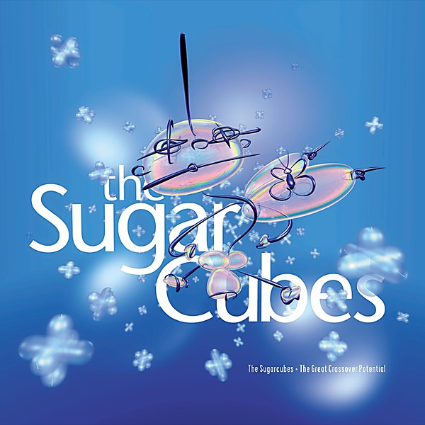

# The Great Crossover Potential

By **The Sugarcubes**

## Album Data

- **Catalog:** Beets
- **Format:** Digital, Album
- **Album:** The Great Crossover Potential
- **Artist:** The Sugarcubes
- **Albumartist:** The Sugarcubes
- **Genre:** Alternative Rock
- **MusicBrainz Album Artist ID:** [95303251-46d5-4239-89c8-eaf0b0947a11](https://musicbrainz.org/artist/95303251-46d5-4239-89c8-eaf0b0947a11)
- **MusicBrainz Album ID:** [304f562b-e9d9-372f-8f38-39cf5d7d49aa](https://musicbrainz.org/release/304f562b-e9d9-372f-8f38-39cf5d7d49aa)
- **MusicBrainz Release Group ID:** [783d26cf-d019-3234-8756-ec04b4187095](https://musicbrainz.org/release-group/783d26cf-d019-3234-8756-ec04b4187095)
- **Year:** 1998
- **Catalog #:** 62102-2
- **Label:** Elektra Entertainment
- **Total Tracks:** 14

## Album Tracks

### Track 01 - Birthday

- **Artist:** The Sugarcubes
- **Format:** ALAC
- **Genre:** Indie Rock
- **Length:** 4:00
- **MusicBrainz Track ID:** [f66dec24-f89e-462e-90c8-de4696041421](https://musicbrainz.org/recording/f66dec24-f89e-462e-90c8-de4696041421)
- **Title:** Birthday
- **Track:** 01
- **Year:** 1998

### Track 02 - Cold Sweat

- **Artist:** The Sugarcubes
- **Format:** ALAC
- **Genre:** Indie Rock
- **Length:** 3:18
- **MusicBrainz Track ID:** [0c72752d-9177-4ffb-a8a9-0d6750f80fc3](https://musicbrainz.org/recording/0c72752d-9177-4ffb-a8a9-0d6750f80fc3)
- **Title:** Cold Sweat
- **Track:** 02
- **Year:** 1998

### Track 03 - Mama

- **Artist:** The Sugarcubes
- **Format:** ALAC
- **Genre:** Ambient
- **Length:** 2:57
- **MusicBrainz Track ID:** [09e91a77-f4d4-42f7-aef8-bcc7d682465f](https://musicbrainz.org/recording/09e91a77-f4d4-42f7-aef8-bcc7d682465f)
- **Title:** Mama
- **Track:** 03
- **Year:** 1998

### Track 04 - Motor Crash

- **Artist:** The Sugarcubes
- **Format:** ALAC
- **Genre:** Indie Pop
- **Length:** 2:24
- **MusicBrainz Track ID:** [c47f517c-1c87-458a-9263-c64d4ce00c61](https://musicbrainz.org/recording/c47f517c-1c87-458a-9263-c64d4ce00c61)
- **Title:** Motor Crash
- **Track:** 04
- **Year:** 1998

### Track 05 - Deus

- **Artist:** The Sugarcubes
- **Format:** ALAC
- **Genre:** Post-Punk
- **Length:** 4:10
- **MusicBrainz Track ID:** [7434de00-7fb4-49e5-b4b4-0ef2535377cd](https://musicbrainz.org/recording/7434de00-7fb4-49e5-b4b4-0ef2535377cd)
- **Title:** Deus
- **Track:** 05
- **Year:** 1998

### Track 06 - Regina

- **Artist:** The Sugarcubes
- **Format:** ALAC
- **Genre:** Indie Rock
- **Length:** 4:07
- **MusicBrainz Track ID:** [bf1eed42-dac7-4f4c-b89e-e498bdf9e157](https://musicbrainz.org/recording/bf1eed42-dac7-4f4c-b89e-e498bdf9e157)
- **Title:** Regina
- **Track:** 06
- **Year:** 1998

### Track 07 - Pump

- **Artist:** The Sugarcubes
- **Format:** ALAC
- **Genre:** Indie Rock
- **Length:** 4:25
- **MusicBrainz Track ID:** [03d993f2-e421-4c41-8f84-d7ae6812aa67](https://musicbrainz.org/recording/03d993f2-e421-4c41-8f84-d7ae6812aa67)
- **Title:** Pump
- **Track:** 07
- **Year:** 1998

### Track 08 - Planet

- **Artist:** The Sugarcubes
- **Format:** ALAC
- **Genre:** Indie Pop
- **Length:** 3:23
- **MusicBrainz Track ID:** [7ba04da5-2dbd-47fa-a31e-eea8bc7468fc](https://musicbrainz.org/recording/7ba04da5-2dbd-47fa-a31e-eea8bc7468fc)
- **Title:** Planet
- **Track:** 08
- **Year:** 1998

### Track 09 - Water

- **Artist:** The Sugarcubes
- **Format:** ALAC
- **Genre:** Indie Rock
- **Length:** 3:03
- **MusicBrainz Track ID:** [30b79a9b-f9d3-426a-b9cc-f0ba8ecf5353](https://musicbrainz.org/recording/30b79a9b-f9d3-426a-b9cc-f0ba8ecf5353)
- **Title:** Water
- **Track:** 09
- **Year:** 1998

### Track 10 - Hit

- **Artist:** The Sugarcubes
- **Format:** ALAC
- **Genre:** Indie Rock
- **Length:** 3:57
- **MusicBrainz Track ID:** [d866ee7f-d10b-4bb9-a2e3-671296fcd018](https://musicbrainz.org/recording/d866ee7f-d10b-4bb9-a2e3-671296fcd018)
- **Title:** Hit
- **Track:** 10
- **Year:** 1998

### Track 11 - Vitamin

- **Artist:** The Sugarcubes
- **Format:** ALAC
- **Genre:** Indie Rock
- **Length:** 3:43
- **MusicBrainz Track ID:** [43da1e59-41b5-4091-bde0-2de65d14cc2b](https://musicbrainz.org/recording/43da1e59-41b5-4091-bde0-2de65d14cc2b)
- **Title:** Vitamin
- **Track:** 11
- **Year:** 1998

### Track 12 - Walkabout

- **Artist:** The Sugarcubes
- **Format:** ALAC
- **Genre:** Indie Rock
- **Length:** 3:49
- **MusicBrainz Track ID:** [64c379b8-f0a0-4b5c-baca-849f79a0ecfe](https://musicbrainz.org/recording/64c379b8-f0a0-4b5c-baca-849f79a0ecfe)
- **Title:** Walkabout
- **Track:** 12
- **Year:** 1998

### Track 13 - Gold

- **Artist:** The Sugarcubes
- **Format:** ALAC
- **Genre:** Indie Rock
- **Length:** 3:40
- **MusicBrainz Track ID:** [1a44cebb-32de-40fe-95b6-422a65dbdac1](https://musicbrainz.org/recording/1a44cebb-32de-40fe-95b6-422a65dbdac1)
- **Title:** Gold
- **Track:** 13
- **Year:** 1998

### Track 14 - Chihuahua

- **Artist:** The Sugarcubes
- **Format:** ALAC
- **Genre:** Post-Punk
- **Length:** 3:29
- **MusicBrainz Track ID:** [7aee226c-22a1-492b-9f9e-b70987c2d0f3](https://musicbrainz.org/recording/7aee226c-22a1-492b-9f9e-b70987c2d0f3)
- **Title:** Chihuahua
- **Track:** 14
- **Year:** 1998

## See also

- [Roon: It's-It](../../Roon/The_Sugarcubes/Its-It.md)
- [Roon: Life's Too Good](../../Roon/The_Sugarcubes/Lifes_Too_Good.md)
