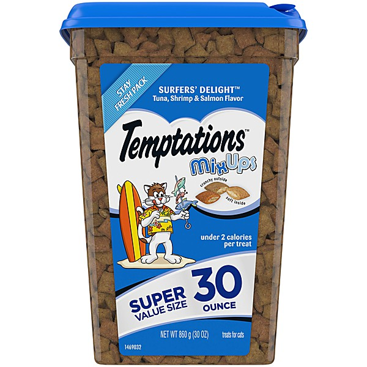

# Best of the Temptations [Wise Buy]

By **The Temptations**

## Album Data

- **Catalog:** Beets
- **Format:** Digital, Album
- **Album:** Best of the Temptations [Wise Buy]
- **Artist:** The Temptations
- **Albumartist:** The Temptations
- **Genre:** Soul
- **MusicBrainz Album Artist ID:** 
- **MusicBrainz Album ID:** 
- **MusicBrainz Release Group ID:** 
- **Year:** 1999
- **Catalog #:** 
- **Label:** 
- **Total Tracks:** 13

## Album Tracks

### Track 01 - Cloud Nine

- **Artist:** The Temptations
- **Format:** ALAC
- **Genre:** Soul
- **Length:** 3:32
- **MusicBrainz Track ID:** 
- **Title:** Cloud Nine
- **Track:** 01
- **Year:** 1968

### Track 02 - Runaway Child Running Wild

- **Artist:** The Temptations
- **Format:** ALAC
- **Genre:** Soul
- **Length:** 9:34
- **MusicBrainz Track ID:** 
- **Title:** Runaway Child Running Wild
- **Track:** 02
- **Year:** 1969

### Track 03 - Don't Let The Joneses Get You Down

- **Artist:** The Temptations
- **Format:** ALAC
- **Genre:** Soul
- **Length:** 4:45
- **MusicBrainz Track ID:** 
- **Title:** Don't Let The Joneses Get You Down
- **Track:** 03
- **Year:** 1969

### Track 04 - I Can't Get Next To You

- **Artist:** The Temptations
- **Format:** ALAC
- **Genre:** Soul
- **Length:** 2:55
- **MusicBrainz Track ID:** 
- **Title:** I Can't Get Next To You
- **Track:** 04
- **Year:** 1969

### Track 05 - Message From A Black Man

- **Artist:** The Temptations
- **Format:** ALAC
- **Genre:** Soul
- **Length:** 6:06
- **MusicBrainz Track ID:** 
- **Title:** Message From A Black Man
- **Track:** 05
- **Year:** 1969

### Track 06 - Slave

- **Artist:** The Temptations
- **Format:** ALAC
- **Genre:** Soul
- **Length:** 7:34
- **MusicBrainz Track ID:** 
- **Title:** Slave
- **Track:** 06
- **Year:** 1969

### Track 07 - Psychedelic Shack

- **Artist:** The Temptations
- **Format:** ALAC
- **Genre:** Soul
- **Length:** 6:22
- **MusicBrainz Track ID:** 
- **Title:** Psychedelic Shack
- **Track:** 07
- **Year:** 1970

### Track 08 - You Make Your Own Heaven And Hell Right Here On Earth

- **Artist:** The Temptations
- **Format:** ALAC
- **Genre:** Soul
- **Length:** 2:47
- **MusicBrainz Track ID:** 
- **Title:** You Make Your Own Heaven And Hell Right Here On Earth
- **Track:** 08
- **Year:** 1970

### Track 09 - Hum Along And Dance

- **Artist:** The Temptations
- **Format:** ALAC
- **Genre:** Soul
- **Length:** 3:51
- **MusicBrainz Track ID:** 
- **Title:** Hum Along And Dance
- **Track:** 09
- **Year:** 1970

### Track 10 - Take A Stroll Thru Your Mind

- **Artist:** The Temptations
- **Format:** ALAC
- **Genre:** Funk
- **Length:** 8:36
- **MusicBrainz Track ID:** 
- **Title:** Take A Stroll Thru Your Mind
- **Track:** 10
- **Year:** 1970

### Track 11 - War

- **Artist:** The Temptations
- **Format:** ALAC
- **Genre:** Soul
- **Length:** 3:15
- **MusicBrainz Track ID:** 
- **Title:** War
- **Track:** 11
- **Year:** 1970

### Track 12 - Friendship Train

- **Artist:** The Temptations
- **Format:** ALAC
- **Genre:** Soul
- **Length:** 7:58
- **MusicBrainz Track ID:** 
- **Title:** Friendship Train
- **Track:** 12
- **Year:** 1970

### Track 13 - Ball Of Confusion (That's What The World Is Today) [Alternate Mix]

- **Artist:** The Temptations
- **Format:** ALAC
- **Genre:** Soul
- **Length:** 4:08
- **MusicBrainz Track ID:** 
- **Title:** Ball Of Confusion (That's What The World Is Today) [Alternate Mix]
- **Track:** 13
- **Year:** 1970

## See also

- [Psychedelic Soul [Disc 1]](Psychedelic_Soul_[Disc_1].md)
- [Psychedelic Soul [Disc 2]](Psychedelic_Soul_[Disc_2].md)
- [CD: Psychedelic Soul - Disc 1 (Disc 1)](../../CD/The_Temptations/Psychedelic_Soul_-_Disc_1_Disc_1.md)
- [CD: Psychedelic Soul - Disc 1 (Disc 2)](../../CD/The_Temptations/Psychedelic_Soul_-_Disc_1_Disc_2.md)
- [CD: ](../../CD/The_Temptations/The_Temptations.md)
