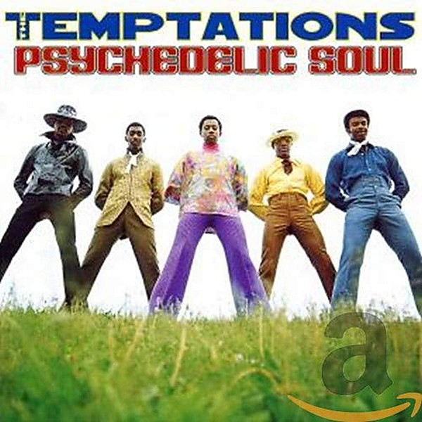

# Psychedelic Soul [Disc 2]

By **The Temptations**

## Album Data

- **Catalog:** Beets
- **Format:** Digital, Album
- **Album:** Psychedelic Soul [Disc 2]
- **Artist:** The Temptations
- **Albumartist:** The Temptations
- **Genre:** Soul
- **MusicBrainz Album Artist ID:** 
- **MusicBrainz Album ID:** 
- **MusicBrainz Release Group ID:** 
- **Year:** 1971
- **Catalog #:** 
- **Label:** 
- **Total Tracks:** 11

## Album Tracks

### Track 01 - Smiling Faces Sometimes

- **Artist:** The Temptations
- **Format:** ALAC
- **Genre:** Soul
- **Length:** 12:43
- **MusicBrainz Track ID:** 
- **Title:** Smiling Faces Sometimes
- **Track:** 01
- **Year:** 1971

### Track 02 - Ungena Za Ulimengu (Unite The World)

- **Artist:** The Temptations
- **Format:** ALAC
- **Genre:** Soul
- **Length:** 4:30
- **MusicBrainz Track ID:** 
- **Title:** Ungena Za Ulimengu (Unite The World)
- **Track:** 02
- **Year:** 1971

### Track 03 - Love Can Be Anything (Can't Nothing Be Love But Love)

- **Artist:** The Temptations
- **Format:** ALAC
- **Genre:** Soul
- **Length:** 9:23
- **MusicBrainz Track ID:** 
- **Title:** Love Can Be Anything (Can't Nothing Be Love But Love)
- **Track:** 03
- **Year:** 1971

### Track 04 - Take A Look Around

- **Artist:** The Temptations
- **Format:** ALAC
- **Genre:** Soul
- **Length:** 3:12
- **MusicBrainz Track ID:** 
- **Title:** Take A Look Around
- **Track:** 04
- **Year:** 1972

### Track 05 - Superstar (Remember How You Got Where You Are)

- **Artist:** The Temptations
- **Format:** ALAC
- **Genre:** Soul
- **Length:** 2:56
- **MusicBrainz Track ID:** 
- **Title:** Superstar (Remember How You Got Where You Are)
- **Track:** 05
- **Year:** 1972

### Track 06 - Funky Music Sho Nuff Turns Me On

- **Artist:** The Temptations
- **Format:** ALAC
- **Genre:** Uk Garage
- **Length:** 3:13
- **MusicBrainz Track ID:** 
- **Title:** Funky Music Sho Nuff Turns Me On
- **Track:** 06
- **Year:** 1972

### Track 07 - Papa Was A Rollin' Stone

- **Artist:** The Temptations
- **Format:** ALAC
- **Genre:** Soul
- **Length:** 12:04
- **MusicBrainz Track ID:** 
- **Title:** Papa Was A Rollin' Stone
- **Track:** 07
- **Year:** 1972

### Track 08 - Plastic Man

- **Artist:** The Temptations
- **Format:** ALAC
- **Genre:** Uk Garage
- **Length:** 5:59
- **MusicBrainz Track ID:** 
- **Title:** Plastic Man
- **Track:** 08
- **Year:** 1973

### Track 09 - Masterpiece

- **Artist:** The Temptations
- **Format:** ALAC
- **Genre:** Soul
- **Length:** 13:50
- **MusicBrainz Track ID:** 
- **Title:** Masterpiece
- **Track:** 09
- **Year:** 1973

### Track 10 - Ain't No Justice

- **Artist:** The Temptations
- **Format:** ALAC
- **Genre:** Soul
- **Length:** 6:07
- **MusicBrainz Track ID:** 
- **Title:** Ain't No Justice
- **Track:** 10
- **Year:** 1973

### Track 11 - 1990

- **Artist:** The Temptations
- **Format:** ALAC
- **Genre:** Soul
- **Length:** 4:04
- **MusicBrainz Track ID:** 
- **Title:** 1990
- **Track:** 11
- **Year:** 1973

## See also

- [Best of the Temptations [Wise Buy]](Best_of_the_Temptations_[Wise_Buy].md)
- [Psychedelic Soul [Disc 1]](Psychedelic_Soul_[Disc_1].md)
- [CD: Psychedelic Soul - Disc 1 (Disc 1)](../../CD/The_Temptations/Psychedelic_Soul_-_Disc_1_Disc_1.md)
- [CD: Psychedelic Soul - Disc 1 (Disc 2)](../../CD/The_Temptations/Psychedelic_Soul_-_Disc_1_Disc_2.md)
- [CD: ](../../CD/The_Temptations/The_Temptations.md)
