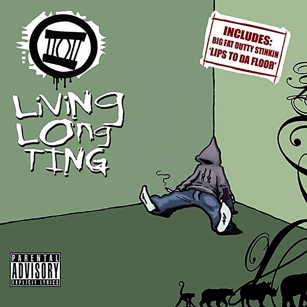

# Hands - Get Free Music at RCRD LBL.com

By **The Ting Tings**

## Album Data

- **Catalog:** Beets
- **Format:** Digital, Album
- **Album:** Hands - Get Free Music at RCRD LBL.com
- **Artist:** The Ting Tings
- **Albumartist:** The Ting Tings
- **Genre:** Indie Pop
- **MusicBrainz Album Artist ID:** 
- **MusicBrainz Album ID:** 
- **MusicBrainz Release Group ID:** 
- **Year:** 0000
- **Catalog #:** 
- **Label:** 
- **Total Tracks:** 10

## Album Tracks

### Track 01 - Silence

- **Artist:** The Ting Tings
- **Format:** ALAC
- **Genre:** Synthpop
- **Length:** 3:47
- **MusicBrainz Track ID:** [f3a71779-300f-4234-8e28-f48be50d41b1](https://musicbrainz.org/recording/f3a71779-300f-4234-8e28-f48be50d41b1)
- **Title:** Silence
- **Track:** 01
- **Year:** 2012

### Track 02 - Hit Me Down Sonny

- **Artist:** The Ting Tings
- **Format:** ALAC
- **Genre:** Indie Rock
- **Length:** 2:51
- **MusicBrainz Track ID:** [e3f09838-b437-45df-adff-07c21e2262ea](https://musicbrainz.org/recording/e3f09838-b437-45df-adff-07c21e2262ea)
- **Title:** Hit Me Down Sonny
- **Track:** 02
- **Year:** 2012

### Track 03 - Hang It Up

- **Artist:** The Ting Tings
- **Format:** ALAC
- **Genre:** Indie Rock
- **Length:** 3:12
- **MusicBrainz Track ID:** [ab438a63-a3e6-45f6-ba1e-a7257d227d8a](https://musicbrainz.org/recording/ab438a63-a3e6-45f6-ba1e-a7257d227d8a)
- **Title:** Hang It Up
- **Track:** 03
- **Year:** 2012

### Track 04 - Give It Back

- **Artist:** The Ting Tings
- **Format:** ALAC
- **Genre:** Indie Rock
- **Length:** 3:36
- **MusicBrainz Track ID:** [acf5bfe9-e04e-4cf9-a078-33de93606ff0](https://musicbrainz.org/recording/acf5bfe9-e04e-4cf9-a078-33de93606ff0)
- **Title:** Give It Back
- **Track:** 04
- **Year:** 2012

### Track 05 - Guggenheim

- **Artist:** The Ting Tings
- **Format:** ALAC
- **Genre:** Synthpop
- **Length:** 3:57
- **MusicBrainz Track ID:** [a19b1681-0e0f-4d79-8b23-3e14527d531b](https://musicbrainz.org/recording/a19b1681-0e0f-4d79-8b23-3e14527d531b)
- **Title:** Guggenheim
- **Track:** 05
- **Year:** 2012

### Track 06 - Soul Killing

- **Artist:** The Ting Tings
- **Format:** ALAC
- **Genre:** Indietronica
- **Length:** 3:17
- **MusicBrainz Track ID:** [4571436f-d570-46db-86d2-cfd734026f3e](https://musicbrainz.org/recording/4571436f-d570-46db-86d2-cfd734026f3e)
- **Title:** Soul Killing
- **Track:** 06
- **Year:** 2012

### Track 07 - One by One

- **Artist:** The Ting Tings
- **Format:** ALAC
- **Genre:** Synthpop
- **Length:** 3:46
- **MusicBrainz Track ID:** [8e9e40f1-04e8-4bc7-95b9-70d4060424d6](https://musicbrainz.org/recording/8e9e40f1-04e8-4bc7-95b9-70d4060424d6)
- **Title:** One by One
- **Track:** 07
- **Year:** 2012

### Track 08 - Day to Day

- **Artist:** The Ting Tings
- **Format:** ALAC
- **Genre:** Indie Pop
- **Length:** 3:34
- **MusicBrainz Track ID:** [0ff434ce-0d71-4d55-82d1-01313f30e99b](https://musicbrainz.org/recording/0ff434ce-0d71-4d55-82d1-01313f30e99b)
- **Title:** Day to Day
- **Track:** 08
- **Year:** 2012

### Track 09 - Help

- **Artist:** The Ting Tings
- **Format:** ALAC
- **Genre:** Indie Pop
- **Length:** 3:01
- **MusicBrainz Track ID:** [de327d8d-1693-4a54-841f-fb9877df0cd5](https://musicbrainz.org/recording/de327d8d-1693-4a54-841f-fb9877df0cd5)
- **Title:** Help
- **Track:** 09
- **Year:** 2012

### Track 10 - In Your Life

- **Artist:** The Ting Tings
- **Format:** ALAC
- **Genre:** Sadcore
- **Length:** 2:58
- **MusicBrainz Track ID:** [1185d27f-6e02-4007-9227-3c68c6f7a96f](https://musicbrainz.org/recording/1185d27f-6e02-4007-9227-3c68c6f7a96f)
- **Title:** In Your Life
- **Track:** 10
- **Year:** 2012

## See also

- [Sounds From Nowheresville](Sounds_From_Nowheresville.md)
- [We Started Nothing](We_Started_Nothing.md)
- [CD: ](../../CD/The_Ting_Tings/The_Ting_Tings.md)
- [CD: We Started Nothing](../../CD/The_Ting_Tings/We_Started_Nothing.md)
- [Roon: We Started Nothing](../../Roon/The_Ting_Tings/We_Started_Nothing.md)
