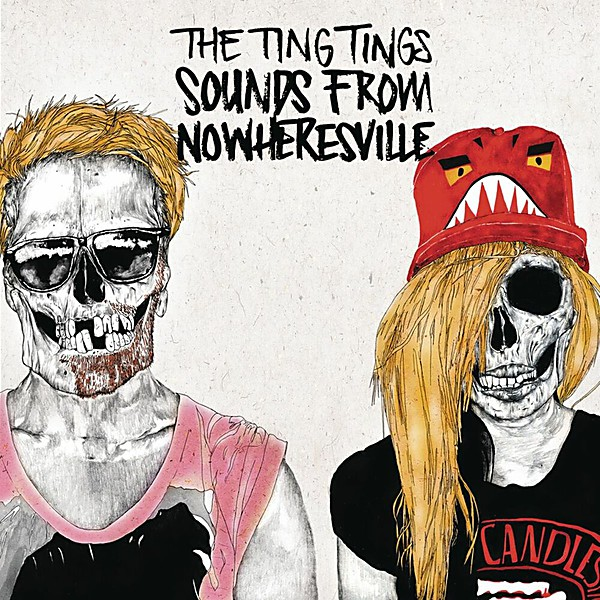

# Sounds From Nowheresville

By **The Ting Tings**

## Album Data

- **Catalog:** Beets
- **Format:** Digital, Album
- **Album:** Sounds From Nowheresville
- **Artist:** The Ting Tings
- **Albumartist:** The Ting Tings
- **Genre:** Indie Pop
- **MusicBrainz Album Artist ID:** [e618770f-e994-41c3-856f-1eedf56b6d74](https://musicbrainz.org/artist/e618770f-e994-41c3-856f-1eedf56b6d74)
- **MusicBrainz Album ID:** [b38a4f04-6c76-4146-9c37-671eb2d411f7](https://musicbrainz.org/release/b38a4f04-6c76-4146-9c37-671eb2d411f7)
- **MusicBrainz Release Group ID:** [70e7c05c-a9aa-426d-82df-8296fe253abb](https://musicbrainz.org/release-group/70e7c05c-a9aa-426d-82df-8296fe253abb)
- **Year:** 2012
- **Catalog #:** 
- **Label:** Columbia
- **Total Tracks:** 10

## Album Tracks

### Track 01 - Great DJ

- **Artist:** The Ting Tings
- **Format:** ALAC
- **Genre:** Indie Pop
- **Length:** 3:23
- **MusicBrainz Track ID:** [64533b49-5d69-443f-8405-f75570e297db](https://musicbrainz.org/recording/64533b49-5d69-443f-8405-f75570e297db)
- **Title:** Great DJ
- **Track:** 01
- **Year:** 2008

### Track 02 - That's Not My Name

- **Artist:** The Ting Tings
- **Format:** ALAC
- **Genre:** Indie Rock
- **Length:** 5:11
- **MusicBrainz Track ID:** [b0d40fde-31d6-4c1d-9130-5976ab3c9f26](https://musicbrainz.org/recording/b0d40fde-31d6-4c1d-9130-5976ab3c9f26)
- **Title:** That's Not My Name
- **Track:** 02
- **Year:** 2008

### Track 03 - Fruit Machine

- **Artist:** The Ting Tings
- **Format:** ALAC
- **Genre:** Riot Grrrl
- **Length:** 2:54
- **MusicBrainz Track ID:** [d40c9580-a24c-4cd6-b422-c2e328fd3083](https://musicbrainz.org/recording/d40c9580-a24c-4cd6-b422-c2e328fd3083)
- **Title:** Fruit Machine
- **Track:** 03
- **Year:** 2008

### Track 04 - Traffic Light

- **Artist:** The Ting Tings
- **Format:** ALAC
- **Genre:** Indie Pop
- **Length:** 2:59
- **MusicBrainz Track ID:** [d1e000d2-7459-4271-9f56-3c21ae20ae95](https://musicbrainz.org/recording/d1e000d2-7459-4271-9f56-3c21ae20ae95)
- **Title:** Traffic Light
- **Track:** 04
- **Year:** 2008

### Track 05 - Shut Up and Let Me Go

- **Artist:** The Ting Tings
- **Format:** ALAC
- **Genre:** Indie Rock
- **Length:** 2:52
- **MusicBrainz Track ID:** [a649d887-5705-4815-8c63-fb2f33123064](https://musicbrainz.org/recording/a649d887-5705-4815-8c63-fb2f33123064)
- **Title:** Shut Up and Let Me Go
- **Track:** 05
- **Year:** 2008

### Track 06 - Keep Your Head

- **Artist:** The Ting Tings
- **Format:** ALAC
- **Genre:** Indie Pop
- **Length:** 3:23
- **MusicBrainz Track ID:** [b37e04e8-5c79-4d5a-bdec-d514160d6113](https://musicbrainz.org/recording/b37e04e8-5c79-4d5a-bdec-d514160d6113)
- **Title:** Keep Your Head
- **Track:** 06
- **Year:** 2008

### Track 07 - Be the One

- **Artist:** The Ting Tings
- **Format:** ALAC
- **Genre:** Indie Pop
- **Length:** 2:58
- **MusicBrainz Track ID:** [acfc8f15-880b-4aac-bacb-bfe30a662721](https://musicbrainz.org/recording/acfc8f15-880b-4aac-bacb-bfe30a662721)
- **Title:** Be the One
- **Track:** 07
- **Year:** 2008

### Track 08 - We Walk

- **Artist:** The Ting Tings
- **Format:** ALAC
- **Genre:** Indie Pop
- **Length:** 4:04
- **MusicBrainz Track ID:** [b456fc90-8769-48ee-84f9-06d0b8880fed](https://musicbrainz.org/recording/b456fc90-8769-48ee-84f9-06d0b8880fed)
- **Title:** We Walk
- **Track:** 08
- **Year:** 2008

### Track 09 - Impacilla Carpisung

- **Artist:** The Ting Tings
- **Format:** ALAC
- **Genre:** Synthpop
- **Length:** 3:41
- **MusicBrainz Track ID:** [1446a19d-50ca-42ab-aade-62500f2597f2](https://musicbrainz.org/recording/1446a19d-50ca-42ab-aade-62500f2597f2)
- **Title:** Impacilla Carpisung
- **Track:** 09
- **Year:** 2008

### Track 10 - We Started Nothing

- **Artist:** The Ting Tings
- **Format:** ALAC
- **Genre:** Indie Pop
- **Length:** 6:22
- **MusicBrainz Track ID:** [c4d9b9c0-2ea1-439a-b543-9e9e93ac6f20](https://musicbrainz.org/recording/c4d9b9c0-2ea1-439a-b543-9e9e93ac6f20)
- **Title:** We Started Nothing
- **Track:** 10
- **Year:** 2008

## See also

- [Hands - Get Free Music at RCRD LBL.com](Hands_-_Get_Free_Music_at_RCRD_LBLcom.md)
- [We Started Nothing](We_Started_Nothing.md)
- [CD: ](../../CD/The_Ting_Tings/The_Ting_Tings.md)
- [CD: We Started Nothing](../../CD/The_Ting_Tings/We_Started_Nothing.md)
- [Roon: We Started Nothing](../../Roon/The_Ting_Tings/We_Started_Nothing.md)
