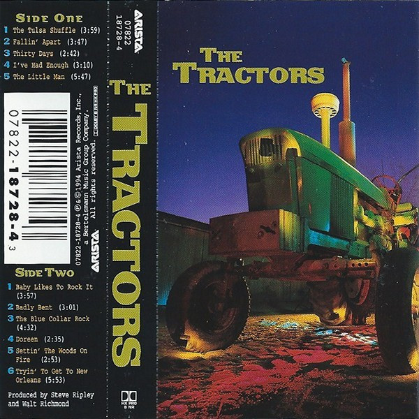

# The Tractors

By **The Tractors**

## Album Data

- **Catalog:** Beets
- **Format:** Digital, Album
- **Album:** The Tractors
- **Artist:** The Tractors
- **Albumartist:** The Tractors
- **Genre:** Americana
- **MusicBrainz Album Artist ID:** 
- **MusicBrainz Album ID:** 
- **MusicBrainz Release Group ID:** 
- **Year:** 0000
- **Catalog #:** 
- **Label:** 
- **Total Tracks:** 00

## Album Tracks

### Track 01 - The Tulsa Shuffle

- **Artist:** The Tractors
- **Format:** AAC
- **Genre:** Western Swing
- **Length:** 3:53
- **MusicBrainz Track ID:** 
- **Title:** The Tulsa Shuffle
- **Track:** 01
- **Year:** 0000

### Track 12 - The Tulsa Shuffle (Revisited)

- **Artist:** The Tractors
- **Format:** MP3
- **Genre:** Western Swing
- **Length:** 5:33
- **MusicBrainz Track ID:** 
- **Title:** The Tulsa Shuffle (Revisited)
- **Track:** 12
- **Year:** 1994

