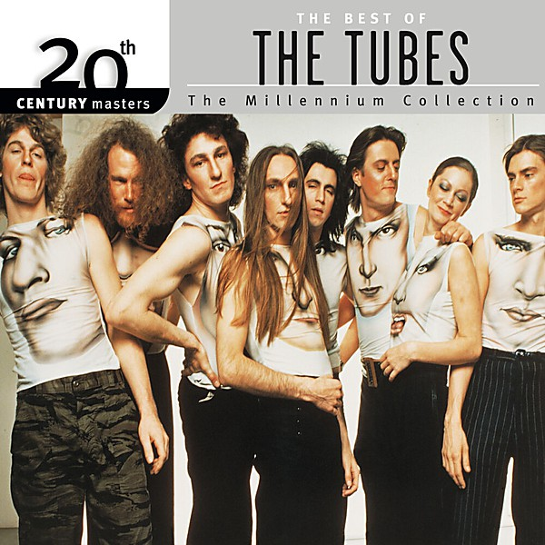

# 20th Century Masters

By **The Tubes**

## Album Data

- **Catalog:** Beets
- **Format:** Digital, Album
- **Album:** 20th Century Masters
- **Artist:** The Tubes
- **Albumartist:** The Tubes
- **Genre:** Punk Rock
- **MusicBrainz Album Artist ID:** [e5180390-dacf-49fb-a4ad-68af9ca7bb13](https://musicbrainz.org/artist/e5180390-dacf-49fb-a4ad-68af9ca7bb13)
- **MusicBrainz Album ID:** [5f329511-5518-413b-b44e-0460ce7cf27f](https://musicbrainz.org/release/5f329511-5518-413b-b44e-0460ce7cf27f)
- **MusicBrainz Release Group ID:** [77dcf08a-28c8-43ea-aca9-8ed64cd90d47](https://musicbrainz.org/release-group/77dcf08a-28c8-43ea-aca9-8ed64cd90d47)
- **Year:** 2000
- **Catalog #:** 01624-12007-2
- **Label:** Popular Records
- **Total Tracks:** 12

## Album Tracks

### Track 01 - Genius of America

- **Artist:** The Tubes
- **Format:** ALAC
- **Genre:** Punk Rock
- **Length:** 4:00
- **MusicBrainz Track ID:** [8598c7e2-b37c-484c-ac00-ce03db481cbb](https://musicbrainz.org/recording/8598c7e2-b37c-484c-ac00-ce03db481cbb)
- **Title:** Genius of America
- **Track:** 01
- **Year:** 1996

### Track 02 - Arms of the Enemy

- **Artist:** The Tubes
- **Format:** ALAC
- **Genre:** Progressive Rock
- **Length:** 4:29
- **MusicBrainz Track ID:** [59b3fc54-fa9c-4f26-b2fb-a3cb0b3f63a1](https://musicbrainz.org/recording/59b3fc54-fa9c-4f26-b2fb-a3cb0b3f63a1)
- **Title:** Arms of the Enemy
- **Track:** 02
- **Year:** 1996

### Track 03 - Say What You Want

- **Artist:** The Tubes
- **Format:** ALAC
- **Genre:** Rock
- **Length:** 4:09
- **MusicBrainz Track ID:** [c263c540-e069-44cc-aaea-d63e3fbdf694](https://musicbrainz.org/recording/c263c540-e069-44cc-aaea-d63e3fbdf694)
- **Title:** Say What You Want
- **Track:** 03
- **Year:** 1996

### Track 04 - How Can You Live With Yourself

- **Artist:** The Tubes
- **Format:** ALAC
- **Genre:** Progressive Rock
- **Length:** 5:15
- **MusicBrainz Track ID:** [210b1522-e2e0-43a7-8431-d18fd46d4140](https://musicbrainz.org/recording/210b1522-e2e0-43a7-8431-d18fd46d4140)
- **Title:** How Can You Live With Yourself
- **Track:** 04
- **Year:** 1996

### Track 05 - Big Brother's Still Watching

- **Artist:** The Tubes
- **Format:** ALAC
- **Genre:** Rock
- **Length:** 5:31
- **MusicBrainz Track ID:** [433be66b-2fb2-4251-b115-2206f64a2a31](https://musicbrainz.org/recording/433be66b-2fb2-4251-b115-2206f64a2a31)
- **Title:** Big Brother's Still Watching
- **Track:** 05
- **Year:** 1996

### Track 06 - After All You Said

- **Artist:** The Tubes
- **Format:** ALAC
- **Genre:** Punk Rock
- **Length:** 4:29
- **MusicBrainz Track ID:** [75239c54-e30e-4748-a8a6-b587fec3db0e](https://musicbrainz.org/recording/75239c54-e30e-4748-a8a6-b587fec3db0e)
- **Title:** After All You Said
- **Track:** 06
- **Year:** 1996

### Track 07 - Fishhouse

- **Artist:** The Tubes
- **Format:** ALAC
- **Genre:** Rock
- **Length:** 4:38
- **MusicBrainz Track ID:** [5f550da2-9651-4d79-ae4e-ac70e03199ee](https://musicbrainz.org/recording/5f550da2-9651-4d79-ae4e-ac70e03199ee)
- **Title:** Fishhouse
- **Track:** 07
- **Year:** 1996

### Track 08 - Fastest Gun Alive

- **Artist:** The Tubes
- **Format:** ALAC
- **Genre:** Rock
- **Length:** 5:05
- **MusicBrainz Track ID:** [dd59e197-6020-456c-b7c1-198316219c5e](https://musicbrainz.org/recording/dd59e197-6020-456c-b7c1-198316219c5e)
- **Title:** Fastest Gun Alive
- **Track:** 08
- **Year:** 1996

### Track 09 - I Never Saw It Comin'

- **Artist:** The Tubes
- **Format:** ALAC
- **Genre:** Rock
- **Length:** 3:19
- **MusicBrainz Track ID:** [4d1aa987-199c-4994-90cb-2d252dfa880d](https://musicbrainz.org/recording/4d1aa987-199c-4994-90cb-2d252dfa880d)
- **Title:** I Never Saw It Comin'
- **Track:** 09
- **Year:** 1996

### Track 10 - Who Names the Hurricanes

- **Artist:** The Tubes
- **Format:** ALAC
- **Genre:** Progressive Rock
- **Length:** 4:50
- **MusicBrainz Track ID:** [cecd008b-2ff4-4150-a16f-af3f6d4658c9](https://musicbrainz.org/recording/cecd008b-2ff4-4150-a16f-af3f6d4658c9)
- **Title:** Who Names the Hurricanes
- **Track:** 10
- **Year:** 1996

### Track 11 - It's Too Late

- **Artist:** The Tubes
- **Format:** ALAC
- **Genre:** Rock
- **Length:** 2:52
- **MusicBrainz Track ID:** [683274c2-66f9-4e3d-8585-884b397daea7](https://musicbrainz.org/recording/683274c2-66f9-4e3d-8585-884b397daea7)
- **Title:** It's Too Late
- **Track:** 11
- **Year:** 1996

### Track 12 - Around the World

- **Artist:** The Tubes
- **Format:** ALAC
- **Genre:** Rock
- **Length:** 4:47
- **MusicBrainz Track ID:** [01138917-14bc-4ad3-8861-c6d00db9013b](https://musicbrainz.org/recording/01138917-14bc-4ad3-8861-c6d00db9013b)
- **Title:** Around the World
- **Track:** 12
- **Year:** 1996

## See also

- [Genius of America](Genius_of_America.md)
- [Love Bomb](Love_Bomb.md)
- [Remote Control](Remote_Control.md)
- [The Completion Backward Principle](The_Completion_Backward_Principle.md)
- [The Tubes](The_Tubes.md)
- [Young and Rich](Young_and_Rich.md)
- [CD: Remote Control](../../CD/The_Tubes/Remote_Control.md)
- [CD: The Completion Backward Principle](../../CD/The_Tubes/The_Completion_Backward_Principle.md)
- [CD: ](../../CD/The_Tubes/The_Tubes_index.md)
- [CD: The Tubes](../../CD/The_Tubes/The_Tubes.md)
- [Roon: Goin' Down](../../Roon/The_Tubes/Goin_Down.md)
- [Roon: Love Bomb](../../Roon/The_Tubes/Love_Bomb.md)
- [Roon: Now](../../Roon/The_Tubes/Now.md)
- [Roon: Remote Control](../../Roon/The_Tubes/Remote_Control.md)
- [Roon: The Completion Backward Principle](../../Roon/The_Tubes/The_Completion_Backward_Principle.md)
- [Roon: The Tubes](../../Roon/The_Tubes/The_Tubes.md)
- [Roon: What Do You Want From Live (Live From Hammersmith Odeon)](../../Roon/The_Tubes/What_Do_You_Want_From_Live_Live_From_Hammersmith_Odeon.md)
- [Roon: Young And Rich](../../Roon/The_Tubes/Young_And_Rich.md)
- [Vinyl: ](../../Vinyl/The_Tubes/The_Tubes.md)
- [Vinyl: Young And Rich](../../Vinyl/The_Tubes/Young_And_Rich.md)
