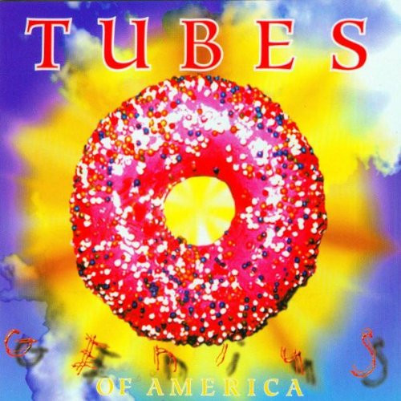

# Genius of America

By **The Tubes**

## Album Data

- **Catalog:** Beets
- **Format:** Digital, Album
- **Album:** Genius of America
- **Artist:** The Tubes
- **Albumartist:** The Tubes
- **Genre:** Punk Rock
- **MusicBrainz Album Artist ID:** [e5180390-dacf-49fb-a4ad-68af9ca7bb13](https://musicbrainz.org/artist/e5180390-dacf-49fb-a4ad-68af9ca7bb13)
- **MusicBrainz Album ID:** [f482ebb8-1d21-458d-a57e-b9e2447142ac](https://musicbrainz.org/release/f482ebb8-1d21-458d-a57e-b9e2447142ac)
- **MusicBrainz Release Group ID:** [c9c8c392-29fc-35e1-a38a-4b85d92a4078](https://musicbrainz.org/release-group/c9c8c392-29fc-35e1-a38a-4b85d92a4078)
- **Year:** 1996
- **Catalog #:** BGOCD188
- **Label:** Beat Goes On Records
- **Total Tracks:** 14

## Album Tracks

### Track 01 - Piece by Piece

- **Artist:** The Tubes
- **Format:** ALAC
- **Genre:** Rock
- **Length:** 4:24
- **MusicBrainz Track ID:** [65fc6427-c075-4585-80b2-c04ba70f8570](https://musicbrainz.org/recording/65fc6427-c075-4585-80b2-c04ba70f8570)
- **Title:** Piece by Piece
- **Track:** 01
- **Year:** 1993

### Track 02 - Stella

- **Artist:** The Tubes
- **Format:** ALAC
- **Genre:** Punk Rock
- **Length:** 4:11
- **MusicBrainz Track ID:** [1ac4c0d2-e290-475e-a29e-041651948451](https://musicbrainz.org/recording/1ac4c0d2-e290-475e-a29e-041651948451)
- **Title:** Stella
- **Track:** 02
- **Year:** 1993

### Track 03 - Come as You Are

- **Artist:** The Tubes
- **Format:** ALAC
- **Genre:** Hard Rock
- **Length:** 3:40
- **MusicBrainz Track ID:** [f01d96f5-1b7b-4543-be17-e6714cdc04b1](https://musicbrainz.org/recording/f01d96f5-1b7b-4543-be17-e6714cdc04b1)
- **Title:** Come as You Are
- **Track:** 03
- **Year:** 1993

### Track 04 - One Good Reason

- **Artist:** The Tubes
- **Format:** ALAC
- **Genre:** Rock
- **Length:** 4:05
- **MusicBrainz Track ID:** [89437555-0ef0-4b27-91a6-0dba270ed818](https://musicbrainz.org/recording/89437555-0ef0-4b27-91a6-0dba270ed818)
- **Title:** One Good Reason
- **Track:** 04
- **Year:** 1993

### Track 05 - Bora Bora 2000 / Love Bomb

- **Artist:** The Tubes
- **Format:** ALAC
- **Genre:** Hard Rock
- **Length:** 4:30
- **MusicBrainz Track ID:** [28e8b183-8668-4214-9a15-2c609c08ea57](https://musicbrainz.org/recording/28e8b183-8668-4214-9a15-2c609c08ea57)
- **Title:** Bora Bora 2000 / Love Bomb
- **Track:** 05
- **Year:** 1993

### Track 06 - Night People

- **Artist:** The Tubes
- **Format:** ALAC
- **Genre:** Rock
- **Length:** 2:23
- **MusicBrainz Track ID:** [fd1ad55c-c059-4ade-986c-0745d9e2bb39](https://musicbrainz.org/recording/fd1ad55c-c059-4ade-986c-0745d9e2bb39)
- **Title:** Night People
- **Track:** 06
- **Year:** 1993

### Track 07 - Say Hey

- **Artist:** The Tubes
- **Format:** ALAC
- **Genre:** Punk Rock
- **Length:** 2:27
- **MusicBrainz Track ID:** [bc1e1749-8315-4a99-b4a6-8bc259ab8e3b](https://musicbrainz.org/recording/bc1e1749-8315-4a99-b4a6-8bc259ab8e3b)
- **Title:** Say Hey
- **Track:** 07
- **Year:** 1993

### Track 08 - Eyes

- **Artist:** The Tubes
- **Format:** ALAC
- **Genre:** Rock
- **Length:** 3:47
- **MusicBrainz Track ID:** [d8d718d4-cd3b-4fc6-9c1a-8ea163afcfa1](https://musicbrainz.org/recording/d8d718d4-cd3b-4fc6-9c1a-8ea163afcfa1)
- **Title:** Eyes
- **Track:** 08
- **Year:** 1993

### Track 09 - Muscle Girls

- **Artist:** The Tubes
- **Format:** ALAC
- **Genre:** Rock
- **Length:** 0:56
- **MusicBrainz Track ID:** [20e3f9da-a5c6-45e4-9086-247761f1313c](https://musicbrainz.org/recording/20e3f9da-a5c6-45e4-9086-247761f1313c)
- **Title:** Muscle Girls
- **Track:** 09
- **Year:** 1993

### Track 10 - Theme From a Wooly Place

- **Artist:** The Tubes
- **Format:** ALAC
- **Genre:** Punk Rock
- **Length:** 0:45
- **MusicBrainz Track ID:** [ec0dd6a5-2017-4455-99e1-26a9e1026050](https://musicbrainz.org/recording/ec0dd6a5-2017-4455-99e1-26a9e1026050)
- **Title:** Theme From a Wooly Place
- **Track:** 10
- **Year:** 1993

### Track 11 - For a Song

- **Artist:** The Tubes
- **Format:** ALAC
- **Genre:** Rock
- **Length:** 3:15
- **MusicBrainz Track ID:** [1f81718f-6f35-4762-be61-62ddf80d35da](https://musicbrainz.org/recording/1f81718f-6f35-4762-be61-62ddf80d35da)
- **Title:** For a Song
- **Track:** 11
- **Year:** 1993

### Track 12 - Say Hey

- **Artist:** The Tubes
- **Format:** ALAC
- **Genre:** Punk Rock
- **Length:** 0:34
- **MusicBrainz Track ID:** [4bfd2353-81f4-4280-8251-ef473876d358](https://musicbrainz.org/recording/4bfd2353-81f4-4280-8251-ef473876d358)
- **Title:** Say Hey
- **Track:** 12
- **Year:** 1993

### Track 13 - Feel It

- **Artist:** The Tubes
- **Format:** ALAC
- **Genre:** Rock
- **Length:** 4:07
- **MusicBrainz Track ID:** [f87f03cd-8506-4336-92d6-bd2e8d046fc8](https://musicbrainz.org/recording/f87f03cd-8506-4336-92d6-bd2e8d046fc8)
- **Title:** Feel It
- **Track:** 13
- **Year:** 1993

### Track 14 - Night People

- **Artist:** The Tubes
- **Format:** ALAC
- **Genre:** Rock
- **Length:** 1:22
- **MusicBrainz Track ID:** [b1a99300-4bd5-4402-8db2-0d3448079290](https://musicbrainz.org/recording/b1a99300-4bd5-4402-8db2-0d3448079290)
- **Title:** Night People
- **Track:** 14
- **Year:** 1993

## See also

- [20th Century Masters](20th_Century_Masters.md)
- [Love Bomb](Love_Bomb.md)
- [Remote Control](Remote_Control.md)
- [The Completion Backward Principle](The_Completion_Backward_Principle.md)
- [The Tubes](The_Tubes.md)
- [Young and Rich](Young_and_Rich.md)
- [CD: Remote Control](../../CD/The_Tubes/Remote_Control.md)
- [CD: The Completion Backward Principle](../../CD/The_Tubes/The_Completion_Backward_Principle.md)
- [CD: ](../../CD/The_Tubes/The_Tubes_index.md)
- [CD: The Tubes](../../CD/The_Tubes/The_Tubes.md)
- [Roon: Goin' Down](../../Roon/The_Tubes/Goin_Down.md)
- [Roon: Love Bomb](../../Roon/The_Tubes/Love_Bomb.md)
- [Roon: Now](../../Roon/The_Tubes/Now.md)
- [Roon: Remote Control](../../Roon/The_Tubes/Remote_Control.md)
- [Roon: The Completion Backward Principle](../../Roon/The_Tubes/The_Completion_Backward_Principle.md)
- [Roon: The Tubes](../../Roon/The_Tubes/The_Tubes.md)
- [Roon: What Do You Want From Live (Live From Hammersmith Odeon)](../../Roon/The_Tubes/What_Do_You_Want_From_Live_Live_From_Hammersmith_Odeon.md)
- [Roon: Young And Rich](../../Roon/The_Tubes/Young_And_Rich.md)
- [Vinyl: ](../../Vinyl/The_Tubes/The_Tubes.md)
- [Vinyl: Young And Rich](../../Vinyl/The_Tubes/Young_And_Rich.md)
