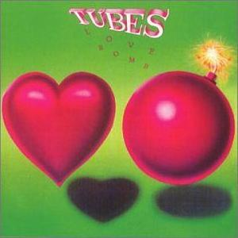

# Love Bomb

By **The Tubes**

## Album Data

- **Catalog:** Beets
- **Format:** Digital, Album
- **Album:** Love Bomb
- **Artist:** The Tubes
- **Albumartist:** The Tubes
- **Genre:** Punk Rock
- **MusicBrainz Album Artist ID:** [e5180390-dacf-49fb-a4ad-68af9ca7bb13](https://musicbrainz.org/artist/e5180390-dacf-49fb-a4ad-68af9ca7bb13)
- **MusicBrainz Album ID:** [1ea9151f-f1f6-3d6c-b72f-4fb5ca28e200](https://musicbrainz.org/release/1ea9151f-f1f6-3d6c-b72f-4fb5ca28e200)
- **MusicBrainz Release Group ID:** [fb12561d-fd3d-3beb-9f0b-2849613d00cf](https://musicbrainz.org/release-group/fb12561d-fd3d-3beb-9f0b-2849613d00cf)
- **Year:** 1993
- **Catalog #:** ICON 1033
- **Label:** Iconoclassic Records
- **Total Tracks:** 15

## Album Tracks

### Track 01 - Turn Me On

- **Artist:** The Tubes
- **Format:** ALAC
- **Genre:** Post-Punk
- **Length:** 4:12
- **MusicBrainz Track ID:** [3b4c31cd-f9ab-42ed-8458-536a74b99869](https://musicbrainz.org/recording/3b4c31cd-f9ab-42ed-8458-536a74b99869)
- **Title:** Turn Me On
- **Track:** 01
- **Year:** 2013

### Track 02 - TV Is King

- **Artist:** The Tubes
- **Format:** ALAC
- **Genre:** Indie Rock
- **Length:** 3:09
- **MusicBrainz Track ID:** [0aa31d36-bf80-480b-91c9-de3c43578449](https://musicbrainz.org/recording/0aa31d36-bf80-480b-91c9-de3c43578449)
- **Title:** TV Is King
- **Track:** 02
- **Year:** 2013

### Track 03 - Prime Time

- **Artist:** The Tubes
- **Format:** ALAC
- **Genre:** Punk Rock
- **Length:** 3:18
- **MusicBrainz Track ID:** [15b921c4-1d15-479b-b95c-86707638736e](https://musicbrainz.org/recording/15b921c4-1d15-479b-b95c-86707638736e)
- **Title:** Prime Time
- **Track:** 03
- **Year:** 2013

### Track 04 - I Want It All Now

- **Artist:** The Tubes
- **Format:** ALAC
- **Genre:** Progressive Rock
- **Length:** 4:28
- **MusicBrainz Track ID:** [ec3a0559-06c1-4dca-b266-4528dec3e93b](https://musicbrainz.org/recording/ec3a0559-06c1-4dca-b266-4528dec3e93b)
- **Title:** I Want It All Now
- **Track:** 04
- **Year:** 2013

### Track 05 - No Way Out

- **Artist:** The Tubes
- **Format:** ALAC
- **Genre:** Psychedelic Rock
- **Length:** 3:24
- **MusicBrainz Track ID:** [7fccbb20-b75e-4db6-b411-c9e021115138](https://musicbrainz.org/recording/7fccbb20-b75e-4db6-b411-c9e021115138)
- **Title:** No Way Out
- **Track:** 05
- **Year:** 2013

### Track 06 - Getoverture

- **Artist:** The Tubes
- **Format:** ALAC
- **Genre:** Psychedelic Rock
- **Length:** 3:23
- **MusicBrainz Track ID:** [814f7af3-04f8-4f97-96ca-5c9e0d56a280](https://musicbrainz.org/recording/814f7af3-04f8-4f97-96ca-5c9e0d56a280)
- **Title:** Getoverture
- **Track:** 06
- **Year:** 2013

### Track 07 - No Mercy

- **Artist:** The Tubes
- **Format:** ALAC
- **Genre:** Acid Rock
- **Length:** 3:27
- **MusicBrainz Track ID:** [40d5ebf1-1f0c-41e7-ac1c-65303de07cfa](https://musicbrainz.org/recording/40d5ebf1-1f0c-41e7-ac1c-65303de07cfa)
- **Title:** No Mercy
- **Track:** 07
- **Year:** 2013

### Track 08 - Only the Strong Survive

- **Artist:** The Tubes
- **Format:** ALAC
- **Genre:** Psychedelic Rock
- **Length:** 3:56
- **MusicBrainz Track ID:** [7da52217-ed15-4f66-ae58-33a5d8106193](https://musicbrainz.org/recording/7da52217-ed15-4f66-ae58-33a5d8106193)
- **Title:** Only the Strong Survive
- **Track:** 08
- **Year:** 2013

### Track 09 - Be Mine Tonight

- **Artist:** The Tubes
- **Format:** ALAC
- **Genre:** Psychedelic Rock
- **Length:** 3:31
- **MusicBrainz Track ID:** [5a59c7c3-b2bf-4d72-a6b0-cd144ba5ee49](https://musicbrainz.org/recording/5a59c7c3-b2bf-4d72-a6b0-cd144ba5ee49)
- **Title:** Be Mine Tonight
- **Track:** 09
- **Year:** 2013

### Track 10 - Love’s a Mystery (I Don’t Understand)

- **Artist:** The Tubes
- **Format:** ALAC
- **Genre:** Progressive Rock
- **Length:** 3:29
- **MusicBrainz Track ID:** [e2ed32dd-c04c-42ad-896a-01496d9b5384](https://musicbrainz.org/recording/e2ed32dd-c04c-42ad-896a-01496d9b5384)
- **Title:** Love’s a Mystery (I Don’t Understand)
- **Track:** 10
- **Year:** 2013

### Track 11 - Telecide

- **Artist:** The Tubes
- **Format:** ALAC
- **Genre:** Psychedelic Rock
- **Length:** 5:52
- **MusicBrainz Track ID:** [348f9003-50c3-4aeb-9d1b-46e1878efdae](https://musicbrainz.org/recording/348f9003-50c3-4aeb-9d1b-46e1878efdae)
- **Title:** Telecide
- **Track:** 11
- **Year:** 2013

### Track 12 - Dreams Come True

- **Artist:** The Tubes
- **Format:** ALAC
- **Genre:** Progressive Rock
- **Length:** 3:45
- **MusicBrainz Track ID:** [37c4ee67-9e1c-4bc6-8493-4c0b96a25a40](https://musicbrainz.org/recording/37c4ee67-9e1c-4bc6-8493-4c0b96a25a40)
- **Title:** Dreams Come True
- **Track:** 12
- **Year:** 2013

### Track 13 - Dangerous

- **Artist:** The Tubes
- **Format:** ALAC
- **Genre:** Progressive Rock
- **Length:** 3:33
- **MusicBrainz Track ID:** [9c150805-3ec1-4112-a805-bad309f94292](https://musicbrainz.org/recording/9c150805-3ec1-4112-a805-bad309f94292)
- **Title:** Dangerous
- **Track:** 13
- **Year:** 2013

### Track 14 - Don’t Ask Me

- **Artist:** The Tubes
- **Format:** ALAC
- **Genre:** Progressive Rock
- **Length:** 3:47
- **MusicBrainz Track ID:** [6aed6ec2-3232-4010-a1ad-f448aa974933](https://musicbrainz.org/recording/6aed6ec2-3232-4010-a1ad-f448aa974933)
- **Title:** Don’t Ask Me
- **Track:** 14
- **Year:** 2013

### Track 15 - Holy War

- **Artist:** The Tubes
- **Format:** ALAC
- **Genre:** Progressive Rock
- **Length:** 3:53
- **MusicBrainz Track ID:** [733b69bf-1df4-45a8-a17b-a1ac2120b4d1](https://musicbrainz.org/recording/733b69bf-1df4-45a8-a17b-a1ac2120b4d1)
- **Title:** Holy War
- **Track:** 15
- **Year:** 2013

## See also

- [20th Century Masters](20th_Century_Masters.md)
- [Genius of America](Genius_of_America.md)
- [Remote Control](Remote_Control.md)
- [The Completion Backward Principle](The_Completion_Backward_Principle.md)
- [The Tubes](The_Tubes.md)
- [Young and Rich](Young_and_Rich.md)
- [CD: Remote Control](../../CD/The_Tubes/Remote_Control.md)
- [CD: The Completion Backward Principle](../../CD/The_Tubes/The_Completion_Backward_Principle.md)
- [CD: ](../../CD/The_Tubes/The_Tubes_index.md)
- [CD: The Tubes](../../CD/The_Tubes/The_Tubes.md)
- [Roon: Goin' Down](../../Roon/The_Tubes/Goin_Down.md)
- [Roon: Love Bomb](../../Roon/The_Tubes/Love_Bomb.md)
- [Roon: Now](../../Roon/The_Tubes/Now.md)
- [Roon: Remote Control](../../Roon/The_Tubes/Remote_Control.md)
- [Roon: The Completion Backward Principle](../../Roon/The_Tubes/The_Completion_Backward_Principle.md)
- [Roon: The Tubes](../../Roon/The_Tubes/The_Tubes.md)
- [Roon: What Do You Want From Live (Live From Hammersmith Odeon)](../../Roon/The_Tubes/What_Do_You_Want_From_Live_Live_From_Hammersmith_Odeon.md)
- [Roon: Young And Rich](../../Roon/The_Tubes/Young_And_Rich.md)
- [Vinyl: ](../../Vinyl/The_Tubes/The_Tubes.md)
- [Vinyl: Young And Rich](../../Vinyl/The_Tubes/Young_And_Rich.md)
