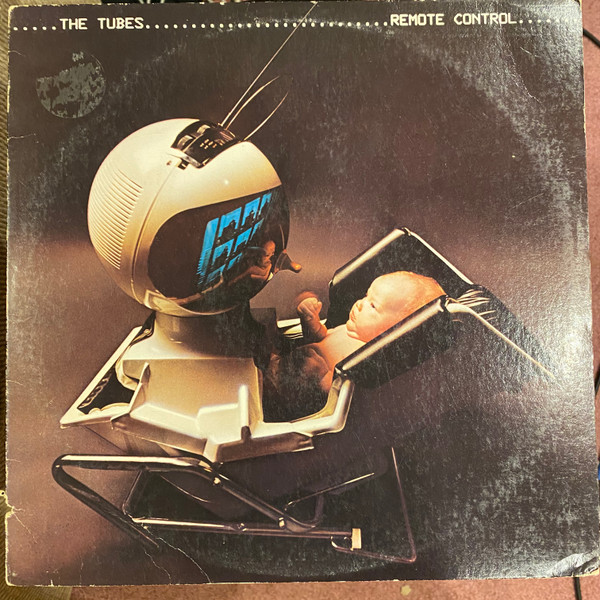

# Remote Control

By **The Tubes**

## Album Data

- **Catalog:** Beets
- **Format:** Digital, Album
- **Album:** Remote Control
- **Artist:** The Tubes
- **Albumartist:** The Tubes
- **Genre:** Progressive Rock
- **MusicBrainz Album Artist ID:** [e5180390-dacf-49fb-a4ad-68af9ca7bb13](https://musicbrainz.org/artist/e5180390-dacf-49fb-a4ad-68af9ca7bb13)
- **MusicBrainz Album ID:** [600b819d-949d-4ea3-a7ca-4e76fc8901e8](https://musicbrainz.org/release/600b819d-949d-4ea3-a7ca-4e76fc8901e8)
- **MusicBrainz Release Group ID:** [d9e76767-768a-333c-b858-b9cf5cc13d18](https://musicbrainz.org/release-group/d9e76767-768a-333c-b858-b9cf5cc13d18)
- **Year:** 2013
- **Catalog #:** ICON 1021
- **Label:** Iconoclassic Records
- **Total Tracks:** 14

## Album Tracks

### Track 01 - Talk to Ya Later

- **Artist:** The Tubes
- **Format:** ALAC
- **Genre:** Progressive Rock
- **Length:** 4:42
- **MusicBrainz Track ID:** [70ee179b-8c5e-4699-a86b-42601da6d614](https://musicbrainz.org/recording/70ee179b-8c5e-4699-a86b-42601da6d614)
- **Title:** Talk to Ya Later
- **Track:** 01
- **Year:** 2011

### Track 02 - Sushi Girl

- **Artist:** The Tubes
- **Format:** ALAC
- **Genre:** Progressive Rock
- **Length:** 3:27
- **MusicBrainz Track ID:** [94429e0b-b155-42e3-865f-897ab3b5979e](https://musicbrainz.org/recording/94429e0b-b155-42e3-865f-897ab3b5979e)
- **Title:** Sushi Girl
- **Track:** 02
- **Year:** 2011

### Track 03 - Amnesia

- **Artist:** The Tubes
- **Format:** ALAC
- **Genre:** New Wave
- **Length:** 4:29
- **MusicBrainz Track ID:** [54f54e08-2a5f-47c8-8f6a-0ad569ae0314](https://musicbrainz.org/recording/54f54e08-2a5f-47c8-8f6a-0ad569ae0314)
- **Title:** Amnesia
- **Track:** 03
- **Year:** 2011

### Track 04 - Mr. Hate

- **Artist:** The Tubes
- **Format:** ALAC
- **Genre:** New Wave
- **Length:** 3:36
- **MusicBrainz Track ID:** [a65f3f13-2e5f-4420-89ea-4d53b5adcd58](https://musicbrainz.org/recording/a65f3f13-2e5f-4420-89ea-4d53b5adcd58)
- **Title:** Mr. Hate
- **Track:** 04
- **Year:** 2011

### Track 05 - Attack of the Fifty Foot Woman

- **Artist:** The Tubes
- **Format:** ALAC
- **Genre:** New Wave
- **Length:** 4:34
- **MusicBrainz Track ID:** [65670f58-647f-465f-ae45-5252363f86f8](https://musicbrainz.org/recording/65670f58-647f-465f-ae45-5252363f86f8)
- **Title:** Attack of the Fifty Foot Woman
- **Track:** 05
- **Year:** 2011

### Track 06 - Think About Me

- **Artist:** The Tubes
- **Format:** ALAC
- **Genre:** New Wave
- **Length:** 3:19
- **MusicBrainz Track ID:** [8396591c-7000-45f5-9cdb-14b389d47016](https://musicbrainz.org/recording/8396591c-7000-45f5-9cdb-14b389d47016)
- **Title:** Think About Me
- **Track:** 06
- **Year:** 2011

### Track 07 - A Matter of Pride

- **Artist:** The Tubes
- **Format:** ALAC
- **Genre:** New Wave
- **Length:** 3:14
- **MusicBrainz Track ID:** [30e02c1a-dda8-4d7c-8bae-f4ddf715a8c8](https://musicbrainz.org/recording/30e02c1a-dda8-4d7c-8bae-f4ddf715a8c8)
- **Title:** A Matter of Pride
- **Track:** 07
- **Year:** 2011

### Track 08 - Don’t Want to Wait Anymore

- **Artist:** The Tubes
- **Format:** ALAC
- **Genre:** Progressive Rock
- **Length:** 4:17
- **MusicBrainz Track ID:** [942b3a3b-1fd5-4cb5-ae28-78a0fc5423f2](https://musicbrainz.org/recording/942b3a3b-1fd5-4cb5-ae28-78a0fc5423f2)
- **Title:** Don’t Want to Wait Anymore
- **Track:** 08
- **Year:** 2011

### Track 09 - Power Tools

- **Artist:** The Tubes
- **Format:** ALAC
- **Genre:** Psychobilly
- **Length:** 4:22
- **MusicBrainz Track ID:** [eccc9abf-4f25-4adb-a32c-b3d249751fd3](https://musicbrainz.org/recording/eccc9abf-4f25-4adb-a32c-b3d249751fd3)
- **Title:** Power Tools
- **Track:** 09
- **Year:** 2011

### Track 10 - Let’s Make Some Noise

- **Artist:** The Tubes
- **Format:** ALAC
- **Genre:** Progressive Rock
- **Length:** 3:29
- **MusicBrainz Track ID:** [047ebee4-bbe1-4818-9edd-51383c0d28b6](https://musicbrainz.org/recording/047ebee4-bbe1-4818-9edd-51383c0d28b6)
- **Title:** Let’s Make Some Noise
- **Track:** 10
- **Year:** 2011

### Track 11 - Tube Talk

- **Artist:** The Tubes
- **Format:** ALAC
- **Genre:** Progressive Rock
- **Length:** 1:19
- **MusicBrainz Track ID:** [aecf0568-7c3a-4973-a29e-0acdadfdad23](https://musicbrainz.org/recording/aecf0568-7c3a-4973-a29e-0acdadfdad23)
- **Title:** Tube Talk
- **Track:** 11
- **Year:** 2011

### Track 12 - What’s Wrong With Me

- **Artist:** The Tubes
- **Format:** ALAC
- **Genre:** Progressive Rock
- **Length:** 3:59
- **MusicBrainz Track ID:** [ae29e149-f82f-42a6-a2c3-f28193d6e8a0](https://musicbrainz.org/recording/ae29e149-f82f-42a6-a2c3-f28193d6e8a0)
- **Title:** What’s Wrong With Me
- **Track:** 12
- **Year:** 2011

### Track 13 - Gonna Get It Next Time

- **Artist:** The Tubes
- **Format:** ALAC
- **Genre:** Progressive Rock
- **Length:** 4:00
- **MusicBrainz Track ID:** [5e021343-1261-4483-ba5f-11c6882490ca](https://musicbrainz.org/recording/5e021343-1261-4483-ba5f-11c6882490ca)
- **Title:** Gonna Get It Next Time
- **Track:** 13
- **Year:** 2011

### Track 14 - Sports Fans

- **Artist:** The Tubes
- **Format:** ALAC
- **Genre:** Progressive Rock
- **Length:** 4:25
- **MusicBrainz Track ID:** [6b306832-fb6f-46fe-b773-2e89dca65990](https://musicbrainz.org/recording/6b306832-fb6f-46fe-b773-2e89dca65990)
- **Title:** Sports Fans
- **Track:** 14
- **Year:** 2011

## See also

- [20th Century Masters](20th_Century_Masters.md)
- [Genius of America](Genius_of_America.md)
- [Love Bomb](Love_Bomb.md)
- [The Completion Backward Principle](The_Completion_Backward_Principle.md)
- [The Tubes](The_Tubes.md)
- [Young and Rich](Young_and_Rich.md)
- [CD: Remote Control](../../CD/The_Tubes/Remote_Control.md)
- [CD: The Completion Backward Principle](../../CD/The_Tubes/The_Completion_Backward_Principle.md)
- [CD: ](../../CD/The_Tubes/The_Tubes_index.md)
- [CD: The Tubes](../../CD/The_Tubes/The_Tubes.md)
- [Roon: Goin' Down](../../Roon/The_Tubes/Goin_Down.md)
- [Roon: Love Bomb](../../Roon/The_Tubes/Love_Bomb.md)
- [Roon: Now](../../Roon/The_Tubes/Now.md)
- [Roon: Remote Control](../../Roon/The_Tubes/Remote_Control.md)
- [Roon: The Completion Backward Principle](../../Roon/The_Tubes/The_Completion_Backward_Principle.md)
- [Roon: The Tubes](../../Roon/The_Tubes/The_Tubes.md)
- [Roon: What Do You Want From Live (Live From Hammersmith Odeon)](../../Roon/The_Tubes/What_Do_You_Want_From_Live_Live_From_Hammersmith_Odeon.md)
- [Roon: Young And Rich](../../Roon/The_Tubes/Young_And_Rich.md)
- [Vinyl: ](../../Vinyl/The_Tubes/The_Tubes.md)
- [Vinyl: Young And Rich](../../Vinyl/The_Tubes/Young_And_Rich.md)
