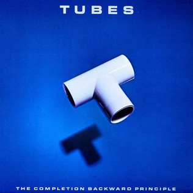

# The Completion Backward Principle

By **The Tubes**

## Album Data

- **Catalog:** Beets
- **Format:** Digital, Album
- **Album:** The Completion Backward Principle
- **Artist:** The Tubes
- **Albumartist:** The Tubes
- **Genre:** Progressive Rock
- **MusicBrainz Album Artist ID:** [e5180390-dacf-49fb-a4ad-68af9ca7bb13](https://musicbrainz.org/artist/e5180390-dacf-49fb-a4ad-68af9ca7bb13)
- **MusicBrainz Album ID:** [a23d59b2-3b58-4a2c-aba1-83ed7af36939](https://musicbrainz.org/release/a23d59b2-3b58-4a2c-aba1-83ed7af36939)
- **MusicBrainz Release Group ID:** [a65e43da-0264-3bdd-ae16-93a23742e340](https://musicbrainz.org/release-group/a65e43da-0264-3bdd-ae16-93a23742e340)
- **Year:** 2011
- **Catalog #:** 
- **Label:** A&M Records
- **Total Tracks:** 08

## Album Tracks

### Track 01 - Up From the Deep

- **Artist:** The Tubes
- **Format:** ALAC
- **Genre:** Acid Rock
- **Length:** 4:28
- **MusicBrainz Track ID:** [4080d38a-29ec-4b28-be48-358f8394bc61](https://musicbrainz.org/recording/4080d38a-29ec-4b28-be48-358f8394bc61)
- **Title:** Up From the Deep
- **Track:** 01
- **Year:** 2021

### Track 02 - Haloes

- **Artist:** The Tubes
- **Format:** ALAC
- **Genre:** New Wave
- **Length:** 4:53
- **MusicBrainz Track ID:** [acdd1f27-007d-48e0-ba06-35ad223739e7](https://musicbrainz.org/recording/acdd1f27-007d-48e0-ba06-35ad223739e7)
- **Title:** Haloes
- **Track:** 02
- **Year:** 2021

### Track 03 - Space Baby

- **Artist:** The Tubes
- **Format:** ALAC
- **Genre:** Progressive Rock
- **Length:** 4:25
- **MusicBrainz Track ID:** [b785e909-192f-485f-9ed6-30144323640b](https://musicbrainz.org/recording/b785e909-192f-485f-9ed6-30144323640b)
- **Title:** Space Baby
- **Track:** 03
- **Year:** 2021

### Track 04 - Malagueña Salerosa

- **Artist:** The Tubes
- **Format:** ALAC
- **Genre:** Progressive Rock
- **Length:** 3:53
- **MusicBrainz Track ID:** [941de2a8-b146-42aa-a01d-155f18a69f1e](https://musicbrainz.org/recording/941de2a8-b146-42aa-a01d-155f18a69f1e)
- **Title:** Malagueña Salerosa
- **Track:** 04
- **Year:** 2021

### Track 05 - Mondo Bondage

- **Artist:** The Tubes
- **Format:** ALAC
- **Genre:** Psychedelic Rock
- **Length:** 4:34
- **MusicBrainz Track ID:** [99628044-8a58-4505-acb1-622779e00966](https://musicbrainz.org/recording/99628044-8a58-4505-acb1-622779e00966)
- **Title:** Mondo Bondage
- **Track:** 05
- **Year:** 2021

### Track 06 - What Do You Want From Life

- **Artist:** The Tubes
- **Format:** ALAC
- **Genre:** New Wave
- **Length:** 4:01
- **MusicBrainz Track ID:** [6d915972-a6dc-48d7-8d20-a7c95ab0f2c7](https://musicbrainz.org/recording/6d915972-a6dc-48d7-8d20-a7c95ab0f2c7)
- **Title:** What Do You Want From Life
- **Track:** 06
- **Year:** 2021

### Track 07 - Boy Crazy

- **Artist:** The Tubes
- **Format:** ALAC
- **Genre:** Indie Rock
- **Length:** 4:09
- **MusicBrainz Track ID:** [21129f91-a14e-44d2-bc86-ff77a93106a6](https://musicbrainz.org/recording/21129f91-a14e-44d2-bc86-ff77a93106a6)
- **Title:** Boy Crazy
- **Track:** 07
- **Year:** 2021

### Track 08 - White Punks on Dope

- **Artist:** The Tubes
- **Format:** ALAC
- **Genre:** Punk Rock
- **Length:** 6:49
- **MusicBrainz Track ID:** [3cbc8448-df82-4c3e-95c7-8376a5b20db5](https://musicbrainz.org/recording/3cbc8448-df82-4c3e-95c7-8376a5b20db5)
- **Title:** White Punks on Dope
- **Track:** 08
- **Year:** 2021

## See also

- [20th Century Masters](20th_Century_Masters.md)
- [Genius of America](Genius_of_America.md)
- [Love Bomb](Love_Bomb.md)
- [Remote Control](Remote_Control.md)
- [The Tubes](The_Tubes.md)
- [Young and Rich](Young_and_Rich.md)
- [CD: Remote Control](../../CD/The_Tubes/Remote_Control.md)
- [CD: The Completion Backward Principle](../../CD/The_Tubes/The_Completion_Backward_Principle.md)
- [CD: ](../../CD/The_Tubes/The_Tubes_index.md)
- [CD: The Tubes](../../CD/The_Tubes/The_Tubes.md)
- [Roon: Goin' Down](../../Roon/The_Tubes/Goin_Down.md)
- [Roon: Love Bomb](../../Roon/The_Tubes/Love_Bomb.md)
- [Roon: Now](../../Roon/The_Tubes/Now.md)
- [Roon: Remote Control](../../Roon/The_Tubes/Remote_Control.md)
- [Roon: The Completion Backward Principle](../../Roon/The_Tubes/The_Completion_Backward_Principle.md)
- [Roon: The Tubes](../../Roon/The_Tubes/The_Tubes.md)
- [Roon: What Do You Want From Live (Live From Hammersmith Odeon)](../../Roon/The_Tubes/What_Do_You_Want_From_Live_Live_From_Hammersmith_Odeon.md)
- [Roon: Young And Rich](../../Roon/The_Tubes/Young_And_Rich.md)
- [Vinyl: ](../../Vinyl/The_Tubes/The_Tubes.md)
- [Vinyl: Young And Rich](../../Vinyl/The_Tubes/Young_And_Rich.md)
