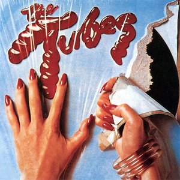

# The Tubes

By **The Tubes**

## Album Data

- **Catalog:** Beets
- **Format:** Digital, Album
- **Album:** The Tubes
- **Artist:** The Tubes
- **Albumartist:** The Tubes
- **Genre:** Progressive Rock
- **MusicBrainz Album Artist ID:** [e5180390-dacf-49fb-a4ad-68af9ca7bb13](https://musicbrainz.org/artist/e5180390-dacf-49fb-a4ad-68af9ca7bb13)
- **MusicBrainz Album ID:** [df6aa261-a1f8-4322-ab50-d6f1499f933b](https://musicbrainz.org/release/df6aa261-a1f8-4322-ab50-d6f1499f933b)
- **MusicBrainz Release Group ID:** [1021bf27-c0e9-32d5-b6c0-b135b75a7eb4](https://musicbrainz.org/release-group/1021bf27-c0e9-32d5-b6c0-b135b75a7eb4)
- **Year:** 2021
- **Catalog #:** 
- **Label:** 
- **Total Tracks:** 09

## Album Tracks

### Track 01 - Tubes World Tour

- **Artist:** The Tubes
- **Format:** MP3
- **Genre:** Psychedelic Rock
- **Length:** 4:34
- **MusicBrainz Track ID:** [93d77a74-2a54-4850-890b-ac98adc864a4](https://musicbrainz.org/recording/93d77a74-2a54-4850-890b-ac98adc864a4)
- **Title:** Tubes World Tour
- **Track:** 01
- **Year:** 1988

### Track 02 - Brighter Day

- **Artist:** The Tubes
- **Format:** MP3
- **Genre:** Progressive Rock
- **Length:** 3:37
- **MusicBrainz Track ID:** [02a09ae4-f92a-4d2e-994e-63edc3113b04](https://musicbrainz.org/recording/02a09ae4-f92a-4d2e-994e-63edc3113b04)
- **Title:** Brighter Day
- **Track:** 02
- **Year:** 1988

### Track 03 - Pimp

- **Artist:** The Tubes
- **Format:** MP3
- **Genre:** Rock
- **Length:** 4:28
- **MusicBrainz Track ID:** [8a34ea30-f601-4d1a-9bff-5a95612b5c6f](https://musicbrainz.org/recording/8a34ea30-f601-4d1a-9bff-5a95612b5c6f)
- **Title:** Pimp
- **Track:** 03
- **Year:** 1988

### Track 04 - Stand Up and Shout

- **Artist:** The Tubes
- **Format:** MP3
- **Genre:** Psychedelic Rock
- **Length:** 2:40
- **MusicBrainz Track ID:** [88f30f51-21ef-49fb-b221-99cebe912a14](https://musicbrainz.org/recording/88f30f51-21ef-49fb-b221-99cebe912a14)
- **Title:** Stand Up and Shout
- **Track:** 04
- **Year:** 1988

### Track 05 - Don't Touch Me There

- **Artist:** The Tubes
- **Format:** MP3
- **Genre:** Acid Rock
- **Length:** 3:33
- **MusicBrainz Track ID:** [5d993ec0-2f54-4827-b3b9-6f31c04480c4](https://musicbrainz.org/recording/5d993ec0-2f54-4827-b3b9-6f31c04480c4)
- **Title:** Don't Touch Me There
- **Track:** 05
- **Year:** 1988

### Track 06 - Slipped My Disco

- **Artist:** The Tubes
- **Format:** MP3
- **Genre:** Indie Rock
- **Length:** 4:23
- **MusicBrainz Track ID:** [b0c2410b-c037-425d-af00-425ea5aad451](https://musicbrainz.org/recording/b0c2410b-c037-425d-af00-425ea5aad451)
- **Title:** Slipped My Disco
- **Track:** 06
- **Year:** 1988

### Track 07 - Proud to Be an American

- **Artist:** The Tubes
- **Format:** MP3
- **Genre:** Rock
- **Length:** 3:01
- **MusicBrainz Track ID:** [b53bdbaf-f345-49ca-8899-1cbfaa34246d](https://musicbrainz.org/recording/b53bdbaf-f345-49ca-8899-1cbfaa34246d)
- **Title:** Proud to Be an American
- **Track:** 07
- **Year:** 1988

### Track 08 - Poland Whole / Madam I'm Adam

- **Artist:** The Tubes
- **Format:** MP3
- **Genre:** Rock
- **Length:** 6:28
- **MusicBrainz Track ID:** [171da3f8-7766-460b-80c1-0cd1355933e9](https://musicbrainz.org/recording/171da3f8-7766-460b-80c1-0cd1355933e9)
- **Title:** Poland Whole / Madam I'm Adam
- **Track:** 08
- **Year:** 1988

### Track 09 - Young and Rich

- **Artist:** The Tubes
- **Format:** MP3
- **Genre:** Progressive Rock
- **Length:** 5:04
- **MusicBrainz Track ID:** [d28ab41b-2d3e-460c-ab1e-de7dc87b0f9c](https://musicbrainz.org/recording/d28ab41b-2d3e-460c-ab1e-de7dc87b0f9c)
- **Title:** Young and Rich
- **Track:** 09
- **Year:** 1988

## See also

- [20th Century Masters](20th_Century_Masters.md)
- [Genius of America](Genius_of_America.md)
- [Love Bomb](Love_Bomb.md)
- [Remote Control](Remote_Control.md)
- [The Completion Backward Principle](The_Completion_Backward_Principle.md)
- [Young and Rich](Young_and_Rich.md)
- [CD: Remote Control](../../CD/The_Tubes/Remote_Control.md)
- [CD: The Completion Backward Principle](../../CD/The_Tubes/The_Completion_Backward_Principle.md)
- [CD: ](../../CD/The_Tubes/The_Tubes_index.md)
- [CD: The Tubes](../../CD/The_Tubes/The_Tubes.md)
- [Roon: Goin' Down](../../Roon/The_Tubes/Goin_Down.md)
- [Roon: Love Bomb](../../Roon/The_Tubes/Love_Bomb.md)
- [Roon: Now](../../Roon/The_Tubes/Now.md)
- [Roon: Remote Control](../../Roon/The_Tubes/Remote_Control.md)
- [Roon: The Completion Backward Principle](../../Roon/The_Tubes/The_Completion_Backward_Principle.md)
- [Roon: The Tubes](../../Roon/The_Tubes/The_Tubes.md)
- [Roon: What Do You Want From Live (Live From Hammersmith Odeon)](../../Roon/The_Tubes/What_Do_You_Want_From_Live_Live_From_Hammersmith_Odeon.md)
- [Roon: Young And Rich](../../Roon/The_Tubes/Young_And_Rich.md)
- [Vinyl: ](../../Vinyl/The_Tubes/The_Tubes.md)
- [Vinyl: Young And Rich](../../Vinyl/The_Tubes/Young_And_Rich.md)
