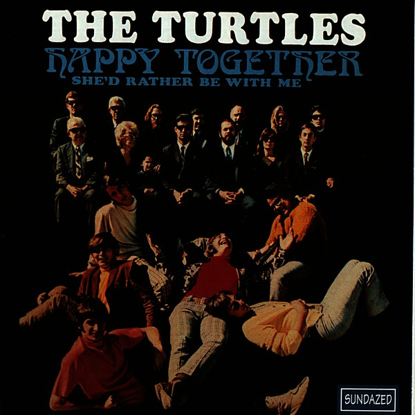

# Happy Together

By **The Turtles**

## Album Data

- **Catalog:** Beets
- **Format:** Digital, Album
- **Album:** Happy Together
- **Artist:** The Turtles
- **Albumartist:** The Turtles
- **Genre:** Psychedelic Rock
- **MusicBrainz Album Artist ID:** [335b6182-0da8-4dc6-a5ec-fe13f0f87e4b](https://musicbrainz.org/artist/335b6182-0da8-4dc6-a5ec-fe13f0f87e4b)
- **MusicBrainz Album ID:** [1e2a4fcc-3c0a-49cf-b59c-7cda9bfe87de](https://musicbrainz.org/release/1e2a4fcc-3c0a-49cf-b59c-7cda9bfe87de)
- **MusicBrainz Release Group ID:** [2c778f87-4915-3489-b8b8-c94661e9025a](https://musicbrainz.org/release-group/2c778f87-4915-3489-b8b8-c94661e9025a)
- **Year:** 1967
- **Catalog #:** RNC 70156
- **Label:** Rhino
- **Total Tracks:** 12

## Album Tracks

### Track 01 - The Battle of the Bands

- **Artist:** The Turtles
- **Format:** MP3
- **Genre:** Rock
- **Length:** 2:16
- **MusicBrainz Track ID:** [7d0a26ad-dcbb-4136-b571-c981870cf85a](https://musicbrainz.org/recording/7d0a26ad-dcbb-4136-b571-c981870cf85a)
- **Title:** The Battle of the Bands
- **Track:** 01
- **Year:** 1986

### Track 02 - The Last Thing I Remember

- **Artist:** The Turtles
- **Format:** MP3
- **Genre:** Rock
- **Length:** 2:55
- **MusicBrainz Track ID:** [bec2285a-113b-47d1-888b-d93a1dd409d7](https://musicbrainz.org/recording/bec2285a-113b-47d1-888b-d93a1dd409d7)
- **Title:** The Last Thing I Remember
- **Track:** 02
- **Year:** 1986

### Track 03 - Elenore

- **Artist:** The Turtles
- **Format:** MP3
- **Genre:** Rock
- **Length:** 2:32
- **MusicBrainz Track ID:** [a06bbaf3-ca94-4234-a17c-40e038f1e718](https://musicbrainz.org/recording/a06bbaf3-ca94-4234-a17c-40e038f1e718)
- **Title:** Elenore
- **Track:** 03
- **Year:** 1986

### Track 04 - Too Much Heartsick Felling

- **Artist:** The Turtles
- **Format:** MP3
- **Genre:** Rock
- **Length:** 2:44
- **MusicBrainz Track ID:** [2770ea28-34c5-4a8c-b57d-8b0131ad9a86](https://musicbrainz.org/recording/2770ea28-34c5-4a8c-b57d-8b0131ad9a86)
- **Title:** Too Much Heartsick Felling
- **Track:** 04
- **Year:** 1986

### Track 05 - Oh, Daddy

- **Artist:** The Turtles
- **Format:** MP3
- **Genre:** Rock
- **Length:** 2:46
- **MusicBrainz Track ID:** [1083b84e-9b07-4f39-8c63-563e0997aa9d](https://musicbrainz.org/recording/1083b84e-9b07-4f39-8c63-563e0997aa9d)
- **Title:** Oh, Daddy
- **Track:** 05
- **Year:** 1986

### Track 06 - Buzzsaw

- **Artist:** The Turtles
- **Format:** MP3
- **Genre:** Uk Garage
- **Length:** 1:58
- **MusicBrainz Track ID:** [2832f729-9bed-40ff-ad9b-7a7570b998d8](https://musicbrainz.org/recording/2832f729-9bed-40ff-ad9b-7a7570b998d8)
- **Title:** Buzzsaw
- **Track:** 06
- **Year:** 1986

### Track 07 - Surfer Dan

- **Artist:** The Turtles
- **Format:** MP3
- **Genre:** Surf Rock
- **Length:** 2:43
- **MusicBrainz Track ID:** [af95d6f7-84fc-4b81-8f8a-1dfcf2f6d8e6](https://musicbrainz.org/recording/af95d6f7-84fc-4b81-8f8a-1dfcf2f6d8e6)
- **Title:** Surfer Dan
- **Track:** 07
- **Year:** 1986

### Track 08 - I'm Chief Kamanawanalea (We're the Royal Macadamia Nuts)

- **Artist:** The Turtles
- **Format:** MP3
- **Genre:** Close Harmony
- **Length:** 1:35
- **MusicBrainz Track ID:** [eda027bb-b15f-4487-a79f-d17ebd1099ac](https://musicbrainz.org/recording/eda027bb-b15f-4487-a79f-d17ebd1099ac)
- **Title:** I'm Chief Kamanawanalea (We're the Royal Macadamia Nuts)
- **Track:** 08
- **Year:** 1986

### Track 09 - You Showed Me

- **Artist:** The Turtles
- **Format:** MP3
- **Genre:** Sunshine Pop
- **Length:** 3:16
- **MusicBrainz Track ID:** [416855f9-42b3-49d8-a27b-8e6ad4e0ecbf](https://musicbrainz.org/recording/416855f9-42b3-49d8-a27b-8e6ad4e0ecbf)
- **Title:** You Showed Me
- **Track:** 09
- **Year:** 1986

### Track 10 - Food

- **Artist:** The Turtles
- **Format:** MP3
- **Genre:** Rock
- **Length:** 2:43
- **MusicBrainz Track ID:** [4e9aebbc-bef0-4d88-bae9-548e16ee451f](https://musicbrainz.org/recording/4e9aebbc-bef0-4d88-bae9-548e16ee451f)
- **Title:** Food
- **Track:** 10
- **Year:** 1986

### Track 11 - Chicken Little Was Right

- **Artist:** The Turtles
- **Format:** MP3
- **Genre:** Rock
- **Length:** 2:49
- **MusicBrainz Track ID:** [26b39819-64a2-4560-a678-72f264038a91](https://musicbrainz.org/recording/26b39819-64a2-4560-a678-72f264038a91)
- **Title:** Chicken Little Was Right
- **Track:** 11
- **Year:** 1986

### Track 12 - Earth Anthem

- **Artist:** The Turtles
- **Format:** MP3
- **Genre:** Rock
- **Length:** 4:00
- **MusicBrainz Track ID:** [0a222c77-b745-4f7b-95e9-d1b9a61f1850](https://musicbrainz.org/recording/0a222c77-b745-4f7b-95e9-d1b9a61f1850)
- **Title:** Earth Anthem
- **Track:** 12
- **Year:** 1986

## See also

- [It Ain't Me Babe](It_Aint_Me_Babe.md)
- [The Turtles Present the Battle of the Bands](The_Turtles_Present_the_Battle_of_the_Bands.md)
- [Turtle Soup](Turtle_Soup.md)
- [Roon: Happy Together (Deluxe Version) (Remastered)](../../Roon/The_Turtles/Happy_Together_Deluxe_Version_Remastered.md)
- [Roon: It Ain't Me Babe (Deluxe Version) (Remastered)](../../Roon/The_Turtles/It_Aint_Me_Babe_Deluxe_Version_Remastered.md)
- [Roon: The Battle of the Bands (Deluxe Version)](../../Roon/The_Turtles/The_Battle_of_the_Bands_Deluxe_Version.md)
- [Roon: Turtle Soup (Deluxe Version) (Remastered)](../../Roon/The_Turtles/Turtle_Soup_Deluxe_Version_Remastered.md)
- [Roon: You Baby (Deluxe Version) (Remastered)](../../Roon/The_Turtles/You_Baby_Deluxe_Version_Remastered.md)
- [Vinyl: Happy Together](../../Vinyl/The_Turtles/Happy_Together.md)
- [Vinyl: ](../../Vinyl/The_Turtles/The_Turtles.md)
- [Vinyl: Turtle Soup](../../Vinyl/The_Turtles/Turtle_Soup.md)
