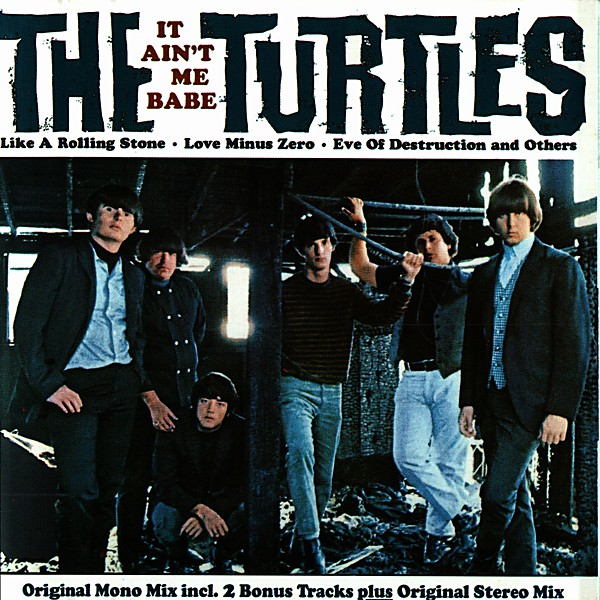

# It Ain't Me Babe

By **The Turtles**

## Album Data

- **Catalog:** Beets
- **Format:** Digital, Album
- **Album:** It Ain't Me Babe
- **Artist:** The Turtles
- **Albumartist:** The Turtles
- **Genre:** Rock
- **MusicBrainz Album Artist ID:** 
- **MusicBrainz Album ID:** 
- **MusicBrainz Release Group ID:** 
- **Year:** 1965
- **Catalog #:** 
- **Label:** 
- **Total Tracks:** 14

## Album Tracks

### Track 01 - Makin' My Mind Up

- **Artist:** The Turtles
- **Format:** MP3
- **Genre:** Psychedelic Rock
- **Length:** 2:16
- **MusicBrainz Track ID:** [97cfd3cd-d621-4f57-a03c-f1c8a9802259](https://musicbrainz.org/recording/97cfd3cd-d621-4f57-a03c-f1c8a9802259)
- **Title:** Makin' My Mind Up
- **Track:** 01
- **Year:** 1967

### Track 02 - Guide for the Married Man

- **Artist:** The Turtles
- **Format:** MP3
- **Genre:** Psychedelic Pop
- **Length:** 2:42
- **MusicBrainz Track ID:** [f69cea32-47c8-4f85-a41b-49b75fbce7fb](https://musicbrainz.org/recording/f69cea32-47c8-4f85-a41b-49b75fbce7fb)
- **Title:** Guide for the Married Man
- **Track:** 02
- **Year:** 1967

### Track 03 - Think I'll Run Away

- **Artist:** The Turtles
- **Format:** MP3
- **Genre:** Rock
- **Length:** 2:30
- **MusicBrainz Track ID:** [df023567-4700-48d7-8f5e-61d47ac00395](https://musicbrainz.org/recording/df023567-4700-48d7-8f5e-61d47ac00395)
- **Title:** Think I'll Run Away
- **Track:** 03
- **Year:** 1967

### Track 04 - Walking Song

- **Artist:** The Turtles
- **Format:** MP3
- **Genre:** Psychedelic Rock
- **Length:** 2:43
- **MusicBrainz Track ID:** [4ca51f65-8089-4f63-a02e-41011150315c](https://musicbrainz.org/recording/4ca51f65-8089-4f63-a02e-41011150315c)
- **Title:** Walking Song
- **Track:** 04
- **Year:** 1967

### Track 05 - Me About You

- **Artist:** The Turtles
- **Format:** MP3
- **Genre:** Soft Rock
- **Length:** 2:30
- **MusicBrainz Track ID:** [320b2ee3-a041-481c-83dc-b926599b635d](https://musicbrainz.org/recording/320b2ee3-a041-481c-83dc-b926599b635d)
- **Title:** Me About You
- **Track:** 05
- **Year:** 1967

### Track 06 - Happy Together

- **Artist:** The Turtles
- **Format:** MP3
- **Genre:** Rock
- **Length:** 2:55
- **MusicBrainz Track ID:** [efd1ebac-6519-4a8b-9556-4f050f080cfa](https://musicbrainz.org/recording/efd1ebac-6519-4a8b-9556-4f050f080cfa)
- **Title:** Happy Together
- **Track:** 06
- **Year:** 1967

### Track 07 - She'd Rather Be With Me

- **Artist:** The Turtles
- **Format:** MP3
- **Genre:** Rock
- **Length:** 2:21
- **MusicBrainz Track ID:** [e5eeff92-1765-4268-b6a9-87f3a23c46e2](https://musicbrainz.org/recording/e5eeff92-1765-4268-b6a9-87f3a23c46e2)
- **Title:** She'd Rather Be With Me
- **Track:** 07
- **Year:** 1967

### Track 08 - Too Young to Be One

- **Artist:** The Turtles
- **Format:** MP3
- **Genre:** Psychedelic Rock
- **Length:** 1:59
- **MusicBrainz Track ID:** [526dbeda-6ca2-4907-85c5-ffec8fc5265e](https://musicbrainz.org/recording/526dbeda-6ca2-4907-85c5-ffec8fc5265e)
- **Title:** Too Young to Be One
- **Track:** 08
- **Year:** 1967

### Track 09 - Person Without a Care

- **Artist:** The Turtles
- **Format:** MP3
- **Genre:** Psychedelic Rock
- **Length:** 2:22
- **MusicBrainz Track ID:** [d895dbe5-624a-4517-a1e6-d26cae858e8d](https://musicbrainz.org/recording/d895dbe5-624a-4517-a1e6-d26cae858e8d)
- **Title:** Person Without a Care
- **Track:** 09
- **Year:** 1967

### Track 10 - Like the Seasons

- **Artist:** The Turtles
- **Format:** MP3
- **Genre:** Psychedelic Rock
- **Length:** 1:55
- **MusicBrainz Track ID:** [4d06338f-4277-4ebb-ab11-9f8a909962fa](https://musicbrainz.org/recording/4d06338f-4277-4ebb-ab11-9f8a909962fa)
- **Title:** Like the Seasons
- **Track:** 10
- **Year:** 1967

### Track 11 - Rugs of Wood and Flowers

- **Artist:** The Turtles
- **Format:** MP3
- **Genre:** Psychedelic Rock
- **Length:** 3:05
- **MusicBrainz Track ID:** [71fd06ee-c1b2-48f4-aa0c-533c55b45357](https://musicbrainz.org/recording/71fd06ee-c1b2-48f4-aa0c-533c55b45357)
- **Title:** Rugs of Wood and Flowers
- **Track:** 11
- **Year:** 1967

### Track 12 - She's My Girl

- **Artist:** The Turtles
- **Format:** MP3
- **Genre:** Sunshine Pop
- **Length:** 2:36
- **MusicBrainz Track ID:** [7b82fc42-e4fe-4d2d-8283-2dd7bc78cda9](https://musicbrainz.org/recording/7b82fc42-e4fe-4d2d-8283-2dd7bc78cda9)
- **Title:** She's My Girl
- **Track:** 12
- **Year:** 1967

### Track 13 - You Know What I Mean

- **Artist:** The Turtles
- **Format:** MP3
- **Genre:** Sunshine Pop
- **Length:** 2:02
- **MusicBrainz Track ID:** [c55e884e-e2ed-4d26-881f-2571be10daa6](https://musicbrainz.org/recording/c55e884e-e2ed-4d26-881f-2571be10daa6)
- **Title:** You Know What I Mean
- **Track:** 13
- **Year:** 1967

### Track 14 - Is It Any Wonder

- **Artist:** The Turtles
- **Format:** MP3
- **Genre:** Psychedelic Rock
- **Length:** 2:29
- **MusicBrainz Track ID:** [e0a51db5-91ed-4e0e-a590-225b98aac37b](https://musicbrainz.org/recording/e0a51db5-91ed-4e0e-a590-225b98aac37b)
- **Title:** Is It Any Wonder
- **Track:** 14
- **Year:** 1967

## See also

- [Happy Together](Happy_Together.md)
- [The Turtles Present the Battle of the Bands](The_Turtles_Present_the_Battle_of_the_Bands.md)
- [Turtle Soup](Turtle_Soup.md)
- [Roon: Happy Together (Deluxe Version) (Remastered)](../../Roon/The_Turtles/Happy_Together_Deluxe_Version_Remastered.md)
- [Roon: It Ain't Me Babe (Deluxe Version) (Remastered)](../../Roon/The_Turtles/It_Aint_Me_Babe_Deluxe_Version_Remastered.md)
- [Roon: The Battle of the Bands (Deluxe Version)](../../Roon/The_Turtles/The_Battle_of_the_Bands_Deluxe_Version.md)
- [Roon: Turtle Soup (Deluxe Version) (Remastered)](../../Roon/The_Turtles/Turtle_Soup_Deluxe_Version_Remastered.md)
- [Roon: You Baby (Deluxe Version) (Remastered)](../../Roon/The_Turtles/You_Baby_Deluxe_Version_Remastered.md)
- [Vinyl: Happy Together](../../Vinyl/The_Turtles/Happy_Together.md)
- [Vinyl: ](../../Vinyl/The_Turtles/The_Turtles.md)
- [Vinyl: Turtle Soup](../../Vinyl/The_Turtles/Turtle_Soup.md)
