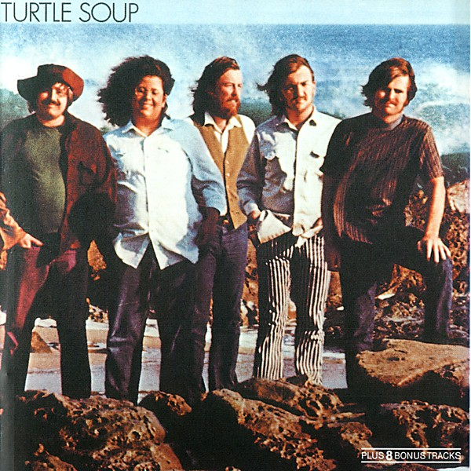

# Turtle Soup

By **The Turtles**

## Album Data

- **Catalog:** Beets
- **Format:** Digital, Album
- **Album:** Turtle Soup
- **Artist:** The Turtles
- **Albumartist:** The Turtles
- **Genre:** Rock
- **MusicBrainz Album Artist ID:** [335b6182-0da8-4dc6-a5ec-fe13f0f87e4b](https://musicbrainz.org/artist/335b6182-0da8-4dc6-a5ec-fe13f0f87e4b)
- **MusicBrainz Album ID:** [6eeaacfa-9af0-41f2-bf23-badc4e4b2a87](https://musicbrainz.org/release/6eeaacfa-9af0-41f2-bf23-badc4e4b2a87)
- **MusicBrainz Release Group ID:** [4105db35-bbab-3223-ad7e-235932d6046c](https://musicbrainz.org/release-group/4105db35-bbab-3223-ad7e-235932d6046c)
- **Year:** 1969
- **Catalog #:** WWS-7124
- **Label:** White Whale
- **Total Tracks:** 12

## Album Tracks

### Track 01 - Come Over

- **Artist:** The Turtles
- **Format:** MP3
- **Genre:** Rock
- **Length:** 2:23
- **MusicBrainz Track ID:** [f85c485a-27c9-48c4-a843-937b57e30901](https://musicbrainz.org/recording/f85c485a-27c9-48c4-a843-937b57e30901)
- **Title:** Come Over
- **Track:** 01
- **Year:** 1969

### Track 02 - House on the Hill

- **Artist:** The Turtles
- **Format:** MP3
- **Genre:** Rock
- **Length:** 3:03
- **MusicBrainz Track ID:** [911cf0f0-6831-4d03-ab4d-a3a813525a83](https://musicbrainz.org/recording/911cf0f0-6831-4d03-ab4d-a3a813525a83)
- **Title:** House on the Hill
- **Track:** 02
- **Year:** 1969

### Track 03 - She Always Leaves Me Laughing

- **Artist:** The Turtles
- **Format:** MP3
- **Genre:** Rock
- **Length:** 2:52
- **MusicBrainz Track ID:** [e75051a8-769b-4d2f-823e-065467197fed](https://musicbrainz.org/recording/e75051a8-769b-4d2f-823e-065467197fed)
- **Title:** She Always Leaves Me Laughing
- **Track:** 03
- **Year:** 1969

### Track 04 - How You Loved Me

- **Artist:** The Turtles
- **Format:** MP3
- **Genre:** Rock
- **Length:** 3:04
- **MusicBrainz Track ID:** [63103019-9bb5-42df-b27e-3e864eb610f5](https://musicbrainz.org/recording/63103019-9bb5-42df-b27e-3e864eb610f5)
- **Title:** How You Loved Me
- **Track:** 04
- **Year:** 1969

### Track 05 - Torn Between Temptations

- **Artist:** The Turtles
- **Format:** MP3
- **Genre:** Rock
- **Length:** 2:53
- **MusicBrainz Track ID:** [f4ac166b-321c-4f03-aba8-b016f500c53d](https://musicbrainz.org/recording/f4ac166b-321c-4f03-aba8-b016f500c53d)
- **Title:** Torn Between Temptations
- **Track:** 05
- **Year:** 1969

### Track 06 - Love in the City

- **Artist:** The Turtles
- **Format:** MP3
- **Genre:** Sunshine Pop
- **Length:** 3:48
- **MusicBrainz Track ID:** [416480e6-36b7-4cb1-b542-35745815e561](https://musicbrainz.org/recording/416480e6-36b7-4cb1-b542-35745815e561)
- **Title:** Love in the City
- **Track:** 06
- **Year:** 1969

### Track 07 - Bachelor Mother

- **Artist:** The Turtles
- **Format:** MP3
- **Genre:** Rock
- **Length:** 2:44
- **MusicBrainz Track ID:** [ca36545a-5073-4998-bc53-7a3d988c28bc](https://musicbrainz.org/recording/ca36545a-5073-4998-bc53-7a3d988c28bc)
- **Title:** Bachelor Mother
- **Track:** 07
- **Year:** 1969

### Track 08 - John and Julie

- **Artist:** The Turtles
- **Format:** MP3
- **Genre:** Rock
- **Length:** 3:15
- **MusicBrainz Track ID:** [1a93c765-badc-4cea-9078-5b681d881ba1](https://musicbrainz.org/recording/1a93c765-badc-4cea-9078-5b681d881ba1)
- **Title:** John and Julie
- **Track:** 08
- **Year:** 1969

### Track 09 - Hot Little Hands

- **Artist:** The Turtles
- **Format:** MP3
- **Genre:** Rock
- **Length:** 4:16
- **MusicBrainz Track ID:** [9a7b235d-6aaf-482b-a943-dd819b03817d](https://musicbrainz.org/recording/9a7b235d-6aaf-482b-a943-dd819b03817d)
- **Title:** Hot Little Hands
- **Track:** 09
- **Year:** 1969

### Track 10 - Somewhere Friday Night

- **Artist:** The Turtles
- **Format:** MP3
- **Genre:** Rock
- **Length:** 3:28
- **MusicBrainz Track ID:** [a1113351-2b31-47f1-a4db-ab5e1a7b2ffd](https://musicbrainz.org/recording/a1113351-2b31-47f1-a4db-ab5e1a7b2ffd)
- **Title:** Somewhere Friday Night
- **Track:** 10
- **Year:** 1969

### Track 11 - Dance This Dance

- **Artist:** The Turtles
- **Format:** MP3
- **Genre:** Rock
- **Length:** 3:36
- **MusicBrainz Track ID:** [e36521e7-7d67-4f1b-9379-2f61d2ac20ea](https://musicbrainz.org/recording/e36521e7-7d67-4f1b-9379-2f61d2ac20ea)
- **Title:** Dance This Dance
- **Track:** 11
- **Year:** 1969

### Track 12 - You Don't Have to Walk in the Rain

- **Artist:** The Turtles
- **Format:** MP3
- **Genre:** Close Harmony
- **Length:** 2:44
- **MusicBrainz Track ID:** [1ef74096-66b9-4b0f-a32b-19385d4a971c](https://musicbrainz.org/recording/1ef74096-66b9-4b0f-a32b-19385d4a971c)
- **Title:** You Don't Have to Walk in the Rain
- **Track:** 12
- **Year:** 1969

## See also

- [Happy Together](Happy_Together.md)
- [It Ain't Me Babe](It_Aint_Me_Babe.md)
- [The Turtles Present the Battle of the Bands](The_Turtles_Present_the_Battle_of_the_Bands.md)
- [Roon: Happy Together (Deluxe Version) (Remastered)](../../Roon/The_Turtles/Happy_Together_Deluxe_Version_Remastered.md)
- [Roon: It Ain't Me Babe (Deluxe Version) (Remastered)](../../Roon/The_Turtles/It_Aint_Me_Babe_Deluxe_Version_Remastered.md)
- [Roon: The Battle of the Bands (Deluxe Version)](../../Roon/The_Turtles/The_Battle_of_the_Bands_Deluxe_Version.md)
- [Roon: Turtle Soup (Deluxe Version) (Remastered)](../../Roon/The_Turtles/Turtle_Soup_Deluxe_Version_Remastered.md)
- [Roon: You Baby (Deluxe Version) (Remastered)](../../Roon/The_Turtles/You_Baby_Deluxe_Version_Remastered.md)
- [Vinyl: Happy Together](../../Vinyl/The_Turtles/Happy_Together.md)
- [Vinyl: ](../../Vinyl/The_Turtles/The_Turtles.md)
- [Vinyl: Turtle Soup](../../Vinyl/The_Turtles/Turtle_Soup.md)
