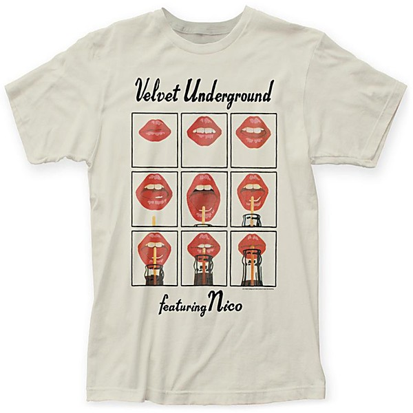

# Live MCMXCIII [Single Disc]

By **The Velvet Underground**

## Album Data

- **Catalog:** Beets
- **Format:** Digital, Album
- **Album:** Live MCMXCIII [Single Disc]
- **Artist:** The Velvet Underground
- **Albumartist:** The Velvet Underground
- **Genre:** Psychedelic Rock
- **MusicBrainz Album Artist ID:** 
- **MusicBrainz Album ID:** 
- **MusicBrainz Release Group ID:** 
- **Year:** 1993
- **Catalog #:** 
- **Label:** Warner Bros.
- **Total Tracks:** 00

## Album Tracks

### Track 01 - Venus in Furs

- **Artist:** The Velvet Underground
- **Format:** MP3
- **Genre:** Psychedelic Rock
- **Length:** 5:29
- **MusicBrainz Track ID:** 
- **Title:** Venus in Furs
- **Track:** 01
- **Year:** 1993

### Track 02 - All Tomorrow's Parties

- **Artist:** The Velvet Underground
- **Format:** MP3
- **Genre:** Psychedelic Rock
- **Length:** 5:23
- **MusicBrainz Track ID:** 
- **Title:** All Tomorrow's Parties
- **Track:** 02
- **Year:** 1993

### Track 03 - Some Kinda Love

- **Artist:** The Velvet Underground
- **Format:** MP3
- **Genre:** Psychedelic Rock
- **Length:** 2:44
- **MusicBrainz Track ID:** 
- **Title:** Some Kinda Love
- **Track:** 03
- **Year:** 1993

### Track 04 - The Gift

- **Artist:** The Velvet Underground
- **Format:** MP3
- **Genre:** Noise Rock
- **Length:** 6:36
- **MusicBrainz Track ID:** 
- **Title:** The Gift
- **Track:** 04
- **Year:** 1993

### Track 05 - After Hours

- **Artist:** The Velvet Underground
- **Format:** MP3
- **Genre:** Alternative Rock
- **Length:** 9:07
- **MusicBrainz Track ID:** 
- **Title:** After Hours
- **Track:** 05
- **Year:** 1993

### Track 06 - Sweet Jane

- **Artist:** The Velvet Underground
- **Format:** MP3
- **Genre:** Psychedelic Rock
- **Length:** 10:33
- **MusicBrainz Track ID:** 
- **Title:** Sweet Jane
- **Track:** 06
- **Year:** 1993

### Track 07 - Rock & Roll

- **Artist:** The Velvet Underground
- **Format:** MP3
- **Genre:** Rock And Roll
- **Length:** 6:11
- **MusicBrainz Track ID:** 
- **Title:** Rock & Roll
- **Track:** 07
- **Year:** 1993

### Track 08 - I'm Waiting for the Man

- **Artist:** The Velvet Underground
- **Format:** MP3
- **Genre:** Psychedelic Rock
- **Length:** 5:15
- **MusicBrainz Track ID:** 
- **Title:** I'm Waiting for the Man
- **Track:** 08
- **Year:** 1993

### Track 09 - Heroin

- **Artist:** The Velvet Underground
- **Format:** MP3
- **Genre:** Psychedelic Rock
- **Length:** 9:49
- **MusicBrainz Track ID:** 
- **Title:** Heroin
- **Track:** 09
- **Year:** 1993

### Track 10 - Pale Blue Eyes

- **Artist:** The Velvet Underground
- **Format:** MP3
- **Genre:** Psychedelic Rock
- **Length:** 6:17
- **MusicBrainz Track ID:** 
- **Title:** Pale Blue Eyes
- **Track:** 10
- **Year:** 1993

