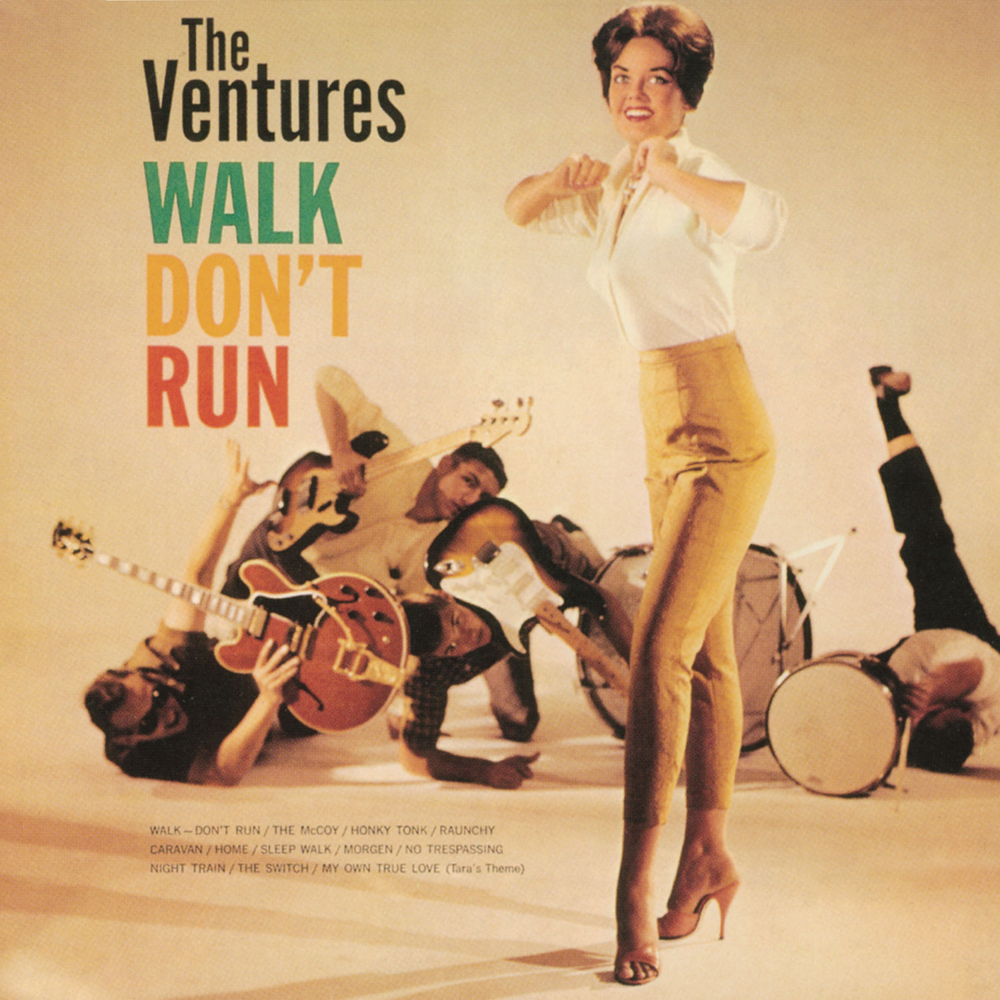

# Walk Don’t Run

By **The Ventures**

## Album Data

- **Catalog:** Beets
- **Format:** Digital, Album
- **Album:** Walk Don’t Run
- **Artist:** The Ventures
- **Albumartist:** The Ventures
- **Genre:** Surf Rock
- **MusicBrainz Album Artist ID:** [b2cc8903-0077-4bef-8454-ac5cef53d126](https://musicbrainz.org/artist/b2cc8903-0077-4bef-8454-ac5cef53d126)
- **MusicBrainz Album ID:** [bbc6506d-a2db-422f-8b69-dafcdc142a76](https://musicbrainz.org/release/bbc6506d-a2db-422f-8b69-dafcdc142a76)
- **MusicBrainz Release Group ID:** [5c3d4ccd-4c74-3f0f-b7f9-4f15f3b9df42](https://musicbrainz.org/release-group/5c3d4ccd-4c74-3f0f-b7f9-4f15f3b9df42)
- **Year:** 1960
- **Catalog #:** 
- **Label:** Capitol Records
- **Total Tracks:** 12

## Album Tracks

### Track 01 - Morgen

- **Artist:** The Ventures
- **Format:** MP3
- **Genre:** Surf Rock
- **Length:** 2:06
- **MusicBrainz Track ID:** [4e8049c0-d299-4767-9d7a-18c02faf0472](https://musicbrainz.org/recording/4e8049c0-d299-4767-9d7a-18c02faf0472)
- **Title:** Morgen
- **Track:** 01
- **Year:** 1960

### Track 02 - Raunchy

- **Artist:** The Ventures
- **Format:** MP3
- **Genre:** Surf Rock
- **Length:** 2:16
- **MusicBrainz Track ID:** [fe740807-daf6-4bef-aaff-4e08857a6d1f](https://musicbrainz.org/recording/fe740807-daf6-4bef-aaff-4e08857a6d1f)
- **Title:** Raunchy
- **Track:** 02
- **Year:** 1960

### Track 03 - Home

- **Artist:** The Ventures
- **Format:** MP3
- **Genre:** Surf Rock
- **Length:** 2:18
- **MusicBrainz Track ID:** [756c7743-7e4b-4ed0-8185-3314146f47d0](https://musicbrainz.org/recording/756c7743-7e4b-4ed0-8185-3314146f47d0)
- **Title:** Home
- **Track:** 03
- **Year:** 1960

### Track 04 - My Own True Love (Tara’s Theme)

- **Artist:** The Ventures
- **Format:** MP3
- **Genre:** Surf Rock
- **Length:** 2:14
- **MusicBrainz Track ID:** [0fb18024-0857-4ba3-b2ef-552d4cd01567](https://musicbrainz.org/recording/0fb18024-0857-4ba3-b2ef-552d4cd01567)
- **Title:** My Own True Love (Tara’s Theme)
- **Track:** 04
- **Year:** 1960

### Track 05 - The Switch

- **Artist:** The Ventures
- **Format:** MP3
- **Genre:** Surf Rock
- **Length:** 1:56
- **MusicBrainz Track ID:** [d271b4b9-b431-44a0-8387-7bcd37afc0f6](https://musicbrainz.org/recording/d271b4b9-b431-44a0-8387-7bcd37afc0f6)
- **Title:** The Switch
- **Track:** 05
- **Year:** 1960

### Track 06 - Walk, Don’t Run

- **Artist:** The Ventures
- **Format:** MP3
- **Genre:** Surf Rock
- **Length:** 2:02
- **MusicBrainz Track ID:** [bc99b291-63a0-4295-bbdf-2ed49d83d317](https://musicbrainz.org/recording/bc99b291-63a0-4295-bbdf-2ed49d83d317)
- **Title:** Walk, Don’t Run
- **Track:** 06
- **Year:** 1960

### Track 07 - Night Train

- **Artist:** The Ventures
- **Format:** MP3
- **Genre:** Surf Rock
- **Length:** 2:49
- **MusicBrainz Track ID:** [005869e6-d67d-4f56-ad94-f910f0999dd8](https://musicbrainz.org/recording/005869e6-d67d-4f56-ad94-f910f0999dd8)
- **Title:** Night Train
- **Track:** 07
- **Year:** 1960

### Track 08 - No Trespassing

- **Artist:** The Ventures
- **Format:** MP3
- **Genre:** Surf Rock
- **Length:** 1:57
- **MusicBrainz Track ID:** [797819c2-de60-4927-8d0f-286c37aefb9b](https://musicbrainz.org/recording/797819c2-de60-4927-8d0f-286c37aefb9b)
- **Title:** No Trespassing
- **Track:** 08
- **Year:** 1960

### Track 09 - Caravan

- **Artist:** The Ventures
- **Format:** MP3
- **Genre:** Surf Rock
- **Length:** 2:08
- **MusicBrainz Track ID:** [c11ad781-d694-43fe-8592-7ae59c5a6793](https://musicbrainz.org/recording/c11ad781-d694-43fe-8592-7ae59c5a6793)
- **Title:** Caravan
- **Track:** 09
- **Year:** 1960

### Track 10 - Sleep Walk

- **Artist:** The Ventures
- **Format:** MP3
- **Genre:** Surf Rock
- **Length:** 2:04
- **MusicBrainz Track ID:** [04783927-631c-4bb1-9115-61878221ab41](https://musicbrainz.org/recording/04783927-631c-4bb1-9115-61878221ab41)
- **Title:** Sleep Walk
- **Track:** 10
- **Year:** 1960

### Track 11 - The McCoy

- **Artist:** The Ventures
- **Format:** MP3
- **Genre:** Surf Rock
- **Length:** 2:07
- **MusicBrainz Track ID:** [c9707c1a-3fe5-4c1e-b794-cbff5752ed54](https://musicbrainz.org/recording/c9707c1a-3fe5-4c1e-b794-cbff5752ed54)
- **Title:** The McCoy
- **Track:** 11
- **Year:** 1960

### Track 12 - Honky Tonk

- **Artist:** The Ventures
- **Format:** MP3
- **Genre:** Surf Rock
- **Length:** 2:43
- **MusicBrainz Track ID:** [f4e429c4-05ee-4348-8ca7-42a8a5d54d39](https://musicbrainz.org/recording/f4e429c4-05ee-4348-8ca7-42a8a5d54d39)
- **Title:** Honky Tonk
- **Track:** 12
- **Year:** 1960

## See also

- [Roon: Walk Don't Run (Stereo)](../../Roon/The_Ventures/Walk_Dont_Run_Stereo.md)
- [Vinyl: ](../../Vinyl/The_Ventures/The_Ventures.md)
- [Vinyl: Walk Don't Run](../../Vinyl/The_Ventures/Walk_Dont_Run.md)
