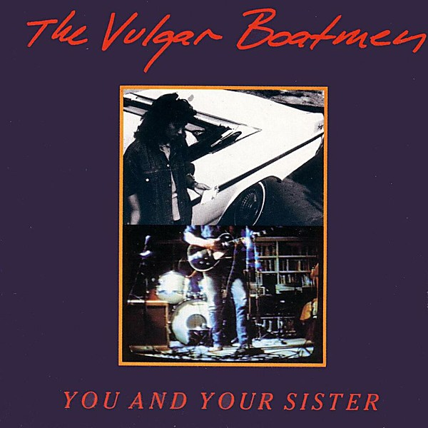

# You and Your Sister

By **The Vulgar Boatmen**

## Album Data

- **Catalog:** Beets
- **Format:** Digital, Album
- **Album:** You and Your Sister
- **Artist:** The Vulgar Boatmen
- **Albumartist:** The Vulgar Boatmen
- **Genre:** Progressive Metal
- **MusicBrainz Album Artist ID:** [21fbea56-b304-4650-8653-92a91e3f83c3](https://musicbrainz.org/artist/21fbea56-b304-4650-8653-92a91e3f83c3)
- **MusicBrainz Album ID:** [1c38808f-0e50-4c9d-b0c2-937caced5e0e](https://musicbrainz.org/release/1c38808f-0e50-4c9d-b0c2-937caced5e0e)
- **MusicBrainz Release Group ID:** [a361ef4a-a336-39b4-98c0-78f3555cdb0d](https://musicbrainz.org/release-group/a361ef4a-a336-39b4-98c0-78f3555cdb0d)
- **Year:** 1989
- **Catalog #:** 1171-2
- **Label:** Safe House
- **Total Tracks:** 12

## Album Tracks

### Track 01 - Mary Jane

- **Artist:** The Vulgar Boatmen
- **Format:** ALAC
- **Genre:** Progressive Metal
- **Length:** 3:57
- **MusicBrainz Track ID:** [7049c4e0-d20c-4d48-9251-63d4d55d9626](https://musicbrainz.org/recording/7049c4e0-d20c-4d48-9251-63d4d55d9626)
- **Title:** Mary Jane
- **Track:** 01
- **Year:** 1989

### Track 02 - You and Your Sister

- **Artist:** The Vulgar Boatmen
- **Format:** ALAC
- **Genre:** Jangle Pop
- **Length:** 4:27
- **MusicBrainz Track ID:** [496a4278-9bd6-4158-ad19-39c19d838e0e](https://musicbrainz.org/recording/496a4278-9bd6-4158-ad19-39c19d838e0e)
- **Title:** You and Your Sister
- **Track:** 02
- **Year:** 1989

### Track 03 - Margaret Says

- **Artist:** The Vulgar Boatmen
- **Format:** ALAC
- **Genre:** Progressive Metal
- **Length:** 4:45
- **MusicBrainz Track ID:** [50e110a6-cb50-41fb-9b47-ce29a14e8fc8](https://musicbrainz.org/recording/50e110a6-cb50-41fb-9b47-ce29a14e8fc8)
- **Title:** Margaret Says
- **Track:** 03
- **Year:** 1989

### Track 04 - Katie

- **Artist:** The Vulgar Boatmen
- **Format:** ALAC
- **Genre:** Progressive Metal
- **Length:** 2:54
- **MusicBrainz Track ID:** [23c0b938-2807-4fe1-a563-d4e5ca21373c](https://musicbrainz.org/recording/23c0b938-2807-4fe1-a563-d4e5ca21373c)
- **Title:** Katie
- **Track:** 04
- **Year:** 1989

### Track 05 - Drive Somewhere

- **Artist:** The Vulgar Boatmen
- **Format:** ALAC
- **Genre:** Progressive Metal
- **Length:** 5:59
- **MusicBrainz Track ID:** [c799b003-9b85-4269-92a6-2404d3bd5e63](https://musicbrainz.org/recording/c799b003-9b85-4269-92a6-2404d3bd5e63)
- **Title:** Drive Somewhere
- **Track:** 05
- **Year:** 1989

### Track 06 - Decision by the Airport

- **Artist:** The Vulgar Boatmen
- **Format:** ALAC
- **Genre:** Progressive Metal
- **Length:** 2:42
- **MusicBrainz Track ID:** [4e47cec9-6426-4618-87e2-11d6c09871e3](https://musicbrainz.org/recording/4e47cec9-6426-4618-87e2-11d6c09871e3)
- **Title:** Decision by the Airport
- **Track:** 06
- **Year:** 1989

### Track 07 - Change the World All Around

- **Artist:** The Vulgar Boatmen
- **Format:** ALAC
- **Genre:** Progressive Metal
- **Length:** 4:11
- **MusicBrainz Track ID:** [a3d99493-ad57-4dc7-9d1b-64d822885f1e](https://musicbrainz.org/recording/a3d99493-ad57-4dc7-9d1b-64d822885f1e)
- **Title:** Change the World All Around
- **Track:** 07
- **Year:** 1989

### Track 08 - Fallen Down

- **Artist:** The Vulgar Boatmen
- **Format:** ALAC
- **Genre:** Progressive Metal
- **Length:** 3:34
- **MusicBrainz Track ID:** [5ea1d130-e999-48fb-83b1-b6f56da576c9](https://musicbrainz.org/recording/5ea1d130-e999-48fb-83b1-b6f56da576c9)
- **Title:** Fallen Down
- **Track:** 08
- **Year:** 1989

### Track 09 - Hold Me Tight

- **Artist:** The Vulgar Boatmen
- **Format:** ALAC
- **Genre:** Progressive Metal
- **Length:** 3:37
- **MusicBrainz Track ID:** [c2432c74-63c7-470e-8380-b41f3ef49a4a](https://musicbrainz.org/recording/c2432c74-63c7-470e-8380-b41f3ef49a4a)
- **Title:** Hold Me Tight
- **Track:** 09
- **Year:** 1989

### Track 10 - Cry Real Tears

- **Artist:** The Vulgar Boatmen
- **Format:** ALAC
- **Genre:** Progressive Metal
- **Length:** 2:29
- **MusicBrainz Track ID:** [b4c2cbaa-c3f5-41a2-aad4-4bd7e887b7ea](https://musicbrainz.org/recording/b4c2cbaa-c3f5-41a2-aad4-4bd7e887b7ea)
- **Title:** Cry Real Tears
- **Track:** 10
- **Year:** 1989

### Track 11 - Drink More Coffee

- **Artist:** The Vulgar Boatmen
- **Format:** ALAC
- **Genre:** Progressive Metal
- **Length:** 2:58
- **MusicBrainz Track ID:** [ba4e0d3e-0347-4785-b0a0-4725973040d5](https://musicbrainz.org/recording/ba4e0d3e-0347-4785-b0a0-4725973040d5)
- **Title:** Drink More Coffee
- **Track:** 11
- **Year:** 1989

### Track 12 - The Street Where You Live

- **Artist:** The Vulgar Boatmen
- **Format:** ALAC
- **Genre:** Progressive Metal
- **Length:** 4:05
- **MusicBrainz Track ID:** [c50976eb-1c0e-4523-bf37-af8fb8db6c9d](https://musicbrainz.org/recording/c50976eb-1c0e-4523-bf37-af8fb8db6c9d)
- **Title:** The Street Where You Live
- **Track:** 12
- **Year:** 1989

