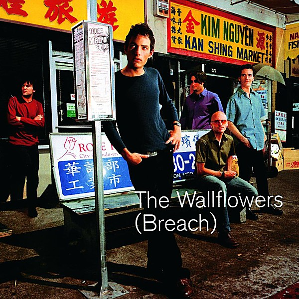

# (Breach)

By **The Wallflowers**

## Album Data

- **Catalog:** Beets
- **Format:** Digital, Album
- **Album:** (Breach)
- **Artist:** The Wallflowers
- **Albumartist:** The Wallflowers
- **Genre:** Alternative Rock
- **MusicBrainz Album Artist ID:** 
- **MusicBrainz Album ID:** 
- **MusicBrainz Release Group ID:** 
- **Year:** 2000
- **Catalog #:** INTD-90055
- **Label:** Interscope Records
- **Total Tracks:** 11

## Album Tracks

### Track 01 - One Headlight

- **Artist:** The Wallflowers
- **Format:** ALAC
- **Genre:** Alternative Rock
- **Length:** 5:12
- **MusicBrainz Track ID:** [a1c25ddc-2dd7-46a8-8041-2296ed37ca28](https://musicbrainz.org/recording/a1c25ddc-2dd7-46a8-8041-2296ed37ca28)
- **Title:** One Headlight
- **Track:** 01
- **Year:** 1996

### Track 02 - 6th Avenue Heartache

- **Artist:** The Wallflowers
- **Format:** ALAC
- **Genre:** Folk Rock
- **Length:** 5:37
- **MusicBrainz Track ID:** [20ea40b7-8021-4e1f-adb4-97ab9d80ba10](https://musicbrainz.org/recording/20ea40b7-8021-4e1f-adb4-97ab9d80ba10)
- **Title:** 6th Avenue Heartache
- **Track:** 02
- **Year:** 1996

### Track 03 - Bleeders

- **Artist:** The Wallflowers
- **Format:** ALAC
- **Genre:** Alternative Rock
- **Length:** 3:41
- **MusicBrainz Track ID:** [08c6df04-cbee-45bd-8cbd-5522c2cfc7b0](https://musicbrainz.org/recording/08c6df04-cbee-45bd-8cbd-5522c2cfc7b0)
- **Title:** Bleeders
- **Track:** 03
- **Year:** 1996

### Track 04 - Three Marlenas

- **Artist:** The Wallflowers
- **Format:** ALAC
- **Genre:** Alternative Rock
- **Length:** 4:59
- **MusicBrainz Track ID:** [9e7d7e99-6fce-430c-a0a3-2ad658716389](https://musicbrainz.org/recording/9e7d7e99-6fce-430c-a0a3-2ad658716389)
- **Title:** Three Marlenas
- **Track:** 04
- **Year:** 1996

### Track 05 - The Difference

- **Artist:** The Wallflowers
- **Format:** ALAC
- **Genre:** Alternative Rock
- **Length:** 3:50
- **MusicBrainz Track ID:** [2cfeea30-1304-46bc-bb48-b1298e113013](https://musicbrainz.org/recording/2cfeea30-1304-46bc-bb48-b1298e113013)
- **Title:** The Difference
- **Track:** 05
- **Year:** 1996

### Track 06 - Invisible City

- **Artist:** The Wallflowers
- **Format:** ALAC
- **Genre:** Folk Rock
- **Length:** 4:47
- **MusicBrainz Track ID:** [573f156f-37c3-4de5-925f-593b57dbe460](https://musicbrainz.org/recording/573f156f-37c3-4de5-925f-593b57dbe460)
- **Title:** Invisible City
- **Track:** 06
- **Year:** 1996

### Track 07 - Laughing Out Loud

- **Artist:** The Wallflowers
- **Format:** ALAC
- **Genre:** Alternative Rock
- **Length:** 3:39
- **MusicBrainz Track ID:** [2df90cdd-bdd8-45ca-a9fe-b4bb571acbc5](https://musicbrainz.org/recording/2df90cdd-bdd8-45ca-a9fe-b4bb571acbc5)
- **Title:** Laughing Out Loud
- **Track:** 07
- **Year:** 1996

### Track 08 - Josephine

- **Artist:** The Wallflowers
- **Format:** ALAC
- **Genre:** Folk Rock
- **Length:** 5:09
- **MusicBrainz Track ID:** [94751fd3-9ba7-4257-b6c2-43ee09698f6a](https://musicbrainz.org/recording/94751fd3-9ba7-4257-b6c2-43ee09698f6a)
- **Title:** Josephine
- **Track:** 08
- **Year:** 1996

### Track 09 - God Don’t Make Lonely Girls

- **Artist:** The Wallflowers
- **Format:** ALAC
- **Genre:** Country Rock
- **Length:** 4:48
- **MusicBrainz Track ID:** [3c6fe7db-d99b-4b77-82eb-5901c3107a98](https://musicbrainz.org/recording/3c6fe7db-d99b-4b77-82eb-5901c3107a98)
- **Title:** God Don’t Make Lonely Girls
- **Track:** 09
- **Year:** 1996

### Track 10 - Angel on My Bike

- **Artist:** The Wallflowers
- **Format:** ALAC
- **Genre:** Alternative Rock
- **Length:** 4:21
- **MusicBrainz Track ID:** [8f9186a0-9fed-4ac4-82eb-3791c4570e3f](https://musicbrainz.org/recording/8f9186a0-9fed-4ac4-82eb-3791c4570e3f)
- **Title:** Angel on My Bike
- **Track:** 10
- **Year:** 1996

### Track 11 - I Wish I Felt Nothing

- **Artist:** The Wallflowers
- **Format:** ALAC
- **Genre:** Folk Rock
- **Length:** 5:02
- **MusicBrainz Track ID:** [3f7e9174-39b4-4fea-a3c8-16ea85733407](https://musicbrainz.org/recording/3f7e9174-39b4-4fea-a3c8-16ea85733407)
- **Title:** I Wish I Felt Nothing
- **Track:** 11
- **Year:** 1996

## See also

- [Bringing Down the Horse](Bringing_Down_the_Horse.md)
- [Roon: 6th Avenue Heartache](../../Roon/The_Wallflowers/6th_Avenue_Heartache.md)
- [Roon: Breach](../../Roon/The_Wallflowers/Breach.md)
- [Roon: Bringing Down The Horse](../../Roon/The_Wallflowers/Bringing_Down_The_Horse.md)
- [Roon: Glad All Over](../../Roon/The_Wallflowers/Glad_All_Over.md)
- [Roon: The Wallflowers](../../Roon/The_Wallflowers/The_Wallflowers.md)
