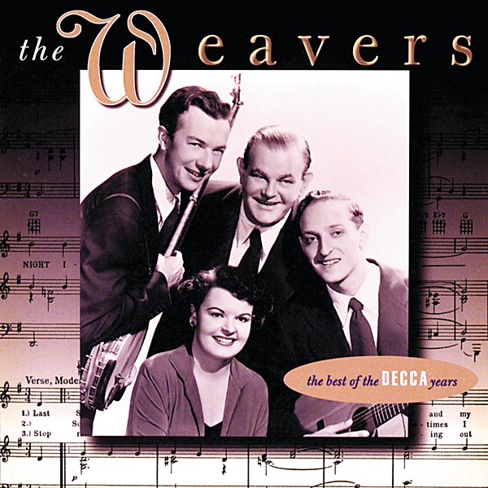

# The Best of the Decca Years

By **The Weavers**

## Album Data

- **Catalog:** Beets
- **Format:** Digital, Album
- **Album:** The Best of the Decca Years
- **Artist:** The Weavers
- **Albumartist:** The Weavers
- **Genre:** Blues
- **MusicBrainz Album Artist ID:** 
- **MusicBrainz Album ID:** 
- **MusicBrainz Release Group ID:** 
- **Year:** 1996
- **Catalog #:** 
- **Label:** 
- **Total Tracks:** 00

## Album Tracks

### Track 01 - On Top of Old Smokey

- **Artist:** The Weavers
- **Format:** AAC
- **Genre:** Blues
- **Length:** 2:44
- **MusicBrainz Track ID:** 
- **Title:** On Top of Old Smokey
- **Track:** 01
- **Year:** 1996

