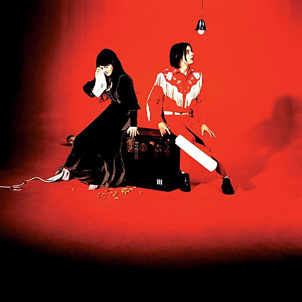

# Elephant

By **The White Stripes**

## Album Data

- **Catalog:** Beets
- **Format:** Digital, Album
- **Album:** Elephant
- **Artist:** The White Stripes
- **Albumartist:** The White Stripes
- **Genre:** Indie Rock
- **MusicBrainz Album Artist ID:** 
- **MusicBrainz Album ID:** 
- **MusicBrainz Release Group ID:** 
- **Year:** 2003
- **Catalog #:** 63881-27256-2
- **Label:** V2
- **Total Tracks:** 13

## Album Tracks

### Track 01 - Blue Orchid

- **Artist:** The White Stripes
- **Format:** ALAC
- **Genre:** Indie Rock
- **Length:** 2:37
- **MusicBrainz Track ID:** [b7051ce6-0cb3-4fbb-8056-f65633bf9e20](https://musicbrainz.org/recording/b7051ce6-0cb3-4fbb-8056-f65633bf9e20)
- **Title:** Blue Orchid
- **Track:** 01
- **Year:** 2005

### Track 02 - The Nurse

- **Artist:** The White Stripes
- **Format:** ALAC
- **Genre:** Indie Rock
- **Length:** 3:47
- **MusicBrainz Track ID:** [de77f93d-fa3a-44bb-9a0b-396c0337c3d4](https://musicbrainz.org/recording/de77f93d-fa3a-44bb-9a0b-396c0337c3d4)
- **Title:** The Nurse
- **Track:** 02
- **Year:** 2005

### Track 03 - My Doorbell

- **Artist:** The White Stripes
- **Format:** ALAC
- **Genre:** Indie Rock
- **Length:** 4:01
- **MusicBrainz Track ID:** [12d742ca-f515-4914-aa99-c73d754d81ea](https://musicbrainz.org/recording/12d742ca-f515-4914-aa99-c73d754d81ea)
- **Title:** My Doorbell
- **Track:** 03
- **Year:** 2005

### Track 04 - Forever for Her (Is Over for Me)

- **Artist:** The White Stripes
- **Format:** ALAC
- **Genre:** Indie Rock
- **Length:** 3:15
- **MusicBrainz Track ID:** [346826e2-86ee-42e3-901d-583d978cc85f](https://musicbrainz.org/recording/346826e2-86ee-42e3-901d-583d978cc85f)
- **Title:** Forever for Her (Is Over for Me)
- **Track:** 04
- **Year:** 2005

### Track 05 - Little Ghost

- **Artist:** The White Stripes
- **Format:** ALAC
- **Genre:** Indie Rock
- **Length:** 2:18
- **MusicBrainz Track ID:** [5f37417e-8ddf-4bca-8546-4bc889fab1fc](https://musicbrainz.org/recording/5f37417e-8ddf-4bca-8546-4bc889fab1fc)
- **Title:** Little Ghost
- **Track:** 05
- **Year:** 2005

### Track 06 - The Denial Twist

- **Artist:** The White Stripes
- **Format:** ALAC
- **Genre:** Indie Rock
- **Length:** 2:35
- **MusicBrainz Track ID:** [a231e384-75e3-4515-8494-1eca9435d4cf](https://musicbrainz.org/recording/a231e384-75e3-4515-8494-1eca9435d4cf)
- **Title:** The Denial Twist
- **Track:** 06
- **Year:** 2005

### Track 07 - White Moon

- **Artist:** The White Stripes
- **Format:** ALAC
- **Genre:** Indie Rock
- **Length:** 4:01
- **MusicBrainz Track ID:** [0b748ec8-4953-4371-a48e-96b7eda9d730](https://musicbrainz.org/recording/0b748ec8-4953-4371-a48e-96b7eda9d730)
- **Title:** White Moon
- **Track:** 07
- **Year:** 2005

### Track 08 - Instinct Blues

- **Artist:** The White Stripes
- **Format:** ALAC
- **Genre:** Indie Rock
- **Length:** 4:16
- **MusicBrainz Track ID:** [18df04ad-385f-4d6d-85da-c361e9b82a6e](https://musicbrainz.org/recording/18df04ad-385f-4d6d-85da-c361e9b82a6e)
- **Title:** Instinct Blues
- **Track:** 08
- **Year:** 2005

### Track 09 - Passive Manipulation

- **Artist:** The White Stripes
- **Format:** ALAC
- **Genre:** Indie Rock
- **Length:** 0:35
- **MusicBrainz Track ID:** [37391a45-0fba-4076-a45b-ddd8277858f5](https://musicbrainz.org/recording/37391a45-0fba-4076-a45b-ddd8277858f5)
- **Title:** Passive Manipulation
- **Track:** 09
- **Year:** 2005

### Track 10 - Take, Take, Take

- **Artist:** The White Stripes
- **Format:** ALAC
- **Genre:** Indie Rock
- **Length:** 4:22
- **MusicBrainz Track ID:** [edf78d2e-8a7f-4fa9-b548-69f26f461f7f](https://musicbrainz.org/recording/edf78d2e-8a7f-4fa9-b548-69f26f461f7f)
- **Title:** Take, Take, Take
- **Track:** 10
- **Year:** 2005

### Track 11 - As Ugly as I Seem

- **Artist:** The White Stripes
- **Format:** ALAC
- **Genre:** Indie Rock
- **Length:** 4:09
- **MusicBrainz Track ID:** [17121abb-3460-4370-b101-ac0a03c76a47](https://musicbrainz.org/recording/17121abb-3460-4370-b101-ac0a03c76a47)
- **Title:** As Ugly as I Seem
- **Track:** 11
- **Year:** 2005

### Track 12 - Red Rain

- **Artist:** The White Stripes
- **Format:** ALAC
- **Genre:** Indie Rock
- **Length:** 3:52
- **MusicBrainz Track ID:** [722a0384-2a21-4b59-90d4-75d2f612f4c3](https://musicbrainz.org/recording/722a0384-2a21-4b59-90d4-75d2f612f4c3)
- **Title:** Red Rain
- **Track:** 12
- **Year:** 2005

### Track 13 - I’m Lonely (but I Ain’t That Lonely Yet)

- **Artist:** The White Stripes
- **Format:** ALAC
- **Genre:** Garage Rock
- **Length:** 4:19
- **MusicBrainz Track ID:** [8e754847-60f0-4938-82ac-63728bd764b9](https://musicbrainz.org/recording/8e754847-60f0-4938-82ac-63728bd764b9)
- **Title:** I’m Lonely (but I Ain’t That Lonely Yet)
- **Track:** 13
- **Year:** 2005

## See also

- [Get Behind Me Satan](Get_Behind_Me_Satan.md)
- [Icky Thump](Icky_Thump.md)
- [Live Under the Lights of the Rising Sun](Live_Under_the_Lights_of_the_Rising_Sun.md)
- [The White Stripes](The_White_Stripes.md)
- [Roon: Elephant](../../Roon/The_White_Stripes/Elephant.md)
- [Roon: Greatest Hits](../../Roon/The_White_Stripes/Greatest_Hits.md)
- [Roon: Icky Thump](../../Roon/The_White_Stripes/Icky_Thump.md)
- [Roon: White Blood Cells](../../Roon/The_White_Stripes/White_Blood_Cells.md)
- [Vinyl: Get Behind Me Satan](../../Vinyl/The_White_Stripes/Get_Behind_Me_Satan.md)
- [Vinyl: Live Under The Lights Of The Rising Sun](../../Vinyl/The_White_Stripes/Live_Under_The_Lights_Of_The_Rising_Sun.md)
- [Vinyl: ](../../Vinyl/The_White_Stripes/The_White_Stripes.md)
