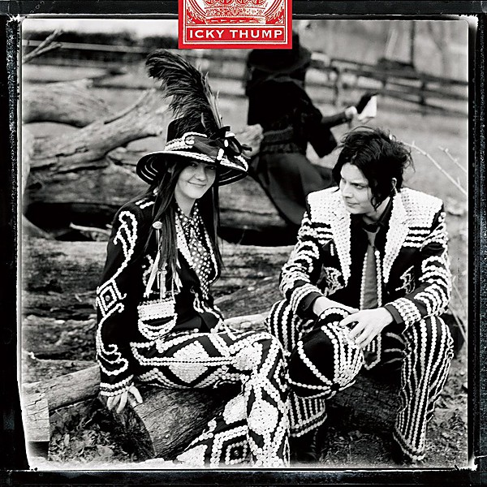

# Icky Thump

By **The White Stripes**

## Album Data

- **Catalog:** Beets
- **Format:** Digital, Album
- **Album:** Icky Thump
- **Artist:** The White Stripes
- **Albumartist:** The White Stripes
- **Genre:** Indie Rock
- **MusicBrainz Album Artist ID:** [11ae9fbb-f3d7-4a47-936f-4c0a04d3b3b5](https://musicbrainz.org/artist/11ae9fbb-f3d7-4a47-936f-4c0a04d3b3b5)
- **MusicBrainz Album ID:** [8a42e7bf-4003-3c14-99e2-511635ed5610](https://musicbrainz.org/release/8a42e7bf-4003-3c14-99e2-511635ed5610)
- **MusicBrainz Release Group ID:** [2956b5fb-fd54-3da7-b742-690bc6788e99](https://musicbrainz.org/release-group/2956b5fb-fd54-3da7-b742-690bc6788e99)
- **Year:** 2007
- **Catalog #:** TMR-285
- **Label:** Third Man Records
- **Total Tracks:** 28

## Album Tracks

### Track 01 - Let’s Shake Hands

- **Artist:** The White Stripes
- **Format:** MP3
- **Genre:** Garage Rock
- **Length:** 2:02
- **MusicBrainz Track ID:** [15384a5f-a97e-494b-b2d0-36c48b346d25](https://musicbrainz.org/recording/15384a5f-a97e-494b-b2d0-36c48b346d25)
- **Title:** Let’s Shake Hands
- **Track:** 01
- **Year:** 2014

### Track 02 - When I Hear My Name

- **Artist:** The White Stripes
- **Format:** MP3
- **Genre:** Indie Rock
- **Length:** 1:52
- **MusicBrainz Track ID:** [3b6b29e3-3a6c-4571-9c28-c7ae6055fc59](https://musicbrainz.org/recording/3b6b29e3-3a6c-4571-9c28-c7ae6055fc59)
- **Title:** When I Hear My Name
- **Track:** 02
- **Year:** 2014

### Track 03 - Jolene

- **Artist:** The White Stripes
- **Format:** MP3
- **Genre:** Garage Rock
- **Length:** 2:51
- **MusicBrainz Track ID:** [f710f24e-9a39-4edc-aca6-e22741cb5805](https://musicbrainz.org/recording/f710f24e-9a39-4edc-aca6-e22741cb5805)
- **Title:** Jolene
- **Track:** 03
- **Year:** 2014

### Track 04 - Lord, Send Me an Angel

- **Artist:** The White Stripes
- **Format:** MP3
- **Genre:** Garage Rock
- **Length:** 3:56
- **MusicBrainz Track ID:** [b089a9e0-ebb2-4803-94df-576cc820f33f](https://musicbrainz.org/recording/b089a9e0-ebb2-4803-94df-576cc820f33f)
- **Title:** Lord, Send Me an Angel
- **Track:** 04
- **Year:** 2014

### Track 05 - You’re Pretty Good Looking

- **Artist:** The White Stripes
- **Format:** MP3
- **Genre:** Indie Rock
- **Length:** 2:06
- **MusicBrainz Track ID:** [40453039-8131-4b65-814d-2c427cb75985](https://musicbrainz.org/recording/40453039-8131-4b65-814d-2c427cb75985)
- **Title:** You’re Pretty Good Looking
- **Track:** 05
- **Year:** 2014

### Track 06 - Hello Operator

- **Artist:** The White Stripes
- **Format:** MP3
- **Genre:** Indie Rock
- **Length:** 2:19
- **MusicBrainz Track ID:** [0c4e1b16-84fb-451d-b8ed-a266136bc36d](https://musicbrainz.org/recording/0c4e1b16-84fb-451d-b8ed-a266136bc36d)
- **Title:** Hello Operator
- **Track:** 06
- **Year:** 2014

### Track 07 - Death Letter

- **Artist:** The White Stripes
- **Format:** MP3
- **Genre:** Indie Rock
- **Length:** 4:24
- **MusicBrainz Track ID:** [ef569cdf-e310-4e26-9353-1adef92c0d78](https://musicbrainz.org/recording/ef569cdf-e310-4e26-9353-1adef92c0d78)
- **Title:** Death Letter
- **Track:** 07
- **Year:** 2014

### Track 08 - Astro / I Walk Like Jayne Mansfield / Jack the Ripper

- **Artist:** The White Stripes
- **Format:** MP3
- **Genre:** Indie Rock
- **Length:** 3:41
- **MusicBrainz Track ID:** [e4bbd9be-3b9b-497d-af23-98e8f4a0dcdb](https://musicbrainz.org/recording/e4bbd9be-3b9b-497d-af23-98e8f4a0dcdb)
- **Title:** Astro / I Walk Like Jayne Mansfield / Jack the Ripper
- **Track:** 08
- **Year:** 2014

### Track 09 - Canon / John the Revelator

- **Artist:** The White Stripes
- **Format:** MP3
- **Genre:** Indie Rock
- **Length:** 2:34
- **MusicBrainz Track ID:** [26df5128-75c0-428e-a014-3bee482e617c](https://musicbrainz.org/recording/26df5128-75c0-428e-a014-3bee482e617c)
- **Title:** Canon / John the Revelator
- **Track:** 09
- **Year:** 2014

### Track 10 - Dead Leaves and the Dirty Ground

- **Artist:** The White Stripes
- **Format:** MP3
- **Genre:** Indie Rock
- **Length:** 2:57
- **MusicBrainz Track ID:** [6ae29eca-b8a5-4692-8305-785c459228a5](https://musicbrainz.org/recording/6ae29eca-b8a5-4692-8305-785c459228a5)
- **Title:** Dead Leaves and the Dirty Ground
- **Track:** 10
- **Year:** 2014

### Track 11 - Apple Blossom

- **Artist:** The White Stripes
- **Format:** MP3
- **Genre:** Indie Rock
- **Length:** 2:11
- **MusicBrainz Track ID:** [2cae4a01-beef-4497-bc85-935f776abc41](https://musicbrainz.org/recording/2cae4a01-beef-4497-bc85-935f776abc41)
- **Title:** Apple Blossom
- **Track:** 11
- **Year:** 2014

### Track 12 - I Just Don’t Know What to Do With Myself

- **Artist:** The White Stripes
- **Format:** MP3
- **Genre:** Indie Rock
- **Length:** 2:48
- **MusicBrainz Track ID:** [57140682-ac23-4f7e-8cb6-47c594c4d337](https://musicbrainz.org/recording/57140682-ac23-4f7e-8cb6-47c594c4d337)
- **Title:** I Just Don’t Know What to Do With Myself
- **Track:** 12
- **Year:** 2014

### Track 13 - Screwdriver

- **Artist:** The White Stripes
- **Format:** MP3
- **Genre:** Garage Rock
- **Length:** 3:22
- **MusicBrainz Track ID:** [62f216e5-57b9-43ed-919a-e6944d9aa67c](https://musicbrainz.org/recording/62f216e5-57b9-43ed-919a-e6944d9aa67c)
- **Title:** Screwdriver
- **Track:** 13
- **Year:** 2014

### Track 14 - Let’s Shake Hands

- **Artist:** The White Stripes
- **Format:** MP3
- **Genre:** Garage Rock
- **Length:** 1:56
- **MusicBrainz Track ID:** [588dc232-3bb3-46aa-b782-87eccbeddf3d](https://musicbrainz.org/recording/588dc232-3bb3-46aa-b782-87eccbeddf3d)
- **Title:** Let’s Shake Hands
- **Track:** 14
- **Year:** 2014

### Track 15 - When I Hear My Name

- **Artist:** The White Stripes
- **Format:** MP3
- **Genre:** Indie Rock
- **Length:** 1:56
- **MusicBrainz Track ID:** [149a2cdd-6e2b-4ff5-b655-730625b7e83e](https://musicbrainz.org/recording/149a2cdd-6e2b-4ff5-b655-730625b7e83e)
- **Title:** When I Hear My Name
- **Track:** 15
- **Year:** 2014

### Track 16 - You’re Pretty Good Looking

- **Artist:** The White Stripes
- **Format:** MP3
- **Genre:** Indie Rock
- **Length:** 1:48
- **MusicBrainz Track ID:** [57ceee6b-8d00-4d2f-8ffe-b223155df9ac](https://musicbrainz.org/recording/57ceee6b-8d00-4d2f-8ffe-b223155df9ac)
- **Title:** You’re Pretty Good Looking
- **Track:** 16
- **Year:** 2014

### Track 17 - Hello Operator

- **Artist:** The White Stripes
- **Format:** MP3
- **Genre:** Indie Rock
- **Length:** 2:27
- **MusicBrainz Track ID:** [e792980d-6dc8-4e41-9d87-5fb2ea96143c](https://musicbrainz.org/recording/e792980d-6dc8-4e41-9d87-5fb2ea96143c)
- **Title:** Hello Operator
- **Track:** 17
- **Year:** 2014

### Track 18 - Jolene

- **Artist:** The White Stripes
- **Format:** MP3
- **Genre:** Garage Rock
- **Length:** 3:12
- **MusicBrainz Track ID:** [f95b874e-50b0-48dd-b2dd-6c3cfaf37985](https://musicbrainz.org/recording/f95b874e-50b0-48dd-b2dd-6c3cfaf37985)
- **Title:** Jolene
- **Track:** 18
- **Year:** 2014

### Track 19 - Apple Blossom

- **Artist:** The White Stripes
- **Format:** MP3
- **Genre:** Indie Rock
- **Length:** 2:29
- **MusicBrainz Track ID:** [c826820f-12d4-4e88-9a02-c79c492cf67a](https://musicbrainz.org/recording/c826820f-12d4-4e88-9a02-c79c492cf67a)
- **Title:** Apple Blossom
- **Track:** 19
- **Year:** 2014

### Track 20 - Stop Breaking Down

- **Artist:** The White Stripes
- **Format:** MP3
- **Genre:** Indie Rock
- **Length:** 4:04
- **MusicBrainz Track ID:** [ddd4a2a0-a320-4130-bb01-bb15e2fc49f8](https://musicbrainz.org/recording/ddd4a2a0-a320-4130-bb01-bb15e2fc49f8)
- **Title:** Stop Breaking Down
- **Track:** 20
- **Year:** 2014

### Track 21 - Death Letter

- **Artist:** The White Stripes
- **Format:** MP3
- **Genre:** Indie Rock
- **Length:** 4:39
- **MusicBrainz Track ID:** [00116a58-71b8-4d41-90ea-443a5d319d3e](https://musicbrainz.org/recording/00116a58-71b8-4d41-90ea-443a5d319d3e)
- **Title:** Death Letter
- **Track:** 21
- **Year:** 2014

### Track 22 - Wasting My Time

- **Artist:** The White Stripes
- **Format:** MP3
- **Genre:** Indie Rock
- **Length:** 2:11
- **MusicBrainz Track ID:** [31c7f27e-805e-4f8b-999d-393714aef2fd](https://musicbrainz.org/recording/31c7f27e-805e-4f8b-999d-393714aef2fd)
- **Title:** Wasting My Time
- **Track:** 22
- **Year:** 2014

### Track 23 - Broken Bricks

- **Artist:** The White Stripes
- **Format:** MP3
- **Genre:** Indie Rock
- **Length:** 0:59
- **MusicBrainz Track ID:** [be9efd03-5727-462b-943f-fd37401cf449](https://musicbrainz.org/recording/be9efd03-5727-462b-943f-fd37401cf449)
- **Title:** Broken Bricks
- **Track:** 23
- **Year:** 2014

### Track 24 - Cannon

- **Artist:** The White Stripes
- **Format:** MP3
- **Genre:** Indie Rock
- **Length:** 2:44
- **MusicBrainz Track ID:** [a118acd5-2ab0-4f98-819c-cd14706667e4](https://musicbrainz.org/recording/a118acd5-2ab0-4f98-819c-cd14706667e4)
- **Title:** Cannon
- **Track:** 24
- **Year:** 2014

### Track 25 - Your Southern Can Is Mine

- **Artist:** The White Stripes
- **Format:** MP3
- **Genre:** Indie Rock
- **Length:** 2:11
- **MusicBrainz Track ID:** [fce2d879-cab0-4eaf-aa04-3a8c84447225](https://musicbrainz.org/recording/fce2d879-cab0-4eaf-aa04-3a8c84447225)
- **Title:** Your Southern Can Is Mine
- **Track:** 25
- **Year:** 2014

### Track 26 - Dead Leaves and the Dirty Ground

- **Artist:** The White Stripes
- **Format:** MP3
- **Genre:** Indie Rock
- **Length:** 3:09
- **MusicBrainz Track ID:** [4a50ce8c-2add-4867-80fd-cdd8d84a80b1](https://musicbrainz.org/recording/4a50ce8c-2add-4867-80fd-cdd8d84a80b1)
- **Title:** Dead Leaves and the Dirty Ground
- **Track:** 26
- **Year:** 2014

### Track 27 - I’m Bored

- **Artist:** The White Stripes
- **Format:** MP3
- **Genre:** Indie Rock
- **Length:** 2:14
- **MusicBrainz Track ID:** [172c5260-228b-42f3-ac91-3a96527b8e92](https://musicbrainz.org/recording/172c5260-228b-42f3-ac91-3a96527b8e92)
- **Title:** I’m Bored
- **Track:** 27
- **Year:** 2014

### Track 28 - Screwdriver

- **Artist:** The White Stripes
- **Format:** MP3
- **Genre:** Garage Rock
- **Length:** 3:09
- **MusicBrainz Track ID:** [21e3fb95-4b10-4a7e-9389-d2525bc3f9c5](https://musicbrainz.org/recording/21e3fb95-4b10-4a7e-9389-d2525bc3f9c5)
- **Title:** Screwdriver
- **Track:** 28
- **Year:** 2014

## See also

- [Elephant](Elephant.md)
- [Get Behind Me Satan](Get_Behind_Me_Satan.md)
- [Live Under the Lights of the Rising Sun](Live_Under_the_Lights_of_the_Rising_Sun.md)
- [The White Stripes](The_White_Stripes.md)
- [Roon: Elephant](../../Roon/The_White_Stripes/Elephant.md)
- [Roon: Greatest Hits](../../Roon/The_White_Stripes/Greatest_Hits.md)
- [Roon: Icky Thump](../../Roon/The_White_Stripes/Icky_Thump.md)
- [Roon: White Blood Cells](../../Roon/The_White_Stripes/White_Blood_Cells.md)
- [Vinyl: Get Behind Me Satan](../../Vinyl/The_White_Stripes/Get_Behind_Me_Satan.md)
- [Vinyl: Live Under The Lights Of The Rising Sun](../../Vinyl/The_White_Stripes/Live_Under_The_Lights_Of_The_Rising_Sun.md)
- [Vinyl: ](../../Vinyl/The_White_Stripes/The_White_Stripes.md)
