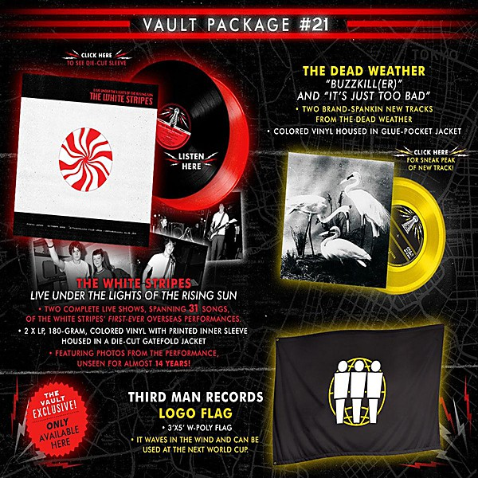

# Live Under the Lights of the Rising Sun

By **The White Stripes**

## Album Data

- **Catalog:** Beets
- **Format:** Digital, Album
- **Album:** Live Under the Lights of the Rising Sun
- **Artist:** The White Stripes
- **Albumartist:** The White Stripes
- **Genre:** Indie Rock
- **MusicBrainz Album Artist ID:** [11ae9fbb-f3d7-4a47-936f-4c0a04d3b3b5](https://musicbrainz.org/artist/11ae9fbb-f3d7-4a47-936f-4c0a04d3b3b5)
- **MusicBrainz Album ID:** [c41a2150-6c40-4755-8141-ff869a4fbe2c](https://musicbrainz.org/release/c41a2150-6c40-4755-8141-ff869a4fbe2c)
- **MusicBrainz Release Group ID:** [64a006bb-aff9-4719-9fe1-2d42554bd9e3](https://musicbrainz.org/release-group/64a006bb-aff9-4719-9fe1-2d42554bd9e3)
- **Year:** 2014
- **Catalog #:** SFTRI 577
- **Label:** Sympathy for the Record Industry
- **Total Tracks:** 17

## Album Tracks

### Track 01 - Jimmy the Exploder

- **Artist:** The White Stripes
- **Format:** ALAC
- **Genre:** Indie Rock
- **Length:** 2:29
- **MusicBrainz Track ID:** [ec74bd34-f760-4e85-b4ed-0ef22ca25784](https://musicbrainz.org/recording/ec74bd34-f760-4e85-b4ed-0ef22ca25784)
- **Title:** Jimmy the Exploder
- **Track:** 01
- **Year:** 1999

### Track 02 - Stop Breaking Down

- **Artist:** The White Stripes
- **Format:** ALAC
- **Genre:** Indie Rock
- **Length:** 2:20
- **MusicBrainz Track ID:** [509b7ca1-28c3-400f-a450-6506995e3cc9](https://musicbrainz.org/recording/509b7ca1-28c3-400f-a450-6506995e3cc9)
- **Title:** Stop Breaking Down
- **Track:** 02
- **Year:** 1999

### Track 03 - The Big Three Killed My Baby

- **Artist:** The White Stripes
- **Format:** ALAC
- **Genre:** Indie Rock
- **Length:** 2:29
- **MusicBrainz Track ID:** [9b66f322-bc16-45aa-a4cc-2c1c4ca5757e](https://musicbrainz.org/recording/9b66f322-bc16-45aa-a4cc-2c1c4ca5757e)
- **Title:** The Big Three Killed My Baby
- **Track:** 03
- **Year:** 1999

### Track 04 - Suzy Lee

- **Artist:** The White Stripes
- **Format:** ALAC
- **Genre:** Indie Rock
- **Length:** 3:21
- **MusicBrainz Track ID:** [5e1ffcf9-c7c7-4946-9fbf-f26c1e09f872](https://musicbrainz.org/recording/5e1ffcf9-c7c7-4946-9fbf-f26c1e09f872)
- **Title:** Suzy Lee
- **Track:** 04
- **Year:** 1999

### Track 05 - Sugar Never Tasted So Good

- **Artist:** The White Stripes
- **Format:** ALAC
- **Genre:** Indie Rock
- **Length:** 2:54
- **MusicBrainz Track ID:** [0f9648ce-2be4-4949-aa82-9635a9af9c8f](https://musicbrainz.org/recording/0f9648ce-2be4-4949-aa82-9635a9af9c8f)
- **Title:** Sugar Never Tasted So Good
- **Track:** 05
- **Year:** 1999

### Track 06 - Wasting My Time

- **Artist:** The White Stripes
- **Format:** ALAC
- **Genre:** Indie Rock
- **Length:** 2:13
- **MusicBrainz Track ID:** [e57872de-dab6-479e-9aef-cb3491b18b53](https://musicbrainz.org/recording/e57872de-dab6-479e-9aef-cb3491b18b53)
- **Title:** Wasting My Time
- **Track:** 06
- **Year:** 1999

### Track 07 - Cannon

- **Artist:** The White Stripes
- **Format:** ALAC
- **Genre:** Indie Rock
- **Length:** 2:30
- **MusicBrainz Track ID:** [b7a16861-54e9-4e54-b16b-9c49e1e34a6a](https://musicbrainz.org/recording/b7a16861-54e9-4e54-b16b-9c49e1e34a6a)
- **Title:** Cannon
- **Track:** 07
- **Year:** 1999

### Track 08 - Astro

- **Artist:** The White Stripes
- **Format:** ALAC
- **Genre:** Indie Rock
- **Length:** 2:42
- **MusicBrainz Track ID:** [49bc8de2-539f-438c-9d30-fe3ccacbbab1](https://musicbrainz.org/recording/49bc8de2-539f-438c-9d30-fe3ccacbbab1)
- **Title:** Astro
- **Track:** 08
- **Year:** 1999

### Track 09 - Broken Bricks

- **Artist:** The White Stripes
- **Format:** ALAC
- **Genre:** Indie Rock
- **Length:** 1:51
- **MusicBrainz Track ID:** [b1cf0193-adea-47e7-bff6-015ee962c7f7](https://musicbrainz.org/recording/b1cf0193-adea-47e7-bff6-015ee962c7f7)
- **Title:** Broken Bricks
- **Track:** 09
- **Year:** 1999

### Track 10 - When I Hear My Name

- **Artist:** The White Stripes
- **Format:** ALAC
- **Genre:** Indie Rock
- **Length:** 1:54
- **MusicBrainz Track ID:** [3eac650b-59f8-4b5a-b596-1d4a0fd4e1da](https://musicbrainz.org/recording/3eac650b-59f8-4b5a-b596-1d4a0fd4e1da)
- **Title:** When I Hear My Name
- **Track:** 10
- **Year:** 1999

### Track 11 - Do

- **Artist:** The White Stripes
- **Format:** ALAC
- **Genre:** Indie Rock
- **Length:** 3:05
- **MusicBrainz Track ID:** [348470ef-7b2f-45fe-a50d-a98f49c4c825](https://musicbrainz.org/recording/348470ef-7b2f-45fe-a50d-a98f49c4c825)
- **Title:** Do
- **Track:** 11
- **Year:** 1999

### Track 12 - Screwdriver

- **Artist:** The White Stripes
- **Format:** ALAC
- **Genre:** Garage Rock
- **Length:** 3:14
- **MusicBrainz Track ID:** [5e55968b-43d8-4e41-9a63-e7636dc751be](https://musicbrainz.org/recording/5e55968b-43d8-4e41-9a63-e7636dc751be)
- **Title:** Screwdriver
- **Track:** 12
- **Year:** 1999

### Track 13 - One More Cup of Coffee

- **Artist:** The White Stripes
- **Format:** ALAC
- **Genre:** Indie Rock
- **Length:** 3:13
- **MusicBrainz Track ID:** [cd6550eb-cedf-4b3e-9b30-0d21f2c29f76](https://musicbrainz.org/recording/cd6550eb-cedf-4b3e-9b30-0d21f2c29f76)
- **Title:** One More Cup of Coffee
- **Track:** 13
- **Year:** 1999

### Track 14 - Little People

- **Artist:** The White Stripes
- **Format:** ALAC
- **Genre:** Indie Rock
- **Length:** 2:22
- **MusicBrainz Track ID:** [d629425c-378b-4d90-95d4-e6ac7cf087cd](https://musicbrainz.org/recording/d629425c-378b-4d90-95d4-e6ac7cf087cd)
- **Title:** Little People
- **Track:** 14
- **Year:** 1999

### Track 15 - Slicker Drips

- **Artist:** The White Stripes
- **Format:** ALAC
- **Genre:** Garage Rock
- **Length:** 1:30
- **MusicBrainz Track ID:** [0b57cc21-dcd6-42a9-aff2-a849bb85444c](https://musicbrainz.org/recording/0b57cc21-dcd6-42a9-aff2-a849bb85444c)
- **Title:** Slicker Drips
- **Track:** 15
- **Year:** 1999

### Track 16 - St. James Infirmary Blues

- **Artist:** The White Stripes
- **Format:** ALAC
- **Genre:** Garage Rock
- **Length:** 2:24
- **MusicBrainz Track ID:** [3654d7d0-3ddc-4f99-ae2b-c2e615c827f5](https://musicbrainz.org/recording/3654d7d0-3ddc-4f99-ae2b-c2e615c827f5)
- **Title:** St. James Infirmary Blues
- **Track:** 16
- **Year:** 1999

### Track 17 - I Fought Piranhas

- **Artist:** The White Stripes
- **Format:** ALAC
- **Genre:** Indie Rock
- **Length:** 3:07
- **MusicBrainz Track ID:** [648657d0-970e-40fc-8453-3d817bc476fc](https://musicbrainz.org/recording/648657d0-970e-40fc-8453-3d817bc476fc)
- **Title:** I Fought Piranhas
- **Track:** 17
- **Year:** 1999

## See also

- [Elephant](Elephant.md)
- [Get Behind Me Satan](Get_Behind_Me_Satan.md)
- [Icky Thump](Icky_Thump.md)
- [The White Stripes](The_White_Stripes.md)
- [Roon: Elephant](../../Roon/The_White_Stripes/Elephant.md)
- [Roon: Greatest Hits](../../Roon/The_White_Stripes/Greatest_Hits.md)
- [Roon: Icky Thump](../../Roon/The_White_Stripes/Icky_Thump.md)
- [Roon: White Blood Cells](../../Roon/The_White_Stripes/White_Blood_Cells.md)
- [Vinyl: Get Behind Me Satan](../../Vinyl/The_White_Stripes/Get_Behind_Me_Satan.md)
- [Vinyl: Live Under The Lights Of The Rising Sun](../../Vinyl/The_White_Stripes/Live_Under_The_Lights_Of_The_Rising_Sun.md)
- [Vinyl: ](../../Vinyl/The_White_Stripes/The_White_Stripes.md)
