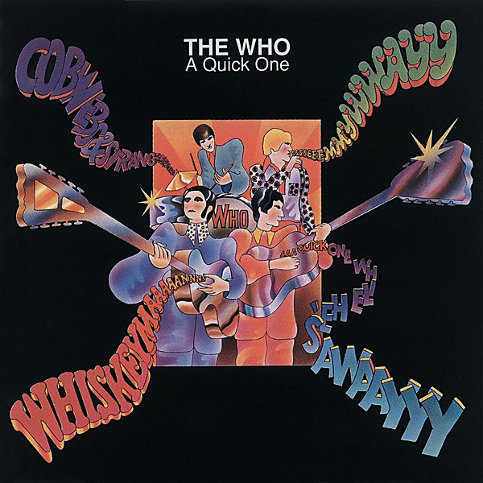

# A Quick One

By **The Who**

## Album Data

- **Catalog:** Beets
- **Format:** Digital, Album
- **Album:** A Quick One
- **Artist:** The Who
- **Albumartist:** The Who
- **Genre:** Freakbeat
- **MusicBrainz Album Artist ID:** [9fdaa16b-a6c4-4831-b87c-bc9ca8ce7eaa](https://musicbrainz.org/artist/9fdaa16b-a6c4-4831-b87c-bc9ca8ce7eaa)
- **MusicBrainz Album ID:** [df5be4f1-4bd7-43e6-b2a3-7eea453d5a4b](https://musicbrainz.org/release/df5be4f1-4bd7-43e6-b2a3-7eea453d5a4b)
- **MusicBrainz Release Group ID:** [475af630-84df-3243-9888-c03c67d54d1a](https://musicbrainz.org/release-group/475af630-84df-3243-9888-c03c67d54d1a)
- **Year:** 1995
- **Catalog #:** MCAD-11634
- **Label:** MCA Records
- **Total Tracks:** 14

## Album Tracks

### Track 01 - You Better You Bet

- **Artist:** The Who
- **Format:** MP3
- **Genre:** Progressive Rock
- **Length:** 5:37
- **MusicBrainz Track ID:** [4ea3af9f-79bc-4aa6-a664-9b165072d573](https://musicbrainz.org/recording/4ea3af9f-79bc-4aa6-a664-9b165072d573)
- **Title:** You Better You Bet
- **Track:** 01
- **Year:** 1997

### Track 02 - Don’t Let Go the Coat

- **Artist:** The Who
- **Format:** MP3
- **Genre:** Hard Rock
- **Length:** 3:48
- **MusicBrainz Track ID:** [4b3bb537-22d6-4d5c-bf01-dd4d62622091](https://musicbrainz.org/recording/4b3bb537-22d6-4d5c-bf01-dd4d62622091)
- **Title:** Don’t Let Go the Coat
- **Track:** 02
- **Year:** 1997

### Track 03 - Cache Cache

- **Artist:** The Who
- **Format:** MP3
- **Genre:** Hard Rock
- **Length:** 3:56
- **MusicBrainz Track ID:** [bcab0710-a351-429b-b38f-eea8bb3bdae3](https://musicbrainz.org/recording/bcab0710-a351-429b-b38f-eea8bb3bdae3)
- **Title:** Cache Cache
- **Track:** 03
- **Year:** 1997

### Track 04 - The Quiet One

- **Artist:** The Who
- **Format:** MP3
- **Genre:** Hard Rock
- **Length:** 3:09
- **MusicBrainz Track ID:** [4730ba9d-fd57-44d3-8641-46199f38dda4](https://musicbrainz.org/recording/4730ba9d-fd57-44d3-8641-46199f38dda4)
- **Title:** The Quiet One
- **Track:** 04
- **Year:** 1997

### Track 05 - Did You Steal My Money

- **Artist:** The Who
- **Format:** MP3
- **Genre:** Hard Rock
- **Length:** 4:15
- **MusicBrainz Track ID:** [2d0a00ee-d311-440e-b2bd-60ac47d78db2](https://musicbrainz.org/recording/2d0a00ee-d311-440e-b2bd-60ac47d78db2)
- **Title:** Did You Steal My Money
- **Track:** 05
- **Year:** 1997

### Track 06 - How Can You Do It Alone

- **Artist:** The Who
- **Format:** MP3
- **Genre:** Hard Rock
- **Length:** 5:26
- **MusicBrainz Track ID:** [6eaff702-3260-426a-9850-dcbee23c11d1](https://musicbrainz.org/recording/6eaff702-3260-426a-9850-dcbee23c11d1)
- **Title:** How Can You Do It Alone
- **Track:** 06
- **Year:** 1997

### Track 07 - Daily Records

- **Artist:** The Who
- **Format:** MP3
- **Genre:** Hard Rock
- **Length:** 3:25
- **MusicBrainz Track ID:** [d502f5b4-5dde-44b5-957f-8e2b472c479d](https://musicbrainz.org/recording/d502f5b4-5dde-44b5-957f-8e2b472c479d)
- **Title:** Daily Records
- **Track:** 07
- **Year:** 1997

### Track 08 - You

- **Artist:** The Who
- **Format:** MP3
- **Genre:** Hard Rock
- **Length:** 4:41
- **MusicBrainz Track ID:** [393dfbdf-0a66-4603-bb5f-de361520ceaa](https://musicbrainz.org/recording/393dfbdf-0a66-4603-bb5f-de361520ceaa)
- **Title:** You
- **Track:** 08
- **Year:** 1997

### Track 09 - Another Tricky Day

- **Artist:** The Who
- **Format:** MP3
- **Genre:** Hard Rock
- **Length:** 4:56
- **MusicBrainz Track ID:** [bb685c36-e3a0-425c-8123-5f2cedea6c6a](https://musicbrainz.org/recording/bb685c36-e3a0-425c-8123-5f2cedea6c6a)
- **Title:** Another Tricky Day
- **Track:** 09
- **Year:** 1997

### Track 10 - I Like Nightmares

- **Artist:** The Who
- **Format:** MP3
- **Genre:** Hard Rock
- **Length:** 3:11
- **MusicBrainz Track ID:** [f4d994a3-1eb7-4778-8c64-abf757b883c8](https://musicbrainz.org/recording/f4d994a3-1eb7-4778-8c64-abf757b883c8)
- **Title:** I Like Nightmares
- **Track:** 10
- **Year:** 1997

### Track 11 - It’s in You

- **Artist:** The Who
- **Format:** MP3
- **Genre:** Hard Rock
- **Length:** 5:01
- **MusicBrainz Track ID:** [75c175d6-5e80-441f-9c98-642935fad085](https://musicbrainz.org/recording/75c175d6-5e80-441f-9c98-642935fad085)
- **Title:** It’s in You
- **Track:** 11
- **Year:** 1997

### Track 12 - Somebody Saved Me

- **Artist:** The Who
- **Format:** MP3
- **Genre:** Rock
- **Length:** 5:31
- **MusicBrainz Track ID:** [581e3ba8-1651-4a17-829b-f5cd530f03cd](https://musicbrainz.org/recording/581e3ba8-1651-4a17-829b-f5cd530f03cd)
- **Title:** Somebody Saved Me
- **Track:** 12
- **Year:** 1997

### Track 13 - How Can You Do It Alone (live)

- **Artist:** The Who
- **Format:** MP3
- **Genre:** Rock
- **Length:** 5:27
- **MusicBrainz Track ID:** [bedd69d0-29e7-47a8-b894-1661d429b76c](https://musicbrainz.org/recording/bedd69d0-29e7-47a8-b894-1661d429b76c)
- **Title:** How Can You Do It Alone (live)
- **Track:** 13
- **Year:** 1997

### Track 14 - The Quiet One (live)

- **Artist:** The Who
- **Format:** MP3
- **Genre:** Hard Rock
- **Length:** 4:28
- **MusicBrainz Track ID:** [1b51784c-2d5b-4fb9-9be3-3c81aef3ea7c](https://musicbrainz.org/recording/1b51784c-2d5b-4fb9-9be3-3c81aef3ea7c)
- **Title:** The Quiet One (live)
- **Track:** 14
- **Year:** 1997

## See also

- [Face Dances](Face_Dances.md)
- [Live at Leeds](Live_at_Leeds.md)
- [My Generation](My_Generation.md)
- [Odds & Sods](Odds_and_Sods.md)
- [The Who Sell Out](The_Who_Sell_Out.md)
- [Tommy](Tommy.md)
- [Who’s Next](Who’s_Next.md)
- [Who's Next](Whos_Next.md)
- [CD: ](../../CD/The_Who/The_Who.md)
- [CD: Tommy](../../CD/The_Who/Tommy.md)
- [Roon: A Quick One (Stereo Version)](../../Roon/The_Who/A_Quick_One_Stereo_Version.md)
- [Roon: Face Dances](../../Roon/The_Who/Face_Dances.md)
- [Roon: Live At Leeds (Live At Leeds/1970)](../../Roon/The_Who/Live_At_Leeds_Live_At_Leeds-1970.md)
- [Roon: My Generation (Stereo Version)](../../Roon/The_Who/My_Generation_Stereo_Version.md)
- [Roon: Quadrophenia (Super Deluxe)](../../Roon/The_Who/Quadrophenia_Super_Deluxe.md)
- [Roon: The Who Sell Out (Super Deluxe)](../../Roon/The_Who/The_Who_Sell_Out_Super_Deluxe.md)
- [Roon: Tommy (Super Deluxe)](../../Roon/The_Who/Tommy_Super_Deluxe.md)
- [Roon: Who's Next (Deluxe Edition)](../../Roon/The_Who/Whos_Next_Deluxe_Edition.md)
- [Vinyl: A Quick One](../../Vinyl/The_Who/A_Quick_One.md)
- [Vinyl: My Generation](../../Vinyl/The_Who/My_Generation.md)
- [Vinyl: Squeeze Box](../../Vinyl/The_Who/Squeeze_Box.md)
- [Vinyl: ](../../Vinyl/The_Who/The_Who.md)
- [Vinyl: The Who Sell Out](../../Vinyl/The_Who/The_Who_Sell_Out.md)
- [Vinyl: Tommy](../../Vinyl/The_Who/Tommy.md)
- [Vinyl: Who Are You](../../Vinyl/The_Who/Who_Are_You.md)
- [Vinyl: Who's Missing](../../Vinyl/The_Who/Whos_Missing.md)
- [Vinyl: Who's Next](../../Vinyl/The_Who/Whos_Next.md)
