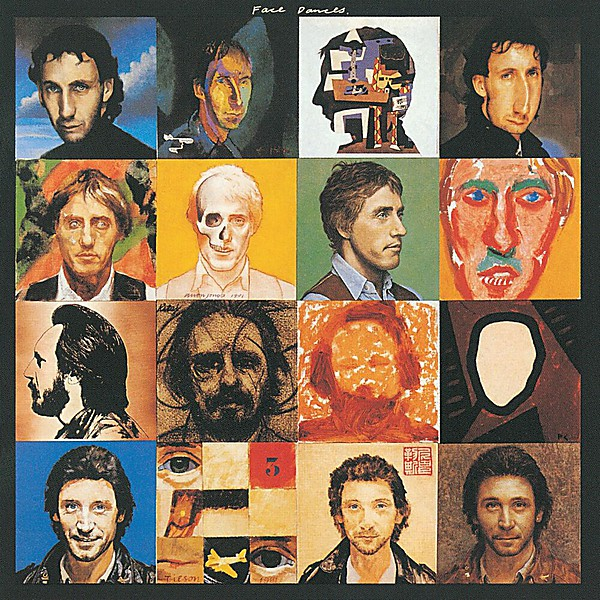

# Face Dances

By **The Who**

## Album Data

- **Catalog:** Beets
- **Format:** Digital, Album
- **Album:** Face Dances
- **Artist:** The Who
- **Albumartist:** The Who
- **Genre:** Hard Rock
- **MusicBrainz Album Artist ID:** [9fdaa16b-a6c4-4831-b87c-bc9ca8ce7eaa](https://musicbrainz.org/artist/9fdaa16b-a6c4-4831-b87c-bc9ca8ce7eaa)
- **MusicBrainz Album ID:** [febf0d67-c377-3115-8ecf-7fb87c9da3de](https://musicbrainz.org/release/febf0d67-c377-3115-8ecf-7fb87c9da3de)
- **MusicBrainz Release Group ID:** [634b1ad8-9be3-348e-bf1e-5456aabdfc77](https://musicbrainz.org/release-group/634b1ad8-9be3-348e-bf1e-5456aabdfc77)
- **Year:** 1997
- **Catalog #:** UDCD 755
- **Label:** Mobile Fidelity Sound Lab
- **Total Tracks:** 14

## Album Tracks

### Track 01 - Heaven and Hell

- **Artist:** The Who
- **Format:** ALAC
- **Genre:** Hard Rock
- **Length:** 4:49
- **MusicBrainz Track ID:** [ddc9a45a-e3e3-42bb-af05-ea87c17dab63](https://musicbrainz.org/recording/ddc9a45a-e3e3-42bb-af05-ea87c17dab63)
- **Title:** Heaven and Hell
- **Track:** 01
- **Year:** 1999

### Track 02 - I Can’t Explain

- **Artist:** The Who
- **Format:** ALAC
- **Genre:** Hard Rock
- **Length:** 2:58
- **MusicBrainz Track ID:** [84f76ca0-e439-4027-b1d7-ee3b1e6fe846](https://musicbrainz.org/recording/84f76ca0-e439-4027-b1d7-ee3b1e6fe846)
- **Title:** I Can’t Explain
- **Track:** 02
- **Year:** 1999

### Track 03 - Fortune Teller

- **Artist:** The Who
- **Format:** ALAC
- **Genre:** Hard Rock
- **Length:** 2:34
- **MusicBrainz Track ID:** [ab2c3fae-5a0e-4c0b-b95b-f22ed5d94ff4](https://musicbrainz.org/recording/ab2c3fae-5a0e-4c0b-b95b-f22ed5d94ff4)
- **Title:** Fortune Teller
- **Track:** 03
- **Year:** 1999

### Track 04 - Tattoo

- **Artist:** The Who
- **Format:** ALAC
- **Genre:** Hard Rock
- **Length:** 3:42
- **MusicBrainz Track ID:** [b813b3a2-8cef-4a49-a63c-15fd4560f921](https://musicbrainz.org/recording/b813b3a2-8cef-4a49-a63c-15fd4560f921)
- **Title:** Tattoo
- **Track:** 04
- **Year:** 1999

### Track 05 - Young Man Blues

- **Artist:** The Who
- **Format:** ALAC
- **Genre:** Hard Rock
- **Length:** 5:51
- **MusicBrainz Track ID:** [01849795-f07a-4665-b84c-12539558ffdf](https://musicbrainz.org/recording/01849795-f07a-4665-b84c-12539558ffdf)
- **Title:** Young Man Blues
- **Track:** 05
- **Year:** 1999

### Track 06 - Substitute

- **Artist:** The Who
- **Format:** ALAC
- **Genre:** Hard Rock
- **Length:** 2:07
- **MusicBrainz Track ID:** [63357e4d-fa6c-42c0-bd01-5045b0925cad](https://musicbrainz.org/recording/63357e4d-fa6c-42c0-bd01-5045b0925cad)
- **Title:** Substitute
- **Track:** 06
- **Year:** 1999

### Track 07 - Happy Jack

- **Artist:** The Who
- **Format:** ALAC
- **Genre:** Hard Rock
- **Length:** 2:13
- **MusicBrainz Track ID:** [7b49bb84-f59c-4173-af6a-8eb62849df3d](https://musicbrainz.org/recording/7b49bb84-f59c-4173-af6a-8eb62849df3d)
- **Title:** Happy Jack
- **Track:** 07
- **Year:** 1999

### Track 08 - I’m a Boy

- **Artist:** The Who
- **Format:** ALAC
- **Genre:** Hard Rock
- **Length:** 4:41
- **MusicBrainz Track ID:** [da881f2a-42a2-4ad9-a5de-75c32a01b135](https://musicbrainz.org/recording/da881f2a-42a2-4ad9-a5de-75c32a01b135)
- **Title:** I’m a Boy
- **Track:** 08
- **Year:** 1999

### Track 09 - A Quick One, While He’s Away

- **Artist:** The Who
- **Format:** ALAC
- **Genre:** Hard Rock
- **Length:** 8:41
- **MusicBrainz Track ID:** [69c0f5e1-7e55-4e3a-8875-b7808c7aa8e5](https://musicbrainz.org/recording/69c0f5e1-7e55-4e3a-8875-b7808c7aa8e5)
- **Title:** A Quick One, While He’s Away
- **Track:** 09
- **Year:** 1999

### Track 10 - Amazing Journey / Sparks

- **Artist:** The Who
- **Format:** ALAC
- **Genre:** Hard Rock
- **Length:** 7:54
- **MusicBrainz Track ID:** [469e17ae-74c9-4eb3-8c66-4cc2147e3276](https://musicbrainz.org/recording/469e17ae-74c9-4eb3-8c66-4cc2147e3276)
- **Title:** Amazing Journey / Sparks
- **Track:** 10
- **Year:** 1999

### Track 11 - Summertime Blues

- **Artist:** The Who
- **Format:** ALAC
- **Genre:** Hard Rock
- **Length:** 3:22
- **MusicBrainz Track ID:** [c8cc419e-cc8a-40d5-994d-06e7492c3352](https://musicbrainz.org/recording/c8cc419e-cc8a-40d5-994d-06e7492c3352)
- **Title:** Summertime Blues
- **Track:** 11
- **Year:** 1999

### Track 12 - Shakin’ All Over

- **Artist:** The Who
- **Format:** ALAC
- **Genre:** Hard Rock
- **Length:** 4:34
- **MusicBrainz Track ID:** [79cf9a41-ac2d-4dae-bb80-31ad7a927987](https://musicbrainz.org/recording/79cf9a41-ac2d-4dae-bb80-31ad7a927987)
- **Title:** Shakin’ All Over
- **Track:** 12
- **Year:** 1999

### Track 13 - My Generation

- **Artist:** The Who
- **Format:** ALAC
- **Genre:** Hard Rock
- **Length:** 15:46
- **MusicBrainz Track ID:** [ecaa1e44-f5ae-463a-a260-b04f8cfe984e](https://musicbrainz.org/recording/ecaa1e44-f5ae-463a-a260-b04f8cfe984e)
- **Title:** My Generation
- **Track:** 13
- **Year:** 1999

### Track 14 - Magic Bus

- **Artist:** The Who
- **Format:** ALAC
- **Genre:** Hard Rock
- **Length:** 7:48
- **MusicBrainz Track ID:** [f9fadde6-55cf-4289-8570-6cf4889619fd](https://musicbrainz.org/recording/f9fadde6-55cf-4289-8570-6cf4889619fd)
- **Title:** Magic Bus
- **Track:** 14
- **Year:** 1999

## See also

- [A Quick One](A_Quick_One.md)
- [Live at Leeds](Live_at_Leeds.md)
- [My Generation](My_Generation.md)
- [Odds & Sods](Odds_and_Sods.md)
- [The Who Sell Out](The_Who_Sell_Out.md)
- [Tommy](Tommy.md)
- [Who’s Next](Who’s_Next.md)
- [Who's Next](Whos_Next.md)
- [CD: ](../../CD/The_Who/The_Who.md)
- [CD: Tommy](../../CD/The_Who/Tommy.md)
- [Roon: A Quick One (Stereo Version)](../../Roon/The_Who/A_Quick_One_Stereo_Version.md)
- [Roon: Face Dances](../../Roon/The_Who/Face_Dances.md)
- [Roon: Live At Leeds (Live At Leeds/1970)](../../Roon/The_Who/Live_At_Leeds_Live_At_Leeds-1970.md)
- [Roon: My Generation (Stereo Version)](../../Roon/The_Who/My_Generation_Stereo_Version.md)
- [Roon: Quadrophenia (Super Deluxe)](../../Roon/The_Who/Quadrophenia_Super_Deluxe.md)
- [Roon: The Who Sell Out (Super Deluxe)](../../Roon/The_Who/The_Who_Sell_Out_Super_Deluxe.md)
- [Roon: Tommy (Super Deluxe)](../../Roon/The_Who/Tommy_Super_Deluxe.md)
- [Roon: Who's Next (Deluxe Edition)](../../Roon/The_Who/Whos_Next_Deluxe_Edition.md)
- [Vinyl: A Quick One](../../Vinyl/The_Who/A_Quick_One.md)
- [Vinyl: My Generation](../../Vinyl/The_Who/My_Generation.md)
- [Vinyl: Squeeze Box](../../Vinyl/The_Who/Squeeze_Box.md)
- [Vinyl: ](../../Vinyl/The_Who/The_Who.md)
- [Vinyl: The Who Sell Out](../../Vinyl/The_Who/The_Who_Sell_Out.md)
- [Vinyl: Tommy](../../Vinyl/The_Who/Tommy.md)
- [Vinyl: Who Are You](../../Vinyl/The_Who/Who_Are_You.md)
- [Vinyl: Who's Missing](../../Vinyl/The_Who/Whos_Missing.md)
- [Vinyl: Who's Next](../../Vinyl/The_Who/Whos_Next.md)
