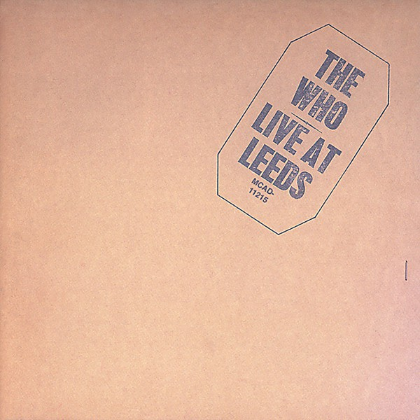

# Live at Leeds

By **The Who**

## Album Data

- **Catalog:** Beets
- **Format:** Digital, Album
- **Album:** Live at Leeds
- **Artist:** The Who
- **Albumartist:** The Who
- **Genre:** Hard Rock
- **MusicBrainz Album Artist ID:** [9fdaa16b-a6c4-4831-b87c-bc9ca8ce7eaa](https://musicbrainz.org/artist/9fdaa16b-a6c4-4831-b87c-bc9ca8ce7eaa)
- **MusicBrainz Album ID:** [995dee1d-18cf-3bf5-ae6a-13ec6dd2ef31](https://musicbrainz.org/release/995dee1d-18cf-3bf5-ae6a-13ec6dd2ef31)
- **MusicBrainz Release Group ID:** [0ba3b960-9b4b-3191-bcc5-1e51169e5955](https://musicbrainz.org/release-group/0ba3b960-9b4b-3191-bcc5-1e51169e5955)
- **Year:** 1999
- **Catalog #:** 
- **Label:** Geffen Records
- **Total Tracks:** 30

## Album Tracks

### Track 01 - Out in the Street (stereo version)

- **Artist:** The Who
- **Format:** MP3
- **Genre:** Hard Rock
- **Length:** 2:30
- **MusicBrainz Track ID:** [bfb161f8-caf8-4a28-ac2b-b34a9f114a3d](https://musicbrainz.org/recording/bfb161f8-caf8-4a28-ac2b-b34a9f114a3d)
- **Title:** Out in the Street (stereo version)
- **Track:** 01
- **Year:** 2014

### Track 02 - I Don’t Mind (stereo version)

- **Artist:** The Who
- **Format:** MP3
- **Genre:** Hard Rock
- **Length:** 2:36
- **MusicBrainz Track ID:** [9413405f-2cae-49f8-b1cc-30aa68d95793](https://musicbrainz.org/recording/9413405f-2cae-49f8-b1cc-30aa68d95793)
- **Title:** I Don’t Mind (stereo version)
- **Track:** 02
- **Year:** 2014

### Track 03 - The Good’s Gone (stereo version)

- **Artist:** The Who
- **Format:** MP3
- **Genre:** Hard Rock
- **Length:** 4:05
- **MusicBrainz Track ID:** [c7cb9bb1-4b0f-4747-973e-e1c850f163d3](https://musicbrainz.org/recording/c7cb9bb1-4b0f-4747-973e-e1c850f163d3)
- **Title:** The Good’s Gone (stereo version)
- **Track:** 03
- **Year:** 2014

### Track 04 - La‐La‐La Lies (stereo version)

- **Artist:** The Who
- **Format:** MP3
- **Genre:** Hard Rock
- **Length:** 2:15
- **MusicBrainz Track ID:** [e0287290-6348-4eaf-ac69-13643e70407e](https://musicbrainz.org/recording/e0287290-6348-4eaf-ac69-13643e70407e)
- **Title:** La‐La‐La Lies (stereo version)
- **Track:** 04
- **Year:** 2014

### Track 05 - Much Too Much (stereo version)

- **Artist:** The Who
- **Format:** MP3
- **Genre:** Hard Rock
- **Length:** 2:43
- **MusicBrainz Track ID:** [c7a32fd3-d3ee-47fb-9e04-ca38e7c40d47](https://musicbrainz.org/recording/c7a32fd3-d3ee-47fb-9e04-ca38e7c40d47)
- **Title:** Much Too Much (stereo version)
- **Track:** 05
- **Year:** 2014

### Track 06 - My Generation (stereo version)

- **Artist:** The Who
- **Format:** MP3
- **Genre:** Hard Rock
- **Length:** 3:18
- **MusicBrainz Track ID:** [8d615d00-6c4c-4464-af2f-04b74f578a54](https://musicbrainz.org/recording/8d615d00-6c4c-4464-af2f-04b74f578a54)
- **Title:** My Generation (stereo version)
- **Track:** 06
- **Year:** 2014

### Track 07 - The Kids Are Alright (stereo version)

- **Artist:** The Who
- **Format:** MP3
- **Genre:** Hard Rock
- **Length:** 3:05
- **MusicBrainz Track ID:** [9538e2bc-1171-4789-bc2e-7d3968d99577](https://musicbrainz.org/recording/9538e2bc-1171-4789-bc2e-7d3968d99577)
- **Title:** The Kids Are Alright (stereo version)
- **Track:** 07
- **Year:** 2014

### Track 08 - Please, Please, Please (stereo version)

- **Artist:** The Who
- **Format:** MP3
- **Genre:** Hard Rock
- **Length:** 2:43
- **MusicBrainz Track ID:** [bc7a2297-1490-4386-a4dd-0523c39e75f3](https://musicbrainz.org/recording/bc7a2297-1490-4386-a4dd-0523c39e75f3)
- **Title:** Please, Please, Please (stereo version)
- **Track:** 08
- **Year:** 2014

### Track 09 - It’s Not True (stereo version)

- **Artist:** The Who
- **Format:** MP3
- **Genre:** Hard Rock
- **Length:** 2:30
- **MusicBrainz Track ID:** [0b110973-eef5-45d0-9a2f-4b65c4e15f9b](https://musicbrainz.org/recording/0b110973-eef5-45d0-9a2f-4b65c4e15f9b)
- **Title:** It’s Not True (stereo version)
- **Track:** 09
- **Year:** 2014

### Track 10 - I’m a Man (stereo version)

- **Artist:** The Who
- **Format:** MP3
- **Genre:** Hard Rock
- **Length:** 3:20
- **MusicBrainz Track ID:** [81833bc0-24b8-43c4-bef6-850fa00742f6](https://musicbrainz.org/recording/81833bc0-24b8-43c4-bef6-850fa00742f6)
- **Title:** I’m a Man (stereo version)
- **Track:** 10
- **Year:** 2014

### Track 11 - A Legal Matter (stereo version)

- **Artist:** The Who
- **Format:** MP3
- **Genre:** Hard Rock
- **Length:** 2:49
- **MusicBrainz Track ID:** [ab226505-f0f4-42a9-b7fc-e3323845c1d5](https://musicbrainz.org/recording/ab226505-f0f4-42a9-b7fc-e3323845c1d5)
- **Title:** A Legal Matter (stereo version)
- **Track:** 11
- **Year:** 2014

### Track 12 - The Ox (stereo version)

- **Artist:** The Who
- **Format:** MP3
- **Genre:** Hard Rock
- **Length:** 3:56
- **MusicBrainz Track ID:** [677064c7-9cbd-44be-8c1c-565ca6cf2e80](https://musicbrainz.org/recording/677064c7-9cbd-44be-8c1c-565ca6cf2e80)
- **Title:** The Ox (stereo version)
- **Track:** 12
- **Year:** 2014

### Track 13 - I Can’t Explain (stereo version)

- **Artist:** The Who
- **Format:** MP3
- **Genre:** Hard Rock
- **Length:** 2:06
- **MusicBrainz Track ID:** [78d8e027-d368-4b5e-a7d5-4d821e187947](https://musicbrainz.org/recording/78d8e027-d368-4b5e-a7d5-4d821e187947)
- **Title:** I Can’t Explain (stereo version)
- **Track:** 13
- **Year:** 2014

### Track 14 - Bald Headed Woman (stereo version)

- **Artist:** The Who
- **Format:** MP3
- **Genre:** Hard Rock
- **Length:** 2:34
- **MusicBrainz Track ID:** [f78d2d2a-dbb4-45aa-803a-3b085f002134](https://musicbrainz.org/recording/f78d2d2a-dbb4-45aa-803a-3b085f002134)
- **Title:** Bald Headed Woman (stereo version)
- **Track:** 14
- **Year:** 2014

### Track 15 - Anyway, Anyhow, Anywhere (stereo version)

- **Artist:** The Who
- **Format:** MP3
- **Genre:** Hard Rock
- **Length:** 2:44
- **MusicBrainz Track ID:** [b1ae2d2a-97a7-4178-a0c0-4e0bccf50523](https://musicbrainz.org/recording/b1ae2d2a-97a7-4178-a0c0-4e0bccf50523)
- **Title:** Anyway, Anyhow, Anywhere (stereo version)
- **Track:** 15
- **Year:** 2014

### Track 16 - Daddy Rolling Stone (stereo version)

- **Artist:** The Who
- **Format:** MP3
- **Genre:** Hard Rock
- **Length:** 2:59
- **MusicBrainz Track ID:** [426d2019-cd38-445b-b367-d11c18bf65e2](https://musicbrainz.org/recording/426d2019-cd38-445b-b367-d11c18bf65e2)
- **Title:** Daddy Rolling Stone (stereo version)
- **Track:** 16
- **Year:** 2014

### Track 17 - Anytime You Want Me (stereo version)

- **Artist:** The Who
- **Format:** MP3
- **Genre:** Hard Rock
- **Length:** 2:37
- **MusicBrainz Track ID:** [e4927160-0606-4c1f-9232-2762488c77ac](https://musicbrainz.org/recording/e4927160-0606-4c1f-9232-2762488c77ac)
- **Title:** Anytime You Want Me (stereo version)
- **Track:** 17
- **Year:** 2014

### Track 18 - Shout and Shimmy (stereo version)

- **Artist:** The Who
- **Format:** MP3
- **Genre:** Hard Rock
- **Length:** 3:19
- **MusicBrainz Track ID:** [89f59383-34f9-4298-bd68-7863186dbe5e](https://musicbrainz.org/recording/89f59383-34f9-4298-bd68-7863186dbe5e)
- **Title:** Shout and Shimmy (stereo version)
- **Track:** 18
- **Year:** 2014

### Track 19 - Circles (stereo version)

- **Artist:** The Who
- **Format:** MP3
- **Genre:** Hard Rock
- **Length:** 3:13
- **MusicBrainz Track ID:** [1fcd59db-482d-4f9e-8f13-4378fe89f18e](https://musicbrainz.org/recording/1fcd59db-482d-4f9e-8f13-4378fe89f18e)
- **Title:** Circles (stereo version)
- **Track:** 19
- **Year:** 2014

### Track 20 - Instant Party Mixture (stereo version)

- **Artist:** The Who
- **Format:** MP3
- **Genre:** Hard Rock
- **Length:** 3:29
- **MusicBrainz Track ID:** [e10a23ea-435d-4eec-b1af-a95187792326](https://musicbrainz.org/recording/e10a23ea-435d-4eec-b1af-a95187792326)
- **Title:** Instant Party Mixture (stereo version)
- **Track:** 20
- **Year:** 2014

### Track 21 - Leaving Here (stereo version)

- **Artist:** The Who
- **Format:** MP3
- **Genre:** Hard Rock
- **Length:** 2:49
- **MusicBrainz Track ID:** [ae319589-7999-4617-b2c7-13e212d410ec](https://musicbrainz.org/recording/ae319589-7999-4617-b2c7-13e212d410ec)
- **Title:** Leaving Here (stereo version)
- **Track:** 21
- **Year:** 2014

### Track 22 - Lubie (Come Back Home) (stereo version)

- **Artist:** The Who
- **Format:** MP3
- **Genre:** Hard Rock
- **Length:** 3:42
- **MusicBrainz Track ID:** [bd25638a-f9d1-4c80-8c2e-6800b5dc6a9c](https://musicbrainz.org/recording/bd25638a-f9d1-4c80-8c2e-6800b5dc6a9c)
- **Title:** Lubie (Come Back Home) (stereo version)
- **Track:** 22
- **Year:** 2014

### Track 23 - (Love Is Like a) Heat Wave (stereo version)

- **Artist:** The Who
- **Format:** MP3
- **Genre:** Hard Rock
- **Length:** 2:41
- **MusicBrainz Track ID:** [34ffd60f-ed6f-4f46-bacf-153bdc6fab35](https://musicbrainz.org/recording/34ffd60f-ed6f-4f46-bacf-153bdc6fab35)
- **Title:** (Love Is Like a) Heat Wave (stereo version)
- **Track:** 23
- **Year:** 2014

### Track 24 - Motoring (stereo version)

- **Artist:** The Who
- **Format:** MP3
- **Genre:** Hard Rock
- **Length:** 2:47
- **MusicBrainz Track ID:** [1387b6aa-4465-401f-a932-3f2ca20dfa46](https://musicbrainz.org/recording/1387b6aa-4465-401f-a932-3f2ca20dfa46)
- **Title:** Motoring (stereo version)
- **Track:** 24
- **Year:** 2014

### Track 25 - Daddy Rolling Stone (alternate stereo version)

- **Artist:** The Who
- **Format:** MP3
- **Genre:** Hard Rock
- **Length:** 3:06
- **MusicBrainz Track ID:** [b9effa46-1e5b-4d6f-9a54-80d68982557c](https://musicbrainz.org/recording/b9effa46-1e5b-4d6f-9a54-80d68982557c)
- **Title:** Daddy Rolling Stone (alternate stereo version)
- **Track:** 25
- **Year:** 2014

### Track 26 - The Kids Are Alright (alternate stereo version)

- **Artist:** The Who
- **Format:** MP3
- **Genre:** Hard Rock
- **Length:** 3:07
- **MusicBrainz Track ID:** [49f7f798-3435-4a2e-aac9-1a0f4d1dc26b](https://musicbrainz.org/recording/49f7f798-3435-4a2e-aac9-1a0f4d1dc26b)
- **Title:** The Kids Are Alright (alternate stereo version)
- **Track:** 26
- **Year:** 2014

### Track 27 - My Generation (instrumental stereo version)

- **Artist:** The Who
- **Format:** MP3
- **Genre:** Hard Rock
- **Length:** 3:38
- **MusicBrainz Track ID:** [ebce5c53-a236-4306-adb4-0150eccf8130](https://musicbrainz.org/recording/ebce5c53-a236-4306-adb4-0150eccf8130)
- **Title:** My Generation (instrumental stereo version)
- **Track:** 27
- **Year:** 2014

### Track 28 - Out in the Street (alternate stereo version)

- **Artist:** The Who
- **Format:** MP3
- **Genre:** Hard Rock
- **Length:** 2:33
- **MusicBrainz Track ID:** [71fbecf0-dcc0-4b6a-a5c2-3f39935b88f9](https://musicbrainz.org/recording/71fbecf0-dcc0-4b6a-a5c2-3f39935b88f9)
- **Title:** Out in the Street (alternate stereo version)
- **Track:** 28
- **Year:** 2014

### Track 29 - I Don’t Mind (full length stereo version)

- **Artist:** The Who
- **Format:** MP3
- **Genre:** Hard Rock
- **Length:** 3:45
- **MusicBrainz Track ID:** [e7d6bad1-cf7a-4c2e-bdad-4c4a9e970770](https://musicbrainz.org/recording/e7d6bad1-cf7a-4c2e-bdad-4c4a9e970770)
- **Title:** I Don’t Mind (full length stereo version)
- **Track:** 29
- **Year:** 2014

### Track 30 - The Good’s Gone (full length stereo version)

- **Artist:** The Who
- **Format:** MP3
- **Genre:** Hard Rock
- **Length:** 4:27
- **MusicBrainz Track ID:** [720e4701-c2c4-4f5d-ad5d-5c1464cb87b7](https://musicbrainz.org/recording/720e4701-c2c4-4f5d-ad5d-5c1464cb87b7)
- **Title:** The Good’s Gone (full length stereo version)
- **Track:** 30
- **Year:** 2014

## See also

- [A Quick One](A_Quick_One.md)
- [Face Dances](Face_Dances.md)
- [My Generation](My_Generation.md)
- [Odds & Sods](Odds_and_Sods.md)
- [The Who Sell Out](The_Who_Sell_Out.md)
- [Tommy](Tommy.md)
- [Who’s Next](Who’s_Next.md)
- [Who's Next](Whos_Next.md)
- [CD: ](../../CD/The_Who/The_Who.md)
- [CD: Tommy](../../CD/The_Who/Tommy.md)
- [Roon: A Quick One (Stereo Version)](../../Roon/The_Who/A_Quick_One_Stereo_Version.md)
- [Roon: Face Dances](../../Roon/The_Who/Face_Dances.md)
- [Roon: Live At Leeds (Live At Leeds/1970)](../../Roon/The_Who/Live_At_Leeds_Live_At_Leeds-1970.md)
- [Roon: My Generation (Stereo Version)](../../Roon/The_Who/My_Generation_Stereo_Version.md)
- [Roon: Quadrophenia (Super Deluxe)](../../Roon/The_Who/Quadrophenia_Super_Deluxe.md)
- [Roon: The Who Sell Out (Super Deluxe)](../../Roon/The_Who/The_Who_Sell_Out_Super_Deluxe.md)
- [Roon: Tommy (Super Deluxe)](../../Roon/The_Who/Tommy_Super_Deluxe.md)
- [Roon: Who's Next (Deluxe Edition)](../../Roon/The_Who/Whos_Next_Deluxe_Edition.md)
- [Vinyl: A Quick One](../../Vinyl/The_Who/A_Quick_One.md)
- [Vinyl: My Generation](../../Vinyl/The_Who/My_Generation.md)
- [Vinyl: Squeeze Box](../../Vinyl/The_Who/Squeeze_Box.md)
- [Vinyl: ](../../Vinyl/The_Who/The_Who.md)
- [Vinyl: The Who Sell Out](../../Vinyl/The_Who/The_Who_Sell_Out.md)
- [Vinyl: Tommy](../../Vinyl/The_Who/Tommy.md)
- [Vinyl: Who Are You](../../Vinyl/The_Who/Who_Are_You.md)
- [Vinyl: Who's Missing](../../Vinyl/The_Who/Whos_Missing.md)
- [Vinyl: Who's Next](../../Vinyl/The_Who/Whos_Next.md)
