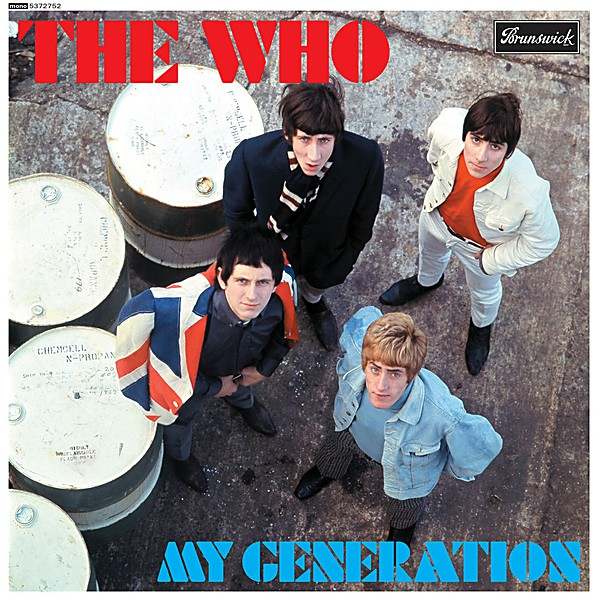

# My Generation

By **The Who**

## Album Data

- **Catalog:** Beets
- **Format:** Digital, Album
- **Album:** My Generation
- **Artist:** The Who
- **Albumartist:** The Who
- **Genre:** Hard Rock
- **MusicBrainz Album Artist ID:** [9fdaa16b-a6c4-4831-b87c-bc9ca8ce7eaa](https://musicbrainz.org/artist/9fdaa16b-a6c4-4831-b87c-bc9ca8ce7eaa)
- **MusicBrainz Album ID:** [49ee5c93-aec5-4154-825f-1908481160e9](https://musicbrainz.org/release/49ee5c93-aec5-4154-825f-1908481160e9)
- **MusicBrainz Release Group ID:** [00c3da9f-309b-3f78-ba23-6a753fd6313d](https://musicbrainz.org/release-group/00c3da9f-309b-3f78-ba23-6a753fd6313d)
- **Year:** 2014
- **Catalog #:** MCAD-11718
- **Label:** MCA Records
- **Total Tracks:** 23

## Album Tracks

### Track 01 - I’m the Face

- **Artist:** The Who
- **Format:** MP3
- **Genre:** Rock
- **Length:** 2:28
- **MusicBrainz Track ID:** [b5316036-2ac2-4d41-ae8f-f32fe96492f1](https://musicbrainz.org/recording/b5316036-2ac2-4d41-ae8f-f32fe96492f1)
- **Title:** I’m the Face
- **Track:** 01
- **Year:** 1998

### Track 02 - Leaving Here

- **Artist:** The Who
- **Format:** ALAC
- **Genre:** Rock And Roll
- **Length:** 2:13
- **MusicBrainz Track ID:** [ee1c4596-5d83-444e-bf23-841f5139514a](https://musicbrainz.org/recording/ee1c4596-5d83-444e-bf23-841f5139514a)
- **Title:** Leaving Here
- **Track:** 02
- **Year:** 1998

### Track 03 - Baby Don’t You Do It

- **Artist:** The Who
- **Format:** ALAC
- **Genre:** Rock
- **Length:** 2:28
- **MusicBrainz Track ID:** [43c4daac-13f6-4b15-a3e0-9573adc9ec71](https://musicbrainz.org/recording/43c4daac-13f6-4b15-a3e0-9573adc9ec71)
- **Title:** Baby Don’t You Do It
- **Track:** 03
- **Year:** 1998

### Track 04 - Summertime Blues

- **Artist:** The Who
- **Format:** ALAC
- **Genre:** Hard Rock
- **Length:** 3:13
- **MusicBrainz Track ID:** [93f5d3d2-d8ee-4fc1-8feb-d5757b0d0750](https://musicbrainz.org/recording/93f5d3d2-d8ee-4fc1-8feb-d5757b0d0750)
- **Title:** Summertime Blues
- **Track:** 04
- **Year:** 1998

### Track 05 - Under My Thumb

- **Artist:** The Who
- **Format:** ALAC
- **Genre:** Rock And Roll
- **Length:** 2:45
- **MusicBrainz Track ID:** [ea7cd562-57c7-4e4c-8cba-7bb9eba934f3](https://musicbrainz.org/recording/ea7cd562-57c7-4e4c-8cba-7bb9eba934f3)
- **Title:** Under My Thumb
- **Track:** 05
- **Year:** 1998

### Track 06 - Mary Anne With the Shaky Hand

- **Artist:** The Who
- **Format:** ALAC
- **Genre:** Psychedelic Rock
- **Length:** 3:23
- **MusicBrainz Track ID:** [3bace468-fb10-4015-98a2-53194a3a0e76](https://musicbrainz.org/recording/3bace468-fb10-4015-98a2-53194a3a0e76)
- **Title:** Mary Anne With the Shaky Hand
- **Track:** 06
- **Year:** 1998

### Track 07 - My Way

- **Artist:** The Who
- **Format:** ALAC
- **Genre:** Rock And Roll
- **Length:** 2:28
- **MusicBrainz Track ID:** [3d2c76e1-0e99-48e6-9209-8e6dc97a1e73](https://musicbrainz.org/recording/3d2c76e1-0e99-48e6-9209-8e6dc97a1e73)
- **Title:** My Way
- **Track:** 07
- **Year:** 1998

### Track 08 - Faith in Something Bigger

- **Artist:** The Who
- **Format:** ALAC
- **Genre:** Psychedelic Rock
- **Length:** 3:01
- **MusicBrainz Track ID:** [12c4eb53-6b73-4d97-947f-96c3bcdcc81c](https://musicbrainz.org/recording/12c4eb53-6b73-4d97-947f-96c3bcdcc81c)
- **Title:** Faith in Something Bigger
- **Track:** 08
- **Year:** 1998

### Track 09 - Glow Girl

- **Artist:** The Who
- **Format:** ALAC
- **Genre:** Psychedelic Rock
- **Length:** 2:26
- **MusicBrainz Track ID:** [786124d7-1a90-49ea-9c04-0bc26eb3718d](https://musicbrainz.org/recording/786124d7-1a90-49ea-9c04-0bc26eb3718d)
- **Title:** Glow Girl
- **Track:** 09
- **Year:** 1998

### Track 10 - Little Billy

- **Artist:** The Who
- **Format:** ALAC
- **Genre:** Hard Rock
- **Length:** 2:17
- **MusicBrainz Track ID:** [795e7040-872b-436f-bb6a-4c252e116882](https://musicbrainz.org/recording/795e7040-872b-436f-bb6a-4c252e116882)
- **Title:** Little Billy
- **Track:** 10
- **Year:** 1998

### Track 11 - Young Man Blues

- **Artist:** The Who
- **Format:** ALAC
- **Genre:** Hard Rock
- **Length:** 2:44
- **MusicBrainz Track ID:** [969d6492-c032-49e6-ad76-1b9de61c4453](https://musicbrainz.org/recording/969d6492-c032-49e6-ad76-1b9de61c4453)
- **Title:** Young Man Blues
- **Track:** 11
- **Year:** 1998

### Track 12 - Cousin Kevin Model Child

- **Artist:** The Who
- **Format:** ALAC
- **Genre:** Rock
- **Length:** 1:26
- **MusicBrainz Track ID:** [e7326e5e-50f7-4792-b025-176d7acb65ff](https://musicbrainz.org/recording/e7326e5e-50f7-4792-b025-176d7acb65ff)
- **Title:** Cousin Kevin Model Child
- **Track:** 12
- **Year:** 1998

### Track 13 - Love Ain’t for Keeping

- **Artist:** The Who
- **Format:** ALAC
- **Genre:** Rock
- **Length:** 4:04
- **MusicBrainz Track ID:** [bc899305-6e6b-4052-9f80-23e85e48ffad](https://musicbrainz.org/recording/bc899305-6e6b-4052-9f80-23e85e48ffad)
- **Title:** Love Ain’t for Keeping
- **Track:** 13
- **Year:** 1998

### Track 14 - Time Is Passing

- **Artist:** The Who
- **Format:** ALAC
- **Genre:** Rock
- **Length:** 3:31
- **MusicBrainz Track ID:** [f8a58121-ac5a-47a8-a4dc-8fb528199f57](https://musicbrainz.org/recording/f8a58121-ac5a-47a8-a4dc-8fb528199f57)
- **Title:** Time Is Passing
- **Track:** 14
- **Year:** 1998

### Track 15 - Pure and Easy

- **Artist:** The Who
- **Format:** ALAC
- **Genre:** Hard Rock
- **Length:** 5:24
- **MusicBrainz Track ID:** [95c468cf-3f5c-4c7c-9319-ad829f7533b0](https://musicbrainz.org/recording/95c468cf-3f5c-4c7c-9319-ad829f7533b0)
- **Title:** Pure and Easy
- **Track:** 15
- **Year:** 1998

### Track 16 - Too Much of Anything

- **Artist:** The Who
- **Format:** ALAC
- **Genre:** Hard Rock
- **Length:** 4:23
- **MusicBrainz Track ID:** [f04446f7-fc92-4545-bd2f-4d079331b358](https://musicbrainz.org/recording/f04446f7-fc92-4545-bd2f-4d079331b358)
- **Title:** Too Much of Anything
- **Track:** 16
- **Year:** 1998

### Track 17 - Long Live Rock

- **Artist:** The Who
- **Format:** ALAC
- **Genre:** Hard Rock
- **Length:** 3:58
- **MusicBrainz Track ID:** [c953d5a6-be03-4754-ba68-c2d93c1bf3c2](https://musicbrainz.org/recording/c953d5a6-be03-4754-ba68-c2d93c1bf3c2)
- **Title:** Long Live Rock
- **Track:** 17
- **Year:** 1998

### Track 18 - Put the Money Down

- **Artist:** The Who
- **Format:** ALAC
- **Genre:** Hard Rock
- **Length:** 4:31
- **MusicBrainz Track ID:** [9f52777f-5f6d-4e0d-8fd3-2f85e445f2b3](https://musicbrainz.org/recording/9f52777f-5f6d-4e0d-8fd3-2f85e445f2b3)
- **Title:** Put the Money Down
- **Track:** 18
- **Year:** 1998

### Track 19 - We Close Tonight

- **Artist:** The Who
- **Format:** ALAC
- **Genre:** Rock
- **Length:** 2:58
- **MusicBrainz Track ID:** [a5964c80-a6f3-4c51-8491-d05b5af4ee6a](https://musicbrainz.org/recording/a5964c80-a6f3-4c51-8491-d05b5af4ee6a)
- **Title:** We Close Tonight
- **Track:** 19
- **Year:** 1998

### Track 20 - Postcard

- **Artist:** The Who
- **Format:** ALAC
- **Genre:** Hard Rock
- **Length:** 3:32
- **MusicBrainz Track ID:** [58747e11-7ee2-40ac-888a-9f99a6787a88](https://musicbrainz.org/recording/58747e11-7ee2-40ac-888a-9f99a6787a88)
- **Title:** Postcard
- **Track:** 20
- **Year:** 1998

### Track 21 - Now I’m a Farmer

- **Artist:** The Who
- **Format:** ALAC
- **Genre:** Rock
- **Length:** 4:09
- **MusicBrainz Track ID:** [611413b6-9ee6-4af7-8a15-85579623ffc1](https://musicbrainz.org/recording/611413b6-9ee6-4af7-8a15-85579623ffc1)
- **Title:** Now I’m a Farmer
- **Track:** 21
- **Year:** 1998

### Track 22 - Water

- **Artist:** The Who
- **Format:** ALAC
- **Genre:** Hard Rock
- **Length:** 4:40
- **MusicBrainz Track ID:** [1365c76f-c826-4c8d-b27f-111f573aad72](https://musicbrainz.org/recording/1365c76f-c826-4c8d-b27f-111f573aad72)
- **Title:** Water
- **Track:** 22
- **Year:** 1998

### Track 23 - Naked Eye

- **Artist:** The Who
- **Format:** ALAC
- **Genre:** Hard Rock
- **Length:** 5:27
- **MusicBrainz Track ID:** [424eab7e-8bdb-48cc-b5b6-7b313f3ebbcf](https://musicbrainz.org/recording/424eab7e-8bdb-48cc-b5b6-7b313f3ebbcf)
- **Title:** Naked Eye
- **Track:** 23
- **Year:** 1998

## See also

- [A Quick One](A_Quick_One.md)
- [Face Dances](Face_Dances.md)
- [Live at Leeds](Live_at_Leeds.md)
- [Odds & Sods](Odds_and_Sods.md)
- [The Who Sell Out](The_Who_Sell_Out.md)
- [Tommy](Tommy.md)
- [Who’s Next](Who’s_Next.md)
- [Who's Next](Whos_Next.md)
- [CD: ](../../CD/The_Who/The_Who.md)
- [CD: Tommy](../../CD/The_Who/Tommy.md)
- [Roon: A Quick One (Stereo Version)](../../Roon/The_Who/A_Quick_One_Stereo_Version.md)
- [Roon: Face Dances](../../Roon/The_Who/Face_Dances.md)
- [Roon: Live At Leeds (Live At Leeds/1970)](../../Roon/The_Who/Live_At_Leeds_Live_At_Leeds-1970.md)
- [Roon: My Generation (Stereo Version)](../../Roon/The_Who/My_Generation_Stereo_Version.md)
- [Roon: Quadrophenia (Super Deluxe)](../../Roon/The_Who/Quadrophenia_Super_Deluxe.md)
- [Roon: The Who Sell Out (Super Deluxe)](../../Roon/The_Who/The_Who_Sell_Out_Super_Deluxe.md)
- [Roon: Tommy (Super Deluxe)](../../Roon/The_Who/Tommy_Super_Deluxe.md)
- [Roon: Who's Next (Deluxe Edition)](../../Roon/The_Who/Whos_Next_Deluxe_Edition.md)
- [Vinyl: A Quick One](../../Vinyl/The_Who/A_Quick_One.md)
- [Vinyl: My Generation](../../Vinyl/The_Who/My_Generation.md)
- [Vinyl: Squeeze Box](../../Vinyl/The_Who/Squeeze_Box.md)
- [Vinyl: ](../../Vinyl/The_Who/The_Who.md)
- [Vinyl: The Who Sell Out](../../Vinyl/The_Who/The_Who_Sell_Out.md)
- [Vinyl: Tommy](../../Vinyl/The_Who/Tommy.md)
- [Vinyl: Who Are You](../../Vinyl/The_Who/Who_Are_You.md)
- [Vinyl: Who's Missing](../../Vinyl/The_Who/Whos_Missing.md)
- [Vinyl: Who's Next](../../Vinyl/The_Who/Whos_Next.md)
