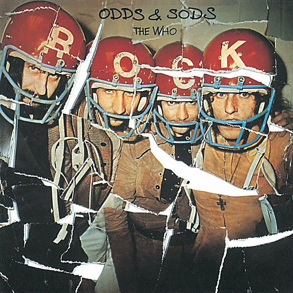

# Odds & Sods

By **The Who**

## Album Data

- **Catalog:** Beets
- **Format:** Digital, Album
- **Album:** Odds & Sods
- **Artist:** The Who
- **Albumartist:** The Who
- **Genre:** Rock
- **MusicBrainz Album Artist ID:** [9fdaa16b-a6c4-4831-b87c-bc9ca8ce7eaa](https://musicbrainz.org/artist/9fdaa16b-a6c4-4831-b87c-bc9ca8ce7eaa)
- **MusicBrainz Album ID:** [115c79ac-4731-4648-ae34-40bcddbf0f78](https://musicbrainz.org/release/115c79ac-4731-4648-ae34-40bcddbf0f78)
- **MusicBrainz Release Group ID:** [ecc6176a-ce14-3dfc-921c-c2267664c3c0](https://musicbrainz.org/release-group/ecc6176a-ce14-3dfc-921c-c2267664c3c0)
- **Year:** 1998
- **Catalog #:** MCAD-11268
- **Label:** MCA Records
- **Total Tracks:** 23

## Album Tracks

### Track 01 - Armenia City in the Sky

- **Artist:** The Who
- **Format:** ALAC
- **Genre:** Psychedelic Rock
- **Length:** 3:48
- **MusicBrainz Track ID:** [a74c2fa5-0bde-477a-88e4-fd1cae05ed4f](https://musicbrainz.org/recording/a74c2fa5-0bde-477a-88e4-fd1cae05ed4f)
- **Title:** Armenia City in the Sky
- **Track:** 01
- **Year:** 1995

### Track 02 - Heinz Baked Beans

- **Artist:** The Who
- **Format:** ALAC
- **Genre:** Psychedelic Rock
- **Length:** 1:00
- **MusicBrainz Track ID:** [4213d34c-a770-4a7e-aa76-39a2cf2d41e6](https://musicbrainz.org/recording/4213d34c-a770-4a7e-aa76-39a2cf2d41e6)
- **Title:** Heinz Baked Beans
- **Track:** 02
- **Year:** 1995

### Track 03 - Mary Anne With the Shaky Hand

- **Artist:** The Who
- **Format:** ALAC
- **Genre:** Psychedelic Rock
- **Length:** 2:29
- **MusicBrainz Track ID:** [6c058c5d-675e-4ea2-839a-6ff0bc29d4ea](https://musicbrainz.org/recording/6c058c5d-675e-4ea2-839a-6ff0bc29d4ea)
- **Title:** Mary Anne With the Shaky Hand
- **Track:** 03
- **Year:** 1995

### Track 04 - Odorono

- **Artist:** The Who
- **Format:** ALAC
- **Genre:** Psychedelic Rock
- **Length:** 2:34
- **MusicBrainz Track ID:** [61613722-aabe-430d-8c81-8e49f4283623](https://musicbrainz.org/recording/61613722-aabe-430d-8c81-8e49f4283623)
- **Title:** Odorono
- **Track:** 04
- **Year:** 1995

### Track 05 - Tattoo

- **Artist:** The Who
- **Format:** ALAC
- **Genre:** Hard Rock
- **Length:** 2:51
- **MusicBrainz Track ID:** [d9e2ed2a-01ed-48b4-b86b-8db498221976](https://musicbrainz.org/recording/d9e2ed2a-01ed-48b4-b86b-8db498221976)
- **Title:** Tattoo
- **Track:** 05
- **Year:** 1995

### Track 06 - Our Love Was

- **Artist:** The Who
- **Format:** ALAC
- **Genre:** Psychedelic Rock
- **Length:** 3:23
- **MusicBrainz Track ID:** [d756ca10-0ffb-444a-a96c-c18271bf1fa5](https://musicbrainz.org/recording/d756ca10-0ffb-444a-a96c-c18271bf1fa5)
- **Title:** Our Love Was
- **Track:** 06
- **Year:** 1995

### Track 07 - I Can See for Miles

- **Artist:** The Who
- **Format:** ALAC
- **Genre:** Psychedelic Rock
- **Length:** 4:44
- **MusicBrainz Track ID:** [957e1dcf-a736-480e-aabe-79a73f6d8323](https://musicbrainz.org/recording/957e1dcf-a736-480e-aabe-79a73f6d8323)
- **Title:** I Can See for Miles
- **Track:** 07
- **Year:** 1995

### Track 08 - I Can’t Reach You

- **Artist:** The Who
- **Format:** ALAC
- **Genre:** Psychedelic Rock
- **Length:** 3:03
- **MusicBrainz Track ID:** [85fd641a-c481-45cf-9f16-71a1b78ac9a6](https://musicbrainz.org/recording/85fd641a-c481-45cf-9f16-71a1b78ac9a6)
- **Title:** I Can’t Reach You
- **Track:** 08
- **Year:** 1995

### Track 09 - Medac

- **Artist:** The Who
- **Format:** ALAC
- **Genre:** Psychedelic Rock
- **Length:** 0:57
- **MusicBrainz Track ID:** [75112dd3-58f4-41b4-9e9d-815c58d28593](https://musicbrainz.org/recording/75112dd3-58f4-41b4-9e9d-815c58d28593)
- **Title:** Medac
- **Track:** 09
- **Year:** 1995

### Track 10 - Relax

- **Artist:** The Who
- **Format:** ALAC
- **Genre:** Psychedelic Rock
- **Length:** 2:41
- **MusicBrainz Track ID:** [44ab5360-87dd-4548-b72e-f5448aa6981f](https://musicbrainz.org/recording/44ab5360-87dd-4548-b72e-f5448aa6981f)
- **Title:** Relax
- **Track:** 10
- **Year:** 1995

### Track 11 - Silas Stingy

- **Artist:** The Who
- **Format:** ALAC
- **Genre:** Psychedelic Rock
- **Length:** 3:07
- **MusicBrainz Track ID:** [e3042670-9355-44e4-bb10-7a18c6e07807](https://musicbrainz.org/recording/e3042670-9355-44e4-bb10-7a18c6e07807)
- **Title:** Silas Stingy
- **Track:** 11
- **Year:** 1995

### Track 12 - Sunrise

- **Artist:** The Who
- **Format:** ALAC
- **Genre:** Psychedelic Rock
- **Length:** 3:06
- **MusicBrainz Track ID:** [fe7d84fe-b6ec-4d96-8f49-8ed9d8514fca](https://musicbrainz.org/recording/fe7d84fe-b6ec-4d96-8f49-8ed9d8514fca)
- **Title:** Sunrise
- **Track:** 12
- **Year:** 1995

### Track 13 - Rael 1

- **Artist:** The Who
- **Format:** ALAC
- **Genre:** Grunge
- **Length:** 5:45
- **MusicBrainz Track ID:** [84c73e84-f3ff-46b2-af78-4af7b074b079](https://musicbrainz.org/recording/84c73e84-f3ff-46b2-af78-4af7b074b079)
- **Title:** Rael 1
- **Track:** 13
- **Year:** 1995

### Track 14 - Rael 2

- **Artist:** The Who
- **Format:** ALAC
- **Genre:** Psychedelic Rock
- **Length:** 1:28
- **MusicBrainz Track ID:** [6e0237f4-31aa-4d73-8244-1b8bfd071255](https://musicbrainz.org/recording/6e0237f4-31aa-4d73-8244-1b8bfd071255)
- **Title:** Rael 2
- **Track:** 14
- **Year:** 1995

### Track 15 - Glittering Girl

- **Artist:** The Who
- **Format:** ALAC
- **Genre:** Psychedelic Rock
- **Length:** 3:59
- **MusicBrainz Track ID:** [ac85c250-d9ab-41f4-860c-3944cb624c66](https://musicbrainz.org/recording/ac85c250-d9ab-41f4-860c-3944cb624c66)
- **Title:** Glittering Girl
- **Track:** 15
- **Year:** 1995

### Track 16 - Melancholia

- **Artist:** The Who
- **Format:** ALAC
- **Genre:** Psychedelic Rock
- **Length:** 3:22
- **MusicBrainz Track ID:** [48419df0-1c6c-4230-bbc6-6a162321d755](https://musicbrainz.org/recording/48419df0-1c6c-4230-bbc6-6a162321d755)
- **Title:** Melancholia
- **Track:** 16
- **Year:** 1995

### Track 17 - Someone’s Coming

- **Artist:** The Who
- **Format:** ALAC
- **Genre:** Psychedelic Rock
- **Length:** 2:40
- **MusicBrainz Track ID:** [1e83822b-dc55-4f4d-b705-4e5a52f27e02](https://musicbrainz.org/recording/1e83822b-dc55-4f4d-b705-4e5a52f27e02)
- **Title:** Someone’s Coming
- **Track:** 17
- **Year:** 1995

### Track 18 - Jaguar

- **Artist:** The Who
- **Format:** ALAC
- **Genre:** Freakbeat
- **Length:** 3:01
- **MusicBrainz Track ID:** [08cc9cf2-0757-4ce0-bd89-a3e4338dc292](https://musicbrainz.org/recording/08cc9cf2-0757-4ce0-bd89-a3e4338dc292)
- **Title:** Jaguar
- **Track:** 18
- **Year:** 1995

### Track 19 - Early Morning Cold Taxi

- **Artist:** The Who
- **Format:** ALAC
- **Genre:** Psychedelic Rock
- **Length:** 3:25
- **MusicBrainz Track ID:** [97dc5cc6-ad6c-41fb-b3ba-d9afd7c0aed8](https://musicbrainz.org/recording/97dc5cc6-ad6c-41fb-b3ba-d9afd7c0aed8)
- **Title:** Early Morning Cold Taxi
- **Track:** 19
- **Year:** 1995

### Track 20 - Hall of the Mountain King

- **Artist:** The Who
- **Format:** ALAC
- **Genre:** Psychedelic Rock
- **Length:** 4:19
- **MusicBrainz Track ID:** [8fa929b9-15db-4e2f-8193-e8147346fb0d](https://musicbrainz.org/recording/8fa929b9-15db-4e2f-8193-e8147346fb0d)
- **Title:** Hall of the Mountain King
- **Track:** 20
- **Year:** 1995

### Track 21 - Girl’s Eyes

- **Artist:** The Who
- **Format:** ALAC
- **Genre:** Psychedelic Rock
- **Length:** 3:50
- **MusicBrainz Track ID:** [e108933a-c884-4c4f-9683-2cbc1476308c](https://musicbrainz.org/recording/e108933a-c884-4c4f-9683-2cbc1476308c)
- **Title:** Girl’s Eyes
- **Track:** 21
- **Year:** 1995

### Track 22 - Mary Anne With the Shaky Hand (alternative version)

- **Artist:** The Who
- **Format:** ALAC
- **Genre:** Psychedelic Rock
- **Length:** 3:21
- **MusicBrainz Track ID:** [ef0eeda9-9be2-4210-ad89-f7e11980b799](https://musicbrainz.org/recording/ef0eeda9-9be2-4210-ad89-f7e11980b799)
- **Title:** Mary Anne With the Shaky Hand (alternative version)
- **Track:** 22
- **Year:** 1995

### Track 23 - Glow Girl

- **Artist:** The Who
- **Format:** ALAC
- **Genre:** Psychedelic Rock
- **Length:** 2:43
- **MusicBrainz Track ID:** [c97ba107-9048-423c-9a28-559df30c7dc7](https://musicbrainz.org/recording/c97ba107-9048-423c-9a28-559df30c7dc7)
- **Title:** Glow Girl
- **Track:** 23
- **Year:** 1995

## See also

- [A Quick One](A_Quick_One.md)
- [Face Dances](Face_Dances.md)
- [Live at Leeds](Live_at_Leeds.md)
- [My Generation](My_Generation.md)
- [The Who Sell Out](The_Who_Sell_Out.md)
- [Tommy](Tommy.md)
- [Who’s Next](Who’s_Next.md)
- [Who's Next](Whos_Next.md)
- [CD: ](../../CD/The_Who/The_Who.md)
- [CD: Tommy](../../CD/The_Who/Tommy.md)
- [Roon: A Quick One (Stereo Version)](../../Roon/The_Who/A_Quick_One_Stereo_Version.md)
- [Roon: Face Dances](../../Roon/The_Who/Face_Dances.md)
- [Roon: Live At Leeds (Live At Leeds/1970)](../../Roon/The_Who/Live_At_Leeds_Live_At_Leeds-1970.md)
- [Roon: My Generation (Stereo Version)](../../Roon/The_Who/My_Generation_Stereo_Version.md)
- [Roon: Quadrophenia (Super Deluxe)](../../Roon/The_Who/Quadrophenia_Super_Deluxe.md)
- [Roon: The Who Sell Out (Super Deluxe)](../../Roon/The_Who/The_Who_Sell_Out_Super_Deluxe.md)
- [Roon: Tommy (Super Deluxe)](../../Roon/The_Who/Tommy_Super_Deluxe.md)
- [Roon: Who's Next (Deluxe Edition)](../../Roon/The_Who/Whos_Next_Deluxe_Edition.md)
- [Vinyl: A Quick One](../../Vinyl/The_Who/A_Quick_One.md)
- [Vinyl: My Generation](../../Vinyl/The_Who/My_Generation.md)
- [Vinyl: Squeeze Box](../../Vinyl/The_Who/Squeeze_Box.md)
- [Vinyl: ](../../Vinyl/The_Who/The_Who.md)
- [Vinyl: The Who Sell Out](../../Vinyl/The_Who/The_Who_Sell_Out.md)
- [Vinyl: Tommy](../../Vinyl/The_Who/Tommy.md)
- [Vinyl: Who Are You](../../Vinyl/The_Who/Who_Are_You.md)
- [Vinyl: Who's Missing](../../Vinyl/The_Who/Whos_Missing.md)
- [Vinyl: Who's Next](../../Vinyl/The_Who/Whos_Next.md)
