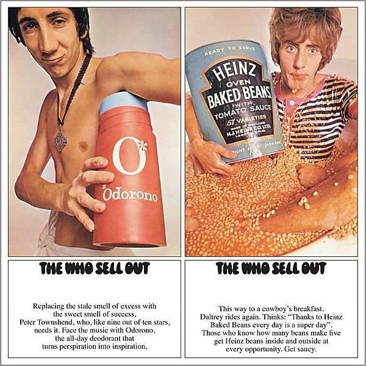

# The Who Sell Out

By **The Who**

## Album Data

- **Catalog:** Beets
- **Format:** Digital, Album
- **Album:** The Who Sell Out
- **Artist:** The Who
- **Albumartist:** The Who
- **Genre:** Psychedelic Rock
- **MusicBrainz Album Artist ID:** [9fdaa16b-a6c4-4831-b87c-bc9ca8ce7eaa](https://musicbrainz.org/artist/9fdaa16b-a6c4-4831-b87c-bc9ca8ce7eaa)
- **MusicBrainz Album ID:** [abcd3bba-a4be-4d55-abad-e718285ada3e](https://musicbrainz.org/release/abcd3bba-a4be-4d55-abad-e718285ada3e)
- **MusicBrainz Release Group ID:** [aa02a102-f7b5-3584-8d21-bd9c560effb6](https://musicbrainz.org/release-group/aa02a102-f7b5-3584-8d21-bd9c560effb6)
- **Year:** 1995
- **Catalog #:** B0001386-36
- **Label:** Geffen Records
- **Total Tracks:** 24

## Album Tracks

### Track 01 - Overture

- **Artist:** The Who
- **Format:** ALAC
- **Genre:** Psychedelic Rock
- **Length:** 5:21
- **MusicBrainz Track ID:** [e357b847-b451-4ad2-baa3-65d81c153b89](https://musicbrainz.org/recording/e357b847-b451-4ad2-baa3-65d81c153b89)
- **Title:** Overture
- **Track:** 01
- **Year:** 2011

### Track 02 - It’s a Boy

- **Artist:** The Who
- **Format:** ALAC
- **Genre:** Hard Rock
- **Length:** 0:38
- **MusicBrainz Track ID:** [325fb957-0e43-4690-ac5f-9040269ad4f7](https://musicbrainz.org/recording/325fb957-0e43-4690-ac5f-9040269ad4f7)
- **Title:** It’s a Boy
- **Track:** 02
- **Year:** 2011

### Track 03 - 1921

- **Artist:** The Who
- **Format:** ALAC
- **Genre:** Hard Rock
- **Length:** 2:49
- **MusicBrainz Track ID:** [e675ba82-72df-4769-8e41-7858d6539cb8](https://musicbrainz.org/recording/e675ba82-72df-4769-8e41-7858d6539cb8)
- **Title:** 1921
- **Track:** 03
- **Year:** 2011

### Track 04 - Amazing Journey

- **Artist:** The Who
- **Format:** ALAC
- **Genre:** Progressive Rock
- **Length:** 3:25
- **MusicBrainz Track ID:** [720b8394-083f-4124-aefd-5dca042592e2](https://musicbrainz.org/recording/720b8394-083f-4124-aefd-5dca042592e2)
- **Title:** Amazing Journey
- **Track:** 04
- **Year:** 2011

### Track 05 - Sparks

- **Artist:** The Who
- **Format:** ALAC
- **Genre:** Hard Rock
- **Length:** 3:46
- **MusicBrainz Track ID:** [f4eac908-3737-49b8-a1e8-bb870034ac7a](https://musicbrainz.org/recording/f4eac908-3737-49b8-a1e8-bb870034ac7a)
- **Title:** Sparks
- **Track:** 05
- **Year:** 2011

### Track 06 - Eyesight to the Blind (The Hawker)

- **Artist:** The Who
- **Format:** ALAC
- **Genre:** Hard Rock
- **Length:** 2:13
- **MusicBrainz Track ID:** [ddb8ba68-a43f-4554-8e7f-0148022ec2a9](https://musicbrainz.org/recording/ddb8ba68-a43f-4554-8e7f-0148022ec2a9)
- **Title:** Eyesight to the Blind (The Hawker)
- **Track:** 06
- **Year:** 2011

### Track 07 - Christmas

- **Artist:** The Who
- **Format:** ALAC
- **Genre:** Hard Rock
- **Length:** 4:34
- **MusicBrainz Track ID:** [303f80f4-34e4-47d7-b03d-80fc2e7bb89e](https://musicbrainz.org/recording/303f80f4-34e4-47d7-b03d-80fc2e7bb89e)
- **Title:** Christmas
- **Track:** 07
- **Year:** 2011

### Track 08 - Cousin Kevin

- **Artist:** The Who
- **Format:** ALAC
- **Genre:** Hard Rock
- **Length:** 4:07
- **MusicBrainz Track ID:** [94b3c667-8255-47a5-b9a9-be9dd45783c1](https://musicbrainz.org/recording/94b3c667-8255-47a5-b9a9-be9dd45783c1)
- **Title:** Cousin Kevin
- **Track:** 08
- **Year:** 2011

### Track 09 - The Acid Queen

- **Artist:** The Who
- **Format:** ALAC
- **Genre:** Hard Rock
- **Length:** 3:34
- **MusicBrainz Track ID:** [02f281d0-74f5-4ad1-98f9-0cfb9d58f927](https://musicbrainz.org/recording/02f281d0-74f5-4ad1-98f9-0cfb9d58f927)
- **Title:** The Acid Queen
- **Track:** 09
- **Year:** 2011

### Track 10 - Underture

- **Artist:** The Who
- **Format:** ALAC
- **Genre:** Hard Rock
- **Length:** 10:09
- **MusicBrainz Track ID:** [8ae9d2ab-db7b-43bf-bac9-681706acea56](https://musicbrainz.org/recording/8ae9d2ab-db7b-43bf-bac9-681706acea56)
- **Title:** Underture
- **Track:** 10
- **Year:** 2011

### Track 11 - Do You Think It’s Alright?

- **Artist:** The Who
- **Format:** ALAC
- **Genre:** Hard Rock
- **Length:** 0:24
- **MusicBrainz Track ID:** [a7508d1e-0424-418a-8c0f-01322e596c2a](https://musicbrainz.org/recording/a7508d1e-0424-418a-8c0f-01322e596c2a)
- **Title:** Do You Think It’s Alright?
- **Track:** 11
- **Year:** 2011

### Track 12 - Fiddle About

- **Artist:** The Who
- **Format:** ALAC
- **Genre:** Hard Rock
- **Length:** 1:29
- **MusicBrainz Track ID:** [d9e0321d-7c2e-4d34-842d-2f2d14ccce47](https://musicbrainz.org/recording/d9e0321d-7c2e-4d34-842d-2f2d14ccce47)
- **Title:** Fiddle About
- **Track:** 12
- **Year:** 2011

### Track 13 - Pinball Wizard

- **Artist:** The Who
- **Format:** ALAC
- **Genre:** Hard Rock
- **Length:** 3:01
- **MusicBrainz Track ID:** [295291be-e403-47fd-b7ab-ae65ad60a275](https://musicbrainz.org/recording/295291be-e403-47fd-b7ab-ae65ad60a275)
- **Title:** Pinball Wizard
- **Track:** 13
- **Year:** 2011

### Track 14 - There’s a Doctor

- **Artist:** The Who
- **Format:** ALAC
- **Genre:** Hard Rock
- **Length:** 0:23
- **MusicBrainz Track ID:** [bda73f49-47e0-4850-b276-9280d63a2760](https://musicbrainz.org/recording/bda73f49-47e0-4850-b276-9280d63a2760)
- **Title:** There’s a Doctor
- **Track:** 14
- **Year:** 2011

### Track 15 - Go to the Mirror!

- **Artist:** The Who
- **Format:** ALAC
- **Genre:** Progressive Rock
- **Length:** 3:49
- **MusicBrainz Track ID:** [49fb477d-74d8-47aa-b95f-9ad58ba8d8e5](https://musicbrainz.org/recording/49fb477d-74d8-47aa-b95f-9ad58ba8d8e5)
- **Title:** Go to the Mirror!
- **Track:** 15
- **Year:** 2011

### Track 16 - Tommy Can You Hear Me?

- **Artist:** The Who
- **Format:** ALAC
- **Genre:** Hard Rock
- **Length:** 1:36
- **MusicBrainz Track ID:** [8b9f8941-7d3e-4f06-8e68-bcbe004c4e97](https://musicbrainz.org/recording/8b9f8941-7d3e-4f06-8e68-bcbe004c4e97)
- **Title:** Tommy Can You Hear Me?
- **Track:** 16
- **Year:** 2011

### Track 17 - Smash the Mirror

- **Artist:** The Who
- **Format:** ALAC
- **Genre:** Hard Rock
- **Length:** 1:35
- **MusicBrainz Track ID:** [0744536c-a763-4730-b1a5-4a159d91c8f0](https://musicbrainz.org/recording/0744536c-a763-4730-b1a5-4a159d91c8f0)
- **Title:** Smash the Mirror
- **Track:** 17
- **Year:** 2011

### Track 18 - Sensation

- **Artist:** The Who
- **Format:** ALAC
- **Genre:** Hard Rock
- **Length:** 2:27
- **MusicBrainz Track ID:** [9f5d8446-2680-45ae-8539-e1275f2bddeb](https://musicbrainz.org/recording/9f5d8446-2680-45ae-8539-e1275f2bddeb)
- **Title:** Sensation
- **Track:** 18
- **Year:** 2011

### Track 19 - Miracle Cure

- **Artist:** The Who
- **Format:** ALAC
- **Genre:** Hard Rock
- **Length:** 0:12
- **MusicBrainz Track ID:** [fbcb02d1-9bfd-4015-b085-b8d2d142ee1f](https://musicbrainz.org/recording/fbcb02d1-9bfd-4015-b085-b8d2d142ee1f)
- **Title:** Miracle Cure
- **Track:** 19
- **Year:** 2011

### Track 20 - Sally Simpson

- **Artist:** The Who
- **Format:** ALAC
- **Genre:** Hard Rock
- **Length:** 4:12
- **MusicBrainz Track ID:** [eb9d1894-2e1b-4646-b636-8b03f5d1e1a1](https://musicbrainz.org/recording/eb9d1894-2e1b-4646-b636-8b03f5d1e1a1)
- **Title:** Sally Simpson
- **Track:** 20
- **Year:** 2011

### Track 21 - I’m Free

- **Artist:** The Who
- **Format:** ALAC
- **Genre:** Hard Rock
- **Length:** 2:40
- **MusicBrainz Track ID:** [6596e4d9-4464-45ff-aff7-fe0fd4745be8](https://musicbrainz.org/recording/6596e4d9-4464-45ff-aff7-fe0fd4745be8)
- **Title:** I’m Free
- **Track:** 21
- **Year:** 2011

### Track 22 - Welcome

- **Artist:** The Who
- **Format:** ALAC
- **Genre:** Hard Rock
- **Length:** 4:34
- **MusicBrainz Track ID:** [2fa84fd6-1bca-4951-a285-cd046cd6f1d6](https://musicbrainz.org/recording/2fa84fd6-1bca-4951-a285-cd046cd6f1d6)
- **Title:** Welcome
- **Track:** 22
- **Year:** 2011

### Track 23 - Tommy’s Holiday Camp

- **Artist:** The Who
- **Format:** ALAC
- **Genre:** Hard Rock
- **Length:** 0:57
- **MusicBrainz Track ID:** [2d963935-6256-43f1-8549-0b66d303772f](https://musicbrainz.org/recording/2d963935-6256-43f1-8549-0b66d303772f)
- **Title:** Tommy’s Holiday Camp
- **Track:** 23
- **Year:** 2011

### Track 24 - We’re Not Gonna Take It / See Me Feel Me / Listening to You

- **Artist:** The Who
- **Format:** ALAC
- **Genre:** Hard Rock
- **Length:** 7:08
- **MusicBrainz Track ID:** [d491b450-3609-42b2-b197-d4bd9fbb656c](https://musicbrainz.org/recording/d491b450-3609-42b2-b197-d4bd9fbb656c)
- **Title:** We’re Not Gonna Take It / See Me Feel Me / Listening to You
- **Track:** 24
- **Year:** 2011

## See also

- [A Quick One](A_Quick_One.md)
- [Face Dances](Face_Dances.md)
- [Live at Leeds](Live_at_Leeds.md)
- [My Generation](My_Generation.md)
- [Odds & Sods](Odds_and_Sods.md)
- [Tommy](Tommy.md)
- [Who’s Next](Who’s_Next.md)
- [Who's Next](Whos_Next.md)
- [CD: ](../../CD/The_Who/The_Who.md)
- [CD: Tommy](../../CD/The_Who/Tommy.md)
- [Roon: A Quick One (Stereo Version)](../../Roon/The_Who/A_Quick_One_Stereo_Version.md)
- [Roon: Face Dances](../../Roon/The_Who/Face_Dances.md)
- [Roon: Live At Leeds (Live At Leeds/1970)](../../Roon/The_Who/Live_At_Leeds_Live_At_Leeds-1970.md)
- [Roon: My Generation (Stereo Version)](../../Roon/The_Who/My_Generation_Stereo_Version.md)
- [Roon: Quadrophenia (Super Deluxe)](../../Roon/The_Who/Quadrophenia_Super_Deluxe.md)
- [Roon: The Who Sell Out (Super Deluxe)](../../Roon/The_Who/The_Who_Sell_Out_Super_Deluxe.md)
- [Roon: Tommy (Super Deluxe)](../../Roon/The_Who/Tommy_Super_Deluxe.md)
- [Roon: Who's Next (Deluxe Edition)](../../Roon/The_Who/Whos_Next_Deluxe_Edition.md)
- [Vinyl: A Quick One](../../Vinyl/The_Who/A_Quick_One.md)
- [Vinyl: My Generation](../../Vinyl/The_Who/My_Generation.md)
- [Vinyl: Squeeze Box](../../Vinyl/The_Who/Squeeze_Box.md)
- [Vinyl: ](../../Vinyl/The_Who/The_Who.md)
- [Vinyl: The Who Sell Out](../../Vinyl/The_Who/The_Who_Sell_Out.md)
- [Vinyl: Tommy](../../Vinyl/The_Who/Tommy.md)
- [Vinyl: Who Are You](../../Vinyl/The_Who/Who_Are_You.md)
- [Vinyl: Who's Missing](../../Vinyl/The_Who/Whos_Missing.md)
- [Vinyl: Who's Next](../../Vinyl/The_Who/Whos_Next.md)
