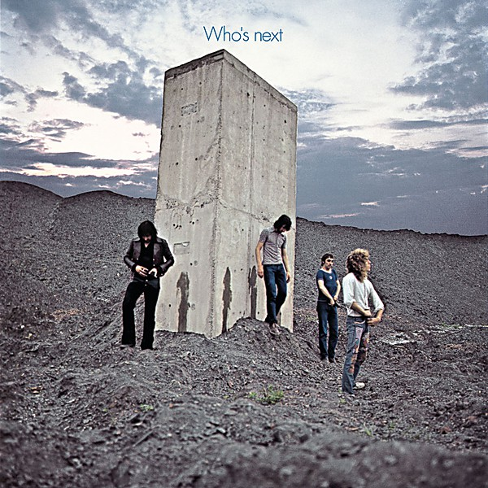

# Who's Next

By **The Who**

## Album Data

- **Catalog:** Beets
- **Format:** Digital, Album
- **Album:** Who's Next
- **Artist:** The Who
- **Albumartist:** The Who
- **Genre:** Hard Rock
- **MusicBrainz Album Artist ID:** [9fdaa16b-a6c4-4831-b87c-bc9ca8ce7eaa](https://musicbrainz.org/artist/9fdaa16b-a6c4-4831-b87c-bc9ca8ce7eaa)
- **MusicBrainz Album ID:** [373fc7cd-4640-4628-a4de-3dc2cf1f214b](https://musicbrainz.org/release/373fc7cd-4640-4628-a4de-3dc2cf1f214b)
- **MusicBrainz Release Group ID:** [9584e28b-66a7-3846-8d52-b3008a283539](https://musicbrainz.org/release-group/9584e28b-66a7-3846-8d52-b3008a283539)
- **Year:** 1995
- **Catalog #:** MCAD-11269
- **Label:** MCA Records
- **Total Tracks:** 16

## Album Tracks

### Track 01 - Baba O’Riley

- **Artist:** The Who
- **Format:** ALAC
- **Genre:** Hard Rock
- **Length:** 5:08
- **MusicBrainz Track ID:** [6156cb06-eb90-4fc4-aa7b-60b1e285aaaa](https://musicbrainz.org/recording/6156cb06-eb90-4fc4-aa7b-60b1e285aaaa)
- **Title:** Baba O’Riley
- **Track:** 01
- **Year:** 1995

### Track 02 - Bargain

- **Artist:** The Who
- **Format:** ALAC
- **Genre:** Hard Rock
- **Length:** 5:34
- **MusicBrainz Track ID:** [6b017128-d658-4fa8-8116-e01cb11cd85b](https://musicbrainz.org/recording/6b017128-d658-4fa8-8116-e01cb11cd85b)
- **Title:** Bargain
- **Track:** 02
- **Year:** 1995

### Track 03 - Love Ain’t for Keeping

- **Artist:** The Who
- **Format:** ALAC
- **Genre:** Hard Rock
- **Length:** 2:10
- **MusicBrainz Track ID:** [adac1041-f1cf-405e-b0b8-0e867562d77b](https://musicbrainz.org/recording/adac1041-f1cf-405e-b0b8-0e867562d77b)
- **Title:** Love Ain’t for Keeping
- **Track:** 03
- **Year:** 1995

### Track 04 - My Wife

- **Artist:** The Who
- **Format:** ALAC
- **Genre:** Hard Rock
- **Length:** 3:41
- **MusicBrainz Track ID:** [7b58a00e-d1b7-4b28-b3f8-14c153a2a336](https://musicbrainz.org/recording/7b58a00e-d1b7-4b28-b3f8-14c153a2a336)
- **Title:** My Wife
- **Track:** 04
- **Year:** 1995

### Track 05 - The Song Is Over

- **Artist:** The Who
- **Format:** ALAC
- **Genre:** Hard Rock
- **Length:** 6:14
- **MusicBrainz Track ID:** [5e624a2f-a22a-478d-bf70-f07910d6025f](https://musicbrainz.org/recording/5e624a2f-a22a-478d-bf70-f07910d6025f)
- **Title:** The Song Is Over
- **Track:** 05
- **Year:** 1995

### Track 06 - Getting in Tune

- **Artist:** The Who
- **Format:** ALAC
- **Genre:** Progressive Rock
- **Length:** 4:50
- **MusicBrainz Track ID:** [4000133e-1f98-4772-a137-fecaf63978da](https://musicbrainz.org/recording/4000133e-1f98-4772-a137-fecaf63978da)
- **Title:** Getting in Tune
- **Track:** 06
- **Year:** 1995

### Track 07 - Going Mobile

- **Artist:** The Who
- **Format:** ALAC
- **Genre:** Hard Rock
- **Length:** 3:43
- **MusicBrainz Track ID:** [476bdb9f-12a1-4387-acf7-0069d3d92136](https://musicbrainz.org/recording/476bdb9f-12a1-4387-acf7-0069d3d92136)
- **Title:** Going Mobile
- **Track:** 07
- **Year:** 1995

### Track 08 - Behind Blue Eyes

- **Artist:** The Who
- **Format:** ALAC
- **Genre:** Hard Rock
- **Length:** 3:42
- **MusicBrainz Track ID:** [20e4b693-8d76-4827-b9fe-19d9e8e40146](https://musicbrainz.org/recording/20e4b693-8d76-4827-b9fe-19d9e8e40146)
- **Title:** Behind Blue Eyes
- **Track:** 08
- **Year:** 1995

### Track 09 - Won’t Get Fooled Again

- **Artist:** The Who
- **Format:** ALAC
- **Genre:** Hard Rock
- **Length:** 8:33
- **MusicBrainz Track ID:** [2e42a0da-277e-4d69-a483-2db2f6a81869](https://musicbrainz.org/recording/2e42a0da-277e-4d69-a483-2db2f6a81869)
- **Title:** Won’t Get Fooled Again
- **Track:** 09
- **Year:** 1995

### Track 10 - Pure and Easy

- **Artist:** The Who
- **Format:** ALAC
- **Genre:** Hard Rock
- **Length:** 4:21
- **MusicBrainz Track ID:** [9defda9f-c6e8-4818-a41f-837662d7a9db](https://musicbrainz.org/recording/9defda9f-c6e8-4818-a41f-837662d7a9db)
- **Title:** Pure and Easy
- **Track:** 10
- **Year:** 1995

### Track 11 - Baby Don’t You Do It

- **Artist:** The Who
- **Format:** ALAC
- **Genre:** Hard Rock
- **Length:** 5:14
- **MusicBrainz Track ID:** [ab92d61e-d858-4985-8559-897acc46263c](https://musicbrainz.org/recording/ab92d61e-d858-4985-8559-897acc46263c)
- **Title:** Baby Don’t You Do It
- **Track:** 11
- **Year:** 1995

### Track 12 - Naked Eye

- **Artist:** The Who
- **Format:** ALAC
- **Genre:** Hard Rock
- **Length:** 5:31
- **MusicBrainz Track ID:** [8b1eee3a-4e42-4414-83d4-6f5716c00ffd](https://musicbrainz.org/recording/8b1eee3a-4e42-4414-83d4-6f5716c00ffd)
- **Title:** Naked Eye
- **Track:** 12
- **Year:** 1995

### Track 13 - Water

- **Artist:** The Who
- **Format:** ALAC
- **Genre:** Hard Rock
- **Length:** 6:25
- **MusicBrainz Track ID:** [0aae985a-c911-4fc5-a61f-34495c6977b5](https://musicbrainz.org/recording/0aae985a-c911-4fc5-a61f-34495c6977b5)
- **Title:** Water
- **Track:** 13
- **Year:** 1995

### Track 14 - Too Much of Anything

- **Artist:** The Who
- **Format:** ALAC
- **Genre:** Hard Rock
- **Length:** 4:25
- **MusicBrainz Track ID:** [f04446f7-fc92-4545-bd2f-4d079331b358](https://musicbrainz.org/recording/f04446f7-fc92-4545-bd2f-4d079331b358)
- **Title:** Too Much of Anything
- **Track:** 14
- **Year:** 1995

### Track 15 - I Don’t Even Know Myself

- **Artist:** The Who
- **Format:** ALAC
- **Genre:** Hard Rock
- **Length:** 4:56
- **MusicBrainz Track ID:** [cf3d80e1-603e-4087-afcc-6a213e6e77db](https://musicbrainz.org/recording/cf3d80e1-603e-4087-afcc-6a213e6e77db)
- **Title:** I Don’t Even Know Myself
- **Track:** 15
- **Year:** 1995

### Track 16 - Behind Blue Eyes

- **Artist:** The Who
- **Format:** ALAC
- **Genre:** Hard Rock
- **Length:** 3:28
- **MusicBrainz Track ID:** [b61127fd-cf88-4f71-96cf-02cb87ac85da](https://musicbrainz.org/recording/b61127fd-cf88-4f71-96cf-02cb87ac85da)
- **Title:** Behind Blue Eyes
- **Track:** 16
- **Year:** 1995

## See also

- [A Quick One](A_Quick_One.md)
- [Face Dances](Face_Dances.md)
- [Live at Leeds](Live_at_Leeds.md)
- [My Generation](My_Generation.md)
- [Odds & Sods](Odds_and_Sods.md)
- [The Who Sell Out](The_Who_Sell_Out.md)
- [Tommy](Tommy.md)
- [Who’s Next](Who’s_Next.md)
- [CD: ](../../CD/The_Who/The_Who.md)
- [CD: Tommy](../../CD/The_Who/Tommy.md)
- [Roon: A Quick One (Stereo Version)](../../Roon/The_Who/A_Quick_One_Stereo_Version.md)
- [Roon: Face Dances](../../Roon/The_Who/Face_Dances.md)
- [Roon: Live At Leeds (Live At Leeds/1970)](../../Roon/The_Who/Live_At_Leeds_Live_At_Leeds-1970.md)
- [Roon: My Generation (Stereo Version)](../../Roon/The_Who/My_Generation_Stereo_Version.md)
- [Roon: Quadrophenia (Super Deluxe)](../../Roon/The_Who/Quadrophenia_Super_Deluxe.md)
- [Roon: The Who Sell Out (Super Deluxe)](../../Roon/The_Who/The_Who_Sell_Out_Super_Deluxe.md)
- [Roon: Tommy (Super Deluxe)](../../Roon/The_Who/Tommy_Super_Deluxe.md)
- [Roon: Who's Next (Deluxe Edition)](../../Roon/The_Who/Whos_Next_Deluxe_Edition.md)
- [Vinyl: A Quick One](../../Vinyl/The_Who/A_Quick_One.md)
- [Vinyl: My Generation](../../Vinyl/The_Who/My_Generation.md)
- [Vinyl: Squeeze Box](../../Vinyl/The_Who/Squeeze_Box.md)
- [Vinyl: ](../../Vinyl/The_Who/The_Who.md)
- [Vinyl: The Who Sell Out](../../Vinyl/The_Who/The_Who_Sell_Out.md)
- [Vinyl: Tommy](../../Vinyl/The_Who/Tommy.md)
- [Vinyl: Who Are You](../../Vinyl/The_Who/Who_Are_You.md)
- [Vinyl: Who's Missing](../../Vinyl/The_Who/Whos_Missing.md)
- [Vinyl: Who's Next](../../Vinyl/The_Who/Whos_Next.md)
