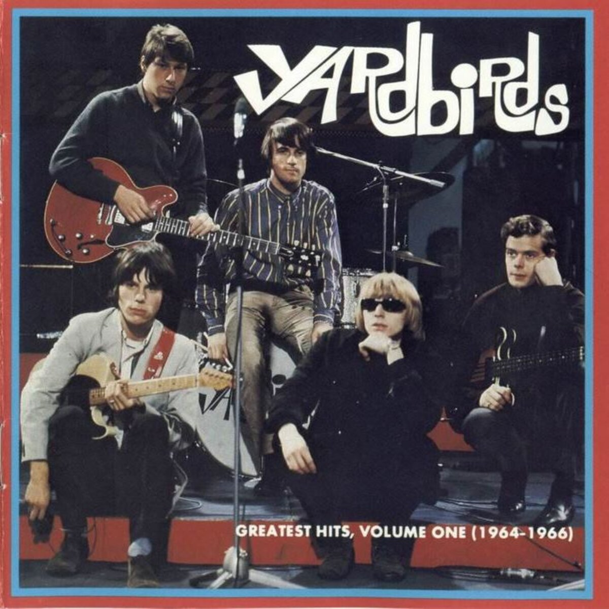

# Greatest Hits, Volume One (1964–1966)

By **The Yardbirds**

## Album Data

- **Catalog:** Beets
- **Format:** Digital, Album
- **Album:** Greatest Hits, Volume One (1964–1966)
- **Artist:** The Yardbirds
- **Albumartist:** The Yardbirds
- **Genre:** Psychedelic Rock
- **MusicBrainz Album Artist ID:** [191de76f-a224-445d-b041-54df16d65bf7](https://musicbrainz.org/artist/191de76f-a224-445d-b041-54df16d65bf7)
- **MusicBrainz Album ID:** [0d156ba6-d4e0-4e41-8a12-656c1031c4c7](https://musicbrainz.org/release/0d156ba6-d4e0-4e41-8a12-656c1031c4c7)
- **MusicBrainz Release Group ID:** [17ad0f22-d744-3a8e-97ef-e268ed241dc4](https://musicbrainz.org/release-group/17ad0f22-d744-3a8e-97ef-e268ed241dc4)
- **Year:** 1986
- **Catalog #:** R2 75895
- **Label:** Rhino
- **Total Tracks:** 18

## Album Tracks

### Track 01 - For Your Love

- **Artist:** The Yardbirds
- **Format:** ALAC
- **Genre:** Psychedelic Rock
- **Length:** 2:31
- **MusicBrainz Track ID:** [77e28eca-c38a-4f91-a742-137489132d47](https://musicbrainz.org/recording/77e28eca-c38a-4f91-a742-137489132d47)
- **Title:** For Your Love
- **Track:** 01
- **Year:** 1986

### Track 02 - Putty (in Your Hands)

- **Artist:** The Yardbirds
- **Format:** ALAC
- **Genre:** Rock And Roll
- **Length:** 2:20
- **MusicBrainz Track ID:** [d5b993b5-8694-442b-a70b-0fdf7fdbc7e9](https://musicbrainz.org/recording/d5b993b5-8694-442b-a70b-0fdf7fdbc7e9)
- **Title:** Putty (in Your Hands)
- **Track:** 02
- **Year:** 1986

### Track 03 - Evil Hearted You

- **Artist:** The Yardbirds
- **Format:** ALAC
- **Genre:** Psychedelic Rock
- **Length:** 2:26
- **MusicBrainz Track ID:** [5a815aec-036f-4e41-8007-b22915139c25](https://musicbrainz.org/recording/5a815aec-036f-4e41-8007-b22915139c25)
- **Title:** Evil Hearted You
- **Track:** 03
- **Year:** 1986

### Track 04 - Still I'm Sad

- **Artist:** The Yardbirds
- **Format:** ALAC
- **Genre:** Psychedelic Rock
- **Length:** 3:01
- **MusicBrainz Track ID:** [b356a8b1-7849-4e6b-99a8-605448c5064a](https://musicbrainz.org/recording/b356a8b1-7849-4e6b-99a8-605448c5064a)
- **Title:** Still I'm Sad
- **Track:** 04
- **Year:** 1986

### Track 05 - You're a Better Man Than I

- **Artist:** The Yardbirds
- **Format:** ALAC
- **Genre:** Psychedelic Rock
- **Length:** 3:22
- **MusicBrainz Track ID:** [f7449872-62aa-412e-adfa-6551d80194d0](https://musicbrainz.org/recording/f7449872-62aa-412e-adfa-6551d80194d0)
- **Title:** You're a Better Man Than I
- **Track:** 05
- **Year:** 1986

### Track 06 - Shapes of Things

- **Artist:** The Yardbirds
- **Format:** ALAC
- **Genre:** Psychedelic Rock
- **Length:** 2:39
- **MusicBrainz Track ID:** [31b47a85-967d-450b-b451-79a16a046630](https://musicbrainz.org/recording/31b47a85-967d-450b-b451-79a16a046630)
- **Title:** Shapes of Things
- **Track:** 06
- **Year:** 1986

### Track 07 - Heart Full of Soul

- **Artist:** The Yardbirds
- **Format:** ALAC
- **Genre:** Psychedelic Rock
- **Length:** 2:33
- **MusicBrainz Track ID:** [f0cd9be0-eebf-4896-80a3-a7c6d0ac187d](https://musicbrainz.org/recording/f0cd9be0-eebf-4896-80a3-a7c6d0ac187d)
- **Title:** Heart Full of Soul
- **Track:** 07
- **Year:** 1986

### Track 08 - Good Morning Little Schoolgirl

- **Artist:** The Yardbirds
- **Format:** ALAC
- **Genre:** Rock And Roll
- **Length:** 2:49
- **MusicBrainz Track ID:** [cc43d014-3cc8-417a-a568-4a3d4e332c0b](https://musicbrainz.org/recording/cc43d014-3cc8-417a-a568-4a3d4e332c0b)
- **Title:** Good Morning Little Schoolgirl
- **Track:** 08
- **Year:** 1986

### Track 09 - I Ain't Done Wrong

- **Artist:** The Yardbirds
- **Format:** ALAC
- **Genre:** Psychedelic Rock
- **Length:** 3:40
- **MusicBrainz Track ID:** [4846ff49-af07-4810-aef3-70d9eba8a8ef](https://musicbrainz.org/recording/4846ff49-af07-4810-aef3-70d9eba8a8ef)
- **Title:** I Ain't Done Wrong
- **Track:** 09
- **Year:** 1986

### Track 10 - I'm a Man

- **Artist:** The Yardbirds
- **Format:** ALAC
- **Genre:** Rock
- **Length:** 2:39
- **MusicBrainz Track ID:** [ee27d516-ac9e-4b14-890c-7c5bde4d7784](https://musicbrainz.org/recording/ee27d516-ac9e-4b14-890c-7c5bde4d7784)
- **Title:** I'm a Man
- **Track:** 10
- **Year:** 1986

### Track 11 - The Train Kept A-Rollin'

- **Artist:** The Yardbirds
- **Format:** ALAC
- **Genre:** Rock And Roll
- **Length:** 3:27
- **MusicBrainz Track ID:** [92581805-9e3e-4ca7-9129-52d977b35b14](https://musicbrainz.org/recording/92581805-9e3e-4ca7-9129-52d977b35b14)
- **Title:** The Train Kept A-Rollin'
- **Track:** 11
- **Year:** 1986

### Track 12 - A Certain Girl

- **Artist:** The Yardbirds
- **Format:** ALAC
- **Genre:** Rock And Roll
- **Length:** 2:20
- **MusicBrainz Track ID:** [9ec07fe4-0eac-4f34-b9af-03222590a1a8](https://musicbrainz.org/recording/9ec07fe4-0eac-4f34-b9af-03222590a1a8)
- **Title:** A Certain Girl
- **Track:** 12
- **Year:** 1986

### Track 13 - I Ain't Got You

- **Artist:** The Yardbirds
- **Format:** ALAC
- **Genre:** Rock
- **Length:** 2:03
- **MusicBrainz Track ID:** [8a4a292d-11e3-4c8e-96b9-c82a908134df](https://musicbrainz.org/recording/8a4a292d-11e3-4c8e-96b9-c82a908134df)
- **Title:** I Ain't Got You
- **Track:** 13
- **Year:** 1986

### Track 14 - I'm Not Talking

- **Artist:** The Yardbirds
- **Format:** ALAC
- **Genre:** Hard Rock
- **Length:** 2:33
- **MusicBrainz Track ID:** [c9ea404f-31e9-45cb-9a16-4e3aa77eafa8](https://musicbrainz.org/recording/c9ea404f-31e9-45cb-9a16-4e3aa77eafa8)
- **Title:** I'm Not Talking
- **Track:** 14
- **Year:** 1986

### Track 15 - I Wish You Would

- **Artist:** The Yardbirds
- **Format:** ALAC
- **Genre:** Rock
- **Length:** 2:20
- **MusicBrainz Track ID:** [38bec094-23f1-48fc-aef8-b680a3195a1a](https://musicbrainz.org/recording/38bec094-23f1-48fc-aef8-b680a3195a1a)
- **Title:** I Wish You Would
- **Track:** 15
- **Year:** 1986

### Track 16 - Too Much Monkey Business (live)

- **Artist:** The Yardbirds
- **Format:** ALAC
- **Genre:** Rock
- **Length:** 3:51
- **MusicBrainz Track ID:** [05bc99e0-50bc-48ce-9ef4-04f3f0ac6248](https://musicbrainz.org/recording/05bc99e0-50bc-48ce-9ef4-04f3f0ac6248)
- **Title:** Too Much Monkey Business (live)
- **Track:** 16
- **Year:** 1986

### Track 17 - Got Love If You Want It (live)

- **Artist:** The Yardbirds
- **Format:** ALAC
- **Genre:** Psychedelic Rock
- **Length:** 2:37
- **MusicBrainz Track ID:** [3fd409f7-a1f5-4834-b216-c382b36f81fe](https://musicbrainz.org/recording/3fd409f7-a1f5-4834-b216-c382b36f81fe)
- **Title:** Got Love If You Want It (live)
- **Track:** 17
- **Year:** 1986

### Track 18 - Smokestack Lightning (live)

- **Artist:** The Yardbirds
- **Format:** ALAC
- **Genre:** Psychedelic Rock
- **Length:** 4:00
- **MusicBrainz Track ID:** [ba2fa3ac-bbb5-4d62-9228-9e7acbc46bb4](https://musicbrainz.org/recording/ba2fa3ac-bbb5-4d62-9228-9e7acbc46bb4)
- **Title:** Smokestack Lightning (live)
- **Track:** 18
- **Year:** 1986

## See also

- [CD: "Greatest Hits, Volume One (1964-1966)"](../../CD/The_Yardbirds/Greatest_Hits__Volume_One_1964-1966.md)
- [CD: ](../../CD/The_Yardbirds/The_Yardbirds.md)
- [Roon: Five Live Yardbirds](../../Roon/The_Yardbirds/Five_Live_Yardbirds.md)
- [Roon: Having a Rave Up with The Yardbirds (2015 Remaster)](../../Roon/The_Yardbirds/Having_a_Rave_Up_with_The_Yardbirds_2015_Remaster.md)
- [Roon: Roger the Engineer (Expanded Edition)](../../Roon/The_Yardbirds/Roger_the_Engineer_Expanded_Edition.md)
