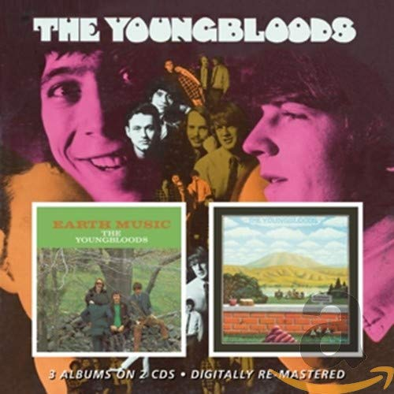

# The Youngbloods / Earth Music

By **The Youngbloods**

## Album Data

- **Catalog:** Beets
- **Format:** Digital, Album
- **Album:** The Youngbloods / Earth Music
- **Artist:** The Youngbloods
- **Albumartist:** The Youngbloods
- **Genre:** Psychedelic Rock
- **MusicBrainz Album Artist ID:** 
- **MusicBrainz Album ID:** 
- **MusicBrainz Release Group ID:** 
- **Year:** 1967
- **Catalog #:** LSP-4150
- **Label:** RCA Victor
- **Total Tracks:** 13

## Album Tracks

### Track 01 - Darkness, Darkness

- **Artist:** The Youngbloods
- **Format:** ALAC
- **Genre:** Psychedelic Rock
- **Length:** 3:51
- **MusicBrainz Track ID:** [86eb3dff-e825-4fc9-837e-27c85e1c6aa7](https://musicbrainz.org/recording/86eb3dff-e825-4fc9-837e-27c85e1c6aa7)
- **Title:** Darkness, Darkness
- **Track:** 01
- **Year:** 1969

### Track 02 - Smug

- **Artist:** The Youngbloods
- **Format:** ALAC
- **Genre:** Psychedelic Rock
- **Length:** 2:11
- **MusicBrainz Track ID:** [cd3de5c3-5b1a-4295-9251-2723b3bd7aed](https://musicbrainz.org/recording/cd3de5c3-5b1a-4295-9251-2723b3bd7aed)
- **Title:** Smug
- **Track:** 02
- **Year:** 1969

### Track 03 - On Sir Francis Drake

- **Artist:** The Youngbloods
- **Format:** ALAC
- **Genre:** Folk Rock
- **Length:** 6:46
- **MusicBrainz Track ID:** [636c2872-85c7-4418-aaaa-ca99e3470b10](https://musicbrainz.org/recording/636c2872-85c7-4418-aaaa-ca99e3470b10)
- **Title:** On Sir Francis Drake
- **Track:** 03
- **Year:** 1969

### Track 04 - Sunlight

- **Artist:** The Youngbloods
- **Format:** ALAC
- **Genre:** Folk Rock
- **Length:** 3:07
- **MusicBrainz Track ID:** [f45bc428-36f4-482d-9f07-7456517862bd](https://musicbrainz.org/recording/f45bc428-36f4-482d-9f07-7456517862bd)
- **Title:** Sunlight
- **Track:** 04
- **Year:** 1969

### Track 05 - Double Sunlight

- **Artist:** The Youngbloods
- **Format:** ALAC
- **Genre:** Folk Rock
- **Length:** 0:41
- **MusicBrainz Track ID:** [0e5a32a5-17c2-498d-a3a3-1dfad62db776](https://musicbrainz.org/recording/0e5a32a5-17c2-498d-a3a3-1dfad62db776)
- **Title:** Double Sunlight
- **Track:** 05
- **Year:** 1969

### Track 06 - Beautiful

- **Artist:** The Youngbloods
- **Format:** ALAC
- **Genre:** Pop Rock
- **Length:** 3:49
- **MusicBrainz Track ID:** [677734fc-86ca-4a08-8ef3-e4b18f17cc24](https://musicbrainz.org/recording/677734fc-86ca-4a08-8ef3-e4b18f17cc24)
- **Title:** Beautiful
- **Track:** 06
- **Year:** 1969

### Track 07 - Turn It Over

- **Artist:** The Youngbloods
- **Format:** ALAC
- **Genre:** Folk Rock
- **Length:** 0:12
- **MusicBrainz Track ID:** [a0c0417f-99fd-4100-bb50-c131a204a4ad](https://musicbrainz.org/recording/a0c0417f-99fd-4100-bb50-c131a204a4ad)
- **Title:** Turn It Over
- **Track:** 07
- **Year:** 1969

### Track 08 - Rain Song (Don’t Let The Rain Bring You Down)

- **Artist:** The Youngbloods
- **Format:** ALAC
- **Genre:** Folk Rock
- **Length:** 3:13
- **MusicBrainz Track ID:** [b6ac9bf8-8026-45fd-b291-3b1ef4ec10b0](https://musicbrainz.org/recording/b6ac9bf8-8026-45fd-b291-3b1ef4ec10b0)
- **Title:** Rain Song (Don’t Let The Rain Bring You Down)
- **Track:** 08
- **Year:** 1969

### Track 09 - Trillium

- **Artist:** The Youngbloods
- **Format:** ALAC
- **Genre:** Folk Rock
- **Length:** 3:08
- **MusicBrainz Track ID:** [c7e45229-5a12-4be6-8a75-4fa3c85dbfe6](https://musicbrainz.org/recording/c7e45229-5a12-4be6-8a75-4fa3c85dbfe6)
- **Title:** Trillium
- **Track:** 09
- **Year:** 1969

### Track 10 - Quicksand

- **Artist:** The Youngbloods
- **Format:** ALAC
- **Genre:** Rock
- **Length:** 2:41
- **MusicBrainz Track ID:** [a79ebe84-ae69-4845-929e-36ca54682e80](https://musicbrainz.org/recording/a79ebe84-ae69-4845-929e-36ca54682e80)
- **Title:** Quicksand
- **Track:** 10
- **Year:** 1969

### Track 11 - Black Mountain Breakdown

- **Artist:** The Youngbloods
- **Format:** ALAC
- **Genre:** Folk Rock
- **Length:** 0:40
- **MusicBrainz Track ID:** [61d3889c-b0eb-4638-a30b-58fcd6a0b5ee](https://musicbrainz.org/recording/61d3889c-b0eb-4638-a30b-58fcd6a0b5ee)
- **Title:** Black Mountain Breakdown
- **Track:** 11
- **Year:** 1969

### Track 12 - Sham

- **Artist:** The Youngbloods
- **Format:** ALAC
- **Genre:** Rock And Roll
- **Length:** 2:44
- **MusicBrainz Track ID:** [e37630d7-eb66-4a65-915b-28100f555944](https://musicbrainz.org/recording/e37630d7-eb66-4a65-915b-28100f555944)
- **Title:** Sham
- **Track:** 12
- **Year:** 1969

### Track 13 - Ride the Wind

- **Artist:** The Youngbloods
- **Format:** ALAC
- **Genre:** Folk Rock
- **Length:** 6:39
- **MusicBrainz Track ID:** [3cc8681d-36b9-4302-aabd-400345e0347d](https://musicbrainz.org/recording/3cc8681d-36b9-4302-aabd-400345e0347d)
- **Title:** Ride the Wind
- **Track:** 13
- **Year:** 1969

## See also

- [Elephant Mountain](Elephant_Mountain.md)
- [Roon: Earth Music](../../Roon/The_Youngbloods/Earth_Music.md)
- [Roon: Elephant Mountain](../../Roon/The_Youngbloods/Elephant_Mountain.md)
- [Roon: High On a Ridge Top](../../Roon/The_Youngbloods/High_On_a_Ridge_Top.md)
- [Roon: The Youngbloods](../../Roon/The_Youngbloods/The_Youngbloods.md)
