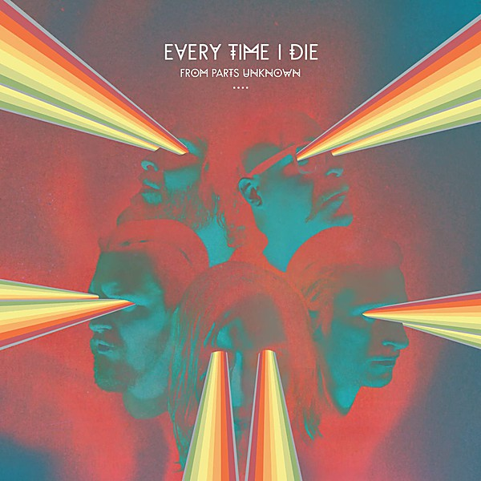

# Unknown Album

By **The Zombies**

## Album Data

- **Catalog:** Beets
- **Format:** Digital, Album
- **Album:** Unknown Album
- **Artist:** The Zombies
- **Albumartist:** The Zombies
- **Genre:** Psychedelic Rock
- **MusicBrainz Album Artist ID:** 
- **MusicBrainz Album ID:** 
- **MusicBrainz Release Group ID:** 
- **Year:** 0000
- **Catalog #:** 
- **Label:** 
- **Total Tracks:** 31

## Album Tracks

### Track 01 - She's Not There

- **Artist:** The Zombies
- **Format:** ALAC
- **Genre:** Psychedelic Rock
- **Length:** 2:26
- **MusicBrainz Track ID:** 
- **Title:** She's Not There
- **Track:** 01
- **Year:** 1964

### Track 02 - You Make Me Feel Good

- **Artist:** The Zombies
- **Format:** ALAC
- **Genre:** Close Harmony
- **Length:** 2:40
- **MusicBrainz Track ID:** 
- **Title:** You Make Me Feel Good
- **Track:** 02
- **Year:** 1964

### Track 03 - Leave Me Be

- **Artist:** The Zombies
- **Format:** ALAC
- **Genre:** Rock
- **Length:** 2:08
- **MusicBrainz Track ID:** 
- **Title:** Leave Me Be
- **Track:** 03
- **Year:** 1964

### Track 04 - Woman

- **Artist:** The Zombies
- **Format:** ALAC
- **Genre:** Rock And Roll
- **Length:** 2:26
- **MusicBrainz Track ID:** 
- **Title:** Woman
- **Track:** 04
- **Year:** 1964

### Track 05 - Tell Her No

- **Artist:** The Zombies
- **Format:** ALAC
- **Genre:** Baroque Pop
- **Length:** 2:07
- **MusicBrainz Track ID:** 
- **Title:** Tell Her No
- **Track:** 05
- **Year:** 1965

### Track 06 - What More Can I Do

- **Artist:** The Zombies
- **Format:** ALAC
- **Genre:** Rock
- **Length:** 1:38
- **MusicBrainz Track ID:** 
- **Title:** What More Can I Do
- **Track:** 06
- **Year:** 1965

### Track 07 - Road Runner

- **Artist:** The Zombies
- **Format:** ALAC
- **Genre:** Rock And Roll
- **Length:** 2:06
- **MusicBrainz Track ID:** 
- **Title:** Road Runner
- **Track:** 07
- **Year:** 1965

### Track 08 - Summertime

- **Artist:** The Zombies
- **Format:** ALAC
- **Genre:** Baroque Pop
- **Length:** 2:17
- **MusicBrainz Track ID:** 
- **Title:** Summertime
- **Track:** 08
- **Year:** 1965

### Track 09 - I Can't Make Up My Mind

- **Artist:** The Zombies
- **Format:** ALAC
- **Genre:** Psychedelic Rock
- **Length:** 2:32
- **MusicBrainz Track ID:** 
- **Title:** I Can't Make Up My Mind
- **Track:** 09
- **Year:** 1965

### Track 10 - The Way I Feel Inside

- **Artist:** The Zombies
- **Format:** ALAC
- **Genre:** Rock
- **Length:** 1:51
- **MusicBrainz Track ID:** 
- **Title:** The Way I Feel Inside
- **Track:** 10
- **Year:** 1965

### Track 11 - Work 'n' Play

- **Artist:** The Zombies
- **Format:** ALAC
- **Genre:** Pop Rock
- **Length:** 2:09
- **MusicBrainz Track ID:** 
- **Title:** Work 'n' Play
- **Track:** 11
- **Year:** 1965

### Track 12 - You've Really Got A Hold On Me/Bring It On Home To Me

- **Artist:** The Zombies
- **Format:** ALAC
- **Genre:** Psychedelic Rock
- **Length:** 3:40
- **MusicBrainz Track ID:** 
- **Title:** You've Really Got A Hold On Me/Bring It On Home To Me
- **Track:** 12
- **Year:** 1965

### Track 13 - Sticks and Stones

- **Artist:** The Zombies
- **Format:** ALAC
- **Genre:** Psychedelic Rock
- **Length:** 2:57
- **MusicBrainz Track ID:** 
- **Title:** Sticks and Stones
- **Track:** 13
- **Year:** 1965

### Track 14 - Can't Nobody Love You

- **Artist:** The Zombies
- **Format:** ALAC
- **Genre:** Rock
- **Length:** 2:16
- **MusicBrainz Track ID:** 
- **Title:** Can't Nobody Love You
- **Track:** 14
- **Year:** 1965

### Track 15 - I Don't Want To Know

- **Artist:** The Zombies
- **Format:** ALAC
- **Genre:** Psychedelic Pop
- **Length:** 2:07
- **MusicBrainz Track ID:** 
- **Title:** I Don't Want To Know
- **Track:** 15
- **Year:** 1965

### Track 16 - I Remember When I Loved Her

- **Artist:** The Zombies
- **Format:** ALAC
- **Genre:** Psychedelic Rock
- **Length:** 2:01
- **MusicBrainz Track ID:** 
- **Title:** I Remember When I Loved Her
- **Track:** 16
- **Year:** 1965

### Track 17 - I Got My Mojo Working

- **Artist:** The Zombies
- **Format:** ALAC
- **Genre:** Britpop
- **Length:** 3:36
- **MusicBrainz Track ID:** 
- **Title:** I Got My Mojo Working
- **Track:** 17
- **Year:** 1965

### Track 18 - She's Coming Home

- **Artist:** The Zombies
- **Format:** ALAC
- **Genre:** Rock
- **Length:** 2:38
- **MusicBrainz Track ID:** 
- **Title:** She's Coming Home
- **Track:** 18
- **Year:** 1965

### Track 19 - I Must Move

- **Artist:** The Zombies
- **Format:** ALAC
- **Genre:** Rock
- **Length:** 1:57
- **MusicBrainz Track ID:** 
- **Title:** I Must Move
- **Track:** 19
- **Year:** 1965

### Track 20 - I Want You Back Again

- **Artist:** The Zombies
- **Format:** ALAC
- **Genre:** Close Harmony
- **Length:** 2:15
- **MusicBrainz Track ID:** 
- **Title:** I Want You Back Again
- **Track:** 20
- **Year:** 1965

### Track 21 - Whenever You're Ready

- **Artist:** The Zombies
- **Format:** ALAC
- **Genre:** Rock
- **Length:** 2:43
- **MusicBrainz Track ID:** 
- **Title:** Whenever You're Ready
- **Track:** 21
- **Year:** 1965

### Track 22 - I Love You

- **Artist:** The Zombies
- **Format:** ALAC
- **Genre:** Rock
- **Length:** 3:23
- **MusicBrainz Track ID:** 
- **Title:** I Love You
- **Track:** 22
- **Year:** 1965

### Track 23 - Is This The Dream

- **Artist:** The Zombies
- **Format:** ALAC
- **Genre:** Downtempo
- **Length:** 2:45
- **MusicBrainz Track ID:** 
- **Title:** Is This The Dream
- **Track:** 23
- **Year:** 1965

### Track 24 - Don't Go Away

- **Artist:** The Zombies
- **Format:** ALAC
- **Genre:** Soft Rock
- **Length:** 2:34
- **MusicBrainz Track ID:** 
- **Title:** Don't Go Away
- **Track:** 24
- **Year:** 1965

### Track 25 - Remember You

- **Artist:** The Zombies
- **Format:** ALAC
- **Genre:** Psychedelic Rock
- **Length:** 2:00
- **MusicBrainz Track ID:** 
- **Title:** Remember You
- **Track:** 25
- **Year:** 1966

### Track 26 - Just Out Of Reach

- **Artist:** The Zombies
- **Format:** ALAC
- **Genre:** Sunshine Pop
- **Length:** 2:10
- **MusicBrainz Track ID:** 
- **Title:** Just Out Of Reach
- **Track:** 26
- **Year:** 1966

### Track 27 - Indication

- **Artist:** The Zombies
- **Format:** ALAC
- **Genre:** Psychedelic Rock
- **Length:** 3:01
- **MusicBrainz Track ID:** 
- **Title:** Indication
- **Track:** 27
- **Year:** 1966

### Track 28 - How We Were Before

- **Artist:** The Zombies
- **Format:** ALAC
- **Genre:** Freakbeat
- **Length:** 2:06
- **MusicBrainz Track ID:** 
- **Title:** How We Were Before
- **Track:** 28
- **Year:** 1966

### Track 29 - Gotta Get A Hold Of Myself

- **Artist:** The Zombies
- **Format:** ALAC
- **Genre:** Psychedelic Rock
- **Length:** 2:29
- **MusicBrainz Track ID:** 
- **Title:** Gotta Get A Hold Of Myself
- **Track:** 29
- **Year:** 1966

### Track 30 - Goin' Out Of My Head

- **Artist:** The Zombies
- **Format:** ALAC
- **Genre:** Pop Rock
- **Length:** 3:03
- **MusicBrainz Track ID:** 
- **Title:** Goin' Out Of My Head
- **Track:** 30
- **Year:** 1967

### Track 31 - She Does Everything For Me

- **Artist:** The Zombies
- **Format:** ALAC
- **Genre:** Sunshine Pop
- **Length:** 2:16
- **MusicBrainz Track ID:** 
- **Title:** She Does Everything For Me
- **Track:** 31
- **Year:** 1967

## See also

- [Still Got That Hunger](Still_Got_That_Hunger.md)
- [The Zombies](The_Zombies.md)
- [Zombie Heaven](Zombie_Heaven_2_3_4.md)
- [Zombie Heaven](Zombie_Heaven_2_3.md)
- [Zombie Heaven](Zombie_Heaven_2.md)
- [Zombie Heaven](Zombie_Heaven.md)
- [CD: Still Got That Hunger](../../CD/The_Zombies/Still_Got_That_Hunger.md)
- [CD: ](../../CD/The_Zombies/The_Zombies.md)
- [CD: Zombie Heaven (Disc 1)](../../CD/The_Zombies/Zombie_Heaven_Disc_1.md)
- [CD: Zombie Heaven (Disc 2)](../../CD/The_Zombies/Zombie_Heaven_Disc_2.md)
- [CD: Zombie Heaven (Disc 3)](../../CD/The_Zombies/Zombie_Heaven_Disc_3.md)
- [CD: Zombie Heaven (Disc 4)](../../CD/The_Zombies/Zombie_Heaven_Disc_4.md)
- [Roon: Live In Concert at Metropolis Studios, London (feat. Colin Blunstone & Rod Argent) (Live at Metropolis Studios)](../../Roon/The_Zombies/Live_In_Concert_at_Metropolis_Studios__London_feat_Colin_Blunstone_and_Rod_Argent_Live_at_Metropolis_Studios.md)
- [Roon: Still Got That Hunger](../../Roon/The_Zombies/Still_Got_That_Hunger.md)
- [Vinyl: ](../../Vinyl/The_Zombies/The_Zombies.md)
- [Vinyl: Time Of The Season](../../Vinyl/The_Zombies/Time_Of_The_Season.md)
