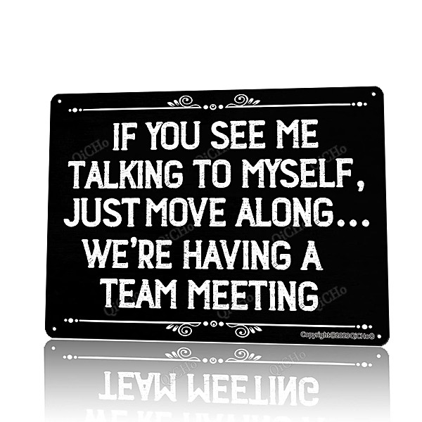

# Zombie Heaven

By **The Zombies**

## Album Data

- **Catalog:** Beets
- **Format:** Digital, Album
- **Album:** Zombie Heaven
- **Artist:** The Zombies
- **Albumartist:** The Zombies
- **Genre:** Psychedelic Rock
- **MusicBrainz Album Artist ID:** 
- **MusicBrainz Album ID:** 
- **MusicBrainz Release Group ID:** 
- **Year:** 1964
- **Catalog #:** 
- **Label:** 
- **Total Tracks:** 31

## Album Tracks

### Track 01 - Summertime [Demo Version]

- **Artist:** The Zombies
- **Format:** ALAC
- **Genre:** Psychedelic Rock
- **Length:** 2:29
- **MusicBrainz Track ID:** 
- **Title:** Summertime [Demo Version]
- **Track:** 01
- **Year:** 1964

### Track 02 - Woman [Demo Version]

- **Artist:** The Zombies
- **Format:** ALAC
- **Genre:** Psychedelic Rock
- **Length:** 3:14
- **MusicBrainz Track ID:** 
- **Title:** Woman [Demo Version]
- **Track:** 02
- **Year:** 1964

### Track 03 - Kind Of Girl [Demo Version]

- **Artist:** The Zombies
- **Format:** ALAC
- **Genre:** Psychedelic Rock
- **Length:** 2:39
- **MusicBrainz Track ID:** 
- **Title:** Kind Of Girl [Demo Version]
- **Track:** 03
- **Year:** 1964

### Track 04 - Leave Me Be [Demo Version]

- **Artist:** The Zombies
- **Format:** ALAC
- **Genre:** Psychedelic Rock
- **Length:** 2:43
- **MusicBrainz Track ID:** 
- **Title:** Leave Me Be [Demo Version]
- **Track:** 04
- **Year:** 1964

### Track 05 - I'm Going Home [Takes 1 & 2]

- **Artist:** The Zombies
- **Format:** ALAC
- **Genre:** Psychedelic Rock
- **Length:** 2:03
- **MusicBrainz Track ID:** 
- **Title:** I'm Going Home [Takes 1 & 2]
- **Track:** 05
- **Year:** 1964

### Track 06 - I'm Going Home [Take 14]

- **Artist:** The Zombies
- **Format:** ALAC
- **Genre:** Psychedelic Rock
- **Length:** 1:51
- **MusicBrainz Track ID:** 
- **Title:** I'm Going Home [Take 14]
- **Track:** 06
- **Year:** 1964

### Track 07 - Sometimes [Intro] [Takes 1, 2, 4, 5 & 6]

- **Artist:** The Zombies
- **Format:** ALAC
- **Genre:** Psychedelic Rock
- **Length:** 1:53
- **MusicBrainz Track ID:** 
- **Title:** Sometimes [Intro] [Takes 1, 2, 4, 5 & 6]
- **Track:** 07
- **Year:** 1964

### Track 08 - Sometimes

- **Artist:** The Zombies
- **Format:** ALAC
- **Genre:** Rock
- **Length:** 2:05
- **MusicBrainz Track ID:** 
- **Title:** Sometimes
- **Track:** 08
- **Year:** 1964

### Track 09 - It's Alright With Me

- **Artist:** The Zombies
- **Format:** ALAC
- **Genre:** Rock And Roll
- **Length:** 1:52
- **MusicBrainz Track ID:** 
- **Title:** It's Alright With Me
- **Track:** 09
- **Year:** 1964

### Track 10 - Kind Of Girl

- **Artist:** The Zombies
- **Format:** ALAC
- **Genre:** Psychedelic Rock
- **Length:** 2:10
- **MusicBrainz Track ID:** 
- **Title:** Kind Of Girl
- **Track:** 10
- **Year:** 1964

### Track 11 - Walking In The Sun [Take 6]

- **Artist:** The Zombies
- **Format:** ALAC
- **Genre:** Psychedelic Rock
- **Length:** 2:36
- **MusicBrainz Track ID:** 
- **Title:** Walking In The Sun [Take 6]
- **Track:** 11
- **Year:** 1964

### Track 12 - Studio Chat/The Way I Feel Inside [False Start]

- **Artist:** The Zombies
- **Format:** ALAC
- **Genre:** Psychedelic Rock
- **Length:** 2:08
- **MusicBrainz Track ID:** 
- **Title:** Studio Chat/The Way I Feel Inside [False Start]
- **Track:** 12
- **Year:** 1964

### Track 13 - The Way I Feel Inside [Take 2]

- **Artist:** The Zombies
- **Format:** ALAC
- **Genre:** Psychedelic Rock
- **Length:** 2:16
- **MusicBrainz Track ID:** 
- **Title:** The Way I Feel Inside [Take 2]
- **Track:** 13
- **Year:** 1964

### Track 14 - I Want You Back Again [Alternate Version]

- **Artist:** The Zombies
- **Format:** ALAC
- **Genre:** Psychedelic Rock
- **Length:** 2:10
- **MusicBrainz Track ID:** 
- **Title:** I Want You Back Again [Alternate Version]
- **Track:** 14
- **Year:** 1964

### Track 15 - Nothing's Changed [Backing Track]

- **Artist:** The Zombies
- **Format:** ALAC
- **Genre:** Psychedelic Rock
- **Length:** 2:44
- **MusicBrainz Track ID:** 
- **Title:** Nothing's Changed [Backing Track]
- **Track:** 15
- **Year:** 1965

### Track 16 - Nothing's Changed

- **Artist:** The Zombies
- **Format:** ALAC
- **Genre:** Psychedelic Pop
- **Length:** 3:18
- **MusicBrainz Track ID:** 
- **Title:** Nothing's Changed
- **Track:** 16
- **Year:** 1965

### Track 17 - Remember You [Soundtrack Version]

- **Artist:** The Zombies
- **Format:** ALAC
- **Genre:** Psychedelic Rock
- **Length:** 2:11
- **MusicBrainz Track ID:** 
- **Title:** Remember You [Soundtrack Version]
- **Track:** 17
- **Year:** 1965

### Track 18 - Come On Time [Take 18]

- **Artist:** The Zombies
- **Format:** ALAC
- **Genre:** Rock
- **Length:** 2:01
- **MusicBrainz Track ID:** 
- **Title:** Come On Time [Take 18]
- **Track:** 18
- **Year:** 1965

### Track 19 - I'll Keep Trying [Take 8]

- **Artist:** The Zombies
- **Format:** ALAC
- **Genre:** Psychedelic Rock
- **Length:** 2:29
- **MusicBrainz Track ID:** 
- **Title:** I'll Keep Trying [Take 8]
- **Track:** 19
- **Year:** 1965

### Track 20 - Whenever You're Ready [Demo Version]

- **Artist:** The Zombies
- **Format:** ALAC
- **Genre:** Psychedelic Rock
- **Length:** 2:34
- **MusicBrainz Track ID:** 
- **Title:** Whenever You're Ready [Demo Version]
- **Track:** 20
- **Year:** 1965

### Track 21 - You'll Go From Me (AKA Don't Go Away) [Demo Version]

- **Artist:** The Zombies
- **Format:** ALAC
- **Genre:** Psychedelic Rock
- **Length:** 2:35
- **MusicBrainz Track ID:** 
- **Title:** You'll Go From Me (AKA Don't Go Away) [Demo Version]
- **Track:** 21
- **Year:** 1965

### Track 22 - I Know She Will [Take 6]

- **Artist:** The Zombies
- **Format:** ALAC
- **Genre:** Psychedelic Rock
- **Length:** 2:48
- **MusicBrainz Track ID:** 
- **Title:** I Know She Will [Take 6]
- **Track:** 22
- **Year:** 1965

### Track 23 - Don't Cry For Me [Take 5]

- **Artist:** The Zombies
- **Format:** ALAC
- **Genre:** Psychedelic Rock
- **Length:** 2:18
- **MusicBrainz Track ID:** 
- **Title:** Don't Cry For Me [Take 5]
- **Track:** 23
- **Year:** 1965

### Track 24 - If It Don't Work Out [Take 2]

- **Artist:** The Zombies
- **Format:** ALAC
- **Genre:** Psychedelic Rock
- **Length:** 2:33
- **MusicBrainz Track ID:** 
- **Title:** If It Don't Work Out [Take 2]
- **Track:** 24
- **Year:** 1965

### Track 25 - One Day I'll Say Goodbye [Home Demo]

- **Artist:** The Zombies
- **Format:** ALAC
- **Genre:** Psychedelic Rock
- **Length:** 2:52
- **MusicBrainz Track ID:** 
- **Title:** One Day I'll Say Goodbye [Home Demo]
- **Track:** 25
- **Year:** 1966

### Track 26 - I Don't Want To Worry [Home Demo]

- **Artist:** The Zombies
- **Format:** ALAC
- **Genre:** Psychedelic Rock
- **Length:** 2:30
- **MusicBrainz Track ID:** 
- **Title:** I Don't Want To Worry [Home Demo]
- **Track:** 26
- **Year:** 1966

### Track 27 - A Love That Never Was [Demo Version]

- **Artist:** The Zombies
- **Format:** ALAC
- **Genre:** Psychedelic Rock
- **Length:** 2:16
- **MusicBrainz Track ID:** 
- **Title:** A Love That Never Was [Demo Version]
- **Track:** 27
- **Year:** 1966

### Track 28 - Call Of The Night (AKA Girl Help Me) [Demo Version]

- **Artist:** The Zombies
- **Format:** ALAC
- **Genre:** Psychedelic Rock
- **Length:** 1:59
- **MusicBrainz Track ID:** 
- **Title:** Call Of The Night (AKA Girl Help Me) [Demo Version]
- **Track:** 28
- **Year:** 1966

### Track 29 - Out Of The Day [Demo Version]

- **Artist:** The Zombies
- **Format:** ALAC
- **Genre:** Psychedelic Rock
- **Length:** 2:21
- **MusicBrainz Track ID:** 
- **Title:** Out Of The Day [Demo Version]
- **Track:** 29
- **Year:** 1966

### Track 30 - This Will Be Our Year [Demo Version]

- **Artist:** The Zombies
- **Format:** ALAC
- **Genre:** Psychedelic Rock
- **Length:** 1:46
- **MusicBrainz Track ID:** 
- **Title:** This Will Be Our Year [Demo Version]
- **Track:** 30
- **Year:** 1966

### Track 31 - Bunny Lake Is Missing [Promo Spot]

- **Artist:** The Zombies
- **Format:** ALAC
- **Genre:** Psychedelic Rock
- **Length:** 0:56
- **MusicBrainz Track ID:** 
- **Title:** Bunny Lake Is Missing [Promo Spot]
- **Track:** 31
- **Year:** 1966

## See also

- [Still Got That Hunger](Still_Got_That_Hunger.md)
- [The Zombies](The_Zombies.md)
- [Unknown Album](Unknown_Album.md)
- [Zombie Heaven](Zombie_Heaven_2_3_4.md)
- [Zombie Heaven](Zombie_Heaven_2_3.md)
- [Zombie Heaven](Zombie_Heaven_2.md)
- [CD: Still Got That Hunger](../../CD/The_Zombies/Still_Got_That_Hunger.md)
- [CD: ](../../CD/The_Zombies/The_Zombies.md)
- [CD: Zombie Heaven (Disc 1)](../../CD/The_Zombies/Zombie_Heaven_Disc_1.md)
- [CD: Zombie Heaven (Disc 2)](../../CD/The_Zombies/Zombie_Heaven_Disc_2.md)
- [CD: Zombie Heaven (Disc 3)](../../CD/The_Zombies/Zombie_Heaven_Disc_3.md)
- [CD: Zombie Heaven (Disc 4)](../../CD/The_Zombies/Zombie_Heaven_Disc_4.md)
- [Roon: Live In Concert at Metropolis Studios, London (feat. Colin Blunstone & Rod Argent) (Live at Metropolis Studios)](../../Roon/The_Zombies/Live_In_Concert_at_Metropolis_Studios__London_feat_Colin_Blunstone_and_Rod_Argent_Live_at_Metropolis_Studios.md)
- [Roon: Still Got That Hunger](../../Roon/The_Zombies/Still_Got_That_Hunger.md)
- [Vinyl: ](../../Vinyl/The_Zombies/The_Zombies.md)
- [Vinyl: Time Of The Season](../../Vinyl/The_Zombies/Time_Of_The_Season.md)
