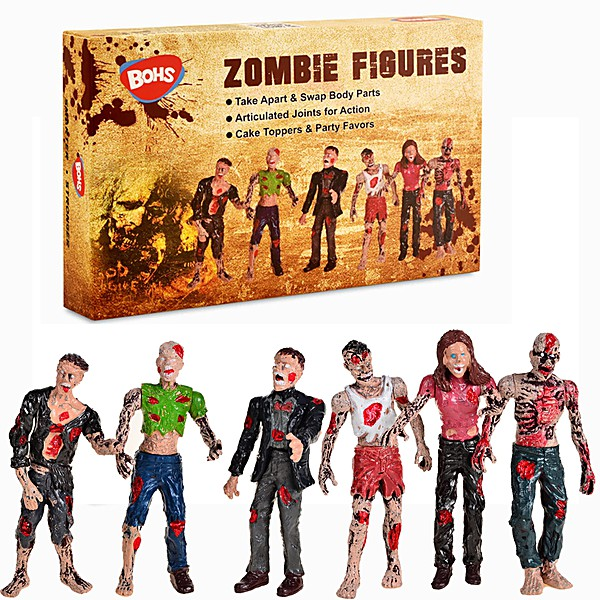

# Zombie Heaven

By **The Zombies**

## Album Data

- **Catalog:** Beets
- **Format:** Digital, Album
- **Album:** Zombie Heaven
- **Artist:** The Zombies
- **Albumartist:** The Zombies
- **Genre:** Psychedelic Rock
- **MusicBrainz Album Artist ID:** 
- **MusicBrainz Album ID:** 
- **MusicBrainz Release Group ID:** 
- **Year:** 1964
- **Catalog #:** 
- **Label:** 
- **Total Tracks:** 28

## Album Tracks

### Track 01 - Care Of Cell 44

- **Artist:** The Zombies
- **Format:** ALAC
- **Genre:** Psychedelic Pop
- **Length:** 3:57
- **MusicBrainz Track ID:** 
- **Title:** Care Of Cell 44
- **Track:** 01
- **Year:** 1968

### Track 02 - A Rose For Emily

- **Artist:** The Zombies
- **Format:** ALAC
- **Genre:** Psychedelic Rock
- **Length:** 2:19
- **MusicBrainz Track ID:** 
- **Title:** A Rose For Emily
- **Track:** 02
- **Year:** 1968

### Track 03 - Maybe After He's Gone

- **Artist:** The Zombies
- **Format:** ALAC
- **Genre:** Psychedelic Pop
- **Length:** 2:34
- **MusicBrainz Track ID:** 
- **Title:** Maybe After He's Gone
- **Track:** 03
- **Year:** 1968

### Track 04 - Beechwood Park

- **Artist:** The Zombies
- **Format:** ALAC
- **Genre:** Sunshine Pop
- **Length:** 2:44
- **MusicBrainz Track ID:** 
- **Title:** Beechwood Park
- **Track:** 04
- **Year:** 1968

### Track 05 - Brief Candles

- **Artist:** The Zombies
- **Format:** ALAC
- **Genre:** Psychedelic Pop
- **Length:** 3:31
- **MusicBrainz Track ID:** 
- **Title:** Brief Candles
- **Track:** 05
- **Year:** 1968

### Track 06 - Hung Up On A Dream

- **Artist:** The Zombies
- **Format:** ALAC
- **Genre:** Psychedelic Rock
- **Length:** 3:02
- **MusicBrainz Track ID:** 
- **Title:** Hung Up On A Dream
- **Track:** 06
- **Year:** 1968

### Track 07 - Changes

- **Artist:** The Zombies
- **Format:** ALAC
- **Genre:** Psychedelic Pop
- **Length:** 3:19
- **MusicBrainz Track ID:** 
- **Title:** Changes
- **Track:** 07
- **Year:** 1968

### Track 08 - I Want Her She Wants Me

- **Artist:** The Zombies
- **Format:** ALAC
- **Genre:** Psychedelic Pop
- **Length:** 2:52
- **MusicBrainz Track ID:** 
- **Title:** I Want Her She Wants Me
- **Track:** 08
- **Year:** 1968

### Track 09 - This Will Be Our Year [Mono]

- **Artist:** The Zombies
- **Format:** ALAC
- **Genre:** Psychedelic Rock
- **Length:** 2:09
- **MusicBrainz Track ID:** 
- **Title:** This Will Be Our Year [Mono]
- **Track:** 09
- **Year:** 1968

### Track 10 - Butcher's Tale (Western Front 1914)

- **Artist:** The Zombies
- **Format:** ALAC
- **Genre:** Psychedelic Rock
- **Length:** 2:48
- **MusicBrainz Track ID:** 
- **Title:** Butcher's Tale (Western Front 1914)
- **Track:** 10
- **Year:** 1968

### Track 11 - Friends Of Mine

- **Artist:** The Zombies
- **Format:** ALAC
- **Genre:** Psychedelic Pop
- **Length:** 2:17
- **MusicBrainz Track ID:** 
- **Title:** Friends Of Mine
- **Track:** 11
- **Year:** 1968

### Track 12 - Time Of The Season

- **Artist:** The Zombies
- **Format:** ALAC
- **Genre:** Psychedelic Rock
- **Length:** 3:34
- **MusicBrainz Track ID:** 
- **Title:** Time Of The Season
- **Track:** 12
- **Year:** 1968

### Track 13 - I'll Call You Mine [Single Version]

- **Artist:** The Zombies
- **Format:** ALAC
- **Genre:** Psychedelic Rock
- **Length:** 2:36
- **MusicBrainz Track ID:** 
- **Title:** I'll Call You Mine [Single Version]
- **Track:** 13
- **Year:** 1968

### Track 14 - Imagine The Swan

- **Artist:** The Zombies
- **Format:** ALAC
- **Genre:** Psychedelic Pop
- **Length:** 3:12
- **MusicBrainz Track ID:** 
- **Title:** Imagine The Swan
- **Track:** 14
- **Year:** 1969

### Track 15 - Conversation Off Floral Street

- **Artist:** The Zombies
- **Format:** ALAC
- **Genre:** Rock
- **Length:** 2:41
- **MusicBrainz Track ID:** 
- **Title:** Conversation Off Floral Street
- **Track:** 15
- **Year:** 1969

### Track 16 - If It Don't Work Out [Overdubbed]

- **Artist:** The Zombies
- **Format:** ALAC
- **Genre:** Psychedelic Rock
- **Length:** 2:29
- **MusicBrainz Track ID:** 
- **Title:** If It Don't Work Out [Overdubbed]
- **Track:** 16
- **Year:** 1969

### Track 17 - Don't Cry For Me [Overdubbed]

- **Artist:** The Zombies
- **Format:** ALAC
- **Genre:** Psychedelic Rock
- **Length:** 2:16
- **MusicBrainz Track ID:** 
- **Title:** Don't Cry For Me [Overdubbed]
- **Track:** 17
- **Year:** 1969

### Track 18 - I Know She Will [Overdubbed]

- **Artist:** The Zombies
- **Format:** ALAC
- **Genre:** Pop
- **Length:** 2:35
- **MusicBrainz Track ID:** 
- **Title:** I Know She Will [Overdubbed]
- **Track:** 18
- **Year:** 1968

### Track 19 - Walking In The Sun [Overdubbed]

- **Artist:** The Zombies
- **Format:** ALAC
- **Genre:** Psychedelic Rock
- **Length:** 2:39
- **MusicBrainz Track ID:** 
- **Title:** Walking In The Sun [Overdubbed]
- **Track:** 19
- **Year:** 1968

### Track 20 - I'll Keep Trying [Overdubbed]

- **Artist:** The Zombies
- **Format:** ALAC
- **Genre:** Psychedelic Rock
- **Length:** 2:28
- **MusicBrainz Track ID:** 
- **Title:** I'll Keep Trying [Overdubbed]
- **Track:** 20
- **Year:** 1968

### Track 21 - I'll Call You Mine [Overdubbed]

- **Artist:** The Zombies
- **Format:** ALAC
- **Genre:** Psychedelic Rock
- **Length:** 2:39
- **MusicBrainz Track ID:** 
- **Title:** I'll Call You Mine [Overdubbed]
- **Track:** 21
- **Year:** 1968

### Track 22 - Smokey Day

- **Artist:** The Zombies
- **Format:** ALAC
- **Genre:** Psychedelic Rock
- **Length:** 2:25
- **MusicBrainz Track ID:** 
- **Title:** Smokey Day
- **Track:** 22
- **Year:** 1968

### Track 23 - She Loves The Way They Love Her

- **Artist:** The Zombies
- **Format:** ALAC
- **Genre:** Rock And Roll
- **Length:** 3:03
- **MusicBrainz Track ID:** 
- **Title:** She Loves The Way They Love Her
- **Track:** 23
- **Year:** 1968

### Track 24 - Girl Help Me

- **Artist:** The Zombies
- **Format:** ALAC
- **Genre:** Psychedelic Pop
- **Length:** 2:22
- **MusicBrainz Track ID:** 
- **Title:** Girl Help Me
- **Track:** 24
- **Year:** 1968

### Track 25 - I Could Spend The Day

- **Artist:** The Zombies
- **Format:** ALAC
- **Genre:** Soft Rock
- **Length:** 2:31
- **MusicBrainz Track ID:** 
- **Title:** I Could Spend The Day
- **Track:** 25
- **Year:** 1968

### Track 26 - A Rose For Emily [Alternative version]

- **Artist:** The Zombies
- **Format:** ALAC
- **Genre:** Psychedelic Rock
- **Length:** 2:21
- **MusicBrainz Track ID:** 
- **Title:** A Rose For Emily [Alternative version]
- **Track:** 26
- **Year:** 1968

### Track 27 - This Will Be Our Year [Stereo]

- **Artist:** The Zombies
- **Format:** ALAC
- **Genre:** Pop
- **Length:** 2:08
- **MusicBrainz Track ID:** 
- **Title:** This Will Be Our Year [Stereo]
- **Track:** 27
- **Year:** 1968

### Track 28 - Time Of The Season [US Radio Spot]

- **Artist:** The Zombies
- **Format:** ALAC
- **Genre:** Psychedelic Rock
- **Length:** 0:52
- **MusicBrainz Track ID:** 
- **Title:** Time Of The Season [US Radio Spot]
- **Track:** 28
- **Year:** 1968

## See also

- [Still Got That Hunger](Still_Got_That_Hunger.md)
- [The Zombies](The_Zombies.md)
- [Unknown Album](Unknown_Album.md)
- [Zombie Heaven](Zombie_Heaven_2_3_4.md)
- [Zombie Heaven](Zombie_Heaven_2.md)
- [Zombie Heaven](Zombie_Heaven.md)
- [CD: Still Got That Hunger](../../CD/The_Zombies/Still_Got_That_Hunger.md)
- [CD: ](../../CD/The_Zombies/The_Zombies.md)
- [CD: Zombie Heaven (Disc 1)](../../CD/The_Zombies/Zombie_Heaven_Disc_1.md)
- [CD: Zombie Heaven (Disc 2)](../../CD/The_Zombies/Zombie_Heaven_Disc_2.md)
- [CD: Zombie Heaven (Disc 3)](../../CD/The_Zombies/Zombie_Heaven_Disc_3.md)
- [CD: Zombie Heaven (Disc 4)](../../CD/The_Zombies/Zombie_Heaven_Disc_4.md)
- [Roon: Live In Concert at Metropolis Studios, London (feat. Colin Blunstone & Rod Argent) (Live at Metropolis Studios)](../../Roon/The_Zombies/Live_In_Concert_at_Metropolis_Studios__London_feat_Colin_Blunstone_and_Rod_Argent_Live_at_Metropolis_Studios.md)
- [Roon: Still Got That Hunger](../../Roon/The_Zombies/Still_Got_That_Hunger.md)
- [Vinyl: ](../../Vinyl/The_Zombies/The_Zombies.md)
- [Vinyl: Time Of The Season](../../Vinyl/The_Zombies/Time_Of_The_Season.md)
