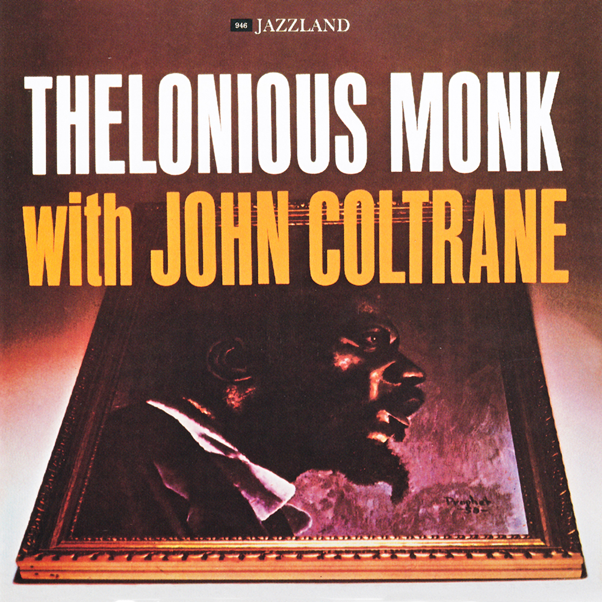

# Thelonious Monk with John Coltrane

By **Thelonious Monk with John Coltrane**

## Album Data

- **Catalog:** Beets
- **Format:** Digital, Album
- **Album:** Thelonious Monk with John Coltrane
- **Artist:** Thelonious Monk With John Coltrane
- **Albumartist:** Thelonious Monk with John Coltrane
- **Genre:** Jazz
- **MusicBrainz Album Artist ID:** [8e8c7417-c905-46b1-b42a-5260b4274ed4](https://musicbrainz.org/artist/8e8c7417-c905-46b1-b42a-5260b4274ed4)
- **MusicBrainz Album ID:** [9553ee6b-89cc-4761-b2e8-0d08d34a5085](https://musicbrainz.org/release/9553ee6b-89cc-4761-b2e8-0d08d34a5085)
- **MusicBrainz Release Group ID:** [20052b09-e445-3bca-b8b5-110c0efd559f](https://musicbrainz.org/release-group/20052b09-e445-3bca-b8b5-110c0efd559f)
- **Year:** 2000
- **Catalog #:** JCD-46-2
- **Label:** Jazzland
- **Total Tracks:** 06

## Album Tracks

### Track 01 - Ruby, My Dear

- **Artist:** Thelonious Monk with John Coltrane
- **Format:** MP3
- **Genre:** Jazz
- **Length:** 6:21
- **MusicBrainz Track ID:** [c69695d4-7a56-41df-b798-6b0cb65290f6](https://musicbrainz.org/recording/c69695d4-7a56-41df-b798-6b0cb65290f6)
- **Title:** Ruby, My Dear
- **Track:** 01
- **Year:** 2000

### Track 02 - Trinkle, Tinkle

- **Artist:** Thelonious Monk with John Coltrane
- **Format:** MP3
- **Genre:** Jazz
- **Length:** 6:40
- **MusicBrainz Track ID:** [5f79eaa4-01de-491a-a7b6-62ffc6489a7e](https://musicbrainz.org/recording/5f79eaa4-01de-491a-a7b6-62ffc6489a7e)
- **Title:** Trinkle, Tinkle
- **Track:** 02
- **Year:** 2000

### Track 03 - Off Minor

- **Artist:** Thelonious Monk with John Coltrane
- **Format:** MP3
- **Genre:** Jazz
- **Length:** 5:16
- **MusicBrainz Track ID:** [7c7d95cc-cf1e-4fec-9872-c8a5828826c5](https://musicbrainz.org/recording/7c7d95cc-cf1e-4fec-9872-c8a5828826c5)
- **Title:** Off Minor
- **Track:** 03
- **Year:** 2000

### Track 04 - Nutty

- **Artist:** Thelonious Monk with John Coltrane
- **Format:** MP3
- **Genre:** Jazz
- **Length:** 6:38
- **MusicBrainz Track ID:** [06937d1a-cc78-44e4-a556-4ad7e830789f](https://musicbrainz.org/recording/06937d1a-cc78-44e4-a556-4ad7e830789f)
- **Title:** Nutty
- **Track:** 04
- **Year:** 2000

### Track 05 - Epistrophy

- **Artist:** Thelonious Monk with John Coltrane
- **Format:** MP3
- **Genre:** Jazz
- **Length:** 3:09
- **MusicBrainz Track ID:** [4eb4e411-b4ed-4e94-ae06-f5ab79db2ef2](https://musicbrainz.org/recording/4eb4e411-b4ed-4e94-ae06-f5ab79db2ef2)
- **Title:** Epistrophy
- **Track:** 05
- **Year:** 2000

### Track 06 - Functional

- **Artist:** Thelonious Monk with John Coltrane
- **Format:** MP3
- **Genre:** Jazz
- **Length:** 9:41
- **MusicBrainz Track ID:** [5db55eed-d336-4f0f-9854-4737805a7231](https://musicbrainz.org/recording/5db55eed-d336-4f0f-9854-4737805a7231)
- **Title:** Functional
- **Track:** 06
- **Year:** 2000

