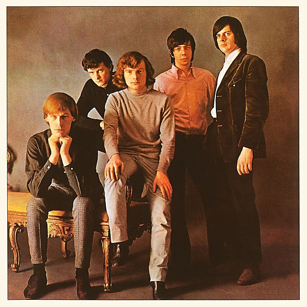

# The Angry Young Them

By **Them**

## Album Data

- **Catalog:** Beets
- **Format:** Digital, Album
- **Album:** The Angry Young Them
- **Artist:** Them
- **Albumartist:** Them
- **Genre:** Blues
- **MusicBrainz Album Artist ID:** [dbd8e1e8-b3d5-4c5f-9343-bbe5e86380a6](https://musicbrainz.org/artist/dbd8e1e8-b3d5-4c5f-9343-bbe5e86380a6)
- **MusicBrainz Album ID:** [7a755568-565e-35b3-bb05-6becadfa3723](https://musicbrainz.org/release/7a755568-565e-35b3-bb05-6becadfa3723)
- **MusicBrainz Release Group ID:** [67bc0ac7-70e0-3259-885a-61c389217a8a](https://musicbrainz.org/release-group/67bc0ac7-70e0-3259-885a-61c389217a8a)
- **Year:** 1988
- **Catalog #:** 820 563-2
- **Label:** London Records
- **Total Tracks:** 14

## Album Tracks

### Track 01 - Mystic Eyes

- **Artist:** Them
- **Format:** AAC
- **Genre:** Hard Rock
- **Length:** 2:41
- **MusicBrainz Track ID:** [b728821d-e99e-49ea-b25d-982830951aa2](https://musicbrainz.org/recording/b728821d-e99e-49ea-b25d-982830951aa2)
- **Title:** Mystic Eyes
- **Track:** 01
- **Year:** 1988

### Track 02 - If You and I Could Be as Two

- **Artist:** Them
- **Format:** MP3
- **Genre:** Rhythm And Blues
- **Length:** 2:53
- **MusicBrainz Track ID:** [a5c12479-a630-4540-8a30-5ff21e76dc0b](https://musicbrainz.org/recording/a5c12479-a630-4540-8a30-5ff21e76dc0b)
- **Title:** If You and I Could Be as Two
- **Track:** 02
- **Year:** 1988

### Track 03 - Little Girl

- **Artist:** Them
- **Format:** MP3
- **Genre:** Rhythm And Blues
- **Length:** 2:49
- **MusicBrainz Track ID:** [94a14399-0f68-456d-a47f-e55f815f3799](https://musicbrainz.org/recording/94a14399-0f68-456d-a47f-e55f815f3799)
- **Title:** Little Girl
- **Track:** 03
- **Year:** 1988

### Track 04 - Just a Little Bit

- **Artist:** Them
- **Format:** AAC
- **Genre:** Rhythm And Blues
- **Length:** 2:26
- **MusicBrainz Track ID:** [bc98641a-2358-4be9-b98f-10039ed11d2e](https://musicbrainz.org/recording/bc98641a-2358-4be9-b98f-10039ed11d2e)
- **Title:** Just a Little Bit
- **Track:** 04
- **Year:** 1988

### Track 05 - I Gave My Love a Diamond

- **Artist:** Them
- **Format:** MP3
- **Genre:** Rock
- **Length:** 3:04
- **MusicBrainz Track ID:** [4f00e094-b728-40c7-9fbf-b2ee6d84ffe0](https://musicbrainz.org/recording/4f00e094-b728-40c7-9fbf-b2ee6d84ffe0)
- **Title:** I Gave My Love a Diamond
- **Track:** 05
- **Year:** 1988

### Track 06 - Gloria

- **Artist:** Them
- **Format:** MP3
- **Genre:** Rock And Roll
- **Length:** 2:40
- **MusicBrainz Track ID:** [ee8bb35f-f32c-4f65-861c-095b7045c413](https://musicbrainz.org/recording/ee8bb35f-f32c-4f65-861c-095b7045c413)
- **Title:** Gloria
- **Track:** 06
- **Year:** 1988

### Track 07 - You Just Can’t Win

- **Artist:** Them
- **Format:** AAC
- **Genre:** Blues
- **Length:** 2:27
- **MusicBrainz Track ID:** [d9496c69-0221-4797-a9e0-2b7594ed9c22](https://musicbrainz.org/recording/d9496c69-0221-4797-a9e0-2b7594ed9c22)
- **Title:** You Just Can’t Win
- **Track:** 07
- **Year:** 1988

### Track 08 - Go on Home Baby

- **Artist:** Them
- **Format:** MP3
- **Genre:** Blues
- **Length:** 2:33
- **MusicBrainz Track ID:** [82defa6e-39fd-4020-b93c-a843cdc9bdca](https://musicbrainz.org/recording/82defa6e-39fd-4020-b93c-a843cdc9bdca)
- **Title:** Go on Home Baby
- **Track:** 08
- **Year:** 1988

### Track 09 - Don’t Look Back

- **Artist:** Them
- **Format:** MP3
- **Genre:** Blues
- **Length:** 3:23
- **MusicBrainz Track ID:** [fea170be-fe02-4c26-ba13-52a10a488989](https://musicbrainz.org/recording/fea170be-fe02-4c26-ba13-52a10a488989)
- **Title:** Don’t Look Back
- **Track:** 09
- **Year:** 1988

### Track 10 - I Like It Like That

- **Artist:** Them
- **Format:** AAC
- **Genre:** Garage Rock
- **Length:** 3:22
- **MusicBrainz Track ID:** [2054c519-d0f5-4ee8-b483-da6d71d086d7](https://musicbrainz.org/recording/2054c519-d0f5-4ee8-b483-da6d71d086d7)
- **Title:** I Like It Like That
- **Track:** 10
- **Year:** 1988

### Track 11 - I’m Gonna Dress in Black

- **Artist:** Them
- **Format:** AAC
- **Genre:** Blues
- **Length:** 3:38
- **MusicBrainz Track ID:** [249dce05-1538-4502-bd81-3b1e1d8c15b9](https://musicbrainz.org/recording/249dce05-1538-4502-bd81-3b1e1d8c15b9)
- **Title:** I’m Gonna Dress in Black
- **Track:** 11
- **Year:** 1988

### Track 12 - Bright Lights, Big City

- **Artist:** Them
- **Format:** AAC
- **Genre:** Rock And Roll
- **Length:** 2:35
- **MusicBrainz Track ID:** [28071b08-c92a-4f98-bc0b-d871151e3e6a](https://musicbrainz.org/recording/28071b08-c92a-4f98-bc0b-d871151e3e6a)
- **Title:** Bright Lights, Big City
- **Track:** 12
- **Year:** 1988

### Track 13 - My Little Baby

- **Artist:** Them
- **Format:** AAC
- **Genre:** Blues
- **Length:** 2:14
- **MusicBrainz Track ID:** [a08a4226-b049-4f49-bee6-c6ff727f9e0d](https://musicbrainz.org/recording/a08a4226-b049-4f49-bee6-c6ff727f9e0d)
- **Title:** My Little Baby
- **Track:** 13
- **Year:** 1988

### Track 14 - (Get Your Kicks on) Route 66

- **Artist:** Them
- **Format:** AAC
- **Genre:** Rock And Roll
- **Length:** 2:27
- **MusicBrainz Track ID:** [8f9bee23-914b-47d3-951f-3ea42a573190](https://musicbrainz.org/recording/8f9bee23-914b-47d3-951f-3ea42a573190)
- **Title:** (Get Your Kicks on) Route 66
- **Track:** 14
- **Year:** 1988

## See also

- [Roon: The "Angry" Young Them!](../../Roon/Them/The_Angry_Young_Them!.md)
- [Roon: Them Again](../../Roon/Them/Them_Again.md)
