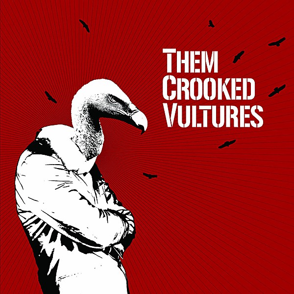

# Them Crooked Vultures

By **Them Crooked Vultures**

## Album Data

- **Catalog:** Beets
- **Format:** Digital, Album
- **Album:** Them Crooked Vultures
- **Artist:** Them Crooked Vultures
- **Albumartist:** Them Crooked Vultures
- **Genre:** Stoner Rock
- **MusicBrainz Album Artist ID:** [4bc09c51-5d42-4c93-9ba6-8cc21a0edb8d](https://musicbrainz.org/artist/4bc09c51-5d42-4c93-9ba6-8cc21a0edb8d)
- **MusicBrainz Album ID:** [8713720a-df4b-4fd8-8e64-59cab6583c2a](https://musicbrainz.org/release/8713720a-df4b-4fd8-8e64-59cab6583c2a)
- **MusicBrainz Release Group ID:** [c433d46d-e1d1-4053-922c-f542c43b6e67](https://musicbrainz.org/release-group/c433d46d-e1d1-4053-922c-f542c43b6e67)
- **Year:** 2009
- **Catalog #:** B0013783-02
- **Label:** DGC Records
- **Total Tracks:** 13

## Album Tracks

### Track 01 - No One Loves Me & Neither Do I

- **Artist:** Them Crooked Vultures
- **Format:** AAC
- **Genre:** Stoner Rock
- **Length:** 5:10
- **MusicBrainz Track ID:** [39840207-eefb-40fe-a42c-7851bb6751fb](https://musicbrainz.org/recording/39840207-eefb-40fe-a42c-7851bb6751fb)
- **Title:** No One Loves Me & Neither Do I
- **Track:** 01
- **Year:** 2009

### Track 02 - Mind Eraser, No Chaser

- **Artist:** Them Crooked Vultures
- **Format:** AAC
- **Genre:** Stoner Rock
- **Length:** 4:06
- **MusicBrainz Track ID:** [cbce65fa-c9f6-49f2-bbe4-bfd244e043a6](https://musicbrainz.org/recording/cbce65fa-c9f6-49f2-bbe4-bfd244e043a6)
- **Title:** Mind Eraser, No Chaser
- **Track:** 02
- **Year:** 2009

### Track 03 - New Fang

- **Artist:** Them Crooked Vultures
- **Format:** AAC
- **Genre:** Stoner Rock
- **Length:** 3:48
- **MusicBrainz Track ID:** [36afed3e-9e20-47f6-a8eb-4ffe149fec41](https://musicbrainz.org/recording/36afed3e-9e20-47f6-a8eb-4ffe149fec41)
- **Title:** New Fang
- **Track:** 03
- **Year:** 2009

### Track 04 - Dead End Friends

- **Artist:** Them Crooked Vultures
- **Format:** AAC
- **Genre:** Stoner Rock
- **Length:** 3:15
- **MusicBrainz Track ID:** [40b25161-77f7-4b0e-a71e-8e2f8bd6428e](https://musicbrainz.org/recording/40b25161-77f7-4b0e-a71e-8e2f8bd6428e)
- **Title:** Dead End Friends
- **Track:** 04
- **Year:** 2009

### Track 05 - Elephants

- **Artist:** Them Crooked Vultures
- **Format:** AAC
- **Genre:** Stoner Rock
- **Length:** 6:49
- **MusicBrainz Track ID:** [e1acd104-547b-4743-9297-89453265edd6](https://musicbrainz.org/recording/e1acd104-547b-4743-9297-89453265edd6)
- **Title:** Elephants
- **Track:** 05
- **Year:** 2009

### Track 06 - Scumbag Blues

- **Artist:** Them Crooked Vultures
- **Format:** AAC
- **Genre:** Stoner Rock
- **Length:** 4:27
- **MusicBrainz Track ID:** [6979a380-a344-464f-9490-ed57751f7c42](https://musicbrainz.org/recording/6979a380-a344-464f-9490-ed57751f7c42)
- **Title:** Scumbag Blues
- **Track:** 06
- **Year:** 2009

### Track 07 - Bandoliers

- **Artist:** Them Crooked Vultures
- **Format:** AAC
- **Genre:** Stoner Rock
- **Length:** 5:42
- **MusicBrainz Track ID:** [3321e35f-324e-49f2-ab4d-85f3bd19b96a](https://musicbrainz.org/recording/3321e35f-324e-49f2-ab4d-85f3bd19b96a)
- **Title:** Bandoliers
- **Track:** 07
- **Year:** 2009

### Track 08 - Reptiles

- **Artist:** Them Crooked Vultures
- **Format:** AAC
- **Genre:** Stoner Rock
- **Length:** 4:15
- **MusicBrainz Track ID:** [f7b673b4-ea37-4a5f-90fd-016b6d45df51](https://musicbrainz.org/recording/f7b673b4-ea37-4a5f-90fd-016b6d45df51)
- **Title:** Reptiles
- **Track:** 08
- **Year:** 2009

### Track 09 - Interlude With Ludes

- **Artist:** Them Crooked Vultures
- **Format:** AAC
- **Genre:** Stoner Rock
- **Length:** 3:44
- **MusicBrainz Track ID:** [1dc26db3-9df3-4f8a-87d0-f9704218d1f7](https://musicbrainz.org/recording/1dc26db3-9df3-4f8a-87d0-f9704218d1f7)
- **Title:** Interlude With Ludes
- **Track:** 09
- **Year:** 2009

### Track 10 - Warsaw or the First Breath You Take After You Give Up

- **Artist:** Them Crooked Vultures
- **Format:** AAC
- **Genre:** Stoner Rock
- **Length:** 7:50
- **MusicBrainz Track ID:** [f19b5378-1ac1-446e-ba66-862d4131554f](https://musicbrainz.org/recording/f19b5378-1ac1-446e-ba66-862d4131554f)
- **Title:** Warsaw or the First Breath You Take After You Give Up
- **Track:** 10
- **Year:** 2009

### Track 11 - Caligulove

- **Artist:** Them Crooked Vultures
- **Format:** AAC
- **Genre:** Stoner Rock
- **Length:** 4:55
- **MusicBrainz Track ID:** [e1e6cba0-e182-4f29-85f2-8ab3cd07d5cc](https://musicbrainz.org/recording/e1e6cba0-e182-4f29-85f2-8ab3cd07d5cc)
- **Title:** Caligulove
- **Track:** 11
- **Year:** 2009

### Track 12 - Gunman

- **Artist:** Them Crooked Vultures
- **Format:** AAC
- **Genre:** Stoner Rock
- **Length:** 4:46
- **MusicBrainz Track ID:** [839cf787-9822-4811-9bf8-e9d600e8c9ba](https://musicbrainz.org/recording/839cf787-9822-4811-9bf8-e9d600e8c9ba)
- **Title:** Gunman
- **Track:** 12
- **Year:** 2009

### Track 13 - Spinning in Daffodils

- **Artist:** Them Crooked Vultures
- **Format:** AAC
- **Genre:** Stoner Rock
- **Length:** 7:28
- **MusicBrainz Track ID:** [f120db76-7206-4751-a72a-aa7bf809298c](https://musicbrainz.org/recording/f120db76-7206-4751-a72a-aa7bf809298c)
- **Title:** Spinning in Daffodils
- **Track:** 13
- **Year:** 2009

## See also

- [CD: ](../../CD/Them_Crooked_Vultures/Them_Crooked_Vultures_index.md)
- [CD: Them Crooked Vultures](../../CD/Them_Crooked_Vultures/Them_Crooked_Vultures.md)
- [Vinyl: ](../../Vinyl/Them_Crooked_Vultures/Them_Crooked_Vultures_index.md)
- [Vinyl: Them Crooked Vultures](../../Vinyl/Them_Crooked_Vultures/Them_Crooked_Vultures.md)
