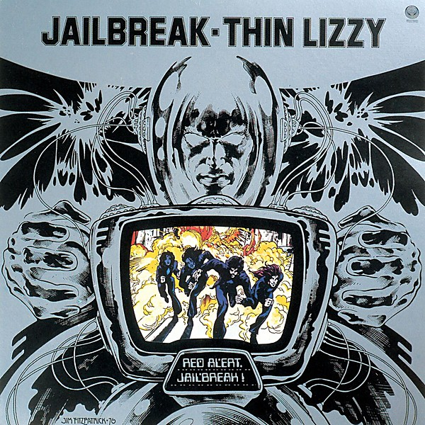

# Jailbreak

By **Thin Lizzy**

## Album Data

- **Catalog:** Beets
- **Format:** Digital, Album
- **Album:** Jailbreak
- **Artist:** Thin Lizzy
- **Albumartist:** Thin Lizzy
- **Genre:** Heavy Metal
- **MusicBrainz Album Artist ID:** [6a726ac6-019e-455c-8bbb-571a77bed52e](https://musicbrainz.org/artist/6a726ac6-019e-455c-8bbb-571a77bed52e)
- **MusicBrainz Album ID:** [f8af7b98-6eae-34f9-a855-303714a45d3c](https://musicbrainz.org/release/f8af7b98-6eae-34f9-a855-303714a45d3c)
- **MusicBrainz Release Group ID:** [d55dae0d-835d-3756-8805-196e41bacc2f](https://musicbrainz.org/release-group/d55dae0d-835d-3756-8805-196e41bacc2f)
- **Year:** 1976
- **Catalog #:** SRM-1-1081
- **Label:** Mercury Records
- **Total Tracks:** 09

## Album Tracks

### Track 01 - Jailbreak

- **Artist:** Thin Lizzy
- **Format:** ALAC
- **Genre:** Heavy Metal
- **Length:** 4:04
- **MusicBrainz Track ID:** [1a978007-b99a-4a0f-82fa-481510d2dce1](https://musicbrainz.org/recording/1a978007-b99a-4a0f-82fa-481510d2dce1)
- **Title:** Jailbreak
- **Track:** 01
- **Year:** 1976

### Track 02 - Angel From the Coast

- **Artist:** Thin Lizzy
- **Format:** ALAC
- **Genre:** Heavy Metal
- **Length:** 3:06
- **MusicBrainz Track ID:** [65cca7bb-dd94-4e00-a9d1-4d451b20ae35](https://musicbrainz.org/recording/65cca7bb-dd94-4e00-a9d1-4d451b20ae35)
- **Title:** Angel From the Coast
- **Track:** 02
- **Year:** 1976

### Track 03 - Running Back

- **Artist:** Thin Lizzy
- **Format:** ALAC
- **Genre:** Hard Rock
- **Length:** 3:16
- **MusicBrainz Track ID:** [3981d218-fca0-4bfa-8cab-a4f382c09b08](https://musicbrainz.org/recording/3981d218-fca0-4bfa-8cab-a4f382c09b08)
- **Title:** Running Back
- **Track:** 03
- **Year:** 1976

### Track 04 - Romeo and the Lonely Girl

- **Artist:** Thin Lizzy
- **Format:** ALAC
- **Genre:** Heavy Metal
- **Length:** 3:58
- **MusicBrainz Track ID:** [318f8418-ff30-4a22-8a39-f142403d7bc7](https://musicbrainz.org/recording/318f8418-ff30-4a22-8a39-f142403d7bc7)
- **Title:** Romeo and the Lonely Girl
- **Track:** 04
- **Year:** 1976

### Track 05 - Warriors

- **Artist:** Thin Lizzy
- **Format:** ALAC
- **Genre:** Heavy Metal
- **Length:** 4:12
- **MusicBrainz Track ID:** [45dd0859-bc74-47b0-9ad0-53ee03d2d392](https://musicbrainz.org/recording/45dd0859-bc74-47b0-9ad0-53ee03d2d392)
- **Title:** Warriors
- **Track:** 05
- **Year:** 1976

### Track 06 - The Boys Are Back in Town

- **Artist:** Thin Lizzy
- **Format:** ALAC
- **Genre:** Hard Rock
- **Length:** 4:30
- **MusicBrainz Track ID:** [7ffd3432-9f45-4c40-a4aa-806db8f2cfcb](https://musicbrainz.org/recording/7ffd3432-9f45-4c40-a4aa-806db8f2cfcb)
- **Title:** The Boys Are Back in Town
- **Track:** 06
- **Year:** 1976

### Track 07 - Fight or Fall

- **Artist:** Thin Lizzy
- **Format:** ALAC
- **Genre:** Soul
- **Length:** 3:48
- **MusicBrainz Track ID:** [4bebaa32-1a04-475c-9230-887a297747af](https://musicbrainz.org/recording/4bebaa32-1a04-475c-9230-887a297747af)
- **Title:** Fight or Fall
- **Track:** 07
- **Year:** 1976

### Track 08 - Cowboy Song

- **Artist:** Thin Lizzy
- **Format:** ALAC
- **Genre:** Heavy Metal
- **Length:** 5:18
- **MusicBrainz Track ID:** [c904233b-d75e-4438-93d9-16807ffcef65](https://musicbrainz.org/recording/c904233b-d75e-4438-93d9-16807ffcef65)
- **Title:** Cowboy Song
- **Track:** 08
- **Year:** 1976

### Track 09 - Emerald

- **Artist:** Thin Lizzy
- **Format:** ALAC
- **Genre:** Heavy Metal
- **Length:** 4:04
- **MusicBrainz Track ID:** [6b44974c-be1c-4d0e-acc8-d29a8ed1ac4b](https://musicbrainz.org/recording/6b44974c-be1c-4d0e-acc8-d29a8ed1ac4b)
- **Title:** Emerald
- **Track:** 09
- **Year:** 1976

## See also

- [Dedication](Dedication.md)
- [CD: Jailbreak](../../CD/Thin_Lizzy/Jailbreak.md)
- [CD: ](../../CD/Thin_Lizzy/Thin_Lizzy.md)
- [Roon: Black Rose](../../Roon/Thin_Lizzy/Black_Rose-_A_Rock_Legend.md)
- [Roon: Chinatown](../../Roon/Thin_Lizzy/Chinatown.md)
- [Roon: Renegade](../../Roon/Thin_Lizzy/Renegade.md)
- [Roon: Thunder And Lightning](../../Roon/Thin_Lizzy/Thunder_And_Lightning.md)
