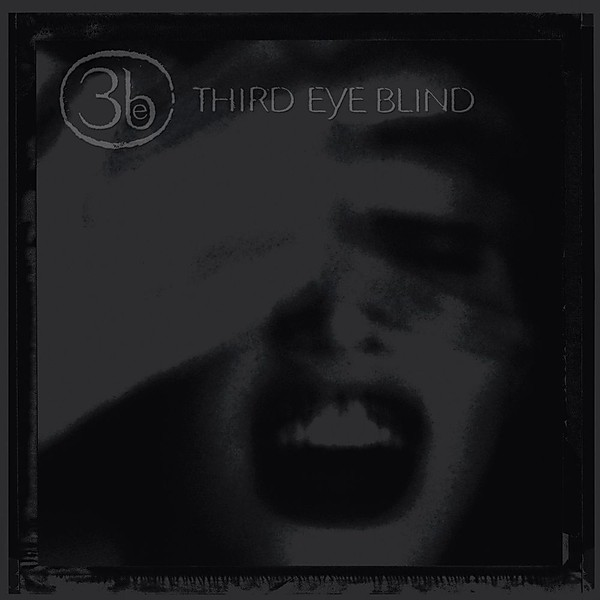

# Third Eye Blind

By **Third Eye Blind**

## Album Data

- **Catalog:** Beets
- **Format:** Digital, Album
- **Album:** Third Eye Blind
- **Artist:** Third Eye Blind
- **Albumartist:** Third Eye Blind
- **Genre:** Post-Grunge
- **MusicBrainz Album Artist ID:** 
- **MusicBrainz Album ID:** 
- **MusicBrainz Release Group ID:** 
- **Year:** 1997
- **Catalog #:** 
- **Label:** 
- **Total Tracks:** 00

## Album Tracks

### Track 00 - 04 Jumper

- **Artist:** Third Eye Blind
- **Format:** AAC
- **Genre:** Post-Grunge
- **Length:** 4:32
- **MusicBrainz Track ID:** 
- **Title:** 04 Jumper
- **Track:** 00
- **Year:** 1997

### Track 00 - How's It Gonna Be

- **Artist:** Third Eye Blind
- **Format:** MP3
- **Genre:** Emo
- **Length:** 4:13
- **MusicBrainz Track ID:** 
- **Title:** How's It Gonna Be
- **Track:** 00
- **Year:** 0098

### Track 00 - Losing A Whole Year

- **Artist:** Third Eye Blind
- **Format:** AAC
- **Genre:** Post-Grunge
- **Length:** 3:20
- **MusicBrainz Track ID:** 
- **Title:** Losing A Whole Year
- **Track:** 00
- **Year:** 2000

