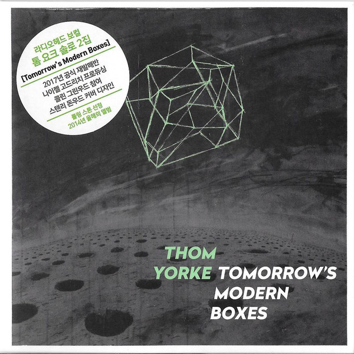

# Tomorrow’s Modern Boxes

By **Thom Yorke**

## Album Data

- **Catalog:** Beets
- **Format:** Digital, Album
- **Album:** Tomorrow’s Modern Boxes
- **Artist:** Thom Yorke
- **Albumartist:** Thom Yorke
- **Genre:** Idm
- **MusicBrainz Album Artist ID:** [8ed2e0b3-aa4c-4e13-bec3-dc7393ed4d6b](https://musicbrainz.org/artist/8ed2e0b3-aa4c-4e13-bec3-dc7393ed4d6b)
- **MusicBrainz Album ID:** [159d05e1-62e8-4437-943e-d25519b6474e](https://musicbrainz.org/release/159d05e1-62e8-4437-943e-d25519b6474e)
- **MusicBrainz Release Group ID:** [e8edab9d-9e02-4338-be4e-7579d7214142](https://musicbrainz.org/release-group/e8edab9d-9e02-4338-be4e-7579d7214142)
- **Year:** 2019
- **Catalog #:** XL866CDJP
- **Label:** XL Recordings
- **Total Tracks:** 09

## Album Tracks

### Track 01 - A Brain in a Bottle

- **Artist:** Thom Yorke
- **Format:** AAC
- **Genre:** Idm
- **Length:** 4:33
- **MusicBrainz Track ID:** [c4421fea-5272-449c-904d-5cef4539b129](https://musicbrainz.org/recording/c4421fea-5272-449c-904d-5cef4539b129)
- **Title:** A Brain in a Bottle
- **Track:** 01
- **Year:** 2019

### Track 02 - Guess Again!

- **Artist:** Thom Yorke
- **Format:** MP3
- **Genre:** Dream Pop
- **Length:** 4:23
- **MusicBrainz Track ID:** [b053966f-338b-4574-8177-fdf5cf59caf3](https://musicbrainz.org/recording/b053966f-338b-4574-8177-fdf5cf59caf3)
- **Title:** Guess Again!
- **Track:** 02
- **Year:** 2019

### Track 03 - Interference

- **Artist:** Thom Yorke
- **Format:** MP3
- **Genre:** Dream Pop
- **Length:** 2:48
- **MusicBrainz Track ID:** [7df03dd6-e99a-4b73-81d2-b6dda54f9962](https://musicbrainz.org/recording/7df03dd6-e99a-4b73-81d2-b6dda54f9962)
- **Title:** Interference
- **Track:** 03
- **Year:** 2019

### Track 04 - The Mother Lode

- **Artist:** Thom Yorke
- **Format:** MP3
- **Genre:** Idm
- **Length:** 6:06
- **MusicBrainz Track ID:** [0b160658-7a09-49d1-9072-bccf39143639](https://musicbrainz.org/recording/0b160658-7a09-49d1-9072-bccf39143639)
- **Title:** The Mother Lode
- **Track:** 04
- **Year:** 2019

### Track 05 - Truth Ray

- **Artist:** Thom Yorke
- **Format:** MP3
- **Genre:** Ambient
- **Length:** 5:13
- **MusicBrainz Track ID:** [278e8c38-96aa-409e-b246-7bb8d8743994](https://musicbrainz.org/recording/278e8c38-96aa-409e-b246-7bb8d8743994)
- **Title:** Truth Ray
- **Track:** 05
- **Year:** 2019

### Track 06 - There Is No Ice (for My Drink)

- **Artist:** Thom Yorke
- **Format:** MP3
- **Genre:** Idm
- **Length:** 7:00
- **MusicBrainz Track ID:** [7f7031ec-a5f1-4ce7-acd7-1223b07816ba](https://musicbrainz.org/recording/7f7031ec-a5f1-4ce7-acd7-1223b07816ba)
- **Title:** There Is No Ice (for My Drink)
- **Track:** 06
- **Year:** 2019

### Track 07 - Pink Section

- **Artist:** Thom Yorke
- **Format:** MP3
- **Genre:** Dark Ambient
- **Length:** 2:34
- **MusicBrainz Track ID:** [f29449e5-b3eb-427e-97da-4e5e2e2f7950](https://musicbrainz.org/recording/f29449e5-b3eb-427e-97da-4e5e2e2f7950)
- **Title:** Pink Section
- **Track:** 07
- **Year:** 2019

### Track 08 - Nose Grows Some

- **Artist:** Thom Yorke
- **Format:** MP3
- **Genre:** Idm
- **Length:** 5:22
- **MusicBrainz Track ID:** [6900290f-5998-45da-ade5-5650801ce760](https://musicbrainz.org/recording/6900290f-5998-45da-ade5-5650801ce760)
- **Title:** Nose Grows Some
- **Track:** 08
- **Year:** 2019

### Track 09 - YouWouldn’tLikeMeWhenI’mAngry

- **Artist:** Thom Yorke
- **Format:** MP3
- **Genre:** Idm
- **Length:** 4:40
- **MusicBrainz Track ID:** [ed3bcff0-a17a-4f68-b151-e2835d689ab0](https://musicbrainz.org/recording/ed3bcff0-a17a-4f68-b151-e2835d689ab0)
- **Title:** YouWouldn’tLikeMeWhenI’mAngry
- **Track:** 09
- **Year:** 2019

## See also

- [Roon: The Eraser](../../Roon/Thom_Yorke/The_Eraser.md)
