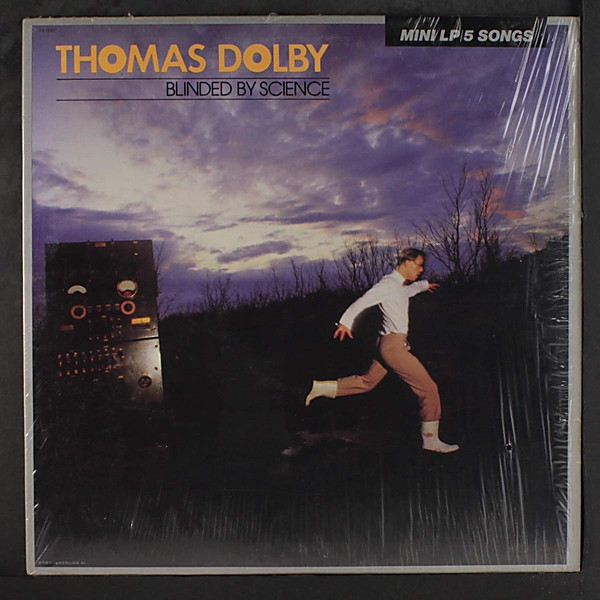

# Blinded by Science

By **Thomas Dolby**

## Album Data

- **Catalog:** Beets
- **Format:** Digital, Album
- **Album:** Blinded by Science
- **Artist:** Thomas Dolby
- **Albumartist:** Thomas Dolby
- **Genre:** New Wave
- **MusicBrainz Album Artist ID:** [5a8cc407-7efb-4e94-9637-d5896395e754](https://musicbrainz.org/artist/5a8cc407-7efb-4e94-9637-d5896395e754)
- **MusicBrainz Album ID:** [12c1d8f6-19c5-4f91-96d7-2fd6f863182f](https://musicbrainz.org/release/12c1d8f6-19c5-4f91-96d7-2fd6f863182f)
- **MusicBrainz Release Group ID:** [98e4a36a-c267-4772-b959-f4833e010fbe](https://musicbrainz.org/release-group/98e4a36a-c267-4772-b959-f4833e010fbe)
- **Year:** 1983
- **Catalog #:** CDP 7 46028-2
- **Label:** Parlophone Odeon
- **Total Tracks:** 07

## Album Tracks

### Track 01 - Dissidents

- **Artist:** Thomas Dolby
- **Format:** MP3
- **Genre:** Synthpop
- **Length:** 4:56
- **MusicBrainz Track ID:** [25fa1070-46ff-479d-8d3d-02dc7d74c52f](https://musicbrainz.org/recording/25fa1070-46ff-479d-8d3d-02dc7d74c52f)
- **Title:** Dissidents
- **Track:** 01
- **Year:** 1984

### Track 02 - The Flat Earth

- **Artist:** Thomas Dolby
- **Format:** MP3
- **Genre:** Synthpop
- **Length:** 6:41
- **MusicBrainz Track ID:** [a9b6c85f-585d-4ab3-9c54-59a1876f72e9](https://musicbrainz.org/recording/a9b6c85f-585d-4ab3-9c54-59a1876f72e9)
- **Title:** The Flat Earth
- **Track:** 02
- **Year:** 1984

### Track 03 - Screen Kiss

- **Artist:** Thomas Dolby
- **Format:** MP3
- **Genre:** Synthpop
- **Length:** 5:24
- **MusicBrainz Track ID:** [83efa9f9-1dcb-439c-b99d-600bd60a9f2d](https://musicbrainz.org/recording/83efa9f9-1dcb-439c-b99d-600bd60a9f2d)
- **Title:** Screen Kiss
- **Track:** 03
- **Year:** 1984

### Track 04 - White City

- **Artist:** Thomas Dolby
- **Format:** MP3
- **Genre:** Synthpop
- **Length:** 5:31
- **MusicBrainz Track ID:** [572dfda4-fe71-4b6d-9546-4ebea8f25e14](https://musicbrainz.org/recording/572dfda4-fe71-4b6d-9546-4ebea8f25e14)
- **Title:** White City
- **Track:** 04
- **Year:** 1984

### Track 05 - Mulu the Rain Forest

- **Artist:** Thomas Dolby
- **Format:** MP3
- **Genre:** Synthpop
- **Length:** 4:47
- **MusicBrainz Track ID:** [2473b731-0723-47f9-8950-e2456026e604](https://musicbrainz.org/recording/2473b731-0723-47f9-8950-e2456026e604)
- **Title:** Mulu the Rain Forest
- **Track:** 05
- **Year:** 1984

### Track 06 - I Scare Myself

- **Artist:** Thomas Dolby
- **Format:** MP3
- **Genre:** New Wave
- **Length:** 5:38
- **MusicBrainz Track ID:** [1ead0802-1d42-42a8-91b1-194395b69086](https://musicbrainz.org/recording/1ead0802-1d42-42a8-91b1-194395b69086)
- **Title:** I Scare Myself
- **Track:** 06
- **Year:** 1984

### Track 07 - Hyperactive!

- **Artist:** Thomas Dolby
- **Format:** MP3
- **Genre:** Synthpop
- **Length:** 4:08
- **MusicBrainz Track ID:** [7204c339-a622-4ee1-88d6-edd92498ce2d](https://musicbrainz.org/recording/7204c339-a622-4ee1-88d6-edd92498ce2d)
- **Title:** Hyperactive!
- **Track:** 07
- **Year:** 1984

## See also

- [The Flat Earth](The_Flat_Earth.md)
- [The Golden Age of Wireless](The_Golden_Age_of_Wireless.md)
- [Vinyl: Blinded By Science](../../Vinyl/Thomas_Dolby/Blinded_By_Science.md)
- [Vinyl: The Flat Earth](../../Vinyl/Thomas_Dolby/The_Flat_Earth.md)
- [Vinyl: The Golden Age Of Wireless](../../Vinyl/Thomas_Dolby/The_Golden_Age_Of_Wireless.md)
- [Vinyl: ](../../Vinyl/Thomas_Dolby/Thomas_Dolby.md)
