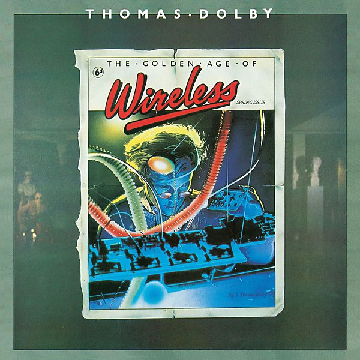

# The Golden Age of Wireless

By **Thomas Dolby**

## Album Data

- **Catalog:** Beets
- **Format:** Digital, Album
- **Album:** The Golden Age of Wireless
- **Artist:** Thomas Dolby
- **Albumartist:** Thomas Dolby
- **Genre:** Synthpop
- **MusicBrainz Album Artist ID:** [5a8cc407-7efb-4e94-9637-d5896395e754](https://musicbrainz.org/artist/5a8cc407-7efb-4e94-9637-d5896395e754)
- **MusicBrainz Album ID:** [922bb9b8-d1a6-3abd-bbad-8b7642e8c79b](https://musicbrainz.org/release/922bb9b8-d1a6-3abd-bbad-8b7642e8c79b)
- **MusicBrainz Release Group ID:** [11ed9046-1cbc-39b0-a8c0-dc27ecbb8670](https://musicbrainz.org/release-group/11ed9046-1cbc-39b0-a8c0-dc27ecbb8670)
- **Year:** 1984
- **Catalog #:** CDP 7 46009 2
- **Label:** Capitol Records
- **Total Tracks:** 10

## Album Tracks

### Track 01 - She Blinded Me With Science

- **Artist:** Thomas Dolby
- **Format:** MP3
- **Genre:** Synthpop
- **Length:** 5:09
- **MusicBrainz Track ID:** [ea83c5f0-884e-417f-b7f7-b93fbbb90f70](https://musicbrainz.org/recording/ea83c5f0-884e-417f-b7f7-b93fbbb90f70)
- **Title:** She Blinded Me With Science
- **Track:** 01
- **Year:** 1984

### Track 02 - Radio Silence

- **Artist:** Thomas Dolby
- **Format:** MP3
- **Genre:** Synthpop
- **Length:** 4:34
- **MusicBrainz Track ID:** [99357034-38fa-4cff-b102-703d6a72fcc3](https://musicbrainz.org/recording/99357034-38fa-4cff-b102-703d6a72fcc3)
- **Title:** Radio Silence
- **Track:** 02
- **Year:** 1984

### Track 03 - Airwaves

- **Artist:** Thomas Dolby
- **Format:** MP3
- **Genre:** Synthpop
- **Length:** 3:36
- **MusicBrainz Track ID:** [090bc67d-736a-40cc-9527-53375b13389d](https://musicbrainz.org/recording/090bc67d-736a-40cc-9527-53375b13389d)
- **Title:** Airwaves
- **Track:** 03
- **Year:** 1984

### Track 04 - Flying North

- **Artist:** Thomas Dolby
- **Format:** MP3
- **Genre:** Synthpop
- **Length:** 3:51
- **MusicBrainz Track ID:** [3eef99ff-7cec-4465-a2e3-87dfc57a2ff2](https://musicbrainz.org/recording/3eef99ff-7cec-4465-a2e3-87dfc57a2ff2)
- **Title:** Flying North
- **Track:** 04
- **Year:** 1984

### Track 05 - Weightless

- **Artist:** Thomas Dolby
- **Format:** MP3
- **Genre:** Synthpop
- **Length:** 3:45
- **MusicBrainz Track ID:** [bcd03754-de59-4319-b421-b379d77c29fd](https://musicbrainz.org/recording/bcd03754-de59-4319-b421-b379d77c29fd)
- **Title:** Weightless
- **Track:** 05
- **Year:** 1984

### Track 06 - Europa and the Pirate Twins

- **Artist:** Thomas Dolby
- **Format:** MP3
- **Genre:** New Wave
- **Length:** 3:17
- **MusicBrainz Track ID:** [97adb234-f873-4c2f-9d40-91f3633b7f6b](https://musicbrainz.org/recording/97adb234-f873-4c2f-9d40-91f3633b7f6b)
- **Title:** Europa and the Pirate Twins
- **Track:** 06
- **Year:** 1984

### Track 07 - Windpower

- **Artist:** Thomas Dolby
- **Format:** MP3
- **Genre:** Synthpop
- **Length:** 3:47
- **MusicBrainz Track ID:** [02d4eea5-16e7-42ef-8257-9ed7435accad](https://musicbrainz.org/recording/02d4eea5-16e7-42ef-8257-9ed7435accad)
- **Title:** Windpower
- **Track:** 07
- **Year:** 1984

### Track 08 - Commercial Breakup

- **Artist:** Thomas Dolby
- **Format:** MP3
- **Genre:** Pop Rock
- **Length:** 4:20
- **MusicBrainz Track ID:** [6532467d-2868-4cbb-9b84-a43800f560c8](https://musicbrainz.org/recording/6532467d-2868-4cbb-9b84-a43800f560c8)
- **Title:** Commercial Breakup
- **Track:** 08
- **Year:** 1984

### Track 09 - One of Our Submarines

- **Artist:** Thomas Dolby
- **Format:** MP3
- **Genre:** Synthpop
- **Length:** 5:10
- **MusicBrainz Track ID:** [0239348a-0e5a-4485-8f8e-d461c995caba](https://musicbrainz.org/recording/0239348a-0e5a-4485-8f8e-d461c995caba)
- **Title:** One of Our Submarines
- **Track:** 09
- **Year:** 1984

### Track 10 - Cloudburst at Shingle Street

- **Artist:** Thomas Dolby
- **Format:** MP3
- **Genre:** Techno
- **Length:** 5:42
- **MusicBrainz Track ID:** [f4d8183e-6acc-47c8-ac18-d8ef5c741eb3](https://musicbrainz.org/recording/f4d8183e-6acc-47c8-ac18-d8ef5c741eb3)
- **Title:** Cloudburst at Shingle Street
- **Track:** 10
- **Year:** 1984

## See also

- [Blinded by Science](Blinded_by_Science.md)
- [The Flat Earth](The_Flat_Earth.md)
- [Vinyl: Blinded By Science](../../Vinyl/Thomas_Dolby/Blinded_By_Science.md)
- [Vinyl: The Flat Earth](../../Vinyl/Thomas_Dolby/The_Flat_Earth.md)
- [Vinyl: The Golden Age Of Wireless](../../Vinyl/Thomas_Dolby/The_Golden_Age_Of_Wireless.md)
- [Vinyl: ](../../Vinyl/Thomas_Dolby/Thomas_Dolby.md)
