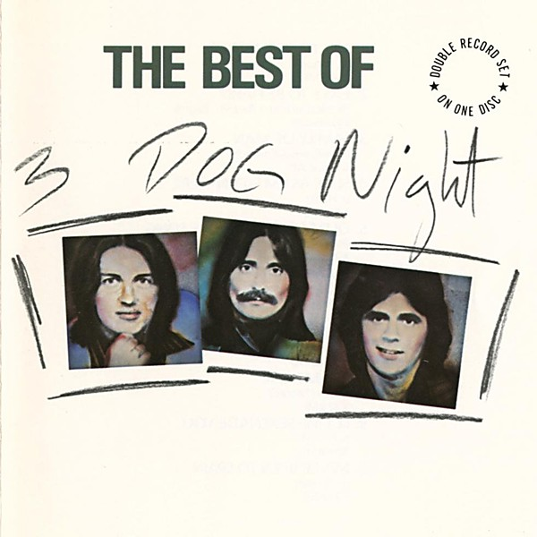

# The Best of Three Dog Night

By **Three Dog Night**

## Album Data

- **Catalog:** Beets
- **Format:** Digital, Album
- **Album:** The Best of Three Dog Night
- **Artist:** Three Dog Night
- **Albumartist:** Three Dog Night
- **Genre:** Southern Rock
- **MusicBrainz Album Artist ID:** [1a48176d-1414-4a18-9792-50ba585d4d59](https://musicbrainz.org/artist/1a48176d-1414-4a18-9792-50ba585d4d59)
- **MusicBrainz Album ID:** [b9af0e13-5c9b-4ef3-bfc0-d400e75f54aa](https://musicbrainz.org/release/b9af0e13-5c9b-4ef3-bfc0-d400e75f54aa)
- **MusicBrainz Release Group ID:** [fda2c2b1-13cb-4be4-b137-945ae99214f3](https://musicbrainz.org/release-group/fda2c2b1-13cb-4be4-b137-945ae99214f3)
- **Year:** 1982
- **Catalog #:** JVC-485
- **Label:** JVC
- **Total Tracks:** 20

## Album Tracks

### Track 01 - Joy to the World

- **Artist:** Three Dog Night
- **Format:** ALAC
- **Genre:** Rock
- **Length:** 3:35
- **MusicBrainz Track ID:** [7fc453d5-9ab2-4ffb-b7a5-dd93e021e5de](https://musicbrainz.org/recording/7fc453d5-9ab2-4ffb-b7a5-dd93e021e5de)
- **Title:** Joy to the World
- **Track:** 01
- **Year:** 1982

### Track 02 - Easy to Be Hard

- **Artist:** Three Dog Night
- **Format:** ALAC
- **Genre:** Rock
- **Length:** 3:13
- **MusicBrainz Track ID:** [7d5501d6-1bba-4e61-be7d-8c03b8df10e9](https://musicbrainz.org/recording/7d5501d6-1bba-4e61-be7d-8c03b8df10e9)
- **Title:** Easy to Be Hard
- **Track:** 02
- **Year:** 1982

### Track 03 - Family of Man

- **Artist:** Three Dog Night
- **Format:** ALAC
- **Genre:** Soft Rock
- **Length:** 3:11
- **MusicBrainz Track ID:** [d533e091-60e3-4458-b905-8b7cfa9bd8a9](https://musicbrainz.org/recording/d533e091-60e3-4458-b905-8b7cfa9bd8a9)
- **Title:** Family of Man
- **Track:** 03
- **Year:** 1982

### Track 04 - Sure as I’m Sittin’ Here

- **Artist:** Three Dog Night
- **Format:** ALAC
- **Genre:** Southern Rock
- **Length:** 3:09
- **MusicBrainz Track ID:** [f3ace9f3-ffe2-4eef-ae03-9dd88451c9fb](https://musicbrainz.org/recording/f3ace9f3-ffe2-4eef-ae03-9dd88451c9fb)
- **Title:** Sure as I’m Sittin’ Here
- **Track:** 04
- **Year:** 1982

### Track 05 - Old Fashioned Love Song

- **Artist:** Three Dog Night
- **Format:** ALAC
- **Genre:** Soft Rock
- **Length:** 3:24
- **MusicBrainz Track ID:** [ba2c5d5c-47a8-4e1c-90bd-38738fbd5cff](https://musicbrainz.org/recording/ba2c5d5c-47a8-4e1c-90bd-38738fbd5cff)
- **Title:** Old Fashioned Love Song
- **Track:** 05
- **Year:** 1982

### Track 06 - Mama Told Me (Not to Come)

- **Artist:** Three Dog Night
- **Format:** ALAC
- **Genre:** Soft Rock
- **Length:** 3:19
- **MusicBrainz Track ID:** [1f568049-4f03-4579-9627-f4b926b7c654](https://musicbrainz.org/recording/1f568049-4f03-4579-9627-f4b926b7c654)
- **Title:** Mama Told Me (Not to Come)
- **Track:** 06
- **Year:** 1970

### Track 07 - Try a Little Tenderness

- **Artist:** Three Dog Night
- **Format:** ALAC
- **Genre:** Rock
- **Length:** 4:11
- **MusicBrainz Track ID:** [39fade16-b4aa-475c-8b20-a35d2f62f3d2](https://musicbrainz.org/recording/39fade16-b4aa-475c-8b20-a35d2f62f3d2)
- **Title:** Try a Little Tenderness
- **Track:** 07
- **Year:** 1982

### Track 08 - Shambala

- **Artist:** Three Dog Night
- **Format:** ALAC
- **Genre:** Southern Rock
- **Length:** 3:25
- **MusicBrainz Track ID:** [9e8ff051-f44b-4077-9d65-b4552507688a](https://musicbrainz.org/recording/9e8ff051-f44b-4077-9d65-b4552507688a)
- **Title:** Shambala
- **Track:** 08
- **Year:** 1982

### Track 09 - Let Me Serenade You

- **Artist:** Three Dog Night
- **Format:** ALAC
- **Genre:** Southern Rock
- **Length:** 3:05
- **MusicBrainz Track ID:** [500b3a61-660d-41b2-8ad7-7c02c53a97f3](https://musicbrainz.org/recording/500b3a61-660d-41b2-8ad7-7c02c53a97f3)
- **Title:** Let Me Serenade You
- **Track:** 09
- **Year:** 1982

### Track 10 - Never Been to Spain

- **Artist:** Three Dog Night
- **Format:** ALAC
- **Genre:** Southern Rock
- **Length:** 3:43
- **MusicBrainz Track ID:** [92cc7a32-3779-4b21-9af6-7d4d4f0986df](https://musicbrainz.org/recording/92cc7a32-3779-4b21-9af6-7d4d4f0986df)
- **Title:** Never Been to Spain
- **Track:** 10
- **Year:** 1982

### Track 11 - Black and White

- **Artist:** Three Dog Night
- **Format:** ALAC
- **Genre:** Soft Rock
- **Length:** 3:47
- **MusicBrainz Track ID:** [a11e067c-34b4-4fe1-b2f1-90a18bef9dff](https://musicbrainz.org/recording/a11e067c-34b4-4fe1-b2f1-90a18bef9dff)
- **Title:** Black and White
- **Track:** 11
- **Year:** 1982

### Track 12 - Pieces of April

- **Artist:** Three Dog Night
- **Format:** ALAC
- **Genre:** Soft Rock
- **Length:** 4:13
- **MusicBrainz Track ID:** [6f796c84-6dc0-48dc-a36e-6805fbc12b68](https://musicbrainz.org/recording/6f796c84-6dc0-48dc-a36e-6805fbc12b68)
- **Title:** Pieces of April
- **Track:** 12
- **Year:** 1982

### Track 13 - Liar

- **Artist:** Three Dog Night
- **Format:** ALAC
- **Genre:** Rock
- **Length:** 3:05
- **MusicBrainz Track ID:** [a6aec1b8-a88c-404b-b25e-095abfd2b0a3](https://musicbrainz.org/recording/a6aec1b8-a88c-404b-b25e-095abfd2b0a3)
- **Title:** Liar
- **Track:** 13
- **Year:** 1982

### Track 14 - Out in the Country

- **Artist:** Three Dog Night
- **Format:** ALAC
- **Genre:** Soft Rock
- **Length:** 3:10
- **MusicBrainz Track ID:** [8ad4029c-ce8f-4f79-a215-de0862d7aea4](https://musicbrainz.org/recording/8ad4029c-ce8f-4f79-a215-de0862d7aea4)
- **Title:** Out in the Country
- **Track:** 14
- **Year:** 1982

### Track 15 - The Show Must Go On

- **Artist:** Three Dog Night
- **Format:** ALAC
- **Genre:** Rock
- **Length:** 3:28
- **MusicBrainz Track ID:** [168cb31b-69a2-48ef-b6dd-1b716c5a6a91](https://musicbrainz.org/recording/168cb31b-69a2-48ef-b6dd-1b716c5a6a91)
- **Title:** The Show Must Go On
- **Track:** 15
- **Year:** 1982

### Track 16 - Eli’s Coming

- **Artist:** Three Dog Night
- **Format:** ALAC
- **Genre:** Southern Rock
- **Length:** 2:43
- **MusicBrainz Track ID:** [52f6a365-3177-4417-92d9-2ed7f5b82f6f](https://musicbrainz.org/recording/52f6a365-3177-4417-92d9-2ed7f5b82f6f)
- **Title:** Eli’s Coming
- **Track:** 16
- **Year:** 1969

### Track 17 - One Man Band

- **Artist:** Three Dog Night
- **Format:** ALAC
- **Genre:** Southern Rock
- **Length:** 2:52
- **MusicBrainz Track ID:** [3a745b7b-cdbd-4be6-9849-d0ed4b0f3717](https://musicbrainz.org/recording/3a745b7b-cdbd-4be6-9849-d0ed4b0f3717)
- **Title:** One Man Band
- **Track:** 17
- **Year:** 1982

### Track 18 - One

- **Artist:** Three Dog Night
- **Format:** ALAC
- **Genre:** Rock
- **Length:** 3:06
- **MusicBrainz Track ID:** [320ffeb5-c610-4378-a3d2-700fce233051](https://musicbrainz.org/recording/320ffeb5-c610-4378-a3d2-700fce233051)
- **Title:** One
- **Track:** 18
- **Year:** 1982

### Track 19 - Play Something Sweet (Brickyard Blues)

- **Artist:** Three Dog Night
- **Format:** ALAC
- **Genre:** Soft Rock
- **Length:** 4:52
- **MusicBrainz Track ID:** [b0faf57b-2bdb-4e4f-b3b9-15a44cf87dcb](https://musicbrainz.org/recording/b0faf57b-2bdb-4e4f-b3b9-15a44cf87dcb)
- **Title:** Play Something Sweet (Brickyard Blues)
- **Track:** 19
- **Year:** 1982

### Track 20 - Celebrate

- **Artist:** Three Dog Night
- **Format:** ALAC
- **Genre:** Soft Rock
- **Length:** 3:13
- **MusicBrainz Track ID:** [492cce86-db25-4aed-a052-0fe39d4aae42](https://musicbrainz.org/recording/492cce86-db25-4aed-a052-0fe39d4aae42)
- **Title:** Celebrate
- **Track:** 20
- **Year:** 1982

## See also

- [Roon: It Ain't Easy](../../Roon/Three_Dog_Night/It_Aint_Easy.md)
- [Roon: Naturally](../../Roon/Three_Dog_Night/Naturally.md)
- [Roon: Suitable For Framing](../../Roon/Three_Dog_Night/Suitable_For_Framing.md)
- [Roon: The Best Of 3 Dog Night](../../Roon/Three_Dog_Night/The_Best_Of_3_Dog_Night.md)
- [Roon: Three Dog Night](../../Roon/Three_Dog_Night/Three_Dog_Night.md)
- [Vinyl: Mama Told Me (Not To Come)](../../Vinyl/Three_Dog_Night/Mama_Told_Me_Not_To_Come.md)
- [Vinyl: ](../../Vinyl/Three_Dog_Night/Three_Dog_Night.md)
