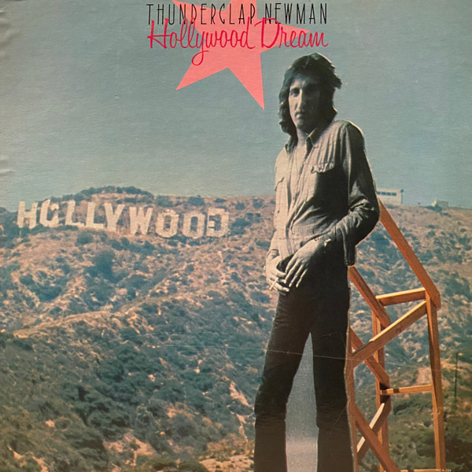

# Hollywood Dream

By **Thunderclap Newman**

## Album Data

- **Catalog:** Beets
- **Format:** Digital, Album
- **Album:** Hollywood Dream
- **Artist:** Thunderclap Newman
- **Albumartist:** Thunderclap Newman
- **Genre:** Southern Rock
- **MusicBrainz Album Artist ID:** [e5ef73d3-58ce-4a71-bbf7-72cf5cb2393a](https://musicbrainz.org/artist/e5ef73d3-58ce-4a71-bbf7-72cf5cb2393a)
- **MusicBrainz Album ID:** [29877ae6-2ed9-4245-938c-b9c8f71c5d30](https://musicbrainz.org/release/29877ae6-2ed9-4245-938c-b9c8f71c5d30)
- **MusicBrainz Release Group ID:** [fd24c739-62d2-3b05-b043-07882550b906](https://musicbrainz.org/release-group/fd24c739-62d2-3b05-b043-07882550b906)
- **Year:** 1991
- **Catalog #:** 833 794-2
- **Label:** Polydor
- **Total Tracks:** 18

## Album Tracks

### Track 01 - Something in the Air

- **Artist:** Thunderclap Newman
- **Format:** AAC
- **Genre:** Psychedelic Rock
- **Length:** 3:55
- **MusicBrainz Track ID:** [3e0958a7-27d5-44c7-896d-2b9f0ece0420](https://musicbrainz.org/recording/3e0958a7-27d5-44c7-896d-2b9f0ece0420)
- **Title:** Something in the Air
- **Track:** 01
- **Year:** 1991

### Track 02 - Hollywood #1

- **Artist:** Thunderclap Newman
- **Format:** AAC
- **Genre:** Southern Rock
- **Length:** 3:20
- **MusicBrainz Track ID:** [34fe591d-5046-4f2d-8248-894ae8a5e2e1](https://musicbrainz.org/recording/34fe591d-5046-4f2d-8248-894ae8a5e2e1)
- **Title:** Hollywood #1
- **Track:** 02
- **Year:** 1991

### Track 03 - The Reason

- **Artist:** Thunderclap Newman
- **Format:** AAC
- **Genre:** Pop
- **Length:** 4:06
- **MusicBrainz Track ID:** [ef3fdae7-7cb8-4323-b585-602ccdd5b2e1](https://musicbrainz.org/recording/ef3fdae7-7cb8-4323-b585-602ccdd5b2e1)
- **Title:** The Reason
- **Track:** 03
- **Year:** 1991

### Track 04 - Open the Door, Homer

- **Artist:** Thunderclap Newman
- **Format:** AAC
- **Genre:** Southern Rock
- **Length:** 3:02
- **MusicBrainz Track ID:** [992503d4-b317-472a-bf22-61c4ef7d9ea6](https://musicbrainz.org/recording/992503d4-b317-472a-bf22-61c4ef7d9ea6)
- **Title:** Open the Door, Homer
- **Track:** 04
- **Year:** 1991

### Track 05 - Look Around

- **Artist:** Thunderclap Newman
- **Format:** AAC
- **Genre:** Art Rock
- **Length:** 3:00
- **MusicBrainz Track ID:** [82b3351f-1da4-4db9-8c01-36951641d48d](https://musicbrainz.org/recording/82b3351f-1da4-4db9-8c01-36951641d48d)
- **Title:** Look Around
- **Track:** 05
- **Year:** 1991

### Track 06 - Accidents

- **Artist:** Thunderclap Newman
- **Format:** AAC
- **Genre:** Art Rock
- **Length:** 9:42
- **MusicBrainz Track ID:** [48dcf11f-bc1f-405e-bba6-2f4aec7e7a3b](https://musicbrainz.org/recording/48dcf11f-bc1f-405e-bba6-2f4aec7e7a3b)
- **Title:** Accidents
- **Track:** 06
- **Year:** 1991

### Track 07 - Wild Country

- **Artist:** Thunderclap Newman
- **Format:** AAC
- **Genre:** Psychedelic Rock
- **Length:** 4:16
- **MusicBrainz Track ID:** [ff575a8d-f78f-4a50-8e70-1b7c1c26621f](https://musicbrainz.org/recording/ff575a8d-f78f-4a50-8e70-1b7c1c26621f)
- **Title:** Wild Country
- **Track:** 07
- **Year:** 1991

### Track 08 - When I Think

- **Artist:** Thunderclap Newman
- **Format:** AAC
- **Genre:** Art Rock
- **Length:** 3:11
- **MusicBrainz Track ID:** [2436258e-e7de-47a3-ba3b-760539fe900b](https://musicbrainz.org/recording/2436258e-e7de-47a3-ba3b-760539fe900b)
- **Title:** When I Think
- **Track:** 08
- **Year:** 1991

### Track 09 - The Old Cornmill

- **Artist:** Thunderclap Newman
- **Format:** AAC
- **Genre:** Southern Rock
- **Length:** 4:02
- **MusicBrainz Track ID:** [7d2d616c-2bc0-4a8f-8bcc-b38f8713f977](https://musicbrainz.org/recording/7d2d616c-2bc0-4a8f-8bcc-b38f8713f977)
- **Title:** The Old Cornmill
- **Track:** 09
- **Year:** 1991

### Track 10 - I Don’t Know

- **Artist:** Thunderclap Newman
- **Format:** AAC
- **Genre:** Southern Rock
- **Length:** 3:45
- **MusicBrainz Track ID:** [3a213115-43cb-43c5-b245-b40a9d0cca32](https://musicbrainz.org/recording/3a213115-43cb-43c5-b245-b40a9d0cca32)
- **Title:** I Don’t Know
- **Track:** 10
- **Year:** 1991

### Track 11 - Hollywood Dream (instrumental)

- **Artist:** Thunderclap Newman
- **Format:** AAC
- **Genre:** Southern Rock
- **Length:** 3:06
- **MusicBrainz Track ID:** [6506bb2b-9f78-4005-abd3-30ba84a7f862](https://musicbrainz.org/recording/6506bb2b-9f78-4005-abd3-30ba84a7f862)
- **Title:** Hollywood Dream (instrumental)
- **Track:** 11
- **Year:** 1991

### Track 12 - Hollywood #2

- **Artist:** Thunderclap Newman
- **Format:** AAC
- **Genre:** Southern Rock
- **Length:** 2:57
- **MusicBrainz Track ID:** [d8ccc792-dec4-48ff-a578-290059fd9ab5](https://musicbrainz.org/recording/d8ccc792-dec4-48ff-a578-290059fd9ab5)
- **Title:** Hollywood #2
- **Track:** 12
- **Year:** 1991

### Track 13 - Something in the Air (single version)

- **Artist:** Thunderclap Newman
- **Format:** AAC
- **Genre:** Southern Rock
- **Length:** 3:57
- **MusicBrainz Track ID:** [3e0958a7-27d5-44c7-896d-2b9f0ece0420](https://musicbrainz.org/recording/3e0958a7-27d5-44c7-896d-2b9f0ece0420)
- **Title:** Something in the Air (single version)
- **Track:** 13
- **Year:** 1991

### Track 14 - Wilhemina

- **Artist:** Thunderclap Newman
- **Format:** AAC
- **Genre:** Southern Rock
- **Length:** 2:58
- **MusicBrainz Track ID:** [8fa28bbd-9182-4965-a6f6-1937c3f363d7](https://musicbrainz.org/recording/8fa28bbd-9182-4965-a6f6-1937c3f363d7)
- **Title:** Wilhemina
- **Track:** 14
- **Year:** 1991

### Track 15 - Accidents (single version)

- **Artist:** Thunderclap Newman
- **Format:** AAC
- **Genre:** Southern Rock
- **Length:** 3:48
- **MusicBrainz Track ID:** [c9109d6c-f531-4c18-8bf6-5cb1740bbc6b](https://musicbrainz.org/recording/c9109d6c-f531-4c18-8bf6-5cb1740bbc6b)
- **Title:** Accidents (single version)
- **Track:** 15
- **Year:** 1991

### Track 16 - I See It All

- **Artist:** Thunderclap Newman
- **Format:** AAC
- **Genre:** Southern Rock
- **Length:** 2:49
- **MusicBrainz Track ID:** [cbcf5981-6e20-4959-bba7-8c0391db6ac1](https://musicbrainz.org/recording/cbcf5981-6e20-4959-bba7-8c0391db6ac1)
- **Title:** I See It All
- **Track:** 16
- **Year:** 1991

### Track 17 - The Reason (single version)

- **Artist:** Thunderclap Newman
- **Format:** AAC
- **Genre:** Pop
- **Length:** 3:50
- **MusicBrainz Track ID:** [fc567332-8f3d-4a09-b331-4e54ca972cc6](https://musicbrainz.org/recording/fc567332-8f3d-4a09-b331-4e54ca972cc6)
- **Title:** The Reason (single version)
- **Track:** 17
- **Year:** 1991

### Track 18 - Stormy Petrel

- **Artist:** Thunderclap Newman
- **Format:** AAC
- **Genre:** Southern Rock
- **Length:** 2:58
- **MusicBrainz Track ID:** [ada7d819-5a70-44cb-9b6c-86b8815bb143](https://musicbrainz.org/recording/ada7d819-5a70-44cb-9b6c-86b8815bb143)
- **Title:** Stormy Petrel
- **Track:** 18
- **Year:** 1991

