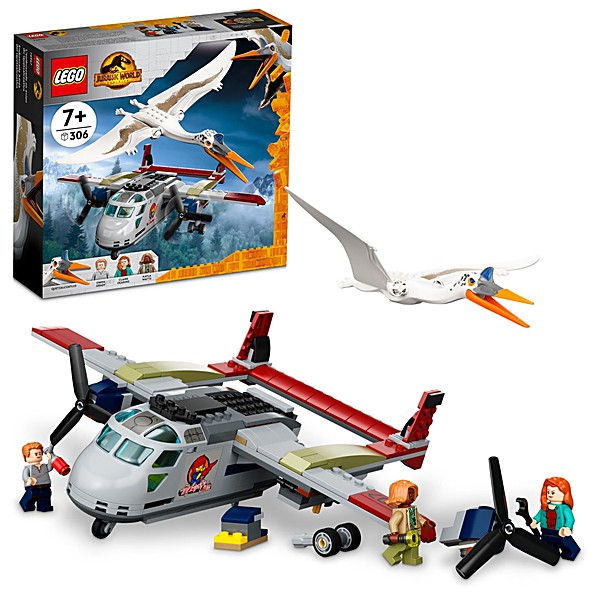

# Rapture And Gravity

By **Tigers Of Youth**

## Album Data

- **Catalog:** Beets
- **Format:** Digital, Album
- **Album:** Rapture And Gravity
- **Artist:** Tigers Of Youth
- **Albumartist:** Tigers Of Youth
- **Genre:** Unknown
- **MusicBrainz Album Artist ID:** 
- **MusicBrainz Album ID:** 
- **MusicBrainz Release Group ID:** 
- **Year:** 2017
- **Catalog #:** 
- **Label:** 
- **Total Tracks:** 05

## Album Tracks

### Track 01 - Simple Treason

- **Artist:** Tigers Of Youth
- **Format:** ALAC
- **Genre:** Unknown
- **Length:** 3:11
- **MusicBrainz Track ID:** 
- **Title:** Simple Treason
- **Track:** 01
- **Year:** 2017

### Track 02 - Prometheus

- **Artist:** Tigers Of Youth
- **Format:** ALAC
- **Genre:** Unknown
- **Length:** 3:36
- **MusicBrainz Track ID:** 
- **Title:** Prometheus
- **Track:** 02
- **Year:** 2017

### Track 03 - Ghost State

- **Artist:** Tigers Of Youth
- **Format:** ALAC
- **Genre:** Unknown
- **Length:** 4:00
- **MusicBrainz Track ID:** 
- **Title:** Ghost State
- **Track:** 03
- **Year:** 2017

### Track 04 - Rapture And Gravity

- **Artist:** Tigers Of Youth
- **Format:** ALAC
- **Genre:** Unknown
- **Length:** 3:35
- **MusicBrainz Track ID:** 
- **Title:** Rapture And Gravity
- **Track:** 04
- **Year:** 2017

### Track 05 - Dragon Brothers

- **Artist:** Tigers Of Youth
- **Format:** ALAC
- **Genre:** Unknown
- **Length:** 4:27
- **MusicBrainz Track ID:** 
- **Title:** Dragon Brothers
- **Track:** 05
- **Year:** 2017

