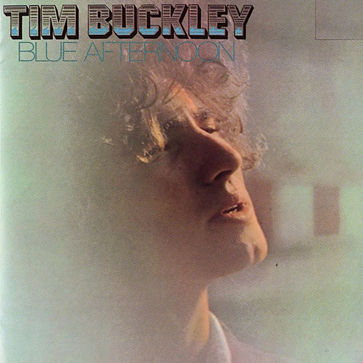

# Blue Afternoon

By **Tim Buckley**

## Album Data

- **Catalog:** Beets
- **Format:** Digital, Album
- **Album:** Blue Afternoon
- **Artist:** Tim Buckley
- **Albumartist:** Tim Buckley
- **Genre:** Rock
- **MusicBrainz Album Artist ID:** [8546949d-f46c-45ab-8391-85b26dda6b65](https://musicbrainz.org/artist/8546949d-f46c-45ab-8391-85b26dda6b65)
- **MusicBrainz Album ID:** [0df25273-1b83-372a-bea0-a85d1c0eeafc](https://musicbrainz.org/release/0df25273-1b83-372a-bea0-a85d1c0eeafc)
- **MusicBrainz Release Group ID:** [b38e1102-7fe0-3410-8a4a-9d4739cfbb94](https://musicbrainz.org/release-group/b38e1102-7fe0-3410-8a4a-9d4739cfbb94)
- **Year:** 1989
- **Catalog #:** 74028-2
- **Label:** Elektra
- **Total Tracks:** 10

## Album Tracks

### Track 01 - No Man Can Find the War

- **Artist:** Tim Buckley
- **Format:** ALAC
- **Genre:** Folk Rock
- **Length:** 2:59
- **MusicBrainz Track ID:** [17712020-e84a-4d72-8841-f855894a7e0d](https://musicbrainz.org/recording/17712020-e84a-4d72-8841-f855894a7e0d)
- **Title:** No Man Can Find the War
- **Track:** 01
- **Year:** 1989

### Track 02 - Carnival Song

- **Artist:** Tim Buckley
- **Format:** ALAC
- **Genre:** Folk Rock
- **Length:** 3:12
- **MusicBrainz Track ID:** [db4331b3-46a7-4c97-8ab6-c3ad363e7b36](https://musicbrainz.org/recording/db4331b3-46a7-4c97-8ab6-c3ad363e7b36)
- **Title:** Carnival Song
- **Track:** 02
- **Year:** 1989

### Track 03 - Pleasant Street

- **Artist:** Tim Buckley
- **Format:** ALAC
- **Genre:** Folk Rock
- **Length:** 5:17
- **MusicBrainz Track ID:** [067b7b72-07bb-4d58-b802-ad37d650819c](https://musicbrainz.org/recording/067b7b72-07bb-4d58-b802-ad37d650819c)
- **Title:** Pleasant Street
- **Track:** 03
- **Year:** 1989

### Track 04 - Hallucinations

- **Artist:** Tim Buckley
- **Format:** ALAC
- **Genre:** Folk Rock
- **Length:** 4:53
- **MusicBrainz Track ID:** [4c4f3fb2-382d-4e85-a9a9-36c3d1e25b36](https://musicbrainz.org/recording/4c4f3fb2-382d-4e85-a9a9-36c3d1e25b36)
- **Title:** Hallucinations
- **Track:** 04
- **Year:** 1989

### Track 05 - I Never Asked to Be Your Mountain

- **Artist:** Tim Buckley
- **Format:** ALAC
- **Genre:** Psychedelic Rock
- **Length:** 6:05
- **MusicBrainz Track ID:** [49913402-b32c-4dae-b403-90768120bbdf](https://musicbrainz.org/recording/49913402-b32c-4dae-b403-90768120bbdf)
- **Title:** I Never Asked to Be Your Mountain
- **Track:** 05
- **Year:** 1989

### Track 06 - Once I Was

- **Artist:** Tim Buckley
- **Format:** ALAC
- **Genre:** Folk Rock
- **Length:** 3:23
- **MusicBrainz Track ID:** [5090ab39-3836-4737-b9f4-a240eff662f4](https://musicbrainz.org/recording/5090ab39-3836-4737-b9f4-a240eff662f4)
- **Title:** Once I Was
- **Track:** 06
- **Year:** 1989

### Track 07 - Phantasmagoria in Two

- **Artist:** Tim Buckley
- **Format:** ALAC
- **Genre:** Psychedelic Rock
- **Length:** 3:28
- **MusicBrainz Track ID:** [d904a99d-e690-4adc-9f2d-536e506f356a](https://musicbrainz.org/recording/d904a99d-e690-4adc-9f2d-536e506f356a)
- **Title:** Phantasmagoria in Two
- **Track:** 07
- **Year:** 1989

### Track 08 - Knight‐Errant

- **Artist:** Tim Buckley
- **Format:** ALAC
- **Genre:** Psychedelic Rock
- **Length:** 1:59
- **MusicBrainz Track ID:** [3aca480b-abe0-47e6-a3f8-69d91004267a](https://musicbrainz.org/recording/3aca480b-abe0-47e6-a3f8-69d91004267a)
- **Title:** Knight‐Errant
- **Track:** 08
- **Year:** 1989

### Track 09 - Goodbye and Hello

- **Artist:** Tim Buckley
- **Format:** ALAC
- **Genre:** Psychedelic Rock
- **Length:** 8:42
- **MusicBrainz Track ID:** [fd72dca0-7409-4cac-8f0d-42cbbe562b9d](https://musicbrainz.org/recording/fd72dca0-7409-4cac-8f0d-42cbbe562b9d)
- **Title:** Goodbye and Hello
- **Track:** 09
- **Year:** 1989

### Track 10 - Morning Glory

- **Artist:** Tim Buckley
- **Format:** ALAC
- **Genre:** Americana
- **Length:** 2:49
- **MusicBrainz Track ID:** [2c21d59b-e909-429f-b75e-7b755606c5a7](https://musicbrainz.org/recording/2c21d59b-e909-429f-b75e-7b755606c5a7)
- **Title:** Morning Glory
- **Track:** 10
- **Year:** 1989

## See also

- [Goodbye and Hello](Goodbye_and_Hello.md)
- [Happy Sad](Happy_Sad.md)
- [Lorca](Lorca.md)
- [Tim Buckley](Tim_Buckley.md)
- [Roon: Bear's Sonic Journals](../../Roon/Tim_Buckley/Bears_Sonic_Journals-_Merry-Go-Round_At_The_Carousel_Digital.md)
- [Roon: Happy Sad](../../Roon/Tim_Buckley/Happy_Sad.md)
