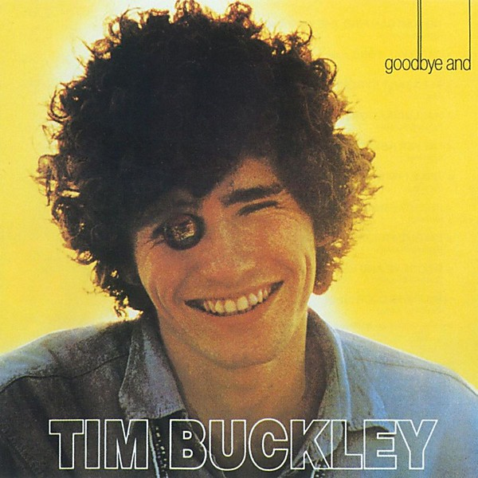

# Goodbye and Hello

By **Tim Buckley**

## Album Data

- **Catalog:** Beets
- **Format:** Digital, Album
- **Album:** Goodbye and Hello
- **Artist:** Tim Buckley
- **Albumartist:** Tim Buckley
- **Genre:** Psychedelic Rock
- **MusicBrainz Album Artist ID:** [8546949d-f46c-45ab-8391-85b26dda6b65](https://musicbrainz.org/artist/8546949d-f46c-45ab-8391-85b26dda6b65)
- **MusicBrainz Album ID:** [2e0491f2-3ba0-4e71-b137-340fdb602935](https://musicbrainz.org/release/2e0491f2-3ba0-4e71-b137-340fdb602935)
- **MusicBrainz Release Group ID:** [2e569a55-d829-31c8-9016-0c9a56333288](https://musicbrainz.org/release-group/2e569a55-d829-31c8-9016-0c9a56333288)
- **Year:** 1989
- **Catalog #:** 74045-2
- **Label:** Elektra
- **Total Tracks:** 06

## Album Tracks

### Track 01 - Strange Feelin’

- **Artist:** Tim Buckley
- **Format:** ALAC
- **Genre:** Psychedelic Rock
- **Length:** 7:40
- **MusicBrainz Track ID:** [b06fb04f-4b89-4635-b537-b3bf038e1ee3](https://musicbrainz.org/recording/b06fb04f-4b89-4635-b537-b3bf038e1ee3)
- **Title:** Strange Feelin’
- **Track:** 01
- **Year:** 1989

### Track 02 - Buzzin’ Fly

- **Artist:** Tim Buckley
- **Format:** ALAC
- **Genre:** Psychedelic Rock
- **Length:** 6:04
- **MusicBrainz Track ID:** [9f506ff9-9c0e-4988-b641-a38e5ad98563](https://musicbrainz.org/recording/9f506ff9-9c0e-4988-b641-a38e5ad98563)
- **Title:** Buzzin’ Fly
- **Track:** 02
- **Year:** 1989

### Track 03 - Love From Room 109 at the Islander (On Pacific Coast Highway)

- **Artist:** Tim Buckley
- **Format:** ALAC
- **Genre:** Rock
- **Length:** 10:49
- **MusicBrainz Track ID:** [6a4a3e65-0839-46d4-adea-41d2beda6802](https://musicbrainz.org/recording/6a4a3e65-0839-46d4-adea-41d2beda6802)
- **Title:** Love From Room 109 at the Islander (On Pacific Coast Highway)
- **Track:** 03
- **Year:** 1989

### Track 04 - Dream Letter

- **Artist:** Tim Buckley
- **Format:** ALAC
- **Genre:** Folk Rock
- **Length:** 5:12
- **MusicBrainz Track ID:** [817c6f8b-ab6c-46ef-8300-d67e832ca276](https://musicbrainz.org/recording/817c6f8b-ab6c-46ef-8300-d67e832ca276)
- **Title:** Dream Letter
- **Track:** 04
- **Year:** 1989

### Track 05 - Gypsy Woman

- **Artist:** Tim Buckley
- **Format:** ALAC
- **Genre:** Progressive Rock
- **Length:** 12:19
- **MusicBrainz Track ID:** [91312b63-1c67-4f9b-9cd6-af67b1a75668](https://musicbrainz.org/recording/91312b63-1c67-4f9b-9cd6-af67b1a75668)
- **Title:** Gypsy Woman
- **Track:** 05
- **Year:** 1989

### Track 06 - Sing a Song for You

- **Artist:** Tim Buckley
- **Format:** ALAC
- **Genre:** Americana
- **Length:** 2:39
- **MusicBrainz Track ID:** [de315e84-8baf-486e-8b85-0d7af4a16f09](https://musicbrainz.org/recording/de315e84-8baf-486e-8b85-0d7af4a16f09)
- **Title:** Sing a Song for You
- **Track:** 06
- **Year:** 1989

## See also

- [Blue Afternoon](Blue_Afternoon.md)
- [Happy Sad](Happy_Sad.md)
- [Lorca](Lorca.md)
- [Tim Buckley](Tim_Buckley.md)
- [Roon: Bear's Sonic Journals](../../Roon/Tim_Buckley/Bears_Sonic_Journals-_Merry-Go-Round_At_The_Carousel_Digital.md)
- [Roon: Happy Sad](../../Roon/Tim_Buckley/Happy_Sad.md)
