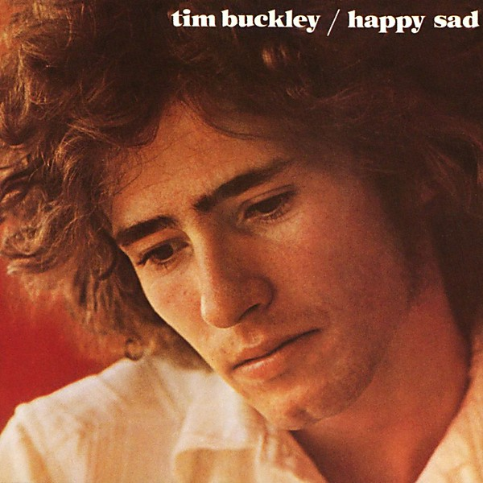

# Happy Sad

By **Tim Buckley**

## Album Data

- **Catalog:** Beets
- **Format:** Digital, Album
- **Album:** Happy Sad
- **Artist:** Tim Buckley
- **Albumartist:** Tim Buckley
- **Genre:** Psychedelic Rock
- **MusicBrainz Album Artist ID:** [8546949d-f46c-45ab-8391-85b26dda6b65](https://musicbrainz.org/artist/8546949d-f46c-45ab-8391-85b26dda6b65)
- **MusicBrainz Album ID:** [7fe3fb83-53fb-359a-9288-74b5c67a493a](https://musicbrainz.org/release/7fe3fb83-53fb-359a-9288-74b5c67a493a)
- **MusicBrainz Release Group ID:** [50701e2b-a074-380e-82aa-cfb21421dbb4](https://musicbrainz.org/release-group/50701e2b-a074-380e-82aa-cfb21421dbb4)
- **Year:** 1989
- **Catalog #:** 7559-61339-2
- **Label:** Elektra Entertainment
- **Total Tracks:** 05

## Album Tracks

### Track 01 - Lorca

- **Artist:** Tim Buckley
- **Format:** ALAC
- **Genre:** Jazz Fusion
- **Length:** 9:59
- **MusicBrainz Track ID:** [053fa5f4-2b75-4194-9895-482fdfcca07d](https://musicbrainz.org/recording/053fa5f4-2b75-4194-9895-482fdfcca07d)
- **Title:** Lorca
- **Track:** 01
- **Year:** 1992

### Track 02 - Anonymous Proposition

- **Artist:** Tim Buckley
- **Format:** ALAC
- **Genre:** Folk Rock
- **Length:** 7:48
- **MusicBrainz Track ID:** [68247237-67a3-4aea-854f-7c1ce029254e](https://musicbrainz.org/recording/68247237-67a3-4aea-854f-7c1ce029254e)
- **Title:** Anonymous Proposition
- **Track:** 02
- **Year:** 1992

### Track 03 - I Had a Talk With My Woman

- **Artist:** Tim Buckley
- **Format:** ALAC
- **Genre:** Psychedelic Rock
- **Length:** 6:01
- **MusicBrainz Track ID:** [939cf996-0f3c-470e-976e-eae76ad679d3](https://musicbrainz.org/recording/939cf996-0f3c-470e-976e-eae76ad679d3)
- **Title:** I Had a Talk With My Woman
- **Track:** 03
- **Year:** 1992

### Track 04 - Driftin’

- **Artist:** Tim Buckley
- **Format:** ALAC
- **Genre:** Folk Rock
- **Length:** 8:12
- **MusicBrainz Track ID:** [9f0b00f0-b25f-49d2-9fb6-e383e44cf78b](https://musicbrainz.org/recording/9f0b00f0-b25f-49d2-9fb6-e383e44cf78b)
- **Title:** Driftin’
- **Track:** 04
- **Year:** 1992

### Track 05 - Nobody Walkin’

- **Artist:** Tim Buckley
- **Format:** ALAC
- **Genre:** Folk Rock
- **Length:** 7:36
- **MusicBrainz Track ID:** [369febe7-e8a2-46e9-ac8f-2ab0a2c14736](https://musicbrainz.org/recording/369febe7-e8a2-46e9-ac8f-2ab0a2c14736)
- **Title:** Nobody Walkin’
- **Track:** 05
- **Year:** 1992

## See also

- [Blue Afternoon](Blue_Afternoon.md)
- [Goodbye and Hello](Goodbye_and_Hello.md)
- [Lorca](Lorca.md)
- [Tim Buckley](Tim_Buckley.md)
- [Roon: Bear's Sonic Journals](../../Roon/Tim_Buckley/Bears_Sonic_Journals-_Merry-Go-Round_At_The_Carousel_Digital.md)
- [Roon: Happy Sad](../../Roon/Tim_Buckley/Happy_Sad.md)
