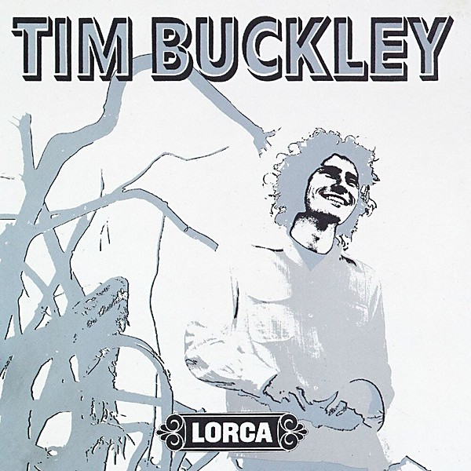

# Lorca

By **Tim Buckley**

## Album Data

- **Catalog:** Beets
- **Format:** Digital, Album
- **Album:** Lorca
- **Artist:** Tim Buckley
- **Albumartist:** Tim Buckley
- **Genre:** Folk Rock
- **MusicBrainz Album Artist ID:** [8546949d-f46c-45ab-8391-85b26dda6b65](https://musicbrainz.org/artist/8546949d-f46c-45ab-8391-85b26dda6b65)
- **MusicBrainz Album ID:** [ea3a09d9-d169-33b3-a093-bc5288eb5857](https://musicbrainz.org/release/ea3a09d9-d169-33b3-a093-bc5288eb5857)
- **MusicBrainz Release Group ID:** [f5859553-1f68-3bc8-850c-25e0842a99d5](https://musicbrainz.org/release-group/f5859553-1f68-3bc8-850c-25e0842a99d5)
- **Year:** 1992
- **Catalog #:** EKS-74004
- **Label:** Elektra
- **Total Tracks:** 12

## Album Tracks

### Track 01 - I Can’t See You

- **Artist:** Tim Buckley
- **Format:** ALAC
- **Genre:** Folk Rock
- **Length:** 2:43
- **MusicBrainz Track ID:** [47dfdf9c-9ff5-4e72-90cf-62e69c59950c](https://musicbrainz.org/recording/47dfdf9c-9ff5-4e72-90cf-62e69c59950c)
- **Title:** I Can’t See You
- **Track:** 01
- **Year:** 1966

### Track 02 - Wings

- **Artist:** Tim Buckley
- **Format:** ALAC
- **Genre:** Dream Pop
- **Length:** 2:35
- **MusicBrainz Track ID:** [d6f8ccf0-5c14-40a0-92b4-f077706b78c0](https://musicbrainz.org/recording/d6f8ccf0-5c14-40a0-92b4-f077706b78c0)
- **Title:** Wings
- **Track:** 02
- **Year:** 1966

### Track 03 - Song of the Magician

- **Artist:** Tim Buckley
- **Format:** ALAC
- **Genre:** Rock
- **Length:** 3:07
- **MusicBrainz Track ID:** [d13ade65-5bc4-4f93-bbb9-48c666a3fc4e](https://musicbrainz.org/recording/d13ade65-5bc4-4f93-bbb9-48c666a3fc4e)
- **Title:** Song of the Magician
- **Track:** 03
- **Year:** 1966

### Track 04 - Strange Street Affair Under Blue

- **Artist:** Tim Buckley
- **Format:** ALAC
- **Genre:** Psychedelic Rock
- **Length:** 3:13
- **MusicBrainz Track ID:** [969dc8fb-00ff-4572-971c-4663b2ef3cc9](https://musicbrainz.org/recording/969dc8fb-00ff-4572-971c-4663b2ef3cc9)
- **Title:** Strange Street Affair Under Blue
- **Track:** 04
- **Year:** 1966

### Track 05 - Valentine Melody

- **Artist:** Tim Buckley
- **Format:** ALAC
- **Genre:** Folk Rock
- **Length:** 3:44
- **MusicBrainz Track ID:** [6787c946-427b-4303-b56b-91972b1a5cc9](https://musicbrainz.org/recording/6787c946-427b-4303-b56b-91972b1a5cc9)
- **Title:** Valentine Melody
- **Track:** 05
- **Year:** 1966

### Track 06 - Aren’t You the Girl

- **Artist:** Tim Buckley
- **Format:** ALAC
- **Genre:** Folk Rock
- **Length:** 2:07
- **MusicBrainz Track ID:** [0dab13ed-1065-4720-ac00-04af2b473df1](https://musicbrainz.org/recording/0dab13ed-1065-4720-ac00-04af2b473df1)
- **Title:** Aren’t You the Girl
- **Track:** 06
- **Year:** 1966

### Track 07 - Song Slowly Song

- **Artist:** Tim Buckley
- **Format:** ALAC
- **Genre:** Folk Rock
- **Length:** 4:16
- **MusicBrainz Track ID:** [f365e2fb-2ade-4bf5-b3c3-95de2a81c6c7](https://musicbrainz.org/recording/f365e2fb-2ade-4bf5-b3c3-95de2a81c6c7)
- **Title:** Song Slowly Song
- **Track:** 07
- **Year:** 1966

### Track 08 - It Happens Every Time

- **Artist:** Tim Buckley
- **Format:** ALAC
- **Genre:** Folk Rock
- **Length:** 1:52
- **MusicBrainz Track ID:** [4d94e86a-84fd-4ee1-aa14-e82adf3709b0](https://musicbrainz.org/recording/4d94e86a-84fd-4ee1-aa14-e82adf3709b0)
- **Title:** It Happens Every Time
- **Track:** 08
- **Year:** 1966

### Track 09 - Song for Jainie

- **Artist:** Tim Buckley
- **Format:** ALAC
- **Genre:** Folk Rock
- **Length:** 2:46
- **MusicBrainz Track ID:** [ab3f9793-611c-44ae-9514-45d642a4d676](https://musicbrainz.org/recording/ab3f9793-611c-44ae-9514-45d642a4d676)
- **Title:** Song for Jainie
- **Track:** 09
- **Year:** 1966

### Track 10 - Grief in My Soul

- **Artist:** Tim Buckley
- **Format:** ALAC
- **Genre:** Folk Rock
- **Length:** 2:08
- **MusicBrainz Track ID:** [bfd8414c-9a8d-4324-ae9f-0543d6d0b48a](https://musicbrainz.org/recording/bfd8414c-9a8d-4324-ae9f-0543d6d0b48a)
- **Title:** Grief in My Soul
- **Track:** 10
- **Year:** 1966

### Track 11 - She Is

- **Artist:** Tim Buckley
- **Format:** ALAC
- **Genre:** Folk Rock
- **Length:** 3:08
- **MusicBrainz Track ID:** [6489d528-82e6-4029-841b-300bd6b66b32](https://musicbrainz.org/recording/6489d528-82e6-4029-841b-300bd6b66b32)
- **Title:** She Is
- **Track:** 11
- **Year:** 1966

### Track 12 - Understand Your Man

- **Artist:** Tim Buckley
- **Format:** ALAC
- **Genre:** Blues
- **Length:** 3:05
- **MusicBrainz Track ID:** [2b9baf08-d7ae-45e3-b179-7452bd1b01d7](https://musicbrainz.org/recording/2b9baf08-d7ae-45e3-b179-7452bd1b01d7)
- **Title:** Understand Your Man
- **Track:** 12
- **Year:** 1966

## See also

- [Blue Afternoon](Blue_Afternoon.md)
- [Goodbye and Hello](Goodbye_and_Hello.md)
- [Happy Sad](Happy_Sad.md)
- [Tim Buckley](Tim_Buckley.md)
- [Roon: Bear's Sonic Journals](../../Roon/Tim_Buckley/Bears_Sonic_Journals-_Merry-Go-Round_At_The_Carousel_Digital.md)
- [Roon: Happy Sad](../../Roon/Tim_Buckley/Happy_Sad.md)
